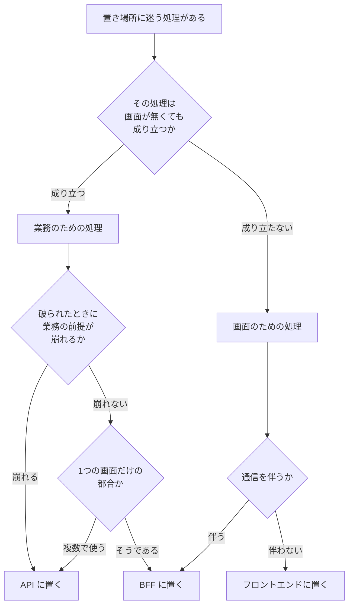
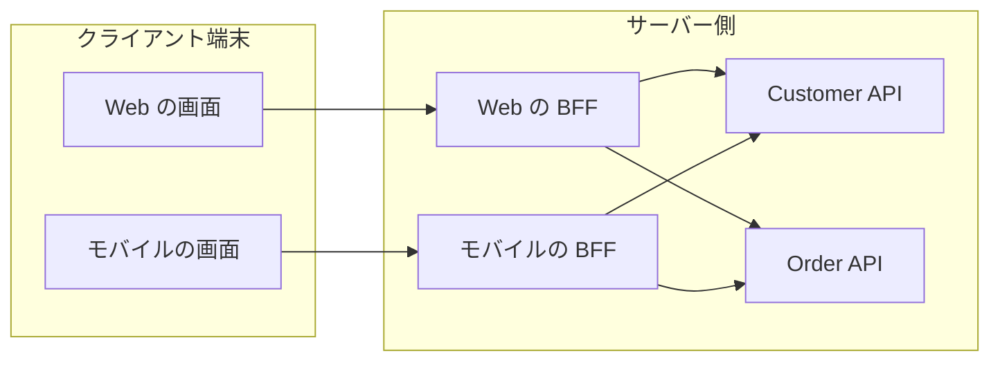

# 03 アーキテクチャ

合計金額の計算を、画面に書くかサーバーに書くかで迷ったことがあるはずである。どちらに置いても画面は動く。動くからこそ決め手が無いまま片方に置かれ、同じ計算が別の画面にもう一度書かれる。**この章は、その迷いを、根拠を挙げて決められる問いに置き換えるためのものである。**

## この章で判断できること

| 項目 | 内容 |
|---|---|
| 想定読者 | 画面とサーバーをまたぐ構造を自分で決める開発者 |
| 答える問い | フロントエンド・BFF・API のどれに何を置くか。層の境界を何で決めるか |
| 読んだあとにできること | 「この処理はどこに置くか」に、理由を挙げて答えられる。BFF を置く提案に賛成も反対もでき、その理由を言える |
| 例示に使う言語 | Java。例示のためであり、原則は言語に依らない |

## 結論

**置き場所は「誰のために存在するか」で決める。** 画面のためのものは画面の側へ、業務のためのものは業務の側へ置く。判断の材料は、使う技術ではなく、その処理が存在する目的である。画面が無くなっても意味が残るなら、それは業務のためのものである。

**BFF を置く理由は3つしかない。** BFF（Backend For Frontend）は、1つの画面体験のために置くサーバー側の部品である。足してよいのは、クライアントが複数ある、サーバー側の集約が要る、作り手が分かれている、のいずれかが成り立つときである。3つとも立たないなら置かない。

**構造の境界は、チームの境界と一致する。** 一致させないと、機能を1つ足すたびに複数のチームの調整が要る。層ごとにチームを分けると、この調整が毎回起きる。

**根拠**: `SRC-DESIGN-001` p.201、`SRC-ARCH-002` p.549、p.554、`SRC-EXT-016`、`SRC-EXT-020`、`SRC-EXT-022`

## 章01・章02 との境目

**この章は、章「[01 良いコードとは何か](01-good-code.md)」と章「[02 設計](02-design.md)」の続きである。** 観点IDの接頭辞も違い、この章は `AR-` である。

| 水準 | 扱う章 | 例 |
|---|---|---|
| 1つのメソッドの中 | 章01（`GC-` 番） | メソッドが1つのことをしているか（`GC-04`） |
| クラスとパッケージの間 | 章02（`DS-` 番） | 責務を変更する理由で定義しているか（`DS-01`） |
| プロセスと配置をまたぐ間 | この章（`AR-` 番） | 業務ルールをどの層に置くか、BFF を置くか |

**章02 は5つの項目を「この章で扱わないこと」に入れ、この章へ送っている。** 層の分離、フロントエンド・BFF・API の分担、サービス分割、品質特性の取引、データベースのスキーマ設計である。**この章はそのうち3つを引き受ける。** サービス分割とデータベースのスキーマ設計は、この章でも扱わない。理由は「この章で扱わないこと」に書く。

**重複する観点は繰り返さない。** クラスの責務の切り方（`DS-01`、`DS-02`）、共通化の判断（`DS-05`）、パッケージの分け方（`DS-08`）は章02 が持つ。この章は、それらがプロセスをまたいだときに何が変わるかだけを書く。

## 中心の問い

**この章が答えるのは1つの問いである。フロントエンド・BFF・API のどれに置くか迷ったとき、何を根拠に決めるのか。**

置き場所を決める材料は3つある。**上から順に見る。**



**この図は判断の順序であって、正解の表ではない。** 各段の根拠は、以下の観点で1つずつ示す。

## 層の責務と境界

**層の名前ではなく、層が存在する理由から責務を決める。** プレゼンテーション層やアプリケーション層という名前は、どこに何を置くかを教えない。名前だけを頼りにすると、どの層にも業務のロジックが書ける状態になる。この節では、責務の決め方と、決めた責務が守られているかを見る観点を4つ挙げる。

### AR-01 層の責務を「誰のために存在するか」で定めているか

その層が誰のためにあるかを、1文で言えるかを見る。**「この層は画面のためにある」「この層は業務のためにある」と言えないなら、その層は複数の理由で存在している。**

『現場で役立つシステム設計の原則』は、業務アプリケーションで一般的な三層を挙げる。プレゼンテーション層が画面と外部接続、アプリケーション層が業務ロジックと業務ルール、データソース層がデータベース入出力である。

**同書は、三層に分けただけでは足りないと述べる。** データだけを持つクラスと機能だけを持つクラスに分ける設計のままでは、どの層からも同じデータクラスを参照でき、どの層にもロジックが書けてしまう。結果として同じ業務ロジックがあちこちに重複する。

同書が示す答えが、三層にドメインモデルを足した形である。**業務的な判断・加工・計算のロジックを、すべてドメインオブジェクトに任せる。** ドメインモデル（業務の概念をそのままクラスにしたもの）は、画面とデータベースの都合から独立して整理できる。

Martin Fowler「PresentationDomainDataLayering」も同じ3つを挙げる。HTTP要求とHTML描画を扱う層、検証と計算を持つ層、永続化を扱う層である。**同記事が挙げる第一の理由は、3つの話題を独立に考えられるようにして注意の範囲を狭めることである。** 同記事は、この理由だけで層分けを正当化できると述べる。第二の理由は、同じ業務ロジックの上に複数の画面を重複なく載せられることである。

**2つの資料は独立している。** 一方は日本語の業務システムの本、他方は英語圏の個人の公開文書であり、著者も出版年も異なる。

**プロセスをまたぐ場合も、名前が変わるだけである。**

```text
1つのプロセスの中          プロセスをまたぐとき
------------------        ------------------
プレゼンテーション層  ---> フロントエンド
（画面のため）             （画面のため）

  ※ 集約が必要なとき ---> BFF
                          （1つの画面体験のため）

アプリケーション層    ---> API
ドメインモデル             （業務のため）
（業務のため）

データソース層        ---> API の内側
（永続化のため）           （外に見せない）
```

**画面のためか業務のためかで迷う例が、合計金額の計算である。** 『現場で役立つシステム設計の原則』は、合計金額の計算・消費税の計算・日付の表示形式を、複数の画面に重複しやすいものとして並べて挙げる。**この3つは同じ扱いではない。** 合計金額と消費税は業務の計算であり、日付の表示形式は画面の加工である。**画面が無くなっても意味が残るかで分ける。**

**根拠**: `SRC-DESIGN-001` p.69-70、p.89-90（3章）、p.200（7章）、`SRC-EXT-020`

### AR-02 業務ルールが画面の表示コードに入っていないか

画面を描くコードに `if` 文があるとき、その条件が業務ルールになっていないかを見る。**業務ルールとは、業務の側の都合で決まり、業務が変われば変わる判断である。**

『現場で役立つシステム設計の原則』は、注文の強調表示を例に挙げる。「一定金額を超え、かつ注文後1日以上を経過した注文を強調表示する」という条件判断は業務ルールである。**これが画面のコードに紛れ込むと、注文を表示する複数の画面に同じ判断が書かれる。**

同書は、そのときに起きることを2つ挙げる。どこに何が書いてあるかを調べ上げる作業と、変更の副作用を確かめるための広い範囲のテストである。同書はより短い合図も出す。**画面を表示するロジックに `if` 文が入り始めたら要注意である。**

Alistair Cockburn「Hexagonal Architecture」は、別の角度から同じことを述べる。業務ロジックが画面のコードに入り込むと、変わりやすい表示の細部にテストが依存し、自動テストで確かめられなくなる。**同文書の基本規則は「内側のコードが外側へ漏れ出さないこと」である。**

**悪い例**

```java
public class OrderRow {
    private final long amount;
    private final LocalDate orderedOn;

    public String cssClass(LocalDate today) {
        if (amount > 100000 && orderedOn.isBefore(today)) {
            return "important";
        }
        return "";
    }
}
```

**良い例**

```java
public record Order(Money amount, LocalDate orderedOn) {
    private static final Money PRIORITY_THRESHOLD = Money.yen(100000);
    private static final int PRIORITY_ELAPSED_DAYS = 1;

    public boolean isPriority(LocalDate today) {
        return amount.isGreaterThan(PRIORITY_THRESHOLD)
            && orderedOn.plusDays(PRIORITY_ELAPSED_DAYS).isBefore(today);
    }
}

public class OrderRow {
    private final Order order;

    public String cssClass(LocalDate today) {
        return order.isPriority(today) ? "important" : "";
    }
}
```

**なぜ悪いのか**: `100000` と `isBefore` の組み合わせが業務ルールである。この画面のクラスは、金額の基準と経過日数の両方を知っている。**基準額が変わったとき、注文を表示する画面をすべて探す必要がある。** 『現場で役立つシステム設計の原則』が挙げる変更の困難が、そのまま起きる。

**なぜ良いのか**: 「優先して処理すべき注文か」という業務の判断が `Order` に1つだけある。基準額が変わっても触るのは `Order` である。**画面のクラスが知っているのは「優先ならこの表示にする」だけであり、これは画面のための知識である。** 業務の判断と表示の対応づけが分かれている。

**画面の側に条件を1つも書かない、とは決められない。** 画面のためだけの条件は画面に書く。例として、一覧の1行が長すぎるときに末尾を省略するかどうかの判断がある。これは表示の都合であり、業務が無くなっても残らない。

**根拠**: `SRC-DESIGN-001` p.199-200、p.216（7章）、`SRC-EXT-025`

### AR-03 API が特定の画面の都合を知っていないか

API のメソッド名や応答の形に、特定の画面の名前や画面の並び順が入っていないかを見る。**入っているなら、提供する側が利用する側の事情を抱え込んでいる。**

『現場で役立つシステム設計の原則』は、API を提供する側がまとまった複合サービスまで提供する場合の問題を述べる。**提供する側に、利用する側の知識が入り込む。** その結果、両方のアプリケーションの成長と、API の修正・拡張の障害になる。

同書の結論は明快である。**独立性を保つため、複合サービスは API を利用する側が開発する。** 提供する側は、組み立てるための部品の提供に専念する。**提供する側が複合サービスまで作るのは、利用する側の目的と機能を検討する体制を用意できる場合に限られる。**

『マイクロサービスアーキテクチャ 第2版』は、別の言い方で同じ結論に達する。呼び出しの集約と絞り込みの性質は、主に外部の画面の要件で決まる。**そのため、画面を作るチームが集約を所有するのが自然である。**

Sam Newman「Backends For Frontends」も、BFF が特定の利用者体験と密に結合し、通常はその画面を作るチームが保守する、と述べる。

**この3件は独立している。** 著者も出版年も異なり、いずれも一次資料である。**この章の中で最も根拠が厚い観点である。**

**悪い例**

```java
// API 側が公開するインターフェース
public interface OrderApi {
    // 「マイページの注文一覧タブ」のための応答
    MyPageOrderTabResponse findForMyPageOrderTab(CustomerId id, int tabPage);

    // 「注文確認画面の上部」のための応答
    OrderConfirmHeaderResponse findForConfirmHeader(OrderId id);
}
```

**良い例**

```java
// API 側が公開するインターフェース
public interface OrderApi {
    List<Order> findByCustomer(CustomerId id, Page page);
    Order find(OrderId id);
}

// 画面を作る側が持つ組み立て
public class MyPageOrderTab {
    private final OrderApi orderApi;
    private final ShipmentApi shipmentApi;

    public MyPageOrderTabView build(CustomerId id, Page page) {
        List<Order> orders = orderApi.findByCustomer(id, page);
        List<Shipment> shipments = shipmentApi.findByOrders(orders);
        return MyPageOrderTabView.of(orders, shipments);
    }
}
```

**なぜ悪いのか**: `findForMyPageOrderTab` は、画面の名前とタブの構造を API の署名に持ち込んでいる。**マイページのタブが2つに分かれた時点で、API 側の変更が要る。** 『現場で役立つシステム設計の原則』が述べる「提供する側に利用する側の知識が入り込む」が、そのまま起きている。

**なぜ良いのか**: `OrderApi` は注文という業務の概念だけを知っている。画面が変わっても署名は変わらない。**画面ごとの組み立ては `MyPageOrderTab` にあり、これは画面を作る側の持ち物である。** 『マイクロサービスアーキテクチャ 第2版』の所有権の議論と一致する。

**そのチームにサーバー側の部品を作る技能が無い場合の答えは、決着していない。** 『マイクロサービスアーキテクチャ 第2版』は、専任のフロントエンドチームを持つ組織では、そのチームに技能が無いかもしれないと述べる。**同書はこの場合の答えを示していない。** この章も示さない。

**根拠**: `SRC-DESIGN-001` p.254（8章）、`SRC-ARCH-002` p.543（14.9.1）、`SRC-EXT-016`

### AR-04 中間の層に振る舞いを詰め込んでいないか

BFF や集約ゲートウェイに、業務の手順や状態の管理が入っていないかを見る。

『マイクロサービスアーキテクチャ 第2版』は、混合したやり方をとるときの要点として2つを挙げる。提供する機能の凝集を保つことと、中間の層に振る舞いを詰め込みすぎる罠を避けることである。**注文や顧客詳細の変更に関するロジックは、それぞれの操作を扱うサービス内にとどめる。**

同書は、この罠を別の言葉でも表す。「パイプをダムにし、エンドポイントをスマートにする」という規則である。**中間の経路は賢くしない。**

**複数のサービスを順に呼ぶ処理が業務の手順か単なる集約かは、途中で失敗したときに何を戻すかで分かれる。** 戻す必要があるなら業務の手順であり、API 側に置く。並べて表示するだけなら集約であり、BFF に置いてよい。**この判断の基準は、どの資料にもそのままは書かれていない。同書の「状態の管理を漏らさない」から導いたものである。**

**根拠**: `SRC-ARCH-002` p.206（5.10.1）、p.558（14.12）

## BFF を置くかどうか

**BFF は、1つの画面体験のために置くサーバー側の部品である。** 『マイクロサービスアーキテクチャ 第2版』は、BFF と中央集約ゲートウェイの主な違いを1つ挙げる。**BFF が本来は単一目的であることである。** 同書の言い方を借りると、BFF を使うことは「画面が2つの部分に分かれている」状態である。1つ目は利用者の端末にあり、2つ目の BFF はサーバー側に埋め込まれている。

**この節では、BFF を置くかどうかと、置いたあとに形が崩れていないかを見る観点を4つ挙げる。** 端末が2種類ある場合の配置は、次の図のようになる。



**根拠**: `SRC-ARCH-002` p.546（14.10）

### AR-05 BFF を置く理由を3つのどれかで説明できるか

BFF を置く理由を、次の3つのどれかで言えるかを見る。**どれも言えないなら置かない。**

| 理由 | 内容 |
|---|---|
| クライアントが複数ある | 画面の大きさ、通信量、電池の制約が違う端末が2種類以上ある |
| サーバー側の集約が要る | 1つの画面を描くのに複数のサービスを呼ぶ必要がある |
| 作り手が分かれている | 画面を作る人と下流サービスを作る人が別の集団である |

『マイクロサービスアーキテクチャ 第2版』は、Web の画面だけを提供する場合の条件を述べる。**BFF が理にかなうのは、サーバー側でかなりの量の集約が必要なときに限られる。** そうでない場合は、サーバー側の部品を足さずに画面合成の技法で足りる。

同書は続けて、モバイルの画面や第三者に固有の機能を提供する必要があるときは、各クライアントに BFF を使うことを最初から積極的に検討する、と述べる。さらに、画面を作る人と下流サービスを作る人がかなり分離している場合は、BFF を使う理由が一層強くなるとする。

Sam Newman「Backends For Frontends」は、パターンの定義ページで同じ3つを挙げる。**同書と同じ著者であるため、独立した2件とは数えない。**

**置いたあとの費用も見る。** Azure Architecture Center「Backends for Frontends pattern」（2025-03-19 版）は3つを挙げる。サービスごとに生存期間・配備・保守・安全の要求が別々に発生すること、中継が1つ増えて遅延が加わること、コードの重複が起きる見込みが高いことである。『マイクロサービスアーキテクチャ 第2版』も、追加のサービスを配備する費用が高いかどうかを毎回見直す、と述べる。

**「かなりの量の集約」がどれくらいかは、どの資料も数値で示していない。** この章も数値を書かない。判断の材料になるのは、1つの画面を描くために呼ぶサービスの数と、捨てるデータの量である。**この2つを数えてから決める。**

#### 画面が1つしか無い場合

**「画面が1つしか無い」だけでは、置かない理由にならない。** Azure Architecture Center の同文書は、向かない場面を2つ挙げる。画面が1つしか無い場合と、複数の画面が同じか似た要求をする場合である。

**この記述と『マイクロサービスアーキテクチャ 第2版』は食い違う。** 前者は画面が1つなら置かないとする。後者は画面が1つでも集約量が多ければ置く価値があるとする。

**この章は後者を採る。** 『マイクロサービスアーキテクチャ 第2版』は、パターンの命名者が書いた一次資料である。Azure Architecture Center の文書は、企業が公開する二次資料である。

**根拠**: `SRC-ARCH-002` p.554（14.10.4）、`SRC-EXT-016`、`SRC-EXT-018`

### AR-06 BFF の数をチームの境界で決めているか

BFF をいくつ置くかを、画面の種類の数で決めていないかを見る。**最後の決め手はチームの数である。**

『マイクロサービスアーキテクチャ 第2版』は明確に述べる。**ソフトウェアはチーム境界に沿っているときに最もうまく機能することが多く、BFF も例外ではない。**

同書が挙げる2つの実例が、この基準を支持する。

| 組織 | BFF の数 | 理由 |
|---|---|---|
| SoundCloud | iOS と Android で1つ | 1つのモバイルチームが両方を持つ |
| REA | iOS と Android で別々 | 2つの別々のチームが持つ |

**この2例は、画面の種類の数では説明できない。** どちらも iOS と Android の2種類であり、違うのはチームの数だけである。

同書は「1つの体験、1つの BFF」という指針も紹介する。**ただしこれは REA の Stewart Gleadow の提案として紹介されたものであり、同書の著者自身の結論ではない。** この章では出発点として使い、決定の基準としては使わない。

Sam Newman「Backends For Frontends」も、BFF がチームの境界に合わせたときに最もよく働くため、チーム構成が BFF の数を決めるべきだと述べる。

**チームの数が先に決まっていない場合は、画面体験の数から始めてよい。** 『マイクロサービスアーキテクチャ 第2版』は、Newman が好むモデルとして、クライアントの種類ごとに1つの BFF を挙げる。**ただしこれは出発点であり、チームが決まった時点で見直す。**

**根拠**: `SRC-ARCH-002` p.547-549（14.10.1）、`SRC-EXT-016`

### AR-07 BFF が汎用のゲートウェイに戻っていないか

1つの BFF を使う画面の種類が増えていないかを見る。**増えているなら、それは BFF ではなく汎用の集約ゲートウェイである。**

『マイクロサービスアーキテクチャ 第2版』は、中央集約ゲートウェイの問題を2つ挙げる。**複数チームが変更するなら調整が要り、1つのチームが所有するならそのチームが詰まる。** どちらの場合もデリバリの詰まりになる。

同書は、さらに強い言い方をする。中央集約ゲートウェイは処理が多いため、結局は専任チームが所有することになる。**それは階層化されたサイロ構造に戻ることである。**

同書は、共有モデルへの懸念も述べる。1つの BFF を使うクライアントの種類が増えると、複数の関心事を抱えて BFF が肥大化する見込みが高まる。

Azure Architecture Center「Backends for Frontends pattern」も、同じ線引きを述べる。BFF は利用者体験に固有の処理だけを扱い、監視や認可のような横断的な関心事は別の仕組みへ分離する。

**集約ゲートウェイを置くこと自体は誤りではない。** 『マイクロサービスアーキテクチャ 第2版』は利点を認めている。外部クライアントで必要な呼び出し数が減り、送り返すデータ量も減るため、帯域の削減と遅延の改善に効く。**問題は、それを1つに集めたときの所有権である。**

**根拠**: `SRC-ARCH-002` p.543（14.9、14.9.1）、p.548（14.10.1）、`SRC-EXT-018`

### AR-08 BFF 間の重複を共有ライブラリで消そうとしていないか

2つの BFF に似たコードがあるとき、それを共有ライブラリに出そうとしていないかを見る。

『マイクロサービスアーキテクチャ 第2版』は、プロセスをまたぐ重複に対して楽観的な立場をとる。**1つのサービスの境界内では重複を抽象化するが、境界をまたぐ重複には同じ対応をとらない。** 理由は、共有コードの抽出がサービス間の密結合につながることのほうが心配だからである。

同書は、共有ライブラリの抽出を「費用が低いものの問題が多い」選択肢と呼ぶ。**特に下流サービスを呼ぶクライアントライブラリに使われる場合、共有ライブラリが結合の主な要因になる。**

もう1つの選択肢が、共有機能を新しいサービスに切り出すことである。同書は、抽出した機能が業務領域の機能を表している場合に効く、と条件を付ける。

Phil Calçado「The Back-end for Front-end Pattern (BFF)」は、SoundCloud で実際にそうした当事者の報告である。**BFF 間の重複を「ドメインモデルに欠けている概念がある兆候」と読み、共有サービスとして切り出した。** 『マイクロサービスアーキテクチャ 第2版』の指針と独立に一致している。

**BFF を統合して重複を消すのは、別の問題を作る。** 同書は、それが結局は汎用の集約ゲートウェイに戻ることだと述べる。**得るものより失うものが多い場合がある。**

**この観点は、章02 の `DS-05`（共通化は目的が同じかで決める）と矛盾しない。** 境界が違うためである。章02 は1つのプロセスの中を扱い、この観点はプロセスをまたぐ場合を扱う。

**いつ切り出すかの目安として、同書は「3回目に実装しようとしているときに抽象化を作る」という格言を挙げる。** 同書は、これを「古い格言」と呼び「経験則のような気がする」と留保している。測定の裏づけは無い。**この章は数値を目安として書き、合否の基準としては使わない。** 章01 の `GC-03`（指標を目標値にしない）と同じ理由である。

**根拠**: `SRC-ARCH-002` p.550-551（14.10.2）、`SRC-EXT-017`

## 業務ルールの置き場所

**業務ルールは3種類に分かれ、置き場所も分かれる。** 分ける基準は「その規則が破られたときに何が起きるか」である。業務の前提が崩れるものは API に必ず置き、体験が悪くなるだけのものは両側に置いてよい。

| 種類 | 例 | 置き場所 |
|---|---|---|
| 形式の検証 | 必須項目、桁数、日付の書式 | 両側に置いてよい |
| 意味の検証 | 開始日が終了日より前、価格が範囲内 | API に必ず置く |
| 業務の判定と計算 | 強調表示の条件、割引、税 | API に置く |

**この節では、置き場所を取り違えていないかを見る観点を4つ挙げる。** 誤りは両方向に起きる。業務のものが画面へ出る誤りと、画面のものが業務へ入る誤りである。

### AR-09 検証を「安全のため」と「体験のため」に分けているか

画面側の検証を、サーバー側の検証の代わりにしていないかを見る。

OWASP「Input Validation Cheat Sheet」に該当の節がある。節の名前は「Client-side vs Server-side Validation」である。**その節は、入力検証をサーバー側で行わなければならないと述べる。** 行う時点は、アプリケーションの処理がデータを扱う前である。理由は、画面側の検証が、利用者による無効化や代理サーバーの利用で迂回できるためである。

同文書は、両側に置くこと自体は推奨している。**画面側は利用者体験のため、サーバー側は安全のためであり、目的が違う。**

同文書は検証を2種類に分ける。形式の検証は、日付や通貨記号のような構造を持つ項目の構文を強制する。意味の検証は、開始日が終了日より前か、価格が想定の範囲内かのような、業務の文脈での正しさを強制する。

**同文書は、選択肢が決まっている項目についてさらに強い扱いを求める。** サーバー側の照合に失敗した場合は、画面側のコードが改ざんされている兆候として重大な事象に記録すべきである。

**悪い例**

```java
public class OrderRegisterService {
    private final OrderRepository repository;

    // 画面側で検証ずみという前提で、そのまま登録する
    public OrderId register(OrderRequest request) {
        Order order = new Order(
            request.customerId(),
            request.productId(),
            request.quantity());
        return repository.register(order);
    }
}
```

**良い例**

```java
public record Quantity(int value) {
    private static final int MAX = 100;

    public Quantity {
        if (value < 1 || value > MAX) {
            throw new IllegalArgumentException("数量は1から" + MAX + "の範囲である");
        }
    }
}

public class OrderRegisterService {
    private final OrderRepository repository;

    public OrderId register(OrderRequest request) {
        // 値オブジェクトの生成そのものが検証である
        Order order = new Order(
            new CustomerId(request.customerId()),
            new ProductId(request.productId()),
            new Quantity(request.quantity()));
        return repository.register(order);
    }
}
```

**なぜ悪いのか**: `register` は、画面側が正しい値だけを送ってくることを前提にしている。**OWASP の文書が述べるとおり、画面側の検証は迂回できる。** 迂回された時点で、範囲外の数量がそのまま保存される。画面側の検証は体験のためであり、安全の保証ではない。

**なぜ良いのか**: `Quantity` を作れた時点で範囲は保証されている。**画面側の検証を通っていない要求が来ても、`Quantity` の生成で止まる。** 画面側にも同じ範囲の検証を置いてよいが、それは利用者に早く知らせるためであり、この検証の代わりではない。

**画面側とサーバー側に同じ形式の検証を書くと、片方だけを直す事故が起きる。** この不整合が実際にどれくらい起きるかを測った資料は見つからなかった。OWASP の文書は両側に置くことを勧めるが、同期の方法には触れていない。**この点は決着していない。**

**根拠**: `SRC-EXT-019`（Client-side vs Server-side Validation の節）

### AR-10 同じ業務の判定を画面側とAPI側の両方に実装していないか

割引の計算、金額の判定、状態の遷移が、画面側とAPI側の両方に書かれていないかを見る。

『現場で役立つシステム設計の原則』は、業務ロジックが画面に紛れ込んだときの重複を具体的に挙げる。**画面が分かれていても同じ関心事を扱う場合、判断・加工・計算のロジックが異なる画面のプログラムに重複しやすい。**

`AR-09` の形式の検証とは扱いが違う。**形式の検証は、両側で目的が違うため重複ではない。** 業務の判定は、両側で目的が同じであるため重複である。

**「画面に金額を出すために画面側で足し算をしてよいか」は、足し算そのものではなく足し算の規則で決める。** 消費税の丸め方や割引の適用順は業務の規則であり、API 側に置く。API が返した値を並べるだけなら、画面側で行ってよい。

**根拠**: `SRC-DESIGN-001` p.199-200（7章）

### AR-11 業務ロジックをサービスクラスに足していないか

API の入口にあたるサービスクラスに、業務の判断が増えていないかを見る。

『現場で役立つシステム設計の原則』は、サービスクラスの実装中に詳細な業務ルールが見つかることが多いと述べる。**そのときにサービスクラスへ業務ロジックを足すと、ドメインモデルの成長が止まる。** 成長が止まると、変更の容易性が劣化する。

同書が示す扱い方は、足さないことではない。**サービスクラスに業務ロジックを書きたくなったら、ドメインモデルを改良する機会として使う。**

Martin Fowler「AnemicDomainModel」は、同じ症状を別の名前で呼ぶ。業務の概念に対応する名前のクラスがありながら、そこにほとんど振る舞いが無く、取得と設定の入れ物になっている状態である。**同記事は、この形が「ドメインモデルの費用だけを払って利点を得られない」と述べる。** 同記事によれば、ドメイン層が持つべきものは検証・計算・業務ルールである。

**サービスクラスが複雑になる原因は、業務の複雑さだけではない。** 『現場で役立つシステム設計の原則』は、依頼元である画面側の多様な要求を原因の1つに挙げる。画面の多様な要求を1つのメソッドに押し込めると、そのメソッドは `if` 文だらけになる。**この場合の答えは、ドメインモデルの改良ではなく、サービスを小さく分けることである。**

**根拠**: `SRC-DESIGN-001` p.157-159（5章）、`SRC-EXT-029`

### AR-12 画面のためだけの加工をドメインに持ち込んでいないか

ドメインオブジェクトに、色・並び順・表示文字列を返すメソッドが増えていないかを見る。

『現場で役立つシステム設計の原則』は、画面の表示だけに関係する判断や加工のロジックを、ドメインオブジェクトに持ち込まない、と述べる。**`AR-02` の逆向きの誤りである。**

**悪い例**

```java
public record Order(Money amount, LocalDate orderedOn, OrderStatus status) {
    public String badgeColor() {
        return switch (status) {
            case PLACED -> "#1e88e5";
            case SHIPPED -> "#43a047";
            case CANCELLED -> "#e53935";
        };
    }
}
```

**良い例**

```java
public record Order(Money amount, LocalDate orderedOn, OrderStatus status) {
    public OrderStatus status() {
        return status;
    }
}

// 画面を作る側が持つ対応づけ
public class OrderStatusStyle {
    private static final Map<OrderStatus, String> COLORS = Map.of(
        OrderStatus.PLACED, "#1e88e5",
        OrderStatus.SHIPPED, "#43a047",
        OrderStatus.CANCELLED, "#e53935");

    public String colorOf(OrderStatus status) {
        return COLORS.get(status);
    }
}
```

**なぜ悪いのか**: `#1e88e5` は画面の配色であり、業務の知識ではない。**配色を変えるだけでドメインのクラスを触ることになる。** 同書が言う「画面とデータベースの都合から独立して整理する」が崩れる。

**なぜ良いのか**: `Order` が持つのは状態そのものだけである。**配色は画面を作る側にあり、画面ごとに変えられる。** 印刷用の出力と画面の出力で色を変えたいときも、`Order` は変わらない。

**根拠**: `SRC-DESIGN-001` p.90（3章）、p.210（7章）

## 構造を決めるときに見るもの

**構造を決める材料は4つある。優先順位が決着しているのは1つだけである。** 品質特性とは、機能の有無ではなく、速さや壊れにくさのような、できばえの側面を指す言葉である。

| 材料 | 優先順位 |
|---|---|
| 制約 | 最初に見る。交渉できないためである |
| 品質特性 | 順位は決着していない |
| 変更の頻度 | 順位は決着していない |
| チームの分かれ方 | 順位は決着していない |

**この節では、材料の扱い方を見る観点を4つ挙げる。** 材料を区別すること、測れる形に直すこと、チームと突き合わせること、判断を残すことである。

**根拠**: `SRC-ARCH-001` p.87、p.89（5章）、`SRC-ARCH-002` 14.10、`SRC-EXT-022`

### AR-13 制約と品質特性を区別しているか

「変えられないもの」と「取引の対象になるもの」を分けているかを見る。

『Design It!』は、アーキテクチャ上重要な要求を4つに分類する。制約、品質特性、影響を与える機能要求、その他の影響を及ぼすものである。**4つ目には、時間・知識・経験・技能・社内政治・自分自身のバイアスが含まれる。**

同書は、制約を「変更できない設計判断」と定義する。**制約は一旦決定されると100%交渉不可能である。** 一方、品質特性は交渉可能だが、重要な取引を伴う。

**この区別が、判断の順序を決める。** 交渉できないものを先に置き、交渉できるものをあとで比べる。

同書は、取引の具体例を挙げる。可用性を高めるために冗長構成をとると、機器の費用が2倍になる。**可用性のために費用を引き換えにしたことになる。**

**制約以外の3つの順位は決着していない。** 3系統の調査のいずれも順位を示していない。この章も順位を書かない。

**根拠**: `SRC-ARCH-001` p.31（1.1.4）、p.66、p.87（5章）、p.89（5.1）

### AR-14 品質特性を言葉ではなくシナリオで書いているか

「保守しやすくする」「速くする」で止まっていないかを見る。**測れる形になっているかが分かれ目である。**

『Design It!』は明確に述べる。**品質特性の語そのものには意味が無い。** 「スケーラビリティ」「可用性」「パフォーマンス」という言葉は、それ自体では何も指していない。意味を与えるために品質特性シナリオを使う。シナリオとは、誰が何をしたときにどう応答し、どこまでを合格とするかを1組で書いたものである。

同書は、シナリオを6つの部分に分ける。

| 部分 | 内容 |
|---|---|
| 発生源 | 刺激を発生させる人またはシステム |
| 刺激 | システムに応答を要求する出来事 |
| 環境的なコンテキスト | 通常時、最大負荷時などのシステムの状態 |
| 成果物 | 振る舞いを特徴づけるシステムの一部 |
| 応答 | 刺激の結果として現れる観察できる振る舞い |
| 応答測定 | 具体的で測定でき、テストできる基準 |

**機能要求との違いは応答測定である。** 同書は、正しく応答するだけでは不十分であり、どう対応するかも重要だと述べる。

Barbacci ほかによる SEI の技術報告書（CMU/SEI-2003-TN-012、2003年7月）は、同じ考え方を評価の手続きの側から示す。**この報告書は、品質特性の目標を「試験できるシナリオ」に翻訳するために効用木を作ると述べる。** 木は4段である。効用、品質特性、属性の関心事、シナリオの順である。

同報告書は、分析が出す結果を2組に分ける。

| 用語 | 定義 |
|---|---|
| 感度点 | ある品質の達成に影響する設計判断 |
| 取引点 | 複数の品質特性に影響する設計判断 |
| リスク | 影響する品質特性から見て問題のある設計判断 |
| 非リスク | 影響する品質特性から見て適切な設計判断 |

同報告書は、シナリオを2つの軸で優先度づけする。システムにとっての重要度と、達成できるかどうかの見込まれるリスクである。

**この2件は独立している。** 一方は書籍、他方は SEI の技術報告書であり、著者も出版年も異なる。

**悪い例**

```text
品質特性: 保守性
目標: 変更しやすくする
```

**良い例**

```text
発生源: 業務部門
刺激: 割引の計算規則を1つ追加したいという要求
環境: 通常の開発期間中
成果物: 注文のドメインモデル
応答: 変更が1つのパッケージに収まる
応答測定: 変更したファイル数が5以下、回帰テストの追加が3件以下
```

**なぜ悪いのか**: 「変更しやすくする」は、2人が読んで同じものを想像できない。**測る手段が無いため、達成したかどうかを判定できない。** 『Design It!』が述べる「言葉そのものには意味が無い」が、そのまま当てはまる。

**なぜ良いのか**: 6つの部分がそろっており、応答測定がある。**「変更したファイル数が5以下」は、設計を選んだあとで確かめられる。** SEI の報告書の効用木で言えば、これが葉のシナリオにあたる。

**応答測定の数値をどこから取るかは、この章が示せない。** 『Design It!』も SEI の報告書も、シナリオの形は示すが数値の決め方は示していない。**ISO/IEC 25010 は、`www.iso.org` の該当ページが 2026-09-08 の時点で HTTP 403 を返したため読めていない。**

**根拠**: `SRC-ARCH-001` p.91-92（5.2.1、図5-1）、`SRC-EXT-027` p.10、p.13

### AR-15 チームの分かれ方と構造の境界がそろっているか

層ごとにチームを分けていないかを見る。**分けているなら、機能を1つ足すたびに何チームの調整が要るかを数える。**

Melvin E. Conway が1968年に書いた記事（Datamation 1968年4月号）が、この観点の出どころである。同記事の結論は次のとおりである。**システムを設計する組織は、その組織の意思疎通の構造を写した設計を作らざるをえない。**

同記事が示す理由は単純である。2つの部分が通信する必要があるとき、それぞれを設計した集団が界面の仕様を交渉して合意しなければならない。**交渉が無ければ、その2つの間に線は引かれない。** 同記事はさらに、組織の意思疎通の構造が完全に柔軟でない限り、その組織は作るすべての設計に自分自身の像を刻む、と述べる。

Martin Fowler「ConwaysLaw」は、この帰結を層の話に当てはめる。**画面担当・サーバー担当・データベース担当のようにチームを層で分けると、層による構造が支配的になる。** 機能を1つ足すたびに層をまたぐ密な協働が要るため、これが問題になる。

『マイクロサービスアーキテクチャ 第2版』の BFF の実例が、同じ法則の別の現れである。SoundCloud と REA の BFF の数の違いは、チームの数の違いで説明できる。

**構造の最上位は業務領域で分ける。** Martin Fowler「PresentationDomainDataLayering」も、この形を勧める。層が大きくなりすぎたら最上位を業務領域の単位に分け、その内側を層にする。**これは章02 の `DS-08`（パッケージを業務領域の単位で分ける）と同じ結論である。** この章では繰り返さない。

#### 決着していない2つの点

**望む構造のために組織を先に変える進め方の有効性は、決着していない。** 『マイクロサービスアーキテクチャ 第2版』は、著者自身が「確かな証拠を見つけられない」と書き、自分が目にした経験として述べている。Martin Fowler「ConwaysLaw」も測定を示していない。**組織が構造を写すという法則は一次資料で裏づけられているが、逆向きの操作はそうではない。**

**専任のフロントエンドチームを置くことが誤りかどうかも決着していない。** 『マイクロサービスアーキテクチャ 第2版』は「間違いだと私は考えています」と著者の意見として書く。一方、同書は専任チームが求められる3つの要因も挙げる。専門家不足、一貫性の追求、技術的課題である。**この3つに答える資料は、3系統の調査のいずれにも無い。**

**根拠**: `SRC-ARCH-002` p.523（14.2.1）、p.524（14.3）、p.549（14.10.1）、p.590（15.15）、`SRC-EXT-020`、`SRC-EXT-021`、`SRC-EXT-022`

### AR-16 層をまたぐ設計判断を記録しているか

「なぜこの層に置いたか」が、コードの外に残っているかを見る。

Michael Nygard が2011-11-15 に書いた記事は、記録しない場合に起きることを述べる。**新しく入った人は2つの悪い選択肢しか持てない。** 盲目的に受け入れるか、盲目的に変えるかである。

同記事は「アーキテクチャ上重要な決定」を、構造・非機能の性質・依存・界面・構築の手法に影響する決定と定義する。項目は5つである。表題、文脈、決定、状態、結果である。

『Design It!』は、同じ形をより具体的に示す。**設計判断がアーキテクチャに影響するかどうかの手がかりを5つ挙げる。**

- 他の部品やチームに直接の影響を与える
- 品質特性への影響が良くも悪くも変わる
- 業務上または技術上の制約によってなされた
- フレームワークや技術の選択のように広範囲の影響を持つ
- チームの開発方法やデリバリー方法を根本的に変える

同書は、書き方の手引きも示す。1ファイルに1つの判断、順番に番号を振る、1ページから2ページに収める、平易な言葉を使う、コードと同じレビュー手順を通す、である。

**この2件は独立している。** Michael Nygard の記事は形式の提唱者本人による定義であり、『Design It!』は別の著者による書籍である。

**このリポジトリ自身も同じ形を使う。** 例は [ADR-001 リポジトリの構成](adr/ADR-001-repository-structure.md) にある。

**どこまでを記録するかに、一律の線引きは無い。** 『Design It!』は、どの判断がアーキテクチャに影響するかはシステムとチームによって違うと述べる。上の5つの手がかりのどれかに当たるかで判断する。

**根拠**: `SRC-ARCH-001` p.326-328（アクティビティ20）、`SRC-EXT-026`

## 層の間でやり取りする値

**画面向けにまとめた形と、資源の単位にそろえた形の、どちらを選ぶかという問いである。** どちらにも取引がある。まとめた形は画面の組み立てが楽になり、資源の単位にそろえた形は画面が変わっても API が変わらない。**この節では、選ぶ前に数えておくものを2つの観点で挙げる。**

### AR-17 過剰な取得と過小な取得のどちらが起きているか言えるか

1つの画面を描くときに、余分なデータを受け取っているのか、要求の回数が多いのかを見る。**両方とも言えないなら、集約の必要性を判断できない。**

『初めてのGraphQL』は、余分なデータをまとめて受け取る状態を「過剰な取得」と呼ぶ。同書の例では、画面が必要としたのは3つの項目だけである。実際に受け取ったのは16のキーを持つオブジェクトである。

同書は、追加の要求を重ねる必要がある状態を「過小な取得」と呼ぶ。**1件の情報を得るのに1回、関連する5件のために5回、合計6回の要求が必要になる例が挙がっている。**

『マイクロサービスアーキテクチャ 第2版』も同じ2つを別の言葉で述べる。REST の資源に GET を投げると、その資源の全項目が返る。総額だけが欲しい場合でも、他の項目を無視するか、別の資源を用意することになる。

**この2つは、集約をどこに置くかの判断材料になる。**

| 症状 | 打つ手 |
|---|---|
| 過剰な取得だけが起きている | 画面向けの資源を1つ足す。層は増やさない |
| 過小な取得が起きている | サーバー側で集約する。BFF を置く理由の1つになる |

**過剰な取得だけを理由に BFF を置くのは早い。** 『マイクロサービスアーキテクチャ 第2版』が示すとおり、別の資源を1つ足すだけで解ける場合がある。層を増やすと、Azure Architecture Center の文書が挙げる費用が乗る。**先に資源の追加で解けるかを確かめる。**

#### GraphQL をどう位置づけるか

**GraphQL は BFF の代わりではなく、BFF の実装方法である。** 『マイクロサービスアーキテクチャ 第2版』は、GraphQL を使って集約ゲートウェイや BFF を実装できると述べる。同書は続けて、新しい型の公開や既存の型への項目追加には依然としてサーバー側の変更が要るとし、**GraphQL のサーバーもチーム境界に沿って配置してよいとする。** これは BFF と同じ配置の判断である。

**Azure Architecture Center「Backends for Frontends pattern」は、これと食い違う記述を持つ。** 同文書は、項目を指定できる問い合わせ機構があれば BFF の層を別に置く必要が無くなることがある、と述べる。**この章は『マイクロサービスアーキテクチャ 第2版』を採る。** 前者は企業が公開する二次資料であり、後者はパターンの命名者が書いた一次資料である。

**取引も見る。** 『マイクロサービスアーキテクチャ 第2版』は、GraphQL の課題を3つ挙げる。

| 課題 | 内容 |
|---|---|
| 負荷の予測 | クライアントが動的に変わる問い合わせを出せる。重い問い合わせの追跡が難しい |
| キャッシュ | 応答ヘッダによる中間キャッシュを、REST と同じようには使えない |
| 書き込み | 理論的には扱えるが、読み取りほど向いていないように見える |

GraphQL 仕様の「Overview」は、設計原則の側からこれを裏づける。**「製品中心」の原則は、画面の要求と、それを書く技術者の要求から出発すると述べる。** 「クライアントが応答を指定する」の原則は、サービスが能力を公開し、それをどう消費するかはクライアントが項目の粒度で指定する、とする。**この2つの原則は、画面の都合が問い合わせの側へ移ることを意味する。**

**根拠**: `SRC-ARCH-003` p.28-30（1.4.1、1.4.2）、`SRC-ARCH-002` p.170-171（5.2.3）、p.543、p.554、p.556-557（14.11）、`SRC-EXT-018`、`SRC-EXT-024`

### AR-18 API の粒度を、組み立ての負担で決めているか

API の粒度を「小さいほど良い」で決めていないかを見る。**組み立てる側の負担を数えたかが分かれ目である。**

『現場で役立つシステム設計の原則』は、粒度と組み立ての関係を表で示す。

| API の粒度 | 実現できる機能の多様性 | 組み立ての複雑さ |
|---|---|---|
| 小さい | 幅広い | 複雑 |
| 大きい | 限定的 | 単純 |

同書の結論は、両端のどちらでもない。**良い Web API とは、組み立ての多様性を保ちつつ、組み立ての負担が増えすぎない大きさの部品を用意することである。**

Google AIP-121「Resource-oriented design」は、粒度の一方の端を具体的に示す。**基本の構成要素は、個別に名前の付いた資源（名詞）と、その間の関係・階層である。** 少数の標準の操作（動詞）が、よくある操作の意味を与える。同文書は、公開する資源の数を多くし、各資源には少数の操作しか置かない形をとる、と述べる。

**同文書は、往復回数が増える取引に触れていない。** そのため、この章は同文書を「小さい粒度の一例」として扱い、選ぶべき形としては扱わない。

Roy T. Fielding の博士論文（2000年）は、この取引を明示する。**統一された界面の制約は効率を下げる。** 情報が、そのアプリケーションに固有の形ではなく標準の形で転送されるためである。同論文は、層を重ねる最大の欠点も述べる。処理にオーバーヘッドと遅延が加わり、利用者から見た性能が落ちることである。

**版の管理の仕方も、粒度で変わる。** 『現場で役立つシステム設計の原則』は、部品を提供する API では、URI にバージョン番号を入れて全体を管理することにあまり意味が無い、と述べる。**小さな API の追加が中心になり、既存の API に影響しないためである。** 同書は、古い API を段階的に廃止する4手順も示す。両方を提供し、`303 See Other` を返し、`404 Not Found` を返し、最後に削除する。**この4手順は同書だけを根拠にしている。**

**「小さい部品を組み合わせる負担」を誰が負うかで、答えが変わる。** 組み立てる側が `AR-03` のとおり画面を作るチームであるなら、その負担は BFF が引き受ける。BFF を置かないなら、負担は画面の中に残る。**粒度と BFF の判断は独立していない。**

**根拠**: `SRC-DESIGN-001` p.244、p.253-254（8章）、`SRC-EXT-023` §5.1.5、§5.1.6、`SRC-EXT-030`

## この章で扱わないこと

**範囲の外にあるものと、その理由を書く。**

| 扱わないもの | 理由 | 代わりに読むもの |
|---|---|---|
| データベースのスキーマ設計 | 永続化の都合は、層の分け方とは別の力学で決まる | この手引きでは未着手 |
| マイクロサービスの境界の切り方 | 業務領域の分け方の話であり、層の話ではない | `SRC-ARCH-002` 2章、章02 の `DS-08` |
| クラスの責務の切り方 | クラスとクラスの間の話である | 章02 の `DS-01`、`DS-02` |
| 共通化してよいかの一般則 | 1つのプロセスの中の話である | 章02 の `DS-05` |
| パッケージの分け方 | 1つのプロセスの中の話である | 章02 の `DS-08`、`DS-09` |
| 画面そのものの設計 | 画面の並べ方と操作の設計は別の主題である | 章「08 画面とインターフェースの設計」 |
| 特定のフレームワークの層の作り方 | この手引きは特定の製品の使い方を書かない | 各製品の公式文書 |
| 通信の方式の選び方 | メッセージの仲介や非同期の設計は、責務の分担とは別の主題である | `SRC-ARCH-002` 4章、5章 |
| 認証と認可の設計 | 安全の設計は、それだけで章1つを要する | `SRC-EXT-019` と OWASP の他の資料 |
| 品質特性の網羅した一覧 | ISO/IEC 25010 の本体を読めていない。読まずに一覧を書くと誤る | ISO/IEC 25010（有償） |

**Java は例示のための言語である。** この章の原則は言語に依らない。`record`、`switch` 式、`Map.of` は Java の表記である。示している考え方は「画面のためのものと業務のためのものを分ける」「集約の責務を消さない」「交渉できないものを先に置く」である。

**フロントエンド側の例も Java で書いた。** 実際の画面が別の言語で書かれていても、境界の引き方は変わらない。**変わるのは、境界がプロセスをまたぐかどうかだけである。**

## 決着していないこと

**この章のもとになった議論で、決着しなかった論点が4件ある。** 調査の記録は `research/orchestration/architecture/40-debate.md` にある。

| 論点 | 決着しない理由 | この章での扱い |
|---|---|---|
| 専任のフロントエンドチームを置くことは誤りか | 「誤りである」の根拠が著者の意見2件だけである。専任チームを求める3つの要因に答える資料も無い | `AR-15` で、両方の記述を並べて書いた |
| 品質特性・変更の頻度・チームの分かれ方の順位 | 3系統の調査のいずれも順位を示していない | `AR-13` で、制約が先であることだけを書いた |
| 望む構造のために組織を先に変える進め方の有効性 | 原典の著者自身が「確かな証拠を見つけられない」と書いている | `AR-15` で、根拠が弱いと明記した |
| BFF を置いた場合と置かない場合の保守費用 | 測定した公開資料も書籍も見つからなかった | 数値を書かなかった |

**次の2つは、資料の側に無いことを確かめた発見である。**

| 問い | 状態 |
|---|---|
| 「かなりの量の集約」がどれくらいか | `SRC-ARCH-002` p.554 は条件を示すが数値を示さない。他の資料にも数値は無い |
| 画面側とサーバー側に同じ検証を置いたときの不整合の頻度 | `SRC-EXT-019` は両側に置くことを勧めるが、同期の方法にも頻度にも触れていない |

## この章の根拠の弱いところ

**読者が根拠の重みを判断できるように、弱い点を挙げる。**

| 弱い点 | 内容 |
|---|---|
| 議論が2者 | この章のもとになった議論は、Claude と Antigravity の2者で行った。codex は利用上限で参加できなかった |
| 3章が続けて2者 | 章01 と章02 も同じ弱点を持つ。3章が連続して2者で書かれている |
| 公開情報の突き合わせが無い | 公開情報15件は司会しか読んでいない。Antigravity は書籍4冊しか検索していない |
| BFF の根拠が1人に集中 | `AR-05` から `AR-08` の根拠は、`SRC-ARCH-002` と `SRC-EXT-016` である。**どちらも Sam Newman が書いたものであり、独立した2件ではない** |
| 反証の資料を見つけられていない | `AR-05` と `AR-06` に反対する資料を見つけられなかった。**反証が無いことは、正しさの証拠ではない** |
| `AR-04` の判断基準が組み立て | 「途中で失敗したときに何を戻すか」で分ける手順は、どの資料にもそのままは書かれていない。`SRC-ARCH-002` p.558 から導いたものである |
| `AR-12` の根拠が1冊 | 「画面のためだけの加工をドメインに持ち込まない」は `SRC-DESIGN-001` p.210 だけを根拠にしている |
| `AR-18` の廃止手順が1冊 | API の段階的な廃止の4手順は `SRC-DESIGN-001` p.253-254 だけを根拠にしている |
| 品質特性の規格を読めていない | ISO/IEC 25010 の該当ページが 2026-09-08 の時点で HTTP 403 を返した。**規格上の定義を使えていない** |
| アーキテクチャ記述の規格を読めていない | ISO/IEC/IEEE 42010 の解説ページへの接続が 2026-09-08 に拒否された。**「利害関係者」「関心事」「視点」の規格上の定義を引けていない** |
| GraphQL 仕様の版を確かめていない | `spec.graphql.org` が 2026-09-08 の時点で HTTP 403 を返した。**`SRC-EXT-024` は GitHub 上の原稿であり、October 2021 版として確認できていない** |

調査の記録は `research/orchestration/architecture/` にある。**論点と決着は `40-debate.md` に、失敗した系統は `00-plan.md` に書いてある。**

## 観点の一覧

**この章の観点を引くための索引である。** レビューの指摘やチェックリストから、観点IDで一意に指せる。

| 観点ID | 見るもの | 強さ | 出典 |
|---|---|---|---|
| `AR-01` | 層の責務を「誰のために存在するか」で定めているか | 必須 | `SRC-DESIGN-001` 3章、`SRC-EXT-020` |
| `AR-02` | 業務ルールが画面の表示コードに入っていないか | 必須 | `SRC-DESIGN-001` 7章、`SRC-EXT-025` |
| `AR-03` | API が特定の画面の都合を知っていないか | 必須 | `SRC-DESIGN-001` 8章、`SRC-EXT-016` |
| `AR-04` | 中間の層に振る舞いを詰め込んでいないか | 必須 | `SRC-ARCH-002` 14.12 |
| `AR-05` | BFF を置く理由を3つのどれかで説明できるか | 必須 | `SRC-ARCH-002` 14.10.4、`SRC-EXT-016` |
| `AR-06` | BFF の数をチームの境界で決めているか | 推奨 | `SRC-ARCH-002` 14.10.1、`SRC-EXT-016` |
| `AR-07` | BFF が汎用のゲートウェイに戻っていないか | 必須 | `SRC-ARCH-002` 14.9.1、`SRC-EXT-018` |
| `AR-08` | BFF 間の重複を共有ライブラリで消そうとしていないか | 推奨 | `SRC-ARCH-002` 14.10.2、`SRC-EXT-017` |
| `AR-09` | 検証を「安全のため」と「体験のため」に分けているか | 必須 | `SRC-EXT-019` |
| `AR-10` | 同じ業務の判定を画面側とAPI側の両方に実装していないか | 必須 | `SRC-DESIGN-001` 7章 |
| `AR-11` | 業務ロジックをサービスクラスに足していないか | 推奨 | `SRC-DESIGN-001` 5章、`SRC-EXT-029` |
| `AR-12` | 画面のためだけの加工をドメインに持ち込んでいないか | 推奨 | `SRC-DESIGN-001` 7章 |
| `AR-13` | 制約と品質特性を区別しているか | 必須 | `SRC-ARCH-001` 5章 |
| `AR-14` | 品質特性を言葉ではなくシナリオで書いているか | 必須 | `SRC-ARCH-001` 5.2.1、`SRC-EXT-027` |
| `AR-15` | チームの分かれ方と構造の境界がそろっているか | 推奨 | `SRC-EXT-022`、`SRC-ARCH-002` 14.10.1 |
| `AR-16` | 層をまたぐ設計判断を記録しているか | 推奨 | `SRC-ARCH-001` アクティビティ20、`SRC-EXT-026` |
| `AR-17` | 過剰な取得と過小な取得のどちらが起きているか言えるか | 推奨 | `SRC-ARCH-003` 1.4、`SRC-ARCH-002` 5.2.3 |
| `AR-18` | API の粒度を、組み立ての負担で決めているか | 推奨 | `SRC-DESIGN-001` 8章、`SRC-EXT-030` |

## 出典

**この章が使った出典と該当箇所を挙げる。** 出典IDの一覧は [出典カタログ](../research/sources.md) にある。

| 出典ID | 書名・資料名 | 使った箇所 | 支持する観点 |
|---|---|---|---|
| `SRC-ARCH-001` | Design It! プログラマーのためのアーキテクティング入門 | 1.1.4、1.2、5章、5.2.1、アクティビティ20 | `AR-13`、`AR-14`、`AR-16` |
| `SRC-ARCH-002` | マイクロサービスアーキテクチャ 第2版 | 5.2.3、5.10.1、14.3、14.9、14.10、14.11、14.12、15.15 | `AR-04`、`AR-05`、`AR-06`、`AR-07`、`AR-08`、`AR-15`、`AR-17` |
| `SRC-ARCH-003` | 初めてのGraphQL | 1.4.1、1.4.2 | `AR-17` |
| `SRC-DESIGN-001` | 現場で役立つシステム設計の原則 | 3章、5章、7章、8章 | `AR-01`、`AR-02`、`AR-03`、`AR-10`、`AR-11`、`AR-12`、`AR-18` |
| `SRC-EXT-016` | Sam Newman「Backends For Frontends」 | パターンの定義ページ全体 | `AR-03`、`AR-05`、`AR-06` |
| `SRC-EXT-017` | Phil Calçado「The Back-end for Front-end Pattern (BFF)」 | 記事全体 | `AR-08` |
| `SRC-EXT-018` | Azure Architecture Center「Backends for Frontends pattern」 | 2025-03-19 版の全体 | `AR-05`、`AR-07`、`AR-17` |
| `SRC-EXT-019` | OWASP「Input Validation Cheat Sheet」 | Client-side vs Server-side Validation の節 | `AR-09` |
| `SRC-EXT-020` | Martin Fowler「PresentationDomainDataLayering」 | 記事全体 | `AR-01`、`AR-15` |
| `SRC-EXT-021` | Martin Fowler「ConwaysLaw」 | 記事全体 | `AR-15` |
| `SRC-EXT-022` | Melvin E. Conway「How Do Committees Invent?」 | Datamation 1968年4月号 p.28-31 | `AR-15` |
| `SRC-EXT-023` | Roy T. Fielding 博士論文（2000年） | §5.1.5、§5.1.6 | `AR-18` |
| `SRC-EXT-024` | GraphQL 仕様 | Section 1「Overview」 | `AR-17` |
| `SRC-EXT-025` | Alistair Cockburn「Hexagonal Architecture」 | 記事全体 | `AR-02` |
| `SRC-EXT-026` | Michael Nygard「Documenting Architecture Decisions」 | 記事全体 | `AR-16` |
| `SRC-EXT-027` | Barbacci ほか（CMU/SEI-2003-TN-012） | p.10、p.13 | `AR-14` |
| `SRC-EXT-028` | Martin Fowler「MicroservicePremium」 | 調査で読んだだけである | 観点を支持しない。この章の範囲外である |
| `SRC-EXT-029` | Martin Fowler「AnemicDomainModel」 | 記事全体 | `AR-11` |
| `SRC-EXT-030` | Google AIP-121「Resource-oriented design」 | 資源指向設計の節 | `AR-18` |

**1冊または1件にしか根拠が無い観点を挙げる。** `AR-04` の判断基準、`AR-11` の一部、`AR-12`、`AR-18` の廃止手順は `SRC-DESIGN-001` だけ、`AR-14` の6つの部分は `SRC-ARCH-001` だけを根拠にしている。**複数の資料が支持する観点と、重みが違う。**

`AR-01`（層の責務）、`AR-03`（API が画面を知らないこと）、`AR-15`（チームと構造の一致）は、独立した複数の資料が支持している。**この章の中では最も根拠が厚い。**

**`AR-05` から `AR-08` は、根拠の件数が2件に見えて実質1件である。** `SRC-ARCH-002` と `SRC-EXT-016` は、どちらも Sam Newman が書いたものである。

## 文書情報

| 項目 | 内容 |
|---|---|
| 作成者 | Claude（Opus 5） |
| 機密区分 | 公開可 |
| 保守責任者 | このリポジトリの保守担当 |
| 最終確認日 | 2026-09-09 |
