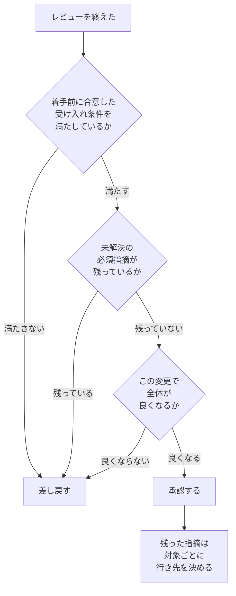

# 04 コードレビュー

| 項目 | 内容 |
|---|---|
| この章で答えること | レビューで何をどの順に見て、どこまで見たら承認してよいか。指摘をどう書き、強さをどう分けるか |
| 作成者 | Claude（Opus 5） |
| 機密区分 | 公開可 |
| 想定読者 | 他人のコードをレビューし、承認の判断を自分で下す開発者 |
| この章を読んだあとできること | 承認の条件を3層に分けて説明できる。指摘の強さを2段階で書き分けられる |
| 保守責任者 | このリポジトリの保守担当 |
| 最終確認日 | 2026-09-08 |
| 出典 | `SRC-REVIEW-001`、`SRC-CODE-001`、`SRC-CODE-002`、`SRC-EXT-006`、`SRC-EXT-031` から `SRC-EXT-041` |
| 例示に使う言語 | Java（例示のためであり、原則は言語に依らない） |

## 3行で

1. **欠陥の発見は目的の1つであって、主目的ではない。** Microsoft で実際のレビューコメント570件を分類した調査では、欠陥に関するものは78件（14%）で9分類中4位だった（`SRC-EXT-038` §V）。最多は「コードの改善」の165件（29%）である。
2. **承認の条件は3層で決める。** 下限は着手前に合意した受け入れ条件（`SRC-REVIEW-001` p.213）、判定は「この変更で全体が良くなるか」（`SRC-EXT-006` の `standard.html`）、終わり方は「よさそうです」（`SRC-CODE-002` p.376）である。
3. **指摘の強さは2段階にする。** マージを止めるものと、止めないものである。質問と参考情報は強さではなく、発話の目的である（`SRC-REVIEW-001` p.137、`SRC-EXT-035`）。

## 章01 から章03 との境目

**この章は、コードの良し悪しの中身を作り直さない。** それは章「[01 良いコードとは何か](01-good-code.md)」「[02 設計](02-design.md)」「[03 アーキテクチャ](03-architecture.md)」が観点IDつきで持っている。

| 水準 | 扱う章 | 例 |
|---|---|---|
| 1つのメソッドの中 | 章01（`GC-` 番、17件） | 分岐が深くなっていないか（`GC-06`） |
| クラスとパッケージの間 | 章02（`DS-` 番、16件） | 責務を変更する理由で定義しているか（`DS-01`） |
| プロセスと配置をまたぐ間 | 章03（`AR-` 番、18件） | 業務ルールが画面の表示コードに入っていないか（`AR-02`） |
| レビューという場 | この章（`RV-` 番、25件） | 何をどの順に見るか。どこまで見たら承認するか |

**この章の観点は、既存の51件を使うための観点である。** 「読みにくい」を指摘するときに使う基準は章01 が持ち、この章はその基準をどう伝え、どこで承認するかを扱う。

## 中心の問い

**この章が答えるのは2つの問いである。どこまで見たら承認してよいのか。相手が直せる指摘をどう書くのか。**

承認の判断は、次の順で行う。



**この図は判断の順序であって、合否の表ではない。** 各段の根拠は、以下の観点で1つずつ示す。

## 観点の一覧

**観点IDの接頭辞は `RV-` である。** レビューの指摘やチェックリストから、この章の観点を一意に指すために振る。

| 観点ID | 見るもの | 強さ | 出典 |
|---|---|---|---|
| `RV-01` | 欠陥の発見だけを目的にしていないか | 必須 | `SRC-EXT-038` §V、`SRC-EXT-037` Finding 1 |
| `RV-02` | 何を基準に見るかを、レビューの前に決めてあるか | 必須 | `SRC-REVIEW-001` 2.1、2.8 |
| `RV-03` | 見る深さを、重要度と影響範囲で変えているか | 推奨 | `SRC-REVIEW-001` 1.4 |
| `RV-04` | 変更の説明を読み、そもそも必要かを先に問うているか | 必須 | `SRC-EXT-031` |
| `RV-05` | 設計を、命名や書式より先に見ているか | 必須 | `SRC-EXT-006`、`SRC-CODE-002` 17.4.2 |
| `RV-06` | 割り当てられた範囲を全部見たか。見ていない範囲を宣言したか | 必須 | `SRC-EXT-006` |
| `RV-07` | 差分の外を見て判断しているか | 必須 | `SRC-EXT-006`、`SRC-EXT-038` §VI |
| `RV-08` | 承認の下限を、着手前の受け入れ条件で決めているか | 必須 | `SRC-REVIEW-001` 6.1、6.2 |
| `RV-09` | 「全体として良くなるか」で判断しているか | 必須 | `SRC-EXT-006`、`SRC-CODE-002` 17.4.3 |
| `RV-10` | 未解決の必須指摘が残っていないなら承認しているか | 必須 | `SRC-EXT-006`、`SRC-EXT-036`、`SRC-EXT-037` 5.1 |
| `RV-11` | 意見が割れたときの決め方を先に決めてあるか | 推奨 | `SRC-EXT-006`、`SRC-CODE-002` 17.4.3 |
| `RV-12` | 緊急のときに緩めるものと緩めないものを分けているか | 推奨 | `SRC-EXT-034` |
| `RV-13` | 「後で直す」の扱いを、対象ごとに分けているか | 必須 | `SRC-EXT-033`、`SRC-CODE-002` 17.4.4、`SRC-REVIEW-001` 3.1 |
| `RV-14` | 指摘に、観察・理由・期待する状態が入っているか | 必須 | `SRC-REVIEW-001` 3.3、`SRC-EXT-006` |
| `RV-15` | コードについて述べ、人について述べていないか | 必須 | `SRC-EXT-006`、`SRC-CODE-002` 17.4.3 |
| `RV-16` | 個人の好みを根拠にしていないか | 必須 | `SRC-EXT-006`、`SRC-REVIEW-001` 3.1 |
| `RV-17` | 説明で済ませず、コードを直させているか | 推奨 | `SRC-EXT-006` |
| `RV-18` | 賞賛と質問を、対応不要の区分に置いているか | 推奨 | `SRC-EXT-039` §IV-B、`SRC-REVIEW-001` 4.1 |
| `RV-19` | テキストの往復をやめる合図を決めているか | 推奨 | `SRC-REVIEW-001` 3.5、`SRC-CODE-002` 17.4.3 |
| `RV-20` | 強さを2段階で表しているか | 必須 | `SRC-REVIEW-001` 4.1、`SRC-EXT-035`、`SRC-EXT-037` 5.1 |
| `RV-21` | 強さと観点を分けて示しているか | 推奨 | `SRC-REVIEW-001` 4.2 |
| `RV-22` | `MUST` を RFC 2119 の定義で正当化していないか | 推奨 | `SRC-EXT-041` §6、`SRC-REVIEW-001` 4.1 |
| `RV-23` | 大きさの目安を、上限ではなく兆候として使っているか | 推奨 | `SRC-EXT-032`、`SRC-EXT-039` §VI-B、`SRC-EXT-040` |
| `RV-24` | 初回の応答を1営業日以内に返しているか | 推奨 | `SRC-EXT-006`、`SRC-CODE-002` 17.4.3 |
| `RV-25` | 人数を増やすより、対象を知っている人を選んでいるか | 推奨 | `SRC-EXT-039` §VI-A、`SRC-EXT-037` 5.2 |

## レビューの目的と範囲

**何のために見るのかが決まっていないと、どこで終わるのかも決まらない。**

### RV-01 欠陥の発見だけを目的にしていないか

**何を見るか**: 「不具合が見つからなかったから承認する」という決め方をしていないか。

**なぜそう言えるか**: `SRC-EXT-038`（Bacchelli・Bird、ICSE 2013）は、Microsoft の複数の製品からレビューの議論200本を無作為に選んだ。**その中の570件のコメントを分類した結果は、開発者の期待と食い違った。**

| 期待（動機の1位） | 実際のコメントの分類 |
|---|---|
| 欠陥の発見。プログラマ873人のうち383人（44%）が1位に挙げた | コードの改善が165件（29%）で最多 |
| 管理者165人のうち44%も最上位に挙げた | 欠陥は78件（14%）で9分類中4位 |

同論文は、欠陥に関する78件のうち65件が `if` 節の式の誤りのような論理の誤りだったと報告する。高い水準の問題は6件、安全は5件、例外処理は3件である。**指摘は細かい水準に寄る。**

`SRC-EXT-037`（Sadowski ほか、ICSE-SEIP 2018）は、Google で900万件のレビュー記録と12件の面接、44件の調査回答を分析した。**同論文の Finding 1 は、Google でのレビューの期待が問題解決を中心にしていないと述べる。** 挙がった主題は、教育、規範の維持、履歴の追跡、門番、事故の防止である。欠陥の発見は歓迎されるが、唯一の焦点ではない。

書籍の側も同じ方向を向く。`SRC-CODE-002` p.375（17.4.2）は、レビューが欠陥の有無とコーディングスタイルを見るものとして広く認知されていると述べる。**そのうえで、むしろ設計的な妥当性に重点を置くべきだと書く。** `SRC-REVIEW-001` p.22（1.2）は、役割を3つ挙げる。コード品質を高めること、保守と運用のしやすさを高めること、技術者を育成することである。

**この4件は独立している。** 査読つき論文2件と書籍2冊であり、著者も国も違う。**この章の中で最も根拠が厚い観点である。**

**判断に迷う例**: 「不具合が1件も見つからなかったレビューは無駄だったのか」。無駄ではない。`SRC-EXT-037` の満足度調査では、44人の回答者のうち、コメントが不具合を見つけたと答えたのは2人だけである。それでも回答者全員がレビューを価値あるものだと答えている。

### RV-02 何を基準に見るかを、レビューの前に決めてあるか

**何を見るか**: そのプロジェクトが採用している設計方針とレビュー観点が、文書として存在するか。

**なぜそう言えるか**: `SRC-REVIEW-001` p.27（2.1）は、どのアーキテクチャや設計方針を基準に見るのかがはっきりしないと、指摘すべき点も曖昧になると述べる。**基準が無い状態で見ると、指摘はレビュアーの個人差になる。**

同書 p.104（2.8）は、その対処としてガイドラインを挙げる。**最初に決めるのは「目的」「観点」「定義」の3つである。** 同じ言葉を使っていてもレビュアーごとに解釈が違うと判断がばらつくため、観点の定義をそろえる。ただし観点を細かくしすぎるとレビューの費用が増えるため、共通認識を持てる粒度にとどめる。

同書 p.105（2.8）は、「具体例」「判断基準」「FAQ」を運用しながら足していく項目として分ける。**判断基準を最初から詳細に定めるのは難しく、蓄積しながら整理するのが現実的である。**

`SRC-CODE-002` p.375（17.4.1）は、別の置き場所を挙げる。**プルリクエストのテンプレートにレビュー観点を入れ、設計ルールへのリンクを貼る。**

**この手引きでは、観点の定義を章01 から章03 が持つ。** `GC-` が17件、`DS-` が16件、`AR-` が18件である。ガイドラインを新しく書く代わりに、これらの観点IDを指せばよい。

**判断に迷う例**: ガイドラインが無いチームで、レビューを始めてよいか。始めてよい。`SRC-REVIEW-001` p.104 は最小構成から始めることを勧めている。**観点を全部そろえてから始める必要は無い。**

### RV-03 見る深さを、重要度と影響範囲で変えているか

**何を見るか**: すべてのプルリクエストを同じ深さで見ようとしていないか。

**なぜそう言えるか**: `SRC-REVIEW-001` p.23-24（1.4）は、すべてのプルリクエストを同じ深さでレビューする必要は無い、と明記する。レビューには費用がかかるため、チームと製品の状況に応じて対象と深さを調整する。**重要な変更や影響範囲の大きい箇所に重点を置くのが現実的である。**

ただし、深さを変えたことは伝える。`SRC-EXT-006` の `looking-for.html`（Every Line）は、複数のレビュアーがいる場合に特定のファイルや観点だけを見てよいとしたうえで、**どの部分を見たかをコメントで宣言することを求めている。** 詳しくは `RV-06` で扱う。

**判断に迷う例**: 設定ファイル1行の変更に、どこまで時間をかけるか。`SRC-EXT-037` §6.2 は、最も満足度の低い回答が、1語または2行という極めて小さな変更に結び付いていたと報告する。**小さい変更ほど、レビューが形だけになりやすい。** 一方 `SRC-EXT-040` p.74 は、1行の変更でも最低5分はかけよと書く。

## 見る順序

**順序は2つの層に分かれる。1回のレビューを進める手順と、各段で何を見るかの観点である。この2つは両立する。**

`SRC-EXT-031`（Navigating a CL in Review）が手順を3段で示し、`SRC-EXT-006` の `looking-for.html` が観点を12項目で示す。**Google 自身が両者を別のページに分けている。** `SRC-REVIEW-001` p.26（2章）も、観点を7つに整理したうえで設計を最初に置く。

### RV-04 変更の説明を読み、そもそも必要かを先に問うているか

**何を見るか**: コードを読み始める前に、変更の説明を読んだか。

**なぜそう言えるか**: `SRC-EXT-031` の第1段は、変更の説明を読み、この変更にそもそも意味があるかを問うことである。**意味が無い変更なら、そこで止める。** 細部を調べる時間を使わずに済む。

第2段は、最も大きな論理的変更を含むファイルから見ることである。**同文書は理由を2つ挙げる。** 開発者は変更をレビューに出した直後に次の作業を始めることが多く、大きな設計の問題を早く伝えるほど手戻りが小さい。設計の変更は小さな変更より直すのに時間がかかる。

第3段は、残りのファイルを論理的な順序で漏れなく見ることである。

`SRC-EXT-038` §VI-A は、この手順が要る理由を示す。**面接で最も強く挙がった困難は「変更を理解すること」だった。** 分類したコメントの2番目に多い分類も、質問と回答からなる「理解」である。同論文の調査では、873人のうち798人（91%）が、慣れていないファイルはレビューに時間がかかると答えた。

**判断に迷う例**: 説明が空のプルリクエストをどうするか。`SRC-REVIEW-001` p.128（3.4）は、概要説明に書く項目を6つ挙げる。変更内容、実装の目的、影響範囲、確認してほしい点、動作確認内容、関連資料である。**同書 p.132（3.5）は、情報が足りないときに責めるのではなく、レビューしやすくするために追加を依頼する姿勢を勧めている。**

### RV-05 設計を、命名や書式より先に見ているか

**何を見るか**: 最初のコメントが命名や書式になっていないか。

**なぜそう言えるか**: `SRC-EXT-006` の `looking-for.html` は、観点を12項目で並べる。**先頭は Design であり、同文書は「レビューで扱う最も重要なものは変更全体の設計である」と書く。**

```text
Design / Functionality / Complexity / Tests / Naming / Comments /
Style / Consistency / Documentation / Every Line / Context / Good Things
```

`SRC-REVIEW-001` p.26（2章）は、観点を7つに整理する。設計、理解容易性、命名、コードスタイル、機能・性能、テスト、ドキュメントである。**同書は設計を最初に置く理由を、設計が後続の観点にも影響するためだと述べる。**

`SRC-CODE-002` p.375（17.4.2）も、設計的な妥当性に重点を置けと書く。**この3件は独立している。**

次の差分は、設計を先に見ないと問題を見落とす例である。

**悪い例**

```java
public class UserService {
    private final UserRepository repository;

    public UserService(UserRepository repository) {
        this.repository = repository;
    }

    // 今回の変更: 例外で落ちていたので try-catch を足した
    public User find(long id) {
        try {
            return repository.findById(id);
        } catch (RuntimeException e) {
            return null;
        }
    }
}
```

**良い例**

```java
public class UserService {
    private final UserRepository repository;

    public UserService(UserRepository repository) {
        this.repository = repository;
    }

    public Optional<User> find(long id) {
        try {
            return Optional.of(repository.findById(id));
        } catch (UserNotFoundException e) {
            return Optional.empty();
        }
    }
}
```

**なぜ悪いのか**: この差分だけを見ると「例外で落ちなくなった」ように読める。**しかし戻り値の契約が変わっている。** 変更前は例外が飛んでいた場所で、呼び出し側は `null` を受け取る。`null` を扱えるかどうかは、この差分の中には書かれていない。ここで変数名 `e` や字下げを先に指摘すると、契約が変わったことに気づかないまま話が細部へ移る。

**なぜ良いのか**: 違いは2つある。捕まえる例外を `UserNotFoundException` に絞ったため、他の例外は今までどおり呼び出し側へ伝わる。**そして「見つからない」という状態が戻り値の型に現れている。** 呼び出し側は `Optional` を扱わなければコンパイルが通らない。契約が変わったことが、差分を読む人にも呼び出し側にも見える。章01 の `GC-04`（1つのメソッドが1つのことをしているか）が、この判断の基準を持っている。

**判断に迷う例**: 設計の問題を見つけた時点で、残りを見ずに返してよいか。返してよい。`SRC-EXT-031` の第2段は、大きな設計の問題を早く伝えるほど手戻りが小さいと述べる。**ただし、どこまで見たかを書く。** `RV-06` の宣言と同じ扱いである。

### RV-06 割り当てられた範囲を全部見たか。見ていない範囲を宣言したか

**何を見るか**: 「たぶん大丈夫だろう」で飛ばした部分が無いか。飛ばしたなら、そう書いたか。

**なぜそう言えるか**: `SRC-EXT-006` の `looking-for.html`（Every Line）は、割り当てられたコードの全行を見ることを原則とする。**例外は、複数のレビュアーがいる場合である。** そのときは特定のファイルや観点だけを見てよく、**どの部分を見たかをコメントで宣言する。**

同文書は、自分に判断できない領域についても述べる。**「見なかったまま承認する」のではなく、その領域を判断できるレビュアーを足す。**

**判断に迷う例**: 自動生成されたコードや、機械的な整形だけの差分をどう扱うか。`SRC-EXT-032`（Small CLs）は、ファイル全体の削除を1行の変更として数え、自動リファクタリングの道具が生成した変更を例外として挙げる。**生成物と手で書いた部分を分けて数える。**

### RV-07 差分の外を見て判断しているか

**何を見るか**: 変更行だけを読んで判断していないか。

**なぜそう言えるか**: `SRC-EXT-006` の `looking-for.html`（Context）は、レビューの道具が変更の前後数行しか見せないことを指摘し、ファイル全体とシステム全体を見て判断することを求める。**システムの健全性を下げる変更は受け入れない。**

`SRC-EXT-038` §VI-A も同じ困難を報告する。回答したプログラマの91%が、慣れていないファイルはレビューに時間がかかると答えた。理由として挙がったのは、小さな変更でもレビュー対象より広い範囲を読む必要がある、というものである。

次の差分は、変更行だけを見ると正しく読めるが、差分の外が壊れている例である。

**悪い例**

```java
public enum ShipmentStatus {
    PREPARING, SHIPPED, DELIVERED,
    RETURNED
}

// 差分の外にあるコード。今回は変更していない
public class ShipmentLabel {
    public String of(ShipmentStatus status) {
        switch (status) {
            case PREPARING: return "準備中";
            case SHIPPED:   return "発送済";
            case DELIVERED: return "配達完了";
            default:        return "不明";
        }
    }
}
```

**良い例**

```java
public enum ShipmentStatus {
    PREPARING, SHIPPED, DELIVERED, RETURNED
}

public class ShipmentLabel {
    public String of(ShipmentStatus status) {
        return switch (status) {
            case PREPARING -> "準備中";
            case SHIPPED   -> "発送済";
            case DELIVERED -> "配達完了";
            case RETURNED  -> "返品済";
        };
    }
}
```

**なぜ悪いのか**: 差分は列挙に `RETURNED` を足した1行である。**その1行に誤りは無い。** しかし `default` があるため、返品された荷物の表示は「不明」になる。**コンパイルも通り、テストが無ければ気づけない。** 差分の外にある `ShipmentLabel` を開かなければ、この問題は見えない。

**なぜ良いのか**: `switch` 式にして `default` を消したため、列挙に値を足した時点でコンパイルが失敗する。**次に誰かが値を足したときも、機械が教えてくれる。** 章01 の `GC-06`（分岐が深くなっていないか）は分岐の形を扱うが、「差分の外が壊れる」という見方はこの章が持つ。

**判断に迷う例**: どこまで差分の外を開くか。`SRC-EXT-039` §VI-B は、変更に含まれるファイル数が増えるほど、有用と判定されるコメントの割合が下がると測定している。**開く範囲を広げると質は上がるが、時間は延びる。** `RV-03` の深さの判断と組み合わせる。

## 承認の条件

**承認の条件は3層に分かれる。この3つは別のことを言っており、どれか1つを選ぶものではない。**

| 層 | 決めるもの | 出典 |
|---|---|---|
| 下限 | 着手前に合意した受け入れ条件 | `SRC-REVIEW-001` p.213（6.2） |
| 判定 | この変更で全体が良くなるか | `SRC-EXT-006` の `standard.html` |
| 終わり方 | 「よさそうです」で終える | `SRC-CODE-002` p.376（17.4.3） |

### RV-08 承認の下限を、着手前の受け入れ条件で決めているか

**何を見るか**: 何を満たせば完了なのかが、レビューを始める前に決まっているか。

**なぜそう言えるか**: `SRC-REVIEW-001` p.213（6.2）は、着手前に受け入れ条件を明文化してチームで合意することを求める。**受け入れ条件は、そのタスク固有の完了条件を具体的に示すものである。** 同書 p.214 は、ユーザー登録機能の例として5項目の確認表を挙げる。必須項目を入れると登録できること、仕様どおりの検証が設定されていること、正常系と異常系のテストコードが実装されていること、などである。

**この合意が無いと、承認の判断がレビューの場に持ち込まれる。** 同書 p.213 は、実装後に仕様の解釈違いが見つかると、修正だけでなく再レビューと再確認も必要になると述べる。作業量が多いタスクほど、発覚したときの費用が大きい。

同書 p.212（6.1）は、完了の定義そのものも動かす。**ゴールを「実装が終わった」ではなく「マージされ、利用者に届く状態になった」に置く。** ゴールを実装完了に置くと、レビュー待ちや修正対応が見えなくなる。

`SRC-EXT-036`（GitLab）も同じ形をとる。**承認前の確認項目表を持ち、品質・性能・安全・文書・配備・法令順守の6分野に分けている。**

**判断に迷う例**: 受け入れ条件に書かれていない問題を見つけたら、差し戻してよいか。差し戻してよい。受け入れ条件は下限であって、上限ではない。**ただし、それが必須の指摘なのかは `RV-20` の2段階で分ける。**

### RV-09 「全体として良くなるか」で判断しているか

**何を見るか**: 承認の前に細部を磨き上げることを求めていないか。

**なぜそう言えるか**: `SRC-EXT-006` の `standard.html` は、判定の基準を1つに定める。**その変更がシステム全体のコードの健全性を確実に良くする状態になったら承認する。** 同文書は「完璧なコードというものは存在しない。あるのはより良いコードだけである」と書き、承認の前にあらゆる細部を磨かせることを禁じている。

`SRC-CODE-002` p.376（17.4.3）が訳出した Chromium の指針も、同じ趣旨を「終わりを見つける」として挙げる。**完璧に固執して徹底的なレビューをしようとすると、レビューされる側は疲弊する。** 「絶対に間違いないと保証する」ではなく「よさそうです」でレビューを終える。

**この2件は独立している。** 一方は Google の公開標準、他方は Chromium プロジェクトの指針である。

**判断に迷う例**: 「良くなる」の判断が割れたときはどうするか。`RV-11` の手順で決める。

### RV-10 未解決の必須指摘が残っていないなら承認しているか

**何を見るか**: 任意の指摘が残っているという理由だけで、承認を止めていないか。

**なぜそう言えるか**: `SRC-EXT-006` の `speed.html` は、指摘を残したまま承認してよい場合を3つ挙げる。著者が確実に対応すると信じられるとき、指摘が必須でないとき、修正が些細なとき（import の整理や誤字）である。

`SRC-EXT-036`（GitLab）は、これを規則にしている。**非ブロッキングの指摘しか残っていないとき、待たずに次の段階へ進める。**

`SRC-EXT-037` 5.1 は、道具の側で同じ区別を作った例を示す。**Google のレビュー道具では、未解決のコメントが著者の作業項目であり、解決済みのコメントは任意または情報提供である。** 強さが道具の状態として表れる。

**この3件は独立している。** Google の公開標準、GitLab の公開標準、査読つき論文である。

**判断に迷う例**: 著者が対応すると信じられるかを、どう判断するか。`SRC-EXT-039` §VI-A は、同じチームか別のチームかで指摘の有用度に実質的な差が無いことを測定している（差は5製品すべてで1.5%未満）。**信頼の根拠を所属に置かない。** 過去にその指摘がどう扱われたかを見る。

### RV-11 意見が割れたときの決め方を先に決めてあるか

**何を見るか**: 議論が止まったときに、次に何をするかが決まっているか。

**なぜそう言えるか**: `SRC-EXT-006` の `standard.html` は、決め方を段階で示す。**まず著者とレビュアーで合意を試み、次に対面または会議を持ち、最後に技術リードや管理者へ上げる。** 同文書は「変更を放置しない」と書く。

判断の優先順位も同じ文書にある。**技術的な事実とデータが、意見と個人の好みに優先する。** スタイルの点はスタイルガイドが権威を持ち、規則が無い点は既存コードとの一貫性を求めてよい。

`SRC-CODE-002` p.376（17.4.3）が訳出した Chromium の指針は、2つを加える。**レビュー道具の上で意見がまとまらなければ、実際に会って意見を交換する。** そして、どちらでもよいことについてレビューの場で決着を付けようとしない。**レビューの目的は勝ち負けではない。**

**判断に迷う例**: 著者の主張が正しいときはどうするか。`SRC-EXT-033`（Handling Pushback）は、まず著者が正しいかを検討せよと述べる。**著者はコードに近いため、より良い洞察を持っていることがある。** 著者が正しくないと判断したときは、著者の返答を理解したことを示したうえで、追加の情報を添えて説明する。

### RV-12 緊急のときに緩めるものと緩めないものを分けているか

**何を見るか**: 「急ぎだから」で通した変更が、あとで見直されているか。

**なぜそう言えるか**: `SRC-EXT-034`（Emergencies）は、緊急の変更を定義する。**巻き戻しの代わりに大きな公開を続けられるようにするもの、利用者に影響している本番の不具合を直すものなど、重大な問題を即座に解決する小さな変更である。**

緊急のときに優先するのは2つである。レビューの速さと、「その緊急を実際に解決しているか」の正しさである。**そのうえで、事後により丁寧なレビューを行う。**

同文書は、緊急ではないものも列挙する。**この一覧が、緩めてよい範囲の境界になる。**

| 緊急ではないもの |
|---|
| 来週ではなく今週公開したい |
| 著者がその変更に長く取り組んだ |
| レビュアーが別の時間帯にいる、または移動中である |
| 金曜の終業時刻である |
| 硬くない締切がある |
| テストが落ちている変更を巻き戻す |

**判断に迷う例**: 緊急で通した変更を、誰がいつ見直すか。**`SRC-EXT-034` は「事後により丁寧なレビューを行う」と書くが、その時期と担当を決める方法は書いていない。** `RV-13` の行き先の表と同じ扱いにする。

### RV-13 「後で直す」の扱いを、対象ごとに分けているか

**何を見るか**: 「後で直します」の対象が何なのかを、確かめているか。

**なぜそう言えるか**: 3つの資料が違うことを言っているように見えるが、**扱っている対象が違う。**

| 対象 | 扱い | 出典 |
|---|---|---|
| 今回の変更が持ち込んだ複雑さ | 今回の変更の中で直す | `SRC-EXT-033`（Handling Pushback） |
| もとからあった良くないコード | 改善タスクに積み、定期的に棚卸しする | `SRC-CODE-002` p.377（17.4.4） |
| 今回扱う必要が薄い議論 | 別のイシューかプルリクエストに切り出す | `SRC-REVIEW-001` p.110-111（3.1 の5） |

`SRC-EXT-033` の理由は明快である。**原著者が書いてから時間が経つほど、その片付けは起きにくくなる。** 周辺の問題に手を出せないときは、不具合票を自分に割り当て、`TODO` のコメントから参照する。

`SRC-CODE-002` p.377 も同じ観察を述べる。**新しい仕事に忙殺され、結局は忘れ去られる。** そのため、タスク管理の道具に改善タスクとして積み上げ、定期的に棚卸しする。

**切り出すときは、いつ誰が対応するかを合意する。** `SRC-REVIEW-001` p.137（4.1）は、対応を見送るなら「別チケットで対応する」のように決めておかないと、そのまま放置されると書く。

**判断に迷う例**: もとからあった問題が、今回の変更で悪化した場合はどうするか。**この場合は「今回の変更が持ち込んだ」側に入る。** 変更の前後で悪化しているかを見る。

## 指摘の書き方

**指摘は、相手が直せる形になって初めて指摘である。**

### RV-14 指摘に、観察・理由・期待する状態が入っているか

**何を見るか**: そのコメントを読んだ人が、何をどう直せばよいか決められるか。

**なぜそう言えるか**: `SRC-REVIEW-001` p.116（3.3）は、根拠が弱い表現だけでは対応方針が伝わらないと述べる。**「なぜそうすべきか」という理由を添える。** 同書 p.117 は、意見や感想で終わるコメントでは何をどう直せばよいか判断できないため、修正の方向性や具体例もあわせて示すことを求める。

同書 p.110（3.1 の4）は、この3つ目を「ゴール」と呼ぶ。**対応の要否を明確にしたうえで、どう修正されていればよいかを具体的に示す。**

`SRC-EXT-006` の `comments.html` も、同じことを別の言い方で述べる。**「何を」ではなく「なぜ」を書く。** 理由が分かると著者は指摘の背景を理解できる。

**悪い例**

```text
ここ、なんか気になります。直しておいてください。
```

**良い例**

```text
MUST(Design): ShipmentLabel の switch に default があるため、
ShipmentStatus に値を足してもコンパイルが通ります。今回 RETURNED を
足したので、この表示は「不明」になります。default を消して全ての値を
並べる形にしてください。次に値が増えたときも、コンパイルで気づけます。
```

**なぜ悪いのか**: 「気になります」は観察ではなく感想である。**どの行のことなのか、何が問題なのか、どうなれば直ったことになるのかが、どれも書かれていない。** 受け取った側は、まず「どこですか」と聞き返す。往復が1つ増える。

**なぜ良いのか**: 4つがそろっている。強さ（`MUST`）、観察（`default` があるため値を足しても通る）、理由（この表示が「不明」になる）、期待する状態（`default` を消して全ての値を並べる）である。**受け取った側は、聞き返さずに直せる。** さらに、直したあとに何が良くなるかも書かれている。

**判断に迷う例**: 直し方が自分にも分からないときはどうするか。`SRC-EXT-006` の `comments.html` は、問題を指摘するだけの書き方と、直接の指示を与える書き方の間で釣り合いを取れと述べる。**問題だけを示すと著者は学ぶが、具体例が有効な場面もある。** 直し方が分からないなら、観察と理由だけを書き、期待する状態を著者と決める。

### RV-15 コードについて述べ、人について述べていないか

**何を見るか**: 主語がコードになっているか、人になっているか。

**なぜそう言えるか**: `SRC-EXT-006` の `comments.html` は、常にコードについて述べ、開発者については述べないことを求める。

`SRC-CODE-002` p.375（17.4.3）は、これをレビューの最重要の原則に置く。**攻撃的なコメントは、どんなに正しい内容でも許されない。** 人格を傷つけ、生産性を下げ、コードを良くするという本来の目標を妨げる。

同書 p.376 が訳出した Chromium の指針は、次の3つを「いけないこと」に挙げる。**人を辱めない。極端な言葉やネガティブな表現を使わない。人ではなくコードについて議論する。** 併せて「すべきこと」の筆頭に「能力と善意を想定する」を置く。**ミスは情報不足に起因すると考える。**

**悪い例**

```text
なぜこれで動くと思ったのですか。普通はこう書きません。
```

**良い例**

```text
MUST(Functionality): find が例外の代わりに null を返すようになったため、
呼び出し側の OrderService で NullPointerException になります。
戻り値を Optional にして、見つからない場合を型で表してください。
```

**なぜ悪いのか**: 主語が人である。「なぜ思ったのですか」は著者の判断を問い、「普通は」は著者を規範の外に置く。**技術的に正しくても、直す場所は1つも書かれていない。** 受け取った側は防御に回り、議論が技術から離れる。

**なぜ良いのか**: 主語がコードである。**どの呼び出し側で、何が起きるかが書いてある。** 著者を評価する語が1つも無い。強さと観点が先頭にあるため、必須の修正であることも伝わる。

**判断に迷う例**: 同じ誤りが繰り返されるときはどうするか。**それでも人を主語にしない。** `RV-19` に従い、テキストの往復ではなく対話に切り替える。

### RV-16 個人の好みを根拠にしていないか

**何を見るか**: 「自分ならこう書く」を、修正の理由にしていないか。

**なぜそう言えるか**: `SRC-EXT-006` の `standard.html` は、判断の優先順位を定める。**技術的な事実とデータが、意見と個人の好みに優先する。** スタイルの点はスタイルガイドが権威を持つ。規則が無い点については、既存コードとの一貫性を求めてよい。

`SRC-REVIEW-001` p.110（3.1 の5）は、同じことを言い換えの形で示す。**「自分ならこう書きます」ではなく「この書き方のほうが、他の実装箇所との関係で整合性が取れそうです」と伝える。** 個人の好みではなくチーム全体の方針を根拠にすることで、レビューの属人化を防ぐ。

`SRC-CODE-002` p.376（17.4.3）が訳出した Chromium の指針は、これを禁止の形で書く。**どちらでもよいことについて、レビューの場で決着を付けようとしない。**

**この手引きでは、根拠を観点IDで示せる。** 「読みにくい」ではなく `GC-06`、「責務が混ざっている」ではなく `DS-01` と書けば、判断の基準が本文にある。**ただし、この対応づけそのものは資料に無い。** 資料が求めているのは「理由を示す」ことであり、観点IDはこの手引き固有の実装である。

**判断に迷う例**: スタイルガイドにも既存コードにも根拠が無いときはどうするか。**そのときは必須の指摘にしない。** `SRC-EXT-006` の `looking-for.html` は、スタイルガイドにない純粋な好みの問題を差し戻しの理由にしないと述べている。

### RV-17 説明で済ませず、コードを直させているか

**何を見るか**: 「複雑ですが、こういう理由です」という返答で終わっていないか。

**なぜそう言えるか**: `SRC-EXT-006` の `comments.html` は、著者が説明を求められて答えたときの扱いを定める。**説明で終わらせず、コードをより明確に書き直させる。** コメントを足して済ませない。

理由は単純である。**説明はレビューの画面に残り、コードには残らない。** 次に読む人は、その画面を開かない。

**判断に迷う例**: 説明がコードに書けない種類のものだったらどうするか。**その場合はコードのコメントか、設計の記録に残す。** `SRC-CODE-002` p.376 が訳出した Chromium の指針は、変更の理由を聞き、やりとりを記録することで将来その意図が分かるようになると述べている。

### RV-18 賞賛と質問を、対応不要の区分に置いているか

**何を見るか**: 賞賛や質問が、修正の依頼と同じ見た目で並んでいないか。

**なぜそう言えるか**: **賞賛と質問は書いてよい。ただし、必須の指摘と混ぜない。**

書いてよい理由は2件ある。`SRC-EXT-006` の `looking-for.html`（Good Things）は、良い点を伝えることを求める。とくに指摘への対応が良かったときに伝える。`SRC-REVIEW-001` p.115（3.3 の1）も、短いひとことが相手に安心感を与えると述べる。

混ぜない理由は測定にある。`SRC-EXT-039` §IV-B は、Microsoft の開発者7人に自分が受けた指摘145件を評価させた。**「有用でない」と評価されたものの中に、実装への賞賛と、レビュアーが理解するための質問が入っている。**

**この2つは対立していない。** 同論文が測ったのは「その指摘が変更を良くしたか」であり、著者から見た有用度である。**関係づくりの効果を測ったものではない。** 測っているものが違う。

`SRC-REVIEW-001` p.136-137（4.1）は、この扱いを記法にしている。**`Q`（質問）と `FYI`（参考情報）は、修正の要否が「不要」の区分に置かれている。**

**判断に迷う例**: 質問の答え次第で必須の指摘になる場合はどうするか。**質問として出し、答えを見てから強さを付ける。** `SRC-EXT-006` の `comments.html` は、確信が持てないときに質問の形で出すことを認めている。

### RV-19 テキストの往復をやめる合図を決めているか

**何を見るか**: 同じ論点で何往復もしていないか。

**なぜそう言えるか**: `SRC-REVIEW-001` p.133（3.5）は、切り替える合図を2つ挙げる。**コメントが何往復も続いている場合と、レビュイーが修正方針に迷っていそうな場合である。** 設計判断が絡む指摘や、前提の認識がずれているコメントでは、テキストの往復を続けるほど意図が伝わりにくくなる。

`SRC-CODE-002` p.376（17.4.3）が訳出した Chromium の指針も、同じことを1行で書く。**レビュー道具の上で意見がまとまらなければ、実際に会って意見を交換する。**

`SRC-EXT-006` の `standard.html` も、合意できないときに対面または会議を持つことを段階に含めている。

**この3件は独立している。**

**判断に迷う例**: 会議のあと、決まったことをどこに書くか。**レビューの画面に書く。** `SRC-CODE-002` p.376 の「理由を聞く」は、やりとりを記録すると、あとから読む人に変更の意図が伝わると述べている。

## 指摘の強さ

**強さは、マージを止めるか止めないかの2値である。それ以外の区分は、強さではなく発話の目的である。**

### RV-20 強さを2段階で表しているか

**何を見るか**: 受け取った側が、どれを直せばマージできるのかを1目で判断できるか。

**なぜそう言えるか**: `SRC-REVIEW-001` p.136-137（4.1）は、7区分の例を示す。`MUST`（必須）、`SHOULD`（推奨）、`BETTER`（任意）、`NITS`（任意）、`IMO`（任意）、`Q`（不要）、`FYI`（不要）である。

**同じ節が、そのうえで2区分を勧めている。** 同書 p.137 は、`SHOULD` の運用が複雑になりやすいと述べる。見送るなら「別チケットで対応する」のようにいつ対応するかを合意しないと放置される。**基本の要否は `MUST` と `BETTER` の2つで足りる、と同書は結論している。**

道具と規約の側も、同じ形をとる。

| 出どころ | 2値の表し方 |
|---|---|
| `SRC-EXT-037` 5.1（Google の道具） | 未解決のコメントが作業項目、解決済みが任意または情報提供 |
| `SRC-EXT-035`（Conventional Comments） | 装飾 `(blocking)` と `(non-blocking)` |
| `SRC-EXT-036`（GitLab） | 必須でない提案に `(non-blocking:)` を付ける |
| `SRC-EXT-006` の `standard.html` | `Nit:` を付けて必須でないことを示す |

**この4件は独立している。** 査読つき論文、規約、GitLab の公開標準、Google の公開標準である。

**悪い例**

```text
命名が分かりにくいです。
ここは早期 return にできます。
この for 文は stream で書けます。
テストが1件も足されていません。
```

**良い例**

```text
MUST(Test): 追加した discount メソッドのテストがありません。
        受け入れ条件に「異常系のテストコード」があるため、
        0円と負数の場合を足してください。
BETTER(Simplicity): この for 文は stream でも書けます。
        今回の変更とは別の話なので、直さなくてかまいません。
```

**なぜ悪いのか**: 4件が同じ見た目で並んでいる。**どれがマージを止めるのかが分からない。** 受け取った側は、全部直すか、全部後回しにするかのどちらかに寄る。`SRC-REVIEW-001` p.129（3.4）は、意図や優先度が曖昧だと、レビュイーが必要以上に対応しようとしてリードタイムが伸びると述べている。

**なぜ良いのか**: 2件に減り、それぞれに強さが付いている。**`MUST` の理由が受け入れ条件を指しているため、なぜ必須なのかも分かる。** `BETTER` には「直さなくてかまいません」と書き添えてある。`SRC-REVIEW-001` p.132（3.5）は、「任意ですが」「参考までに」を添えると判断の余地が伝わると述べている。

**判断に迷う例**: 区分を7つに増やしてよいか。増やしてよい。**ただし `SRC-REVIEW-001` p.137 は、略語が多すぎると意図が伝わりにくくなるため、使う略語を厳選してチームで規則を決めることを求めている。**

### RV-21 強さと観点を分けて示しているか

**何を見るか**: 同じ `MUST` の中で、設計の問題と機能の不具合が区別できるか。

**なぜそう言えるか**: `SRC-REVIEW-001` p.138（4.2）は、対応の要否だけでなく、指摘がどの観点に関するものかも示すことを求める。**同じ `MUST` でも、設計上の問題か機能の不具合かで、確認すべき内容と修正方針が変わる。**

同書は観点の接頭辞を7つ挙げる。`Design`、`Simplicity`、`Naming`、`Style`、`Functionality`、`Test`、`Document` である。2つを組み合わせて `MUST(Naming):` のように書く。

**この手引きでは、観点をさらに細かく指せる。** 章01 から章03 が観点IDを51件持っているためである。`MUST(GC-14)` と書けば、命名の判断基準が `GC-14` の本文にあることまで伝わる。

**この対応づけは資料に無い。** `SRC-REVIEW-001` が定めるのは7つの接頭辞であり、観点IDへ細かくすることは書かれていない。**この手引きの判断である。効果を測った資料も見つかっていない。**

**判断に迷う例**: 観点をどこまで細かく書くか。**分からないときは7つの接頭辞にとどめる。** 観点IDは、指摘を受けた側がその章を開ける場合に効く。

### RV-22 `MUST` を RFC 2119 の定義で正当化していないか

**何を見るか**: 「RFC 2119 に定義があるから `MUST` は必須である」という説明をしていないか。

**なぜそう言えるか**: `SRC-REVIEW-001` p.137（4.1）は、区分の脚注として RFC 2119 を挙げる。**参考として挙げているのであり、定義を引き継ぐとは書いていない。**

RFC 2119 の側は、借用を歓迎していない。`SRC-EXT-041` §6 は、これらの語を注意深く控えめに使うよう求め、**相互運用に必須でないやり方を強制するために使ってはならないと述べる。** この文書は1997年3月に発行された IETF の BCP 14 であり、仕様書の記述水準を示すためのものである。

定義の中身も、レビューの用法と食い違う。`SRC-EXT-041` §3 の `SHOULD` は、特定の状況では無視する正当な理由がありうることを表す。**ただし、影響をすべて理解し慎重に検討したうえで別の道を選ぶ、という条件が付く。** レビューの `SHOULD` は「できれば直したほうがよい」という軽い意味で使われており、同じではない。

**したがって、語は借りてよいが、意味はチームで決めて書き出す。** `RV-02` のガイドラインに含める。

**判断に迷う例**: 別の語（`P1`、`P2` など）を使ってもよいか。よい。**`SRC-EXT-041` の定義から離れるほうが、誤解は減る。**

## 大きさ・速さ・担当

**この3つは、承認の判断そのものではない。判断の質を左右する条件である。**

### RV-23 大きさの目安を、上限ではなく兆候として使っているか

**何を見るか**: 行数やファイル数を、合否の基準にしていないか。

**なぜそう言えるか**: 4つの数値が資料に出てくるが、**測定の有無と対象がそれぞれ違う。**

| 数値 | 出どころ | 測定の有無 |
|---|---|---|
| 10ファイルを超えたら分割を検討する | `SRC-REVIEW-001` p.112（3.2 の2） | 経験則。測定の裏づけは書かれていない |
| 100行はおおむね妥当、1000行は大きすぎる | `SRC-EXT-032`（Small CLs） | 経験則。同文書が「硬い規則は無い」と明記する |
| 200行未満、400行を超えない | `SRC-EXT-040` p.74 | 測定。ただし1社1部門、2006年、2500件の事例研究である |
| 変更行数の中央値は24行 | `SRC-EXT-037` 5.2 | 実測。Google の900万件の記録であり、規範ではない |

**方向だけは、独立した2件の測定が一致する。** `SRC-EXT-039` §VI-B は、変更に含まれるファイル数が増えるほど有用と判定されるコメントの割合が下がることを、150万件のコメントから示した。`SRC-EXT-040` p.80 は、200行未満のレビューは欠陥密度が高く平均の数倍になることが多いと報告する。**250行を超えるレビューで1000行あたり37件を超えたものは無かった。**

**したがって、上限を1つ決めない。** 大きくなったことを、見落としが増える兆候として扱う。

分けにくいときの例外もある。`SRC-REVIEW-001` p.112 は、機能全体を把握しながら確認する必要がある場合は、小さく分けすぎずまとめて依頼するほうが適すると述べる。`SRC-EXT-032` は、ファイル全体の削除と自動リファクタリングの生成物を例外に挙げる。

**判断に迷う例**: 大きすぎる変更を受け取ったらどうするか。`SRC-EXT-032` は、大きすぎることだけを理由に差し戻す裁量をレビュアーに認めている。`SRC-EXT-006` の `speed.html` は、分割できない場合でも設計面の指摘を返し、著者が次の行動を取れるようにせよと述べる。

### RV-24 初回の応答を1営業日以内に返しているか

**何を見るか**: レビュー依頼を受け取ってから、最初の反応までの時間。

**なぜそう言えるか**: `SRC-EXT-006` の `speed.html` は、**レビュー要求に応じるまでの上限を1営業日と定める。** 同文書は、遅いレビューが引き起こすことを4つ挙げる。チームの生産性が下がり、著者の不満が増し、基準を下げる圧力がかかり、整理とリファクタリングが減る。

`SRC-CODE-002` p.376（17.4.3）が訳出した Chromium の指針も、24時間以内に返信できなければ、いつまでに返信できるかをコメントに残すことを求める。

**ただし、これは完了の期限ではない。** `SRC-REVIEW-001` p.129（3.4）は、レビュー対応の目安はチームによって異なると明記したうえで、24時間を例として挙げるにとどめる。同書は、依頼を受け取ったら絵文字やコメントで受け取ったことを伝え、すぐ着手できないときは見込みを伝えることを勧めている。

**集中の途中では中断しない。** `SRC-EXT-006` の `speed.html` は、コードを書くような集中を要する作業の途中で、レビューのために自分を中断しないよう述べている。

**判断に迷う例**: 速さと厳しさが両立するか。`SRC-EXT-033`（Handling Pushback）は、レビューが厳しすぎると言われたとき、レビューの速度を上げることでその不満が薄れると述べる。**速く返すことと、基準を下げることは別である。**

### RV-25 人数を増やすより、対象を知っている人を選んでいるか

**何を見るか**: レビュアーを、所属や役職ではなく、そのコードとの関わりで選んでいるか。

**なぜそう言えるか**: `SRC-EXT-039` §VI-A は、Microsoft の5製品、190,050件のレビュー要求、約150万件のコメントを分析した。**対象ファイルを過去にレビューしたことのあるレビュアーの有用度は65%から71%であり、初めて見るレビュアーの32%から37%のほぼ2倍である。**

同節は、有用度が過去のレビュー回数5回あたりまで上がり、そのあと70%から80%で頭打ちになることも示す。**一方、同じチームか別のチームかによる差は、5製品すべてで1.5%未満だった。**

`SRC-CODE-002` p.375（17.4.1）も同じ選び方を勧める。**コードの歴史や経緯を知っている人か、設計に詳しい人をレビュアーとして割り当てる。**

**人数の数値は、そのまま持ち込まない。** `SRC-EXT-037` 5.2 の実測では、Google のレビュアー数の中央値は1であり、変更の25%未満が2人以上を持つ。**ただし同論文は、所有権と可読性認定という Google 固有の仕組みが前提であることを同じ節に書いている。**

**判断に迷う例**: 自分が判断できない領域が含まれるときはどうするか。`SRC-EXT-006` の `looking-for.html` は、その領域を判断できるレビュアーを足すことを求める。**人数を増やす理由は、確認の網を広げることではなく、判断できない領域を埋めることである。**

## 決着しなかったこと

**調査の議論で決まらなかったものを、決まらなかったと書く。** 記録は `research/orchestration/review/40-debate.md` にある。

| 決まらなかったこと | 理由 |
|---|---|
| 1回のレビューで見る行数の上限 | 測定は2件あるが、片方は2006年の Cisco 1部門の規範（`SRC-EXT-040`）、他方は Google 全社の実測（`SRC-EXT-037`）である。比べられない |
| 観点IDを指摘に添える方式が効くか | 効果を測った資料が1件も見つからなかった。この方式が資料に無いことだけが決まった |
| 承認の記録をどこにどれだけ残すか | 4系統のどれも、保存先と保存期間を扱った資料を挙げていない。「誰がどの範囲を見たか」は `RV-06` で書けるが、その先は決まっていない |
| 賞賛が変更の質を上げるか | `SRC-EXT-039` は「上げない」と読めるが、測っているのは著者から見た有用度である。関係づくりの効果を測った資料が無い |
| 緊急で通した変更をいつ誰が見直すか | `SRC-EXT-034` は事後の丁寧なレビューを求めるが、時期と担当を決める方法は書いていない |

## この章で扱わないこと

**範囲の外にあるものと、その理由を書く。**

| 扱わないもの | 理由 | 代わりに読むもの |
|---|---|---|
| コードの良し悪しの基準そのもの | 章01 から章03 が観点IDつきで持っている | 章01 の `GC-` 番、章02 の `DS-` 番、章03 の `AR-` 番 |
| AI にレビューさせるときの進め方 | 根拠が `SRC-REVIEW-001` 4.2 の1行だけである。同書7章と公開情報を読んでいない | `SRC-REVIEW-001` 7章 |
| 静的解析と自動整形の設定 | 言語と製品に依存し、寿命が短い | 各道具の公式文書 |
| テストの観点そのもの | テスト設計は別の主題である | 章「05 テスト」 |
| レビューの記録から課題を見つける方法 | `SRC-REVIEW-001` 5章を読んでいない | `SRC-REVIEW-001` 5章 |
| 安全のレビューの詳細 | 安全の設計は、それだけで章1つを要する | `SRC-EXT-006`、OWASP の資料 |
| 設計レビューと仕様レビュー | コードを対象としない場のことである | 章「07 仕事の進め方」 |

**Java は例示のための言語である。** この章の原則は言語に依らない。`switch` 式と `Optional` は Java の表記である。示している考え方は「差分の外が壊れていないか」「契約が変わっていないか」である。

**指摘の例は日本語で書いた。** `MUST` と `BETTER` は接頭辞であり、英語で書くか日本語で書くかは記法の選択である。**どちらでも、強さが2段階であることは変わらない。**

## この章の根拠の弱いところ

**読者が根拠の重みを判断できるように、弱い点を挙げる。**

| 弱い点 | 内容 |
|---|---|
| 公開標準が2社に偏っている | 公開された社内標準として引いたのは Google と GitLab だけである。日本の企業が公開するレビュー基準を調べていない |
| Chromium の指針を原典で読んでいない | `RV-09`、`RV-11`、`RV-15`、`RV-19`、`RV-24` は `SRC-CODE-002` p.376 が訳出した指針を根拠にしている。**原典の `cr_respect.md` を開いていない** |
| `SRC-EXT-040` が販売者の報告である | 発行者の SmartBear はレビュー道具を販売している。**測定の当事者であり、利害関係がある** |
| `SRC-EXT-040` の数値が2006年である | 事例研究の対象は2006年5月までの2500件である。**道具も開発の進め方も、この文書の最終確認日である2026-09-08 とは異なる** |
| 規格の本体を読めていない | IEEE Std 1028-2008（Software Reviews and Audits）を読めていない。`standards.ieee.org` の該当ページが 2026-09-08 の時点で HTTP 403 を返し、IEEE Xplore は HTTP 202 を返して本文を返さなかった |
| `RV-21` の対応づけが資料に無い | 観点IDを指摘に添える方式は、この手引きの判断である。`SRC-REVIEW-001` 4.2 が定めるのは7つの接頭辞である |
| Antigravity が公開情報を読んでいない | 議論に参加した3者のうち、Antigravity は書籍3冊しか検索していない。**公開情報に関わる決着は、司会と codex の2者で行った** |
| `RV-03` の根拠が1冊 | 「見る深さを重要度と影響範囲で変える」は `SRC-REVIEW-001` p.23-24 だけを根拠にしている |
| `RV-17` の根拠が1件 | 「説明で済ませずコードを直させる」は `SRC-EXT-006` の `comments.html` だけを根拠にしている |
| 反証の資料を見つけられていない | `RV-20`（強さは2段階）に反対する資料を見つけられなかった。**反証が無いことは、正しさの証拠ではない** |

調査の記録は `research/orchestration/review/` にある。**論点と決着は `40-debate.md` に、参加した系統は `00-plan.md` に書いてある。**

## 出典

**この章が使った出典と該当箇所を挙げる。** 出典IDの一覧は [出典カタログ](../research/sources.md) にある。

| 出典ID | 使った箇所 | 支持する観点 |
|---|---|---|
| `SRC-REVIEW-001` | 1.1、1.2、1.4、2.1、2.8、3.1、3.2、3.3、3.4、3.5、4.1、4.2、6.1、6.2、6.3 | `RV-01` から `RV-03`、`RV-08`、`RV-13`、`RV-14`、`RV-16`、`RV-18` から `RV-23` |
| `SRC-CODE-001` | 1.2、1.3、5章 | `RV-01`（判断の量）、`RV-20`（記法の先例） |
| `SRC-CODE-002` | 17.4.1、17.4.2、17.4.3、17.4.4 | `RV-01`、`RV-05`、`RV-09`、`RV-11`、`RV-13`、`RV-15`、`RV-16`、`RV-19`、`RV-24`、`RV-25` |
| `SRC-EXT-006` | `standard.html`、`looking-for.html`、`comments.html`、`speed.html` | `RV-05` から `RV-07`、`RV-09` から `RV-11`、`RV-14` から `RV-17`、`RV-24`、`RV-25` |
| `SRC-EXT-031` | Navigating a CL in Review | `RV-04` |
| `SRC-EXT-032` | Small CLs | `RV-06`、`RV-23` |
| `SRC-EXT-033` | Handling Pushback in Code Reviews | `RV-11`、`RV-13`、`RV-24` |
| `SRC-EXT-034` | Emergencies | `RV-12` |
| `SRC-EXT-035` | Conventional Comments | `RV-20` |
| `SRC-EXT-036` | Code Review Guidelines（GitLab） | `RV-08`、`RV-10`、`RV-20` |
| `SRC-EXT-037` | 5.1、5.2、6.1、6.2、Finding 1、Finding 4 | `RV-01`、`RV-03`、`RV-10`、`RV-20`、`RV-23`、`RV-25` |
| `SRC-EXT-038` | §IV、§V、§VI-A | `RV-01`、`RV-04`、`RV-07` |
| `SRC-EXT-039` | §IV-B、§VI-A、§VI-B | `RV-07`、`RV-10`、`RV-18`、`RV-23`、`RV-25` |
| `SRC-EXT-040` | p.65、p.74、p.80、p.81 | `RV-03`、`RV-23` |
| `SRC-EXT-041` | §3、§6 | `RV-22` |

**複数の独立した資料が支持する観点を挙げる。** この章の中では最も根拠が厚い。

| 観点 | 支持する独立した資料の数 |
|---|---|
| `RV-01`（欠陥の発見だけを目的にしない） | 4件（査読つき論文2件、書籍2冊） |
| `RV-05`（設計を先に見る） | 3件 |
| `RV-10`（未解決の必須指摘が無ければ承認する） | 3件 |
| `RV-20`（強さは2段階） | 4件 |

**1件にしか根拠が無い観点を挙げる。** 複数の資料が支持する観点と、重みが違う。

| 観点 | 唯一の根拠 |
|---|---|
| `RV-03`（見る深さ） | `SRC-REVIEW-001` 1.4 |
| `RV-04`（見る順序の3段階） | `SRC-EXT-031` |
| `RV-12`（緊急の扱い） | `SRC-EXT-034` |
| `RV-17`（説明で済ませない） | `SRC-EXT-006` の `comments.html` |
| `RV-21`（強さと観点を分ける） | `SRC-REVIEW-001` 4.2 |
