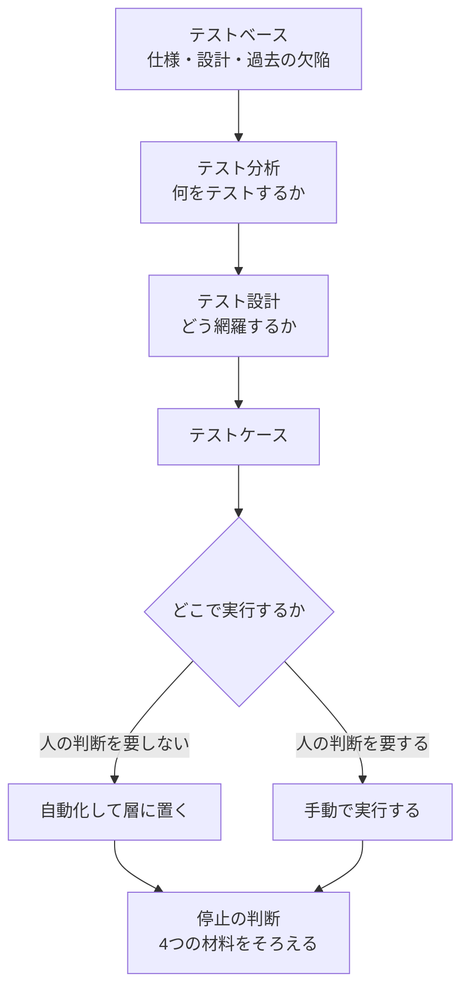
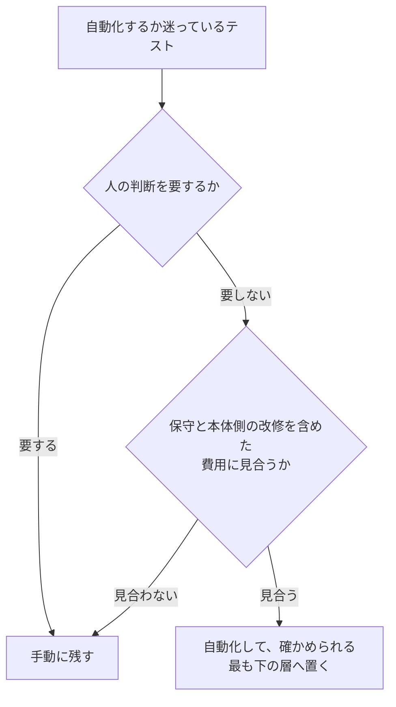

# 05 テスト

リリースの前日に「テストはどこまで終わったのか」と聞かれ、実行した件数だけを答えたことがあるはずである。逆に、仕様書の見出しを写しただけのテスト一覧を渡され、何を確かめる項目なのか読み取れなかったこともあるはずである。**この章は、テストの観点をどこから出すのかと、どこまで実施したら止めてよいと言えるのかを決めるためのものである。**

## この章で判断できること

| 項目 | 内容 |
|---|---|
| 想定読者 | 自分でテストを設計し、テストコードを書き、リリースの可否を判断する開発者 |
| 答える問い | テストの抜けをどうやって減らすか。どこで止めてよいと言えるか |
| 読んだあとにできること | 「このテストが要る理由」を、仕様書の外にある手がかりから説明できる。止めてよいと言える根拠を、実行・欠陥・リスク・開示の4つで関係者に示せる |
| 例示に使う言語 | Java。例示のためであり、原則は言語に依らない |

## 結論

**テストの観点は、仕様書の中だけからは出てこない。** 手がかりは4種類ある。網羅すべきもの、達成すべき特性、テスト対象の一部、そして過去に出たバグのパターンである。仕様書の記述を写して語尾を変えるだけの進め方は、それ自体がアンチパターンとして名前を持っている。

**止める判断は、1つの数値ではなく4つの材料でそろえる。** 合意したテストを実行し終えたか、見つけた欠陥の処置が決まったかを見る。そのうえで、残るリスクが受け入れられる水準かを見て、実施していない範囲を関係者へ開示する。**1つの数値目標で代用しない。**

**自動化は2段階で決める。** 先に「人の判断を要するか」を見て、要するものは手動に残す。残ったものだけを「保守を含めた費用に見合うか」で判断する。**順序が逆になると、人がやるべきテストに費用の話が持ち込まれる。**

**根拠**: `SRC-EXT-052` p.17、`SRC-TEST-001` p.184-185（15.4）、p.315（25.3）、p.346（27.1）、p.413（32.4）、`SRC-EXT-042` §5.1.3

## 章01 から章04 との境目

**この章は、テストしやすいコードの性質を作り直さない。** それは章「[01 良いコードとは何か](01-good-code.md)」が観点IDつきで持っている。

| 主題 | 持つ章 | 例 |
|---|---|---|
| 本体コードがテストしやすいか | 章01（`GC-` 番、17件） | グローバル状態に依存していないか（`GC-10`）。非決定的な動作を直接持っていないか（`GC-11`） |
| カバレッジの数値目標を置かないこと | 章01（`GC-13`） | カバレッジは兆候であって目標ではない |
| テストの単位を決めるときの責務の切り方 | 章02（`DS-` 番、16件） | 責務を変更する理由で定義しているか（`DS-01`） |
| テストの層を決めるときの構造 | 章03（`AR-` 番、18件） | プロセスと配置をまたぐ境界の置き方 |
| テストの有無をレビューで見ること | 章04（`RV-` 番、25件） | 何をどの順に見るか。どこまで見たら承認するか |
| 観点の出し方、設計技法、層の配分、自動化の判断、停止の条件 | この章（`TS-` 番、28件） | 何を手がかりに観点を出すか。どこで止めるか |
| テストコード自体の読みやすさと壊れにくさ | この章 | 実装の内部に結合していないか |

**この境目は資料に書かれていない。この手引きの判断である。** 議論に参加した3者のうち、codex と Antigravity は自分の答えに「推測」の印を付けた。記録は `research/orchestration/test/40-debate.md` の `D-9` にある。

**`GC-13` は「カバレッジの数値目標を置かない」を既に言い切っている。** この章はそれを繰り返さず、「では何で止めるのか」を `TS-19` から `TS-23` で書く。

## 中心の問い

**この章が答える2つの問いは、1つの流れの上にある。** 観点からテストケースまでの流れと、停止の判断の位置は次のとおりである。



**この図は作業の順序であって、工程の定義ではない。** 各段の根拠は、この後の節が観点ごとに1つずつ示す。

## テスト観点の出し方

**観点が出ていない段階で技法を選ぶと、技法の適用先そのものが抜ける。** 観点とは、何をテストするかを決める切り口のことである。この節は、観点をどこから引き出し、どこで洗い出しを打ち切り、誰が出すのかを扱う。

### TS-01 観点の手がかりを、仕様書の外にも求めているか

**観点の出どころを、仕様書の目次だけにしない。** 仕様書に書かれていない前提や、過去に出た欠陥は、目次をたどっても現れない。

西康晴の資料「テスト観点に基づくテスト開発方法論 VSTeP の概要」は、観点の手がかりを4種類挙げる。

| 手がかり | 中身 |
|---|---|
| 網羅すべきもの | 仕様、機能、データ、使い方 |
| 達成すべき特性 | 性能、安全、使いやすさなどの品質特性 |
| テスト対象の一部 | 機能、サブシステム、モジュール、ハードウェア |
| バグのパターン | 過去に出た欠陥の型 |

同資料は、テストタイプ、テスト技法、テストレベル、開発時に書いた図表も手がかりになると述べる。**同資料は、具体化してテストケースにならないものは観点ではないとも定義している。**

書籍の側も同じ向きを取る。『ソフトウェアテスト徹底指南書』は、抽出すべき観点を7種類挙げる。

| 抽出すべき観点 |
|---|
| テスト対象を項目分けしたもの |
| プロダクトリスク |
| 品質特性 |
| 視座の欠落を補うもの（法規制、社内標準） |
| 特に注意が要るテスト条件 |
| 複数のケースに横断的に効くテスト条件 |
| 共通して再利用できる観点 |

**同書は、観点を洗い出して整理すると、仕様書に書かれていないが本来必要なテストを見つけ出せると述べる。**

**この2件は独立している。** 一方は方法論の提唱者本人が公開した資料、他方は日本語の書籍である。

過去の欠陥をどこから集めるかは、同書が「気がかりレビュー」として示す。テストベース（仕様や設計など、テストの根拠にする資料）を関係者で読みながら、テストでフォローすべき気がかりをメモとして書き足していく進め方である。**この進め方の根拠は同書1冊だけである。**

**根拠**: `SRC-EXT-052` p.17、`SRC-TEST-001` p.182-183（15.3）

### TS-02 「何をテストするか」と「どう網羅するか」を分けているか

**洗い出しと網羅の設計を、1回の作業でまとめて済ませない。** 「何をテストするか」と「どう網羅するか」は別の問いである。

ISTQB のファンデーションレベルのシラバス（v4.0.1）は、この2つを別の活動として定義する。**テスト分析は「何をテストするか」に答え、テスト設計は「どうテストするか」に答える。** テスト分析はテストベースを分析してテスト条件を定め、優先順位を付ける。テスト設計はテスト条件をテストケースに具体化し、カバレッジ項目の特定を伴う。カバレッジとは、決めた対象のうちどれだけを通したかの割合である。

『ソフトウェアテスト徹底指南書』は、分ける理由を2つ挙げる。**テスト条件を発散的に分析して漏れを防ぐことと、モデルで整理して設計の誤りを防ぐことである。** 発散と収束を同じ作業に混ぜると、どちらも中途で止まる。

小さな変更で2段に分ける価値があるかは、成果物の数では決まらない。**分けるのは思考の順序であって、成果物の数ではない。** 単体テストでは分析の結果を別紙にしない（`TS-06`）。

**根拠**: `SRC-EXT-042` §1.4.1 p.19、`SRC-TEST-001` p.181（15.1）

### TS-03 仕様の記述を写して並べるだけで設計を終えていないか

**仕様書の文の語尾を変えただけの一覧を、テスト設計の完成としない。** 写しは出発点にはなるが、そこで終えると観点も技法も働かない。

『ソフトウェアテスト徹底指南書』は、この進め方を CPM法（コピー・ペースト・モディファイ法）と呼び、アンチパターンとして扱う。**同書は、問題になるのはそれだけでテストを完結させる場合だと限定する。** 観点の分析と技法による抜け漏れへの対応が欠落し、組み合わせのテストと初期状態のテストが落ちる。

西康晴の資料は、別の角度から同じ結果を述べる。**「大項目・中項目・小項目」で書くテスト設計は漏れを生む。** 抽象度の差が大きい項目を並べるため、列挙の途中で抜けが出るからである。同資料は、同じ表に異なる種類の観点をぶら下げると網羅できないとも述べる。状態とイベントの組は状態遷移で網羅すべきであり、機能の網羅で代用してはならない。

**この2件は独立している。** 書籍と、方法論の提唱者本人の資料である。

仕様書からの写しを一切使わないという意味ではない。**同書が問題にするのは、写しだけで完結させることである。** 写した項目に、観点と技法から出した項目を足す。

**根拠**: `SRC-TEST-001` p.184-185（15.4）、`SRC-EXT-052` p.6-7

### TS-04 観点を先に挙げてから技法を選んでいるか

**使う技法を先に決めて、その技法に合う対象を後から探さない。** 観点が先で、技法は後である。

西康晴の資料は、技法だけを知っていても、どの技法をいつ使うかは決まらないと述べる。**同資料は2つの失敗を挙げる。** 1つは、境界値（区画の端の値）のテストを設計しても、そのもとになる同値クラス（同じ扱いを受けると期待される値のまとまり）が浮かばないことである。もう1つは、直交表を使っても因子が抜けることである。

『ソフトウェアテスト徹底指南書』は、技法の選択を3つの特徴で判断せよと述べる。対応できるテストベースのモデルと形式、対応できるテスト要求、強みと弱みである。**同書は、不適切な技法の導入がテスト設計の効率性と有効性を損なうとする。**

技法を知らない人でも観点は出せる。同書は、技法が扱うモデルを「思考の型」と呼ぶ。**型を知っているほうが整理は速いが、観点の抽出そのものは対象への理解から始まる。**

**根拠**: `SRC-EXT-052` p.8、`SRC-TEST-001` p.193（16.1）、p.230（16.11）

### TS-05 洗い出しを、漏れそうな箇所と設計が難しい箇所に絞っているか

**観点の洗い出しは、漏れそうな箇所とテスト設計が難しい箇所に絞る。** 観点の表が大きくなるほど、使われないまま保守だけが続く。

『ソフトウェアテスト徹底指南書』は、テスト観点を細かく洗い出しすぎると発散し、複雑になってかえって使いにくくなると述べる。**同書は、テストが漏れそうな箇所と、テスト設計の難易度が高い箇所に注力せよと書く。** この記述の根拠は同書1冊だけである。公開情報の側に、洗い出しの打ち切り方を述べた資料は見つからなかった。

どの箇所が「漏れそう」なのかは、着手前にも見当が付く。ISTQB のシラバスの原則4 は、欠陥が偏って集まると述べる。**少数の構成要素が、発見される欠陥または運用時の障害の大半を占める。** 予測した偏りと実測した偏りは、どちらもリスクにもとづくテストの入力になる。

**根拠**: `SRC-TEST-001` p.183（15.3）、`SRC-EXT-042` §1.3

### TS-06 単体テストを書く開発者も観点を出しているか

**観点の洗い出しを、テストの専任者だけの仕事にしない。** ただし、この結論を直接述べた資料は無い。2つの記述を組み合わせて導いたものである。議論の記録は `research/orchestration/test/40-debate.md` の `D-8` にある。

組み合わせたのは『ソフトウェアテスト徹底指南書』の記述である。技法はテストエンジニアだけのものではなく、開発者が単体テストの設計に使える。一方で単体テストでは、詳細なテスト仕様書を作ってから実装する進め方は相性が悪い。同書は、設計書の代わりにテストコード自体を文書として読めるように書けとも述べる。

**開発者も観点を出す。ただし別紙の文書にはしない。** 対象とケースの数が多く、変更が頻繁なため、仕様書の作成と保守に大きな費用がかかるからである。

文書にしないなら、観点を出したことは別の3つで補う。**プルリクエストのレビュー、カバレッジの監視、欠陥流出の評価である。** レビューでの見方は章「[04 コードレビュー](04-review.md)」の `RV-02` が持っている。

**根拠**: `SRC-TEST-001` p.193（16.1）、p.232-233（17.1）

## テストケースの設計技法

**技法は、観点を「確かめられる件数」に落とすための道具である。** この節は、同値分割、境界値分析、デシジョンテーブル、状態遷移、組み合わせの5つの技法と、テストケースの詳細度を扱う。

### TS-07 同値分割の区画を、漏れなく重なりなく作っているか

**同値分割の区画は、重なりなく、取りこぼしなく作る。** 同値分割は、同じ扱いを受けると期待されるデータをひとまとまりの区画にし、そこから代表値を選ぶ技法である。

ISTQB のシラバスは、同値分割を「同じ扱いを受けると期待されるデータを区画に分ける」技法と定義する。**1区画から1件のテストで足りる、という理屈に立つ。** 同資料は、区画が重なってはならず、空であってもならないと定める。区画は入力だけでなく、出力、設定値、内部値、時間に関する値、インタフェースの引数にも作れる。

『ソフトウェアテスト徹底指南書』は、適用範囲をさらに広く取る。**連続値だけの技法ではなく、空でない集合であれば普遍的に適用できる。** 連続値と離散値、順序の有無、値と文字列を問わない。同書は、漏れなくダブりなく分析することが重要だと述べる。

同書は、出力側にも適用せよと述べる。**出力のパーティションを分析すると、特殊なエラー処理が見つかる。**

無効な区画を外してよいかは、記録するかどうかで決まる。ISTQB のシラバスは、100%カバレッジを「無効な区画を含むすべての区画を1回以上通ること」と定める。**一方『ソフトウェアテスト徹底指南書』は、入力を実現できない事情があるとき、無効パーティションを対象から外す判断はあり得ると書く。** 外すなら、外したことを記録する（`TS-20`）。

**根拠**: `SRC-EXT-042` §4.2.1 p.39-40、`SRC-TEST-001` p.194-196（16.3）

### TS-08 境界値分析を、順序のある区画にだけ使っているか

**境界値分析は、順序のある区画にだけ使う。** 種別のコードのように順序の無い区画には当てられない。

ISTQB のシラバスは、境界値分析を同値分割の境界を突く技法と位置づけ、**順序のある区画にしか使えないと明記する。**

同資料は2値版と3値版を挙げる。2値版は境界値と隣の区画側の隣接値、3値版は境界値と両隣の3点を取る。**同資料は3値版のほうが厳しいと述べ、実例を挙げる。**

| 実装の誤り | 2値版（`x=10`、`x=11`） | 3値版（`x=9`、`x=10`、`x=11`） |
|---|---|---|
| `if (x <= 10)` を `if (x = 10)` と書いた | 検出できない | `x=9` で検出できる |

3値版を常に使うかは、この資料では決まらない。**同資料は、厳しさと件数の関係だけを示している。** 件数を増やす判断は、その区画のリスクで決める（`TS-11`）。

**根拠**: `SRC-EXT-042` §4.2.2 p.40

### TS-09 条件の組み合わせが結果を変える仕様に、デシジョンテーブルを使っているか

**条件の組み合わせが結果を変える仕様には、デシジョンテーブルを使う。** 条件を1つずつ確かめても、組み合わせたときの結果は出てこない。

ISTQB のシラバスは、条件の組み合わせが結果を変える仕様にデシジョンテーブルを使うと述べる。**同資料は、この技法に要求の抜けや矛盾を見つける効果もあるとする。**

『ソフトウェアテスト徹底指南書』も、同値パーティションの組み合わせを確かめたいときは同値分割だけでは足りず、デシジョンテーブルなどを合わせて使うと述べる。

条件が10個あるような場合は、表をそのままでは使えない。ISTQB のシラバスは、規則数が条件の数に対して指数で増えると述べ、2つの手を挙げる。**表を最小化するか、リスクにもとづいて絞るかである。**

**根拠**: `SRC-EXT-042` §4.2.3 p.41、`SRC-TEST-001` p.196（16.3）

### TS-10 状態遷移の網羅基準を、対象の重要度で選んでいるか

**状態を持つ対象は、状態だけでなく遷移を確かめる。** 網羅の基準は、対象の重要度で選ぶ。

ISTQB のシラバスは、カバレッジ基準を3つ挙げる。

| 基準 | 中身 | 位置づけ |
|---|---|---|
| 全状態カバレッジ | すべての状態を1回以上通る | 有効遷移カバレッジより弱い |
| 有効遷移カバレッジ（0スイッチ） | すべての有効な遷移を1回以上通る | 最も広く使われる |
| 全遷移カバレッジ | 有効な遷移と無効な遷移をすべて通る | 最低要件とすべき場合がある |

**同資料は、全遷移カバレッジをミッションクリティカルまたは安全に関わるソフトウェアでの最低要件とすべきだと述べる。** 対象の重要度で基準が変わるという記述である。

『ソフトウェアテスト徹底指南書』も、網羅基準はテスト条件のモデルや形式の種類に応じて選ぶと述べる。状態遷移モデルなら n スイッチカバレッジ、パラメータと値の組み合わせなら 2-wise カバレッジ100%が例である。

状態の数が多く、全遷移を書けない場合もある。**そのときは、基準を下げたことを記録する。** `TS-20` の開示に含める。

**根拠**: `SRC-EXT-042` §4.2.4 p.42、`SRC-TEST-001` p.188（15.7）

### TS-11 組み合わせの次数を、リスクで選んでいるか

**「2つの組み合わせまで試したから足りる」と結論しない。** 次数とは、同時に組み合わせる要因の数である。2つの値の組をすべて通す取り方をペアワイズ（2-wise）と呼ぶ。

Kuhn ほかは、2004年に IEEE Transactions on Software Engineering で論文を発表した。同論文は、障害を引き起こすのに必要な条件の数を FTFI 数と呼ぶ。同論文 表1 の測定値は次のとおりである。

| 対象 | 2条件までで引き起こされた障害の割合 |
|---|---|
| 医療機器 | 97% |
| Webブラウザ | 76.1% |
| HTTPサーバ | 70.3% |
| NASA の分散システム | 93.3% |

**この論文は前提を明記している。** 同論文の要旨は、ソフトウェアの振る舞いが複雑な事象の順序に依存せず、変数が離散的で少数の値しか取らないことを条件に挙げる。同論文は、調べた範囲で FTFI 数が6を超える障害は無かったとも述べる。

**測定の資料はこの1件である。** 同論文は過去の4研究をまとめているが、この手引きは独立した4件として数えない。**したがって「ペアワイズで足りる」とは書かない。** 議論の記録は `40-debate.md` の `D-7` にある。

何ワイズまで上げるかは決着していない。対象ごとに次数を選ぶ基準を述べた資料を見つけられなかった。組み合わせを絞る理由そのものは、同論文 1章が示す。**入力20個で各10値の対象は、網羅すると10の20乗件になる。数百件しか実行できない予算では、可能な場合の1兆分の1にも満たない。**

**根拠**: `SRC-EXT-050` 要旨、1章、表1

### TS-12 テストケースの詳細度を、テストレベルで変えているか

**テストケースの詳細度は、テストレベルで変える。** 単体テストにまで別紙のテスト仕様書を作らない。手で実行するテストの手順を、読む人によって解釈が割れる書き方で残さない。

手で実行して他人へ引き継ぐテストは、実行する人によって手順が変わらないところまで書く。単体テストは別紙の仕様書を作らず、テストコード自体を読める形にする。**この2つは対立していない。適用範囲が違うだけである。** 議論の記録は `40-debate.md` の `D-5` にある。

『現場の仕事がバリバリ進む ソフトウェアテスト手法』は、良いテストケースの条件を3つ挙げる。**より多くのバグを見つけること、誰がいつ行っても同じステップで実行できること、多すぎず少なすぎないことである。**

次は、手で実行するシステムテストの一覧を対にして示す。

**悪い例**

```text
No.  対象画面        確認内容
1    ログイン画面    ログインが正しくできること
2    ログイン画面    パスワードが間違っている場合の確認
3    ログイン画面    ロックの確認
4    ログイン画面    その他の異常系
```

**良い例**

```text
No.1  観点: TS-08 境界値（連続して誤った回数）
  前提: 利用者 u001 は有効。連続失敗回数は 0 回。ロック閾値は 3 回
  手順: 1. ログイン画面を開く
        2. u001 と誤ったパスワードを入れて「ログイン」を押す
        3. 手順2 をもう一度行う
  期待: 画面に「あと 1 回誤るとロックされます」と表示される
        u001 の状態は「有効」のままである

No.2  観点: TS-08 境界値（連続して誤った回数）
  前提: 利用者 u001 は有効。連続失敗回数は 2 回。ロック閾値は 3 回
  手順: 1. ログイン画面を開く
        2. u001 と誤ったパスワードを入れて「ログイン」を押す
  期待: 画面に「アカウントがロックされました」と表示される
        u001 の状態は「ロック」になる
```

**なぜ悪いのか**: 4件のどれも、実行する人によって結果が変わる。**「正しくできること」は期待結果ではなく、期待結果の分類名である。** 何を入力し、どの状態から始め、画面に何が出れば合格なのかが書かれていない。第4行の「その他の異常系」は、何件のテストなのかさえ決まっていない。**この一覧は、仕様書の見出しを写して語尾を変えた形をしている。** 『ソフトウェアテスト徹底指南書』が CPM法 と呼ぶ形である（`TS-03`）。

**なぜ良いのか**: 3つがそろっている。**前提（開始状態）、手順（入力と操作）、期待結果（画面の表示と、システム側に残る状態）である。** 連続失敗回数を 0 回と 2 回に分けたのは、ロック閾値 3 回の境界を突くためであり、その根拠が観点IDで書いてある。**どの観点から出たケースかが読めるため、観点を消したときに、消すべきケースも決まる。** さらに、2件が別の状態から始まるため、片方が失敗しても原因の切り分けができる。

自動化するテストにも、この詳細度で一覧を作るかというと、作らない。**『ソフトウェアテスト徹底指南書』は、単体テストで詳細なテスト仕様書を先に作る進め方を、対象とケースの数と変更の頻度から否定している。** 自動化したテストの読みやすさは `TS-26` と `TS-27` で扱う。

**根拠**: `SRC-TEST-002` p.77-79（4-4）、`SRC-TEST-001` p.232（17.1）

## テストの層と自動化の範囲

**自動化の判断は2段階である。順序が逆になると、人がやるべきテストに費用の話が持ち込まれる。** この節は、テストをどの層に置くかと、自動化するかどうかの決め方を扱う。



**この図は判断の順序である。** 各段の根拠は `TS-16` と `TS-17` で示す。

### TS-13 テストを、確かめたいことを確かめられる最も下の層へ置いているか

**上の層でしか確かめていないことを、下の層でも確かめられないか探す。** 下の層とは、外部の資源を使わず、狭い範囲だけを動かすテストである。

Ham Vocke の「The Practical Test Pyramid」は3つの原則を挙げる。**粒度を変えて書くこと、上に行くほど数を減らすこと、テストをできるだけピラミッドの下へ押し下げることである。**

押し下げる理由は、上の層の性質にある。Martin Fowler の「TestPyramid」は、GUI を通すテストが壊れやすく、書くのに費用がかかり、実行に時間がかかると述べる。Mike Wacker の「Just Say No to More End-to-End Tests」は2つを足す。**1つは、部品を同時に多く動かすため、失敗しても原因の部品を特定できないことである。** もう1つは、環境要因で失敗するため不安定であることである。

「下の層」の境目をどこに引くかは、資料によって違う。Simon Stewart の「Test Sizes」は、Google が大きさを資源で定義していると書く。

| 大きさ | 使ってよい資源 | 実行時間の上限 |
|---|---|---|
| 小 | プロセス内のみ。ネットワーク、データベース、ファイル、複数スレッド、`sleep` を禁じる | 60秒 |
| 中 | `localhost` とローカルファイルまで | 300秒 |
| 大 | 制限なし | 900秒 |

**これは1社の定義である。** 層の名前ではなく資源で切る点が、この定義の特徴である。

**根拠**: `SRC-EXT-044`、`SRC-EXT-043`、`SRC-EXT-045`、`SRC-EXT-046`

### TS-14 層をまたいで同じことを確かめていないか

**上位のテストで確認ずみのことを、下位で繰り返さない。** 逆に、上位のテストが失敗したのに下位が失敗しないなら、下位のテストを書く。

Ham Vocke の資料は、この2つを対にして述べる。同資料は、結合テストの粒度も定める。**1回に1つの結合点だけを確かめる。** データベース、REST API、ファイル、メッセージキューなどの境界である。エンドツーエンドのテストは、価値の高い利用の筋道だけに絞る。壊れやすく保守の負担が大きいためである。

重複しているかどうかは、失敗の仕方で見分ける。**上位が落ちたときに下位も落ちるなら、同じことを見ている。** 下位が落ちないなら、下位の網が粗い。

**根拠**: `SRC-EXT-044`

### TS-15 層の比率を数値目標にしていないか

**「単体70%」のような比率を、達成すべき目標として置かない。** 層の定義が資料ごとに違うため、比率は資料をまたいで比べられない。

ISTQB のシラバスは、**層の数と名前が決まっていないと明記する。** 原型（Cohn 2009）は単体・サービス・UI の3層であり、別の模型は単体・結合・エンドツーエンドの3層である。

数値を挙げる資料はある。Mike Wacker の資料は、小70%・中20%・大10% を目安として挙げる。**これは1社の目安であり、規格ではない。** この手引きは比率を示さず、`TS-13` と `TS-14` の2つの手続きに置き換える。議論の記録は `40-debate.md` の `D-3` にある。

上の層に偏っている構成の直し方は、Martin Fowler の資料が示す。同資料は、UI に頼りすぎた構成を「アイスクリームコーン」と呼ぶ。**同資料は、UI 層を避けてサービスやAPIの層で通しのテストを行う道を挙げる。**

**根拠**: `SRC-EXT-042` §5.1.6 p.51、`SRC-EXT-045`、`SRC-EXT-043`

### TS-16 人の判断を要するテストを、手動に残しているか

**自動化の対象を決めるとき、費用の話から始めない。** 先に「人の判断を要するか」を見る。

『ソフトウェアテスト徹底指南書』は、**すべての手動テストは自動化できないと述べる。** 探索的テストのように人の知恵を使う柔軟なテストは自動化が難しく、基本的に手動テストはなくせない。同書は、全テストの自動化がライブラリや単純なアプリケーションなど特殊なプロダクトに限られるとも書く。

ISTQB のシラバスは、自動化のリスクを8つ挙げる。**そのうちの1つが「手動が適する場面での道具の使用」である。** 同資料は、探索的テストが仕様の無いときや不十分なとき、時間の制約が強いときに有用だと述べる。同資料は、テストの4象限のうち業務寄りで製品を批評する象限が利用者に向いており、手動が多いともする。

**この2件は独立している。** 議論の記録は `40-debate.md` の `D-6` にある。

探索的テストも記録に残す。**同資料は、探索的テストが他の形式的な技法を補うものだと位置づけている。** 補うものである以上、何を見たかは `TS-20` の開示に入る。

**根拠**: `SRC-TEST-001` p.315（25.3）、`SRC-EXT-042` §4.4.2 p.44、§5.1.7 p.51、§6.2 p.59-60

### TS-17 自動化の費用を、保守を含めて見ているか

**自動化の見積りを、テストを書く工数だけで終えない。** 学習、導入、運用・保守、マネジメントまで含める。

『ソフトウェアテスト徹底指南書』は、費用対効果の評価で人・物・工数の3種類を見よと述べる。**工数には、学習、導入、運用・保守、マネジメントが含まれる。** 同書は、中長期で見た対価と保守作業を加味した対価を、過小評価する現場が多いと書く。

ISTQB のシラバスも、道具を買っただけでは成果が出ないと述べる。**導入、保守、教育の労力を要する。**

**本体側の改修も第2段の費用に入る。** 『ソフトウェアテスト徹底指南書』は、自動テストがテスト自動化容易性の確保された対象にしか適用できないとし、導入するならプロダクト側にテスト容易性を組み込む必要があるとする。**その性質は章01 の `GC-10` から `GC-12` が持っている。**

投資の回収点をどう見積もるかは決着していない。議論では、外部AIが ISTQB のテスト自動化戦略のシラバスを根拠に回収点の求め方を示した。**この手引きはその文書を開いていないため採らなかった。**

**根拠**: `SRC-TEST-001` p.315（25.3）、p.346-347（27.1）、`SRC-EXT-042` §6.2 p.59

### TS-18 自動テストの件数を成果の指標にしていないか

**報告を「自動テスト◯件を追加した」で終えない。** 件数は、価値を出したかどうかを示さない。

『ソフトウェアテスト徹底指南書』は、**自動テストがテストケース数を水増ししやすいと述べる。** 件数だけを見ると、価値を出していないのに成功したと評価してしまう。

同書は、評価の視座を上げよとも述べる。**テスト作業のレベルで実行時間が20%速くなっても、ライフサイクルのレベルでは変わっていないことがある。** この記述の根拠は同書1冊だけである。

件数の代わりに何を見るかは、ISTQB のシラバスが示す。同資料は、テスト監視で集める指標を7種類挙げる。進捗、テストの進捗、製品品質、欠陥、リスク、カバレッジ、費用である。**カバレッジは7つのうちの1つにすぎない。**

**根拠**: `SRC-TEST-001` p.345-347（27.1）、`SRC-EXT-042` §5.3.1 p.53-54

## どこで止めるか

**章01 の `GC-13` が、カバレッジの数値目標を置かない立場を取っている。** この節は、では何で止めるのかを書く。停止の材料を4つに分け、材料として使えない指標を続けて挙げる。

### TS-19 停止を、4つの材料でそろえて決めているか

**停止の理由を、1つの数値に還元しない。** 実行、欠陥、リスク、開示の4つをそろえる。

ISTQB のシラバスは、終了条件を2種類に分ける。

| 種類 | 例 |
|---|---|
| 網羅の度合いを測るもの | 達成したカバレッジ、未解決欠陥数、欠陥密度、失敗したケース数 |
| 可否で答えるもの | 計画したテストを実行した、静的テストを行った、見つけた欠陥をすべて報告した、回帰テストをすべて自動化した |

『ソフトウェアテスト徹底指南書』は、完了基準の例を4つ挙げる。**計画したテスト実行が完了したこと。目標のテストカバレッジが実現されたこと。検出した欠陥が修正されたか、修正の方針を立てたこと。プロダクトリスクが一定以下であることが確認されたことである。**

**この手引きは、次の4つをそろえて止めると決めた。** 議論の記録は `40-debate.md` の `D-1` にある。

| 材料 | 確かめること |
|---|---|
| 実行 | 合意したテストを実行し終えたか |
| 欠陥 | 見つけた欠陥の処置が決まったか。直したか、直さないと決めたか |
| リスク | 残るリスクが、受け入れられる水準にあるか |
| 開示 | 実施していない範囲を、関係者へ伝えたか |

**数値を目標として置かない理由は、指標の有効性がチームの状況に依存するためである。** 同書が、この依存を述べている。

途中で止めるときの基準も、別に立てる。同書は、開始基準・中止基準・終了基準の3つを立てよと述べ、中止基準の例を4つ挙げる。**テストブロック率が一定以上を超えたこと。合格して当たり前の基本的なテストが失敗したこと。テストウェアや資源に致命的な問題が見つかったこと。プロセス遵守の不備が見つかったことである。**

**『現場の仕事がバリバリ進む ソフトウェアテスト手法』は、この基準の実態に別の見方を示す。** 現実には納期の都合で本当に中断できるとは限らず、実質は「アラームを上げる状態の定義」と言うほうが正しい、という記述である。

**根拠**: `SRC-EXT-042` §5.1.3 p.49、`SRC-TEST-001` p.412-413（32.4）、p.435（33.5）、`SRC-TEST-002` p.37-38（2-4-9）

### TS-20 実施していない範囲を、関係者へ開示しているか

**実施していない範囲を、実施した範囲と同じ場所に書く。** 報告を読む人が、その中だけで抜けを知れるようにするためである。

ISTQB のシラバスは、時間または予算の枯渇も正当な終了条件になり得ると述べる。**ただし条件を付ける。** それ以上テストせずに本番へ出すリスクを、関係者が確認して受け入れた場合に限る。

西康晴の資料は、工数に合わせて観点と関連を削る作業を「剪定」と呼ぶ。網羅基準の緩和、ズームアウト、組み合わせ基準の緩和と削除の3つで行う。**同資料は、削ることそのものより、削った結果を明示することを重く見る。** 漏れが起きないと言い切れる観点を「確定」と呼ぶ。確定できない観点を明示することで、他の工程で手を打てるようにする。

**同資料は、すべての観点を確定させることが目的ではないと明記する。** 品質リスクの高い観点を明示することが目的である。

開示したうえでのリスクの扱いは、テストだけではない。ISTQB のシラバスは、**受容、移転、緊急時計画という選択肢を挙げる。** 同資料の原則1 は、テストが欠陥の存在は示せても、不在は証明できないと述べる。**「テストを続ければいつか安全になる」という前提は、この原則と合わない。**

**根拠**: `SRC-EXT-042` §1.3、§5.1.3 p.49、§5.2.4 p.53、`SRC-EXT-052` p.31、p.33

### TS-21 バグ曲線だけで収束を判断していないか

**曲線が寝てきたことを、そのまま停止の根拠にしない。** バグ曲線とは、見つけた欠陥の累計を時間などに対して描いた図である。

『ソフトウェアテスト徹底指南書』は、バグ曲線（信頼度成長曲線）による予実管理がバッドプラクティスになりがちだと述べる。**バグ検出の程度が、テスト中の機能の品質、担当者の能力、テストの品質、テストのフェーズに左右されるためである。**

IPA/SEC の『組込みソフトウェア開発における品質向上の勧め［バグ管理手法編］』は、別の理由から同じ制約に達する。**曲線の結果だけで収束を判断できることは多くない。** 使うには、テスト項目に偏りが無く必要十分であることと、横軸の項目の粒度がそろっていることが要る。同書は、その必要十分性と粒度の考え方が2013年の時点で明確に示されているとは言いがたい、と自ら述べている。

**同書は、横軸を変えると結論が逆になる例を示す。** 同じデータで、横軸を時間にすると収束して見え、テストケース数にすると収束していない。同書は、収束の判断を曲線だけでなく、実際に出たバグの分析など他の情報にもとづいて行うことが必須だと書く。

**この2件は独立している。** 日本語の書籍と、公的機関の刊行物である。

参考として使ってよい範囲は決着していない。『ソフトウェアテスト徹底指南書』は、予測線が有効になるのを2つの場合に限る。テストフェーズなどを単位に小さく限定する場合と、バグがランダム故障である場合である。**同書は、後者がソフトウェア開発では基本的に該当しないと書く。** 一方 IPA/SEC の資料は、横軸を日付にするなどの対処で参考にできるとする。**どちらも一次資料であり、同じ強さで食い違っている。**

**根拠**: `SRC-TEST-001` p.436-437（33.5）、`SRC-EXT-051` p.62-63、p.84-85

### TS-22 値を改善しても現場が良くならない指標を追っていないか

**その指標を良くしたときに何が良くなるのかを、言えるようにする。** 言えないなら、その指標は現場を動かしていない。

『ソフトウェアテスト徹底指南書』は、値を改善しても現場が良くならない指標を「バニティメトリクス」と呼ぶ。**同書は、これが指標の種類だけでは決まらず、チームの状況と能力に依存すると述べる。** 同じ指標が、あるチームでは有効に働き、別のチームでは働かない。

同書は、さらに悪い型を挙げる。**観察者が見たい姿を見せるための指標を「演出型メトリクス」と呼ぶ。** 遅延などのリスクが隠れ、隠せなくなった時点で一気に致命的な水準まで悪化する現象を生む。**この2つの呼び名の根拠は同書1冊だけである。**

カバレッジを見ること自体はやめない。**章01 の `GC-13` は、数値を目標に置かないと述べているのであって、測るなとは述べていない。** ISTQB のシラバスは、命令カバレッジ100%でも、データに依存する欠陥や、通っていない分岐にある欠陥は見つからないと書く。**低い値は見ていない場所を教えるが、高い値は正しさを示さない。**

**根拠**: `SRC-TEST-001` p.435-436（33.5）、`SRC-EXT-042` §4.3.1 p.42

### TS-23 Good Enough Quality を使うとき、2つの限定を添えているか

**「これで十分よい」と言うときは、その判断の適用範囲を添える。** 添えないと、別の種類のソフトウェアにそのまま持ち込まれる。

『現場の仕事がバリバリ進む ソフトウェアテスト手法』は、Good Enough Quality の条件を4つ挙げる。

| 条件 | 中身 |
|---|---|
| 便益 | 十分な便益がある |
| 致命性 | 致命的な問題がない |
| 比較 | 便益が既知の問題を上回る |
| 副作用 | その時点での改善が現状より悪い方向へ進むなら行わない |

**4つめは、バグを直すことで同等以上に致命的なバグが出る可能性があるなら直さない、という意味である。**

**この手引きは、2つの限定を添えて採る。** 議論の記録は `40-debate.md` の `D-4` にある。

| 限定 | 理由 |
|---|---|
| 着手前に合意した終了条件の代わりにしない | 測定できる終了条件の代替にはならない。議論での codex の指摘である |
| 人の生死に関わるソフトウェアには適用しない | 同書 p.131 の注4 が、ビジネスソフトウェアに関する考え方だと明記している |

**根拠は1冊のみである。** さらに、その4条件は James Bach の1997年の論文を引いた記述である。**この手引きは原典を読んでいないため、4条件が原典どおりかを確かめられない。**

「致命的」の線をどこに引くかは、同書が尺度の例を示す。**生死に関わるソフトウェアは1000時間あたり故障率0.1未満、高信頼性は0.1から10、商用は10から2000、試作は2000超という水準である。** 同書はこれを尺度の例として示しており、停止を直接決める値としては書いていない。

**根拠**: `SRC-TEST-002` p.129-132（7-2、7-3）

## テストコードの書き方

**テストが壊れたときに、それが正常な保守なのか、テストの作りの問題なのかを区別できる形にする。** この節は、何を確かめるか、何を模擬に置き換えるか、1件の大きさ、失敗したときの読み取りやすさを扱う。

### TS-24 テストが「何をするか」を確かめ、「どうやるか」を確かめていないか

**振る舞いを変えないリファクタリングで落ちるテストは、実装の内部に結合している。** 壊れ方は2つに分かれる。議論の記録は `40-debate.md` の `D-10` にある。

| 壊れ方 | 意味 |
|---|---|
| 要求された振る舞いが変わったために壊れる | 正常な保守である。テストは仕様の変化を伝えている |
| 振る舞いを変えないリファクタリングで壊れる | テストが実装の内部に結合した印である |

Alex Eagle の「Change-Detector Tests Considered Harmful」は、後者を「変更検知テスト」と呼ぶ。**依存を模擬（テストダブル。本物の代わりに置く簡易な実装）に置き換え、特定の内部メソッドが特定の引数で呼ばれたことを確かめる形が典型である。** 同資料は、この形のテストがコードの正しさを確かめておらず、既存の振る舞いが続いていることしか示さないと述べる。実装を変えるたびに書き直しになり、安全なリファクタリングを妨げる。

Andrew Trenk の「Test Behavior, Not Implementation」は、判定の仕方を示す。**依存を足すリファクタリングを行っても、振る舞いが同じなら、テストの呼び出し部分は変わらないはずである。変わるのは準備の部分だけである。**

『ソフトウェアテスト徹底指南書』は、同じものを「脆いテスト」と呼ぶ。**本来無関係な変更でも失敗するテストであり、主要因はテスト対象とテストの不適切な結合である。** 同書は、脆いテストが保守費用を継続的に悪化させ、損益分岐点を下回るとそのテストの縮小や放棄に追い込まれると書く。

**この3件は独立している。** Google の公開文書2件は同じ発行者だが、書籍1冊は別である。

次に、同じ対象への2つのテストを対にして示す。**`assertEquals` は素朴な補助メソッドであり、テストのフレームワークは使っていない。**

**悪い例**

```java
class OrderServiceTest {

    static void 注文を確定するとsaveが1回呼ばれる() {
        RecordingOrderRepository repository = new RecordingOrderRepository();
        OrderService service = new OrderService(repository);

        service.confirm(new Order("A-1", 3));

        assertEquals(1, repository.calls.size());
        assertEquals("save", repository.calls.get(0));
        assertEquals("A-1", repository.lastSavedId);
    }

    static void assertEquals(Object expected, Object actual) {
        if (!expected.equals(actual)) {
            throw new AssertionError("期待値: " + expected + " 実際値: " + actual);
        }
    }
}
```

**良い例**

```java
class OrderServiceTest {

    static void 在庫が足りていれば注文は確定済みになる() {
        InMemoryOrderRepository repository = new InMemoryOrderRepository();
        repository.setStock("A-1", 5);
        OrderService service = new OrderService(repository);

        service.confirm(new Order("A-1", 3));

        assertEquals(OrderStatus.CONFIRMED, repository.findById("A-1").status());
        assertEquals(2, repository.stockOf("A-1"));
    }

    static void 在庫が足りないときは注文が保留のままである() {
        InMemoryOrderRepository repository = new InMemoryOrderRepository();
        repository.setStock("A-1", 1);
        OrderService service = new OrderService(repository);

        service.confirm(new Order("A-1", 3));

        assertEquals(OrderStatus.PENDING, repository.findById("A-1").status());
        assertEquals(1, repository.stockOf("A-1"));
    }
}
```

**なぜ悪いのか**: このテストが確かめているのは「`save` が1回呼ばれたこと」であり、注文がどうなったかではない。**呼び出しの回数と名前と引数は、実装の手順である。** `confirm` の中で保存を2回に分ける形へ書き換えると、外から見える結果が同じでもこのテストは落ちる。逆に、`save` が呼ばれてさえいれば、保存された中身が誤っていても通る。**確かめたいことと、確かめていることがずれている。**

問題はもう1つある。リポジトリを記録用の模擬に置き換えているため、**リポジトリ側の変更を検出できない。** Alex Eagle の資料は、この状態を「誤った安心を与える」と書く。テスト名も「`save` が1回呼ばれる」であり、業務の上で何が壊れたのかを伝えない。

**なぜ良いのか**: 確かめているのは外から見える結果だけである。**注文の状態と、在庫の残り数である。** `confirm` の内部で保存の順序を変えても、結果が同じならこのテストは落ちない。落ちるのは、要求された振る舞いが変わったときだけである。

2件に分けたことにも理由がある。**在庫が足りる場合と足りない場合を別のテストにしたため、失敗した時点でどちらの条件が壊れたかが分かる。** 『リーダブルコード』が、完璧な入力値を1つ作るより小さいテストを複数作るほうがよいと述べる根拠は、この点にある。テスト名も、状況と期待する結果の両方を含んでいる（`TS-27`）。

呼び出しの回数を確かめてよい場面もある。**回数そのものが要求である場合である。** 通知を2回送らないことが要求なら、それは振る舞いである。要求として書けるかどうかで見分ける。

**根拠**: `SRC-EXT-047`、`SRC-EXT-048`、`SRC-TEST-001` p.338（26.3）、`SRC-CODE-001` p.211（14.5）

### TS-25 模擬に置き換える相手を、3種類に限っているか

**依存を、実物のまま使えるのに模擬へ置き換えない。** 置き換える相手は3種類に限る。

Ham Vocke の資料は、そのうちの2種類を挙げる。**遅い協力者と、副作用を持つ協力者である。** データベース、ファイル、ネットワークへの到達を避けて、テストを速く保つためである。

**議論の3者は、ここに3つめを足すことで一致した。非決定的な協力者である。** 時刻や乱数のように、呼ぶたびに値が変わるものである。**その性質を本体側でどう扱うかは、章01 の `GC-11` が持っている。**

Alex Eagle の資料は、逆の側から限界を述べる。**依存をすべて模擬に置き換えると、依存側の変更を検出できなくなる。** 置き換える相手を絞る理由は、速さのためだけではない。

「単体」の範囲そのものは決まっていない。Ham Vocke の資料は、**「単体」の大きさに定説が無いと明記する。** 協力者をすべて模擬に置き換える書き方と、実物を使う書き方のどちらでもよい。同資料は、単体テストが公開インタフェースを確かめるものであり、getter や setter のような自明なコードまでテストする必要は無いとも述べる。

**根拠**: `SRC-EXT-044`、`SRC-EXT-047`

### TS-26 1件のテストが1つの振る舞いを確かめているか

**1件のテストの中に、確かめたいことを2つ以上入れない。** 入れると、失敗したときにどちらが壊れたのか分からなくなる。

Andrew Trenk の「Test Behavior, Not Implementation」は、テストを1件につき1つの振る舞いに絞れと述べる。同資料は、準備・実行・検証の3段で書くことも求める。『ソフトウェアテスト徹底指南書』も、単体テストのケースを Given-When-Then パターンや AAA パターンで単純に実装せよと書く。

『リーダブルコード』は、入力値の選び方を述べる。**「コードを完全にテストする最も単純な組み合わせ」を選ぶ。** 必要以上に複雑な値は読みにくく、かつテストが不完全になりがちである。同書は、完璧な入力値を1つ作るより、小さいテストを複数作るほうが簡単で効果的で読みやすいとする。

**この2件は独立している。** 日本語に訳された書籍と、Google の公開文書である。

値を多く並べて確かめたい場合の扱いも、同書が述べる。値を並べるテストは、バッファ超過などの意図しないバグの検出に役立つ。**しかし、そのままコードに書くと読めなくなる。値はプログラムで生成する。**

**根拠**: `SRC-EXT-048`、`SRC-TEST-001` p.319（25.5）、`SRC-CODE-001` p.209-211（14.5）

### TS-27 失敗したときに、何がどう壊れたか分かるか

**失敗の出力とテスト名だけで、原因の場所を絞れるようにする。** 求めるものは2つある。失敗したときの出力に入力・期待値・実際値が出ることと、テスト名から対象・状況・期待する結果が読めることである。

『リーダブルコード』は、素の等値アサーションでは値が出ず、原因を追うのに再実行が要ると述べる。**同書は、テスト名をコメントだと思えばよく、長くてよいと書く。** `Test1` のような名前は付けない。

Andrew Trenk の「Writing Descriptive Test Names」も、確かめる対象と状況と期待する結果を名前に入れよと述べる。**名前を読むだけで何が壊れたか分かるようにするためである。**

**この2件は独立している。** 日本語に訳された書籍と、Google の公開文書である。

準備のコードが長くなって読めない場合は、隠す先を作る。『リーダブルコード』は、「大切でない詳細は隠し、大切な詳細は目立たせる」という設計の原則をテストにも適用せよと述べる。**準備の機械的な詳細はヘルパー関数へ追い出す。** 同書は、テストコードが大きくて恐ろしいと、本物のコードを直すのを恐れるようになり、新しいコードにテストを書かなくなると書く。

**根拠**: `SRC-CODE-001` p.201-203（14.1、14.3）、p.206-207（14.4）、p.211-212（14.6）、`SRC-EXT-049`

### TS-28 結果が不安定なテストを放置していないか

**再実行すると通るテストを、再実行のまま運用しない。** 通ったという記録だけが残り、原因は残らない。

『ソフトウェアテスト徹底指南書』は、コードにもテストにも変更が無いのに結果が不安定なテストを「フレーキーテスト」と呼ぶ。**偽陰性でバグを見逃し、偽陽性でデバッグの手間を増やす。** 同書は、原因を5種類挙げる。

| 原因 |
|---|
| 並行処理のバグ |
| テストを横断する状態や副作用 |
| 依存コンポーネントの不安定さ |
| 未定義・未規定の処理 |
| 本質的なテストのランダム性 |

**同書は、中長期の害も挙げる。** テストの信頼性が損なわれ、バグを検出してもそれがバグだと信用されず、そのままリリースされることが起きる。

Mike Wacker の資料も、エンドツーエンドのテストが環境要因（ネットワークの遅延、データベースの停止）で失敗するため不安定だと述べる。**層が上がるほど、この問題は起きやすい。**

再実行の回数を決めておけばよいか、という問いには答えられない。**この手引きは回数を示さない。** 不安定なテストの割合や、再実行の費用を測った資料を見つけられなかった。Google が2016年に公開した記事は、著者自身が「公表できるものはまだ無い」と書いている。

**根拠**: `SRC-TEST-001` p.340-342（26.5）、`SRC-EXT-045`

## この章で扱わないこと

**範囲の外にあるものと、その理由を書く。**

| 扱わないもの | 理由 | 代わりに読むもの |
|---|---|---|
| テストしやすいコードの性質 | 章01 が観点IDつきで持っている | 章01 の `GC-10` から `GC-13` |
| テストのフレームワークと道具の使い方 | 言語と製品に依存し、寿命が短い | 各道具の公式文書 |
| 性能テストと安全のテスト | それぞれが独立した技術体系を要する | `SRC-TEST-001` の該当章 |
| 契約テストの進め方 | `SRC-EXT-044` が触れているが、この章の調査では追っていない | `SRC-EXT-044` |
| 自動テストの基盤の構築と運用 | `SRC-TEST-001` 25.6 と25.7 を読んでいない | `SRC-TEST-001` 25.6、25.7 |
| リリース可否の総合判断の手順 | `SRC-TEST-001` 20章を読んでいない | `SRC-TEST-001` 20.6 |
| テストを担う組織と人の配置 | 調査の問いに入れていない | `SRC-TEST-001` 25.7 |

**Java は例示のための言語である。** この章の原則は言語に依らない。示している考え方は「外から見える振る舞いを確かめているか」であり、記法の選択ではない。

**テストケースの一覧は日本語の表形式で書いた。** 表計算のソフトで書くか、テスト管理の道具で書くかは、この章が決めることではない。

## 決着していないこと

**調査の議論で決まらなかったものを、決まらなかったと書く。** 記録は `research/orchestration/test/40-debate.md` にある。

| 決まらなかったこと | 理由 |
|---|---|
| バグ曲線を参考として使ってよい範囲 | `SRC-TEST-001` p.436-437 は2条件に限ると述べ、`SRC-EXT-051` p.84-85 は横軸の取り方を変える対処で参考にできると述べる。**どちらも一次資料であり、同じ強さで食い違っている** |
| 組み合わせの次数を何ワイズまで上げるか | `SRC-EXT-050` は FTFI 数が6を超える障害が無かったと述べるが、対象ごとに次数を選ぶ基準は資料に無い。**議論で出た「リスクと相互作用の強さから選ぶ」は、資料の記述ではなく組み立てた主張である** |
| Good Enough Quality の4条件が原典どおりか | `SRC-TEST-002` p.132 は James Bach の1997年の論文を引いた記述である。**原典を読んでいないため確かめられない** |
| 自動化の投資回収点をどう見積もるか | 議論では ISTQB のテスト自動化戦略のシラバスを根拠にした回答が出た。**この手引きはその文書を開いておらず、確かめられないため採らなかった** |

## この章の根拠の弱いところ

**読者が根拠の重みを判断できるように、弱い点を挙げる。**

| 弱い点 | 内容 |
|---|---|
| 技法の規格を読めていない | ISO/IEC/IEEE 29119-4（テスト技法、2021年）の本体を読めていない。`iso.org` が 2026-09-08 の時点で HTTP 403 を返した |
| 知識体系を読めていない | SWEBOK Guide v4.0 の「Software Testing」章の本体を読めていない。申込みの入力を求められた |
| 品質モデルの規格を読めていない | ISO/IEC 25010 の本体を読めていない。品質特性の一覧は `SRC-EXT-042` の記述で代えている |
| 自動化のシラバスを開いていない | ISTQB のテスト自動化戦略のシラバスを開いていない。**投資回収の判断は、この章に書けていない** |
| `TS-23` の根拠が1冊 | Good Enough Quality の4条件は `SRC-TEST-002` 7-3 だけを根拠にしている。**さらに同書が引く原典を読んでいない** |
| `TS-11` の測定が1件 | 組み合わせの次数を支える測定は `SRC-EXT-050` の1件だけである。同論文は過去の4研究をまとめているが、独立した4件として数えない |
| `TS-06` が組み合わせから導いたもの | 「開発者も観点を出す」を直接述べた資料は無い。**2つの記述を組み合わせた判断である** |
| 章01 との境目が資料に無い | どこまでを章01 が持ち、どこからをこの章が持つかは、この手引きの判断である |
| Google の公開文書が5件ある | `SRC-EXT-045` から `SRC-EXT-049` は同じ発行者である。**独立した5件として数えない** |
| Antigravity が公開情報を読んでいない | 議論に参加した3者のうち、Antigravity は書籍3冊の抽出テキストしか検索していない。**公開情報に関わる決着は、司会と codex の2者で行った** |
| 書籍に未読の章がある | `SRC-TEST-001` の13章、18から24章、28から31章、34から39章と、`SRC-TEST-002` の3・5・6章を読んでいない |
| テストの望ましい性質の原文を読めていない | Kent Beck「Test Desiderata」の原文を読めていない。要約しか見ていないため、主張に採っていない |
| ページ番号がPDFのページである | 書籍のページ番号は、PDFのページであり、紙の本のノンブルとは一致しない。**この注記は [出典カタログ](../research/sources.md) にある** |

調査の記録は `research/orchestration/test/` にある。**論点と決着は `40-debate.md` に、参加した系統は `00-plan.md` に書いてある。**

## 観点の一覧

**この章の観点を引くための索引である。** レビューの指摘やチェックリストから、観点IDで一意に指せる。

| 観点ID | 見るもの | 強さ | 出典 |
|---|---|---|---|
| `TS-01` | 観点の手がかりを、仕様書の外にも求めているか | 必須 | `SRC-EXT-052` p.17、`SRC-TEST-001` 15.3 |
| `TS-02` | 「何をテストするか」と「どう網羅するか」を分けているか | 必須 | `SRC-EXT-042` §1.4.1、`SRC-TEST-001` 15.1 |
| `TS-03` | 仕様の記述を写して並べるだけで設計を終えていないか | 必須 | `SRC-TEST-001` 15.4、`SRC-EXT-052` p.6-7 |
| `TS-04` | 観点を先に挙げてから技法を選んでいるか | 必須 | `SRC-EXT-052` p.8、`SRC-TEST-001` 16.11 |
| `TS-05` | 洗い出しを、漏れそうな箇所と設計が難しい箇所に絞っているか | 推奨 | `SRC-TEST-001` 15.3 |
| `TS-06` | 単体テストを書く開発者も観点を出しているか | 推奨 | `SRC-TEST-001` 16.1、17.1 |
| `TS-07` | 同値分割の区画を、漏れなく重なりなく作っているか | 必須 | `SRC-EXT-042` §4.2.1、`SRC-TEST-001` 16.3 |
| `TS-08` | 境界値分析を、順序のある区画にだけ使っているか | 必須 | `SRC-EXT-042` §4.2.2 |
| `TS-09` | 条件の組み合わせが結果を変える仕様に、デシジョンテーブルを使っているか | 推奨 | `SRC-EXT-042` §4.2.3、`SRC-TEST-001` 16.3 |
| `TS-10` | 状態遷移の網羅基準を、対象の重要度で選んでいるか | 推奨 | `SRC-EXT-042` §4.2.4、`SRC-TEST-001` 15.7 |
| `TS-11` | 組み合わせの次数を、リスクで選んでいるか | 推奨 | `SRC-EXT-050` 表1・要旨 |
| `TS-12` | テストケースの詳細度を、テストレベルで変えているか | 必須 | `SRC-TEST-002` 4-4、`SRC-TEST-001` 17.1 |
| `TS-13` | テストを、確かめたいことを確かめられる最も下の層へ置いているか | 必須 | `SRC-EXT-044`、`SRC-EXT-045` |
| `TS-14` | 層をまたいで同じことを確かめていないか | 必須 | `SRC-EXT-044` |
| `TS-15` | 層の比率を数値目標にしていないか | 推奨 | `SRC-EXT-042` §5.1.6、`SRC-EXT-045` |
| `TS-16` | 人の判断を要するテストを、手動に残しているか | 必須 | `SRC-TEST-001` 25.3、`SRC-EXT-042` §6.2 |
| `TS-17` | 自動化の費用を、保守を含めて見ているか | 必須 | `SRC-TEST-001` 27.1、`SRC-EXT-042` §6.2 |
| `TS-18` | 自動テストの件数を成果の指標にしていないか | 推奨 | `SRC-TEST-001` 27.1 |
| `TS-19` | 停止を、4つの材料でそろえて決めているか | 必須 | `SRC-EXT-042` §5.1.3、`SRC-TEST-001` 32.4 |
| `TS-20` | 実施していない範囲を、関係者へ開示しているか | 必須 | `SRC-EXT-042` §5.1.3、`SRC-EXT-052` p.33 |
| `TS-21` | バグ曲線だけで収束を判断していないか | 必須 | `SRC-TEST-001` 33.5、`SRC-EXT-051` p.84-85 |
| `TS-22` | 値を改善しても現場が良くならない指標を追っていないか | 推奨 | `SRC-TEST-001` 33.5、`SRC-EXT-042` §5.3.1 |
| `TS-23` | Good Enough Quality を使うとき、2つの限定を添えているか | 推奨 | `SRC-TEST-002` 7-3 |
| `TS-24` | テストが「何をするか」を確かめ、「どうやるか」を確かめていないか | 必須 | `SRC-EXT-047`、`SRC-EXT-048`、`SRC-TEST-001` 26.3 |
| `TS-25` | 模擬に置き換える相手を、3種類に限っているか | 必須 | `SRC-EXT-044`、`SRC-EXT-047` |
| `TS-26` | 1件のテストが1つの振る舞いを確かめているか | 必須 | `SRC-EXT-048`、`SRC-CODE-001` 14.5、`SRC-TEST-001` 25.5 |
| `TS-27` | 失敗したときに、何がどう壊れたか分かるか | 必須 | `SRC-CODE-001` 14.4、14.6、`SRC-EXT-049` |
| `TS-28` | 結果が不安定なテストを放置していないか | 必須 | `SRC-TEST-001` 26.5 |

## 出典

**この章が使った出典と該当箇所を挙げる。** 出典IDの一覧は [出典カタログ](../research/sources.md) にある。

| 出典ID | 書名・資料名 | 使った箇所 | 支持する観点 |
|---|---|---|---|
| `SRC-TEST-001` | ソフトウェアテスト徹底指南書 | 15.1、15.3、15.4、15.7、16.1、16.3、16.11、17.1、25.3、25.5、26.3、26.5、27.1、32.4、33.5 | `TS-01` から `TS-07`、`TS-09`、`TS-10`、`TS-12`、`TS-16` から `TS-19`、`TS-21`、`TS-22`、`TS-24`、`TS-26`、`TS-28` |
| `SRC-TEST-002` | 現場の仕事がバリバリ進む ソフトウェアテスト手法 | 2-4-9、4-4、7-2、7-3 | `TS-12`、`TS-19`、`TS-23` |
| `SRC-CODE-001` | リーダブルコード | 14.1、14.3、14.4、14.5、14.6 | `TS-24`、`TS-26`、`TS-27` |
| `SRC-EXT-042` | ISTQB Certified Tester Foundation Level Syllabus v4.0.1 | §1.3、§1.4.1、§4.2.1 から §4.2.4、§4.3.1、§4.4.2、§5.1.3、§5.1.6、§5.1.7、§5.2.4、§5.3.1、§6.2 | `TS-02`、`TS-05`、`TS-07` から `TS-10`、`TS-15` から `TS-20`、`TS-22` |
| `SRC-EXT-043` | Martin Fowler「TestPyramid」 | ページ全体 | `TS-13`、`TS-15` |
| `SRC-EXT-044` | Ham Vocke「The Practical Test Pyramid」 | ページ全体 | `TS-13`、`TS-14`、`TS-25` |
| `SRC-EXT-045` | Mike Wacker「Just Say No to More End-to-End Tests」 | ページ全体 | `TS-13`、`TS-15`、`TS-28` |
| `SRC-EXT-046` | Simon Stewart「Test Sizes」 | ページ全体 | `TS-13` |
| `SRC-EXT-047` | Alex Eagle「Change-Detector Tests Considered Harmful」 | ページ全体 | `TS-24`、`TS-25` |
| `SRC-EXT-048` | Andrew Trenk「Test Behavior, Not Implementation」 | ページ全体 | `TS-24`、`TS-26` |
| `SRC-EXT-049` | Andrew Trenk「Writing Descriptive Test Names」 | ページ全体 | `TS-27` |
| `SRC-EXT-050` | Kuhn・Wallace・Gallo「Software Fault Interactions and Implications for Software Testing」 | 要旨、1章、4章、表1 | `TS-11` |
| `SRC-EXT-051` | IPA/SEC『組込みソフトウェア開発における品質向上の勧め［バグ管理手法編］』 | p.62-63、p.84-85 | `TS-21` |
| `SRC-EXT-052` | 西康晴「テスト観点に基づくテスト開発方法論 VSTeP の概要」 | p.6-8、p.17、p.31、p.33 | `TS-01`、`TS-03`、`TS-04`、`TS-20` |

**複数の独立した資料が支持する観点を挙げる。** この章の中では最も根拠が厚い。

| 観点 | 支持する独立した資料の数 |
|---|---|
| `TS-01`（観点の手がかりを仕様書の外にも求める） | 2件（書籍1冊、方法論の提唱者の資料） |
| `TS-03`（仕様の写しだけで設計を終えない） | 2件（書籍1冊、方法論の提唱者の資料） |
| `TS-16`（人の判断を要するテストを手動に残す） | 2件（書籍1冊、資格制度の本体文書） |
| `TS-21`（バグ曲線だけで収束を判断しない） | 2件（書籍1冊、公的機関の刊行物） |
| `TS-24`（振る舞いを確かめ、実装の手順を確かめない） | 2件（書籍1冊、Google の公開文書） |
| `TS-27`（失敗したときに何がどう壊れたか分かる） | 2件（書籍1冊、Google の公開文書） |

**1件にしか根拠が無い観点を挙げる。** 複数の資料が支持する観点と、重みが違う。

| 観点 | 唯一の根拠 |
|---|---|
| `TS-05`（洗い出しを絞る） | `SRC-TEST-001` 15.3 |
| `TS-06`（開発者も観点を出す） | `SRC-TEST-001` 16.1 と17.1 の組み合わせ |
| `TS-08`（境界値分析の適用範囲と2値版・3値版） | `SRC-EXT-042` §4.2.2 |
| `TS-11`（組み合わせの次数） | `SRC-EXT-050` |
| `TS-18`（件数を成果の指標にしない） | `SRC-TEST-001` 27.1 |
| `TS-22`（バニティメトリクスと演出型メトリクス） | `SRC-TEST-001` 33.5 |
| `TS-23`（Good Enough Quality） | `SRC-TEST-002` 7-3 |
| `TS-28`（フレーキーテスト） | `SRC-TEST-001` 26.5 |

## 文書情報

| 項目 | 内容 |
|---|---|
| 作成者 | Claude（Opus 5） |
| 機密区分 | 公開可 |
| 保守責任者 | このリポジトリの保守担当 |
| 最終確認日 | 2026-09-10 |
