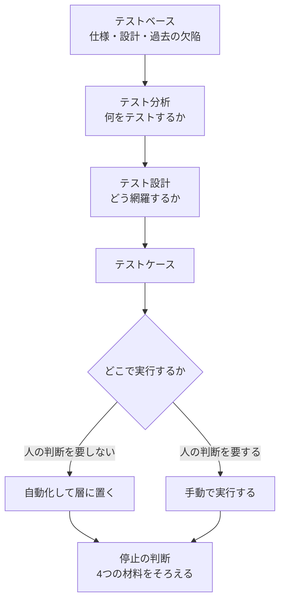
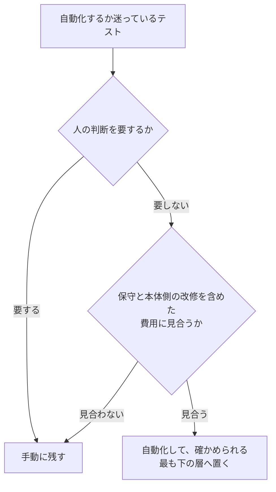

# 05 テスト

| 項目 | 内容 |
|---|---|
| この章で答えること | テストの抜けをどうやって減らすか。どこで止めてよいと言えるか |
| 作成者 | Claude（Opus 5） |
| 機密区分 | 公開可 |
| 想定読者 | 自分でテストを設計し、テストコードを書き、リリースの可否を判断する開発者 |
| この章を読んだあとできること | テスト観点の手がかりを4種類挙げられる。停止の判断を4つの材料で説明できる |
| 保守責任者 | このリポジトリの保守担当 |
| 最終確認日 | 2026-09-08 |
| 出典 | `SRC-TEST-001`、`SRC-TEST-002`、`SRC-CODE-001`、`SRC-EXT-042` から `SRC-EXT-052` |
| 例示に使う言語 | Java（例示のためであり、原則は言語に依らない） |

## 3行で

1. **観点は仕様書の中だけからは出てこない。** 手がかりは4種類ある。網羅すべきもの、達成すべき特性、テスト対象の一部、バグのパターンである（`SRC-EXT-052` p.17）。仕様書を写して並べる進め方は、それ自体がアンチパターンとして名前を持つ（`SRC-TEST-001` p.184-185）。
2. **止める判断は、1つの数値ではなく4つの材料でそろえる。** 合意したテストを実行し終えたか、見つけた欠陥の処置が決まったかを見る。残るリスクが受け入れられる水準かを見て、実施していない範囲を関係者へ開示する（`SRC-EXT-042` §5.1.3、`SRC-TEST-001` p.413）。
3. **自動化は2段階で決める。** 先に「人の判断を要するか」を見て、要するものは手動に残す。残ったものだけを「保守を含めた費用に見合うか」で判断する（`SRC-TEST-001` p.315、p.346）。

## 章01 から章04 との境目

**この章は、テストしやすいコードの性質を作り直さない。** それは章「[01 良いコードとは何か](01-good-code.md)」が観点IDつきで持っている。

| 主題 | 持つ章 | 例 |
|---|---|---|
| 本体コードがテストしやすいか | 章01（`GC-` 番、17件） | グローバル状態に依存していないか（`GC-10`）。非決定的な動作を直接持っていないか（`GC-11`） |
| カバレッジの数値目標を置かないこと | 章01（`GC-13`） | カバレッジは兆候であって目標ではない |
| テストの単位を決めるときの責務の切り方 | 章02（`DS-` 番、16件） | 責務を変更する理由で定義しているか（`DS-01`） |
| テストの層を決めるときの構造 | 章03（`AR-` 番、18件） | プロセスと配置をまたぐ境界の置き方 |
| テストの有無をレビューで見ること | 章04（`RV-` 番、25件） | 何をどの順に見るか。どこまで見たら承認するか |
| 観点の出し方、設計技法、層の配分、自動化の判断、停止の条件 | この章（`TS-` 番、28件） | 何を手がかりに観点を出すか。どこで止めるか |
| テストコード自体の読みやすさと壊れにくさ | この章 | 実装の内部に結合していないか |

**この境目は資料に書かれていない。この手引きの判断である。** 議論に参加した3者のうち、codex と Antigravity は自分の答えに「推測」の印を付けた。記録は `research/orchestration/test/40-debate.md` の `D-9` にある。

**`GC-13` は「カバレッジの数値目標を置かない」を既に言い切っている。** この章はそれを繰り返さず、「では何で止めるのか」を `TS-19` から `TS-23` で書く。

## 中心の問い

**この章が答えるのは2つの問いである。テストの抜けをどうやって減らすのか。どこで止めてよいと言えるのか。**

観点からテストケースまでの流れと、停止の判断の位置は次のとおりである。



**この図は作業の順序であって、工程の定義ではない。** 各段の根拠は、以下の観点で1つずつ示す。

## 観点の一覧

**観点IDの接頭辞は `TS-` である。** テストのレビューや設計の指摘から、この章の観点を一意に指すために振る。

| 観点ID | 見るもの | 強さ | 出典 |
|---|---|---|---|
| `TS-01` | 観点の手がかりを、仕様書の外にも求めているか | 必須 | `SRC-EXT-052` p.17、`SRC-TEST-001` 15.3 |
| `TS-02` | 「何をテストするか」と「どう網羅するか」を分けているか | 必須 | `SRC-EXT-042` §1.4.1、`SRC-TEST-001` 15.1 |
| `TS-03` | 仕様の記述を写して並べるだけで設計を終えていないか | 必須 | `SRC-TEST-001` 15.4、`SRC-EXT-052` p.6-7 |
| `TS-04` | 観点を先に挙げてから技法を選んでいるか | 必須 | `SRC-EXT-052` p.8、`SRC-TEST-001` 16.11 |
| `TS-05` | 洗い出しを、漏れそうな箇所と設計が難しい箇所に絞っているか | 推奨 | `SRC-TEST-001` 15.3 |
| `TS-06` | 単体テストを書く開発者も観点を出しているか | 推奨 | `SRC-TEST-001` 16.1、17.1 |
| `TS-07` | 同値分割の区画を、漏れなく重なりなく作っているか | 必須 | `SRC-EXT-042` §4.2.1、`SRC-TEST-001` 16.3 |
| `TS-08` | 境界値分析を、順序のある区画にだけ使っているか | 必須 | `SRC-EXT-042` §4.2.2 |
| `TS-09` | 条件の組み合わせが結果を変える仕様に、デシジョンテーブルを使っているか | 推奨 | `SRC-EXT-042` §4.2.3、`SRC-TEST-001` 16.3 |
| `TS-10` | 状態遷移の網羅基準を、対象の重要度で選んでいるか | 推奨 | `SRC-EXT-042` §4.2.4、`SRC-TEST-001` 15.7 |
| `TS-11` | 組み合わせの次数を、リスクで選んでいるか | 推奨 | `SRC-EXT-050` 表1・要旨 |
| `TS-12` | テストケースの詳細度を、テストレベルで変えているか | 必須 | `SRC-TEST-002` 4-4、`SRC-TEST-001` 17.1 |
| `TS-13` | テストを、確かめたいことを確かめられる最も下の層へ置いているか | 必須 | `SRC-EXT-044`、`SRC-EXT-045` |
| `TS-14` | 層をまたいで同じことを確かめていないか | 必須 | `SRC-EXT-044` |
| `TS-15` | 層の比率を数値目標にしていないか | 推奨 | `SRC-EXT-042` §5.1.6、`SRC-EXT-045` |
| `TS-16` | 人の判断を要するテストを、手動に残しているか | 必須 | `SRC-TEST-001` 25.3、`SRC-EXT-042` §6.2 |
| `TS-17` | 自動化の費用を、保守を含めて見ているか | 必須 | `SRC-TEST-001` 27.1、`SRC-EXT-042` §6.2 |
| `TS-18` | 自動テストの件数を成果の指標にしていないか | 推奨 | `SRC-TEST-001` 27.1 |
| `TS-19` | 停止を、4つの材料でそろえて決めているか | 必須 | `SRC-EXT-042` §5.1.3、`SRC-TEST-001` 32.4 |
| `TS-20` | 実施していない範囲を、関係者へ開示しているか | 必須 | `SRC-EXT-042` §5.1.3、`SRC-EXT-052` p.33 |
| `TS-21` | バグ曲線だけで収束を判断していないか | 必須 | `SRC-TEST-001` 33.5、`SRC-EXT-051` p.84-85 |
| `TS-22` | 値を改善しても現場が良くならない指標を追っていないか | 推奨 | `SRC-TEST-001` 33.5、`SRC-EXT-042` §5.3.1 |
| `TS-23` | Good Enough Quality を使うとき、2つの限定を添えているか | 推奨 | `SRC-TEST-002` 7-3 |
| `TS-24` | テストが「何をするか」を確かめ、「どうやるか」を確かめていないか | 必須 | `SRC-EXT-047`、`SRC-EXT-048`、`SRC-TEST-001` 26.3 |
| `TS-25` | 模擬に置き換える相手を、3種類に限っているか | 必須 | `SRC-EXT-044`、`SRC-EXT-047` |
| `TS-26` | 1件のテストが1つの振る舞いを確かめているか | 必須 | `SRC-EXT-048`、`SRC-CODE-001` 14.5、`SRC-TEST-001` 25.5 |
| `TS-27` | 失敗したときに、何がどう壊れたか分かるか | 必須 | `SRC-CODE-001` 14.4、14.6、`SRC-EXT-049` |
| `TS-28` | 結果が不安定なテストを放置していないか | 必須 | `SRC-TEST-001` 26.5 |

**書名は章末の「出典」の表に書いてある。** 本文では、その出典IDが初めて出るところにも書名を添える。

## テスト観点の出し方

**観点が出ていない段階で技法を選ぶと、技法の適用先そのものが抜ける。**

### TS-01 観点の手がかりを、仕様書の外にも求めているか

**何を見るか**: 観点の出どころが、仕様書の目次だけになっていないか。

**なぜそう言えるか**: `SRC-EXT-052`（西康晴「テスト観点に基づくテスト開発方法論 VSTeP の概要」）p.17 は、観点の手がかりを4種類挙げる。

| 手がかり | 中身 |
|---|---|
| 網羅すべきもの | 仕様、機能、データ、使い方 |
| 達成すべき特性 | 性能、安全、使いやすさなどの品質特性 |
| テスト対象の一部 | 機能、サブシステム、モジュール、ハードウェア |
| バグのパターン | 過去に出た欠陥の型 |

同資料 p.17 は、テストタイプ、テスト技法、テストレベル、開発時に書いた図表も手がかりになると述べる。**同資料は、具体化してテストケースにならないものは観点ではないとも定義している。**

書籍の側も同じ向きを取る。`SRC-TEST-001`（井芹洋輝『ソフトウェアテスト徹底指南書』）p.183（15.3）は、抽出すべき観点を7種類挙げる。

| 抽出すべき観点 |
|---|
| テスト対象を項目分けしたもの |
| プロダクトリスク |
| 品質特性 |
| 視座の欠落を補うもの（法規制、社内標準） |
| 特に注意が要るテスト条件 |
| 複数のケースに横断的に効くテスト条件 |
| 共通して再利用できる観点 |

**同書 p.182（15.3）は、観点を洗い出して整理すると、仕様書に書かれていないが本来必要なテストを見つけ出せると述べる。**

**この2件は独立している。** 一方は方法論の提唱者本人が公開した資料、他方は日本語の書籍である。

**判断に迷う例**: 過去の欠陥をどこから集めるか。`SRC-TEST-001` p.183（15.3）は「気がかりレビュー」を挙げる。テストベースを関係者で読みながら、テストでフォローすべき気がかりをメモとして書き足していく進め方である。**この記述の根拠は同書1冊だけである。**

### TS-02 「何をテストするか」と「どう網羅するか」を分けているか

**何を見るか**: 洗い出しと網羅の設計を、1回の作業でまとめて済ませていないか。

**なぜそう言えるか**: `SRC-EXT-042`（ISTQB のファンデーションレベルのシラバス v4.0.1）§1.4.1 p.19 は、2つの活動を分ける。**テスト分析は「何をテストするか」に答え、テスト設計は「どうテストするか」に答える。** テスト分析はテストベースを分析してテスト条件を定め、優先順位を付ける。テスト設計はテスト条件をテストケースに具体化し、カバレッジ項目の特定を伴う。

`SRC-TEST-001` p.181（15.1）は、分ける理由を2つ挙げる。**テスト条件を発散的に分析して漏れを防ぐことと、モデルで整理して設計の誤りを防ぐことである。** 発散と収束を同じ作業に混ぜると、どちらも中途で止まる。

**判断に迷う例**: 小さな変更でも2段に分ける価値があるか。**分けるのは思考の順序であって、成果物の数ではない。** 単体テストでは分析の結果を別紙にしない（`TS-06`）。

### TS-03 仕様の記述を写して並べるだけで設計を終えていないか

**何を見るか**: テストケースの一覧が、仕様書の文の語尾だけを変えたものになっていないか。

**なぜそう言えるか**: `SRC-TEST-001` p.184-185（15.4）は、この進め方を CPM法（コピー・ペースト・モディファイ法）と呼び、アンチパターンとして扱う。**同書 p.185 は、問題になるのはそれだけでテストを完結させる場合だと限定する。** 観点の分析と技法による抜け漏れへの対応が欠落し、組み合わせのテストと初期状態のテストが落ちる。

`SRC-EXT-052` p.6-7 は、別の角度から同じ結果を述べる。**「大項目・中項目・小項目」で書くテスト設計は漏れを生む。** 抽象度の差が大きい項目を並べるため、列挙の途中で抜けが出るからである。同資料 p.7 は、同じ表に異なる種類の観点をぶら下げると網羅できないとも述べる。状態とイベントの組は状態遷移で網羅すべきであり、機能の網羅で代用してはならない。

**この2件は独立している。** 書籍と、方法論の提唱者本人の資料である。

**判断に迷う例**: 仕様書からの写しを一切使わないのか。使ってよい。`SRC-TEST-001` p.185 が問題にするのは、写しだけで完結させることである。**写した項目に、観点と技法から出した項目を足す。**

### TS-04 観点を先に挙げてから技法を選んでいるか

**何を見るか**: 使う技法を決めてから、その技法に合う対象を探していないか。

**なぜそう言えるか**: `SRC-EXT-052` p.8 は、技法だけを知っていても、どの技法をいつ使うかは決まらないと述べる。**同資料は2つの失敗を挙げる。境界値を設計しても同値クラスが浮かばないことと、直交表を使っても因子が抜けることである。**

`SRC-TEST-001` p.230（16.11）は、技法の選択を3つの特徴で判断せよと述べる。対応できるテストベースのモデルと形式、対応できるテスト要求、強みと弱みである。**同書は、不適切な技法の導入がテスト設計の効率性と有効性を損なうとする。**

**判断に迷う例**: 技法を知らない人は観点を出せるのか。出せる。`SRC-TEST-001` p.193（16.1）は、技法が扱うモデルを「思考の型」と呼ぶ。**型を知っているほうが整理は速いが、観点の抽出そのものは対象への理解から始まる。**

### TS-05 洗い出しを、漏れそうな箇所と設計が難しい箇所に絞っているか

**何を見るか**: 観点の表が、使われないまま保守だけが続く大きさになっていないか。

**なぜそう言えるか**: `SRC-TEST-001` p.183（15.3）は、テスト観点を細かく洗い出しすぎると発散し、複雑になってかえって使いにくくなると述べる。**同書は、テストが漏れそうな箇所と、テスト設計の難易度が高い箇所に注力せよと書く。**

**この記述の根拠は同書1冊だけである。** 公開情報の側に、洗い出しの打ち切り方を述べた資料は見つからなかった。

**判断に迷う例**: どの箇所が「漏れそう」なのかを、着手前にどう知るか。`SRC-EXT-042` §1.3 の原則4 は、欠陥が偏って集まると述べる。**少数の構成要素が、発見される欠陥または運用時の障害の大半を占める。** 予測した偏りと実測した偏りは、どちらもリスクにもとづくテストの入力になる。

### TS-06 単体テストを書く開発者も観点を出しているか

**何を見るか**: 観点の洗い出しを、テストの専任者だけの仕事にしていないか。

**なぜそう言えるか**: **この結論を直接述べた資料は無い。2つの記述を組み合わせて導いた。** 議論の記録は `research/orchestration/test/40-debate.md` の `D-8` にある。

| 組み合わせた記述 | 出典 |
|---|---|
| 技法はテストエンジニアだけのものではない。開発者は単体テストの設計に使える | `SRC-TEST-001` p.193（16.1） |
| 単体テストでは、詳細なテスト仕様書を作ってから実装する進め方は相性が悪い | `SRC-TEST-001` p.232（17.1） |
| 設計書の代わりにテストコード自体を文書として読めるように書く | `SRC-TEST-001` p.232-233（17.1） |

**開発者も観点を出す。ただし別紙の文書にはしない。** 対象とケースの数が多く、変更が頻繁なため、仕様書の作成と保守に大きな費用がかかるからである。

**判断に迷う例**: 文書にしないなら、観点を出したことをどう確かめるか。`SRC-TEST-001` p.233（17.1）は3つで補うと述べる。**プルリクエストのレビュー、カバレッジの監視、欠陥流出の評価である。** レビューでの見方は章「[04 コードレビュー](04-review.md)」の `RV-02` が持っている。

## テストケースの設計技法

**技法は、観点を「確かめられる件数」に落とすための道具である。**

### TS-07 同値分割の区画を、漏れなく重なりなく作っているか

**何を見るか**: 区画が重なっていないか。どの区画にも入らない値が残っていないか。

**なぜそう言えるか**: `SRC-EXT-042` §4.2.1 p.39 は、同値分割を「同じ扱いを受けると期待されるデータを区画に分ける」技法と定義する。**1区画から1件のテストで足りる、という理屈に立つ。** 同資料は、区画が重なってはならず、空であってもならないと定める。区画は入力だけでなく、出力、設定値、内部値、時間に関する値、インタフェースの引数にも作れる。

`SRC-TEST-001` p.194-195（16.3）は、適用範囲をさらに広く取る。**連続値だけの技法ではなく、空でない集合であれば普遍的に適用できる。** 連続値と離散値、順序の有無、値と文字列を問わない。同書 p.195 は、漏れなくダブりなく分析することが重要だと述べる。

同書 p.196（16.3）は、出力側にも適用せよと述べる。**出力のパーティションを分析すると、特殊なエラー処理が見つかる。**

**判断に迷う例**: 無効な区画を外してよいか。`SRC-EXT-042` §4.2.1 p.40 は、100%カバレッジを「無効な区画を含むすべての区画を1回以上通ること」と定める。**`SRC-TEST-001` p.196 は、入力を実現できない事情があるとき、無効パーティションを対象から外す判断はあり得ると書く。** 外すなら、外したことを記録する（`TS-20`）。

### TS-08 境界値分析を、順序のある区画にだけ使っているか

**何を見るか**: 順序の無い区画（種別のコードなど）に境界値を当てていないか。

**なぜそう言えるか**: `SRC-EXT-042` §4.2.2 p.40 は、境界値分析を同値分割の境界を突く技法と位置づけ、**順序のある区画にしか使えないと明記する。**

同資料は2値版と3値版を挙げる。2値版は境界値と隣の区画側の隣接値、3値版は境界値と両隣の3点を取る。**同資料は3値版のほうが厳しいと述べ、実例を挙げる。**

| 実装の誤り | 2値版（`x=10`、`x=11`） | 3値版（`x=9`、`x=10`、`x=11`） |
|---|---|---|
| `if (x <= 10)` を `if (x = 10)` と書いた | 検出できない | `x=9` で検出できる |

**判断に迷う例**: 3値版を常に使うか。**この資料は、どちらを使うかを決めていない。** 厳しさと件数の関係だけを示している。件数を増やす判断は、その区画のリスクで決める（`TS-11`）。

### TS-09 条件の組み合わせが結果を変える仕様に、デシジョンテーブルを使っているか

**何を見るか**: 条件を1つずつ確かめて済ませていないか。

**なぜそう言えるか**: `SRC-EXT-042` §4.2.3 p.41 は、条件の組み合わせが結果を変える仕様にデシジョンテーブルを使うと述べる。**同資料は、この技法に要求の抜けや矛盾を見つける効果もあるとする。**

`SRC-TEST-001` p.196（16.3）も、同値パーティションの組み合わせを確かめたいときは同値分割だけでは足りず、デシジョンテーブルなどを合わせて使うと述べる。

**判断に迷う例**: 条件が10個ある場合はどうするか。`SRC-EXT-042` §4.2.3 p.41 は、規則数が条件の数に対して指数で増えると述べ、2つの手を挙げる。**表を最小化するか、リスクにもとづいて絞るかである。**

### TS-10 状態遷移の網羅基準を、対象の重要度で選んでいるか

**何を見るか**: 状態を持つ対象に対して、遷移ではなく状態だけを確かめて終えていないか。

**なぜそう言えるか**: `SRC-EXT-042` §4.2.4 p.42 は、カバレッジ基準を3つ挙げる。

| 基準 | 中身 | 位置づけ |
|---|---|---|
| 全状態カバレッジ | すべての状態を1回以上通る | 有効遷移カバレッジより弱い |
| 有効遷移カバレッジ（0スイッチ） | すべての有効な遷移を1回以上通る | 最も広く使われる |
| 全遷移カバレッジ | 有効な遷移と無効な遷移をすべて通る | 最低要件とすべき場合がある |

**同資料は、全遷移カバレッジをミッションクリティカルまたは安全に関わるソフトウェアでの最低要件とすべきだと述べる。** 対象の重要度で基準が変わるという記述である。

`SRC-TEST-001` p.188（15.7）も、網羅基準はテスト条件のモデルや形式の種類に応じて選ぶと述べる。状態遷移モデルなら n スイッチカバレッジ、パラメータと値の組み合わせなら 2-wise カバレッジ100%が例である。

**判断に迷う例**: 状態の数が多く、全遷移を書けない場合。**基準を下げたことを記録する。** `TS-20` の開示に含める。

### TS-11 組み合わせの次数を、リスクで選んでいるか

**何を見るか**: 「2つの組み合わせまで試したから足りる」と結論していないか。

**なぜそう言えるか**: `SRC-EXT-050` は、Kuhn ほかが2004年に IEEE Transactions on Software Engineering で発表した論文である。同論文は、障害を引き起こすのに必要な条件の数を FTFI 数と呼ぶ。同論文 表1 の測定値は次のとおりである。

| 対象 | 2条件までで引き起こされた障害の割合 |
|---|---|
| 医療機器 | 97% |
| Webブラウザ | 76.1% |
| HTTPサーバ | 70.3% |
| NASA の分散システム | 93.3% |

**この論文は前提を明記している。** 同論文の要旨は、ソフトウェアの振る舞いが複雑な事象の順序に依存せず、変数が離散的で少数の値しか取らないことを条件に挙げる。同論文は、調べた範囲で FTFI 数が6を超える障害は無かったとも述べる。

**測定の資料はこの1件である。** 同論文は過去の4研究をまとめているが、この手引きは独立した4件として数えない。**「ペアワイズで足りる」とは書かない。** 議論の記録は `40-debate.md` の `D-7` にある。

**判断に迷う例**: 何ワイズまで上げるか。**この点は決着していない。** 対象ごとに次数を選ぶ基準を述べた資料を見つけられなかった。組み合わせを絞る理由そのものは、同論文 1章が示す。**入力20個で各10値の対象は、網羅すると10の20乗件になる。数百件しか実行できない予算では、可能な場合の1兆分の1にも満たない。**

### TS-12 テストケースの詳細度を、テストレベルで変えているか

**何を見るか**: 単体テストにまで別紙のテスト仕様書を作っていないか。手で実行するテストの手順が曖昧になっていないか。

**なぜそう言えるか**: **2冊の記述は対立していない。適用範囲が違う。** 議論の記録は `40-debate.md` の `D-5` にある。

| テストレベル | 詳細度 | 出典 |
|---|---|---|
| 手で実行し、他人へ引き継ぐテスト | 実行する人によって手順が変わらないところまで書く | `SRC-TEST-002` p.77-78（4-4） |
| 単体テスト | 別紙の仕様書を作らず、テストコード自体を読める形にする | `SRC-TEST-001` p.232（17.1） |

`SRC-TEST-002`（高橋寿一・湯本剛『現場の仕事がバリバリ進む ソフトウェアテスト手法』）p.77-79（4-4）は、良いテストケースの条件を3つ挙げる。**より多くのバグを見つけること、誰がいつ行っても同じステップで実行できること、多すぎず少なすぎないことである。**

次は、手で実行するシステムテストの一覧を対にして示す。

**悪い例**

```text
No.  対象画面        確認内容
1    ログイン画面    ログインが正しくできること
2    ログイン画面    パスワードが間違っている場合の確認
3    ログイン画面    ロックの確認
4    ログイン画面    その他の異常系
```

**良い例**

```text
No.1  観点: TS-08 境界値（連続して誤った回数）
  前提: 利用者 u001 は有効。連続失敗回数は 0 回。ロック閾値は 3 回
  手順: 1. ログイン画面を開く
        2. u001 と誤ったパスワードを入れて「ログイン」を押す
        3. 手順2 をもう一度行う
  期待: 画面に「あと 1 回誤るとロックされます」と表示される
        u001 の状態は「有効」のままである

No.2  観点: TS-08 境界値（連続して誤った回数）
  前提: 利用者 u001 は有効。連続失敗回数は 2 回。ロック閾値は 3 回
  手順: 1. ログイン画面を開く
        2. u001 と誤ったパスワードを入れて「ログイン」を押す
  期待: 画面に「アカウントがロックされました」と表示される
        u001 の状態は「ロック」になる
```

**なぜ悪いのか**: 4件のどれも、実行する人によって結果が変わる。**「正しくできること」は期待結果ではなく、期待結果の分類名である。** 何を入力し、どの状態から始め、画面に何が出れば合格なのかが書かれていない。第4行の「その他の異常系」は、何件のテストなのかさえ決まっていない。**この一覧は、仕様書の見出しを写して語尾を変えた形をしている。** `SRC-TEST-001` p.184-185（15.4）が CPM法 と呼ぶ形である（`TS-03`）。

**なぜ良いのか**: 3つがそろっている。**前提（開始状態）、手順（入力と操作）、期待結果（画面の表示と、システム側に残る状態）である。** 連続失敗回数を 0 回と 2 回に分けたのは、ロック閾値 3 回の境界を突くためであり、その根拠が観点IDで書いてある。**どの観点から出たケースかが読めるため、観点を消したときに、消すべきケースも決まる。** さらに、2件が別の状態から始まるため、片方が失敗しても原因の切り分けができる。

**判断に迷う例**: 自動化するテストにも、この詳細度で一覧を作るか。作らない。**`SRC-TEST-001` p.232（17.1）は、単体テストで詳細なテスト仕様書を先に作る進め方を、対象とケースの数と変更の頻度から否定している。** 自動化したテストの読みやすさは `TS-26` と `TS-27` で扱う。

## テストの層と自動化の範囲

**自動化の判断は2段階である。順序が逆になると、人がやるべきテストに費用の話が持ち込まれる。**



**この図は判断の順序である。** 各段の根拠は `TS-16` と `TS-17` で示す。

### TS-13 テストを、確かめたいことを確かめられる最も下の層へ置いているか

**何を見るか**: 上の層でしか確かめていないことが、下の層でも確かめられないか。

**なぜそう言えるか**: `SRC-EXT-044`（Ham Vocke「The Practical Test Pyramid」、2018-02-26）は3つの原則を挙げる。**粒度を変えて書くこと、上に行くほど数を減らすこと、テストをできるだけピラミッドの下へ押し下げることである。**

押し下げる理由は、上の層の性質にある。`SRC-EXT-043`（Martin Fowler「TestPyramid」、2012-05-01）は、GUI を通すテストが壊れやすく、書くのに費用がかかり、実行に時間がかかると述べる。`SRC-EXT-045`（Mike Wacker「Just Say No to More End-to-End Tests」、2015-04-22）は2つを足す。**1つは、部品を同時に多く動かすため、失敗しても原因の部品を特定できないことである。** もう1つは、環境要因で失敗するため不安定であることである。

**判断に迷う例**: 「下の層」の境目をどこに引くか。`SRC-EXT-046`（Simon Stewart「Test Sizes」、2010-12-13）は、Google が大きさを資源で定義していると書く。

| 大きさ | 使ってよい資源 | 実行時間の上限 |
|---|---|---|
| 小 | プロセス内のみ。ネットワーク、データベース、ファイル、複数スレッド、`sleep` を禁じる | 60秒 |
| 中 | `localhost` とローカルファイルまで | 300秒 |
| 大 | 制限なし | 900秒 |

**これは1社の定義である。** 層の名前ではなく資源で切る点が、この定義の特徴である。

### TS-14 層をまたいで同じことを確かめていないか

**何を見るか**: 上位のテストで確認ずみのことを、下位でも繰り返していないか。

**なぜそう言えるか**: `SRC-EXT-044` は2つを述べる。**上位のテストが失敗したのに下位が失敗しないなら、下位のテストを書く。上位で確認ずみのことを下位で繰り返さない。**

同資料は、結合テストの粒度も定める。**1回に1つの結合点だけを確かめる。** データベース、REST API、ファイル、メッセージキューなどの境界である。エンドツーエンドのテストは、価値の高い利用の筋道だけに絞る。壊れやすく保守の負担が大きいためである。

**判断に迷う例**: 重複しているかどうかを、どうやって知るか。**失敗の仕方で見分ける。** 上位が落ちたときに下位も落ちるなら、同じことを見ている。下位が落ちないなら、下位の網が粗い。

### TS-15 層の比率を数値目標にしていないか

**何を見るか**: 「単体70%」のような比率を、達成すべき目標として置いていないか。

**なぜそう言えるか**: `SRC-EXT-042` §5.1.6 p.51 は、**層の数と名前が決まっていないと明記する。** 原型（Cohn 2009）は単体・サービス・UI の3層であり、別の模型は単体・結合・エンドツーエンドの3層である。**層の定義が資料ごとに違う以上、比率も資料をまたいで比べられない。**

**数値を挙げる資料はある。** `SRC-EXT-045` は、小70%・中20%・大10% を目安として挙げる。**これは1社の目安であり、規格ではない。** この手引きは比率を示さず、`TS-13` と `TS-14` の2つの手続きに置き換える。議論の記録は `40-debate.md` の `D-3` にある。

**判断に迷う例**: 上の層に偏っている構成をどう直すか。`SRC-EXT-043` は、UI に頼りすぎた構成を「アイスクリームコーン」と呼ぶ。**同資料は、UI 層を避けてサービスやAPIの層で通しのテストを行う道を挙げる。**

### TS-16 人の判断を要するテストを、手動に残しているか

**何を見るか**: 自動化の対象を決めるとき、費用の話から始めていないか。

**なぜそう言えるか**: `SRC-TEST-001` p.315（25.3）は、**すべての手動テストは自動化できないと述べる。** 探索的テストのように人の知恵を使う柔軟なテストは自動化が難しく、基本的に手動テストはなくせない。同書は、全テストの自動化がライブラリや単純なアプリケーションなど特殊なプロダクトに限られるとも書く。

`SRC-EXT-042` §6.2 p.59-60 は、自動化のリスクを8つ挙げる。**そのうちの1つが「手動が適する場面での道具の使用」である。** 同資料 §4.4.2 p.44 は、探索的テストが仕様の無いときや不十分なとき、時間の制約が強いときに有用だと述べる。§5.1.7 p.51 は、テストの4象限のうち業務寄りで製品を批評する象限が利用者に向いており、手動が多いとする。

**この2件は独立している。** 議論の記録は `40-debate.md` の `D-6` にある。

**判断に迷う例**: 探索的テストを記録に残さなくてよいか。**残す。** `SRC-EXT-042` §4.4.2 は、探索的テストが他の形式的な技法を補うものだと位置づけている。補うものである以上、何を見たかは `TS-20` の開示に入る。

### TS-17 自動化の費用を、保守を含めて見ているか

**何を見るか**: 見積りが、テストを書く工数だけで終わっていないか。

**なぜそう言えるか**: `SRC-TEST-001` p.346（27.1）は、費用対効果の評価で人・物・工数の3種類を見よと述べる。**工数には、学習、導入、運用・保守、マネジメントが含まれる。** 同書 p.347 は、中長期で見た対価と保守作業を加味した対価を、過小評価する現場が多いと書く。

`SRC-EXT-042` §6.2 p.59 も、道具を買っただけでは成果が出ないと述べる。**導入、保守、教育の労力を要する。**

**本体側の改修も第2段の費用に入る。** `SRC-TEST-001` p.315（25.3）は、自動テストがテスト自動化容易性の確保された対象にしか適用できないとし、導入するならプロダクト側にテスト容易性を組み込む必要があるとする。**その性質は章01 の `GC-10` から `GC-12` が持っている。**

**判断に迷う例**: 投資の回収点をどう見積もるか。**この点は決着していない。** 議論では、外部AIが ISTQB のテスト自動化戦略のシラバスを根拠に回収点の求め方を示したが、この手引きはその文書を開いていないため採らなかった。

### TS-18 自動テストの件数を成果の指標にしていないか

**何を見るか**: 報告が「自動テスト◯件を追加した」で終わっていないか。

**なぜそう言えるか**: `SRC-TEST-001` p.347（27.1）は、**自動テストがテストケース数を水増ししやすいと述べる。** 件数だけを見ると、価値を出していないのに成功したと評価してしまう。

同書 p.345-346（27.1）は、評価の視座を上げよと述べる。**テスト作業のレベルで実行時間が20%速くなっても、ライフサイクルのレベルでは変わっていないことがある。**

**この記述の根拠は同書1冊だけである。**

**判断に迷う例**: 件数の代わりに何を見るか。`SRC-EXT-042` §5.3.1 p.53-54 は、テスト監視で集める指標を7種類挙げる。進捗、テストの進捗、製品品質、欠陥、リスク、カバレッジ、費用である。**カバレッジは7つのうちの1つにすぎない。**

## どこで止めるか

**章01 の `GC-13` が、カバレッジの数値目標を置かない立場を取っている。** この節は、では何で止めるのかを書く。

### TS-19 停止を、4つの材料でそろえて決めているか

**何を見るか**: 停止の理由が、1つの数値に還元されていないか。

**なぜそう言えるか**: `SRC-EXT-042` §5.1.3 p.49 は、終了条件を2種類に分ける。

| 種類 | 例 |
|---|---|
| 網羅の度合いを測るもの | 達成したカバレッジ、未解決欠陥数、欠陥密度、失敗したケース数 |
| 可否で答えるもの | 計画したテストを実行した、静的テストを行った、見つけた欠陥をすべて報告した、回帰テストをすべて自動化した |

`SRC-TEST-001` p.413（32.4）は、完了基準の例を4つ挙げる。**計画したテスト実行が完了したこと。目標のテストカバレッジが実現されたこと。検出した欠陥が修正されたか、修正の方針を立てたこと。プロダクトリスクが一定以下であることが確認されたことである。**

**この手引きは、次の4つをそろえて止めると決めた。** 議論の記録は `40-debate.md` の `D-1` にある。

| 材料 | 確かめること |
|---|---|
| 実行 | 合意したテストを実行し終えたか |
| 欠陥 | 見つけた欠陥の処置が決まったか。直したか、直さないと決めたか |
| リスク | 残るリスクが、受け入れられる水準にあるか |
| 開示 | 実施していない範囲を、関係者へ伝えたか |

**数値を目標として置かない理由は、指標の有効性がチームの状況に依存するためである。** `SRC-TEST-001` p.435（33.5）が、この依存を述べている。

**判断に迷う例**: 途中で止めるときはどうするか。`SRC-TEST-001` p.412-413（32.4）は、開始基準・中止基準・終了基準の3つを立てよと述べ、中止基準の例を4つ挙げる。**テストブロック率が一定以上を超えたこと。合格して当たり前の基本的なテストが失敗したこと。テストウェアや資源に致命的な問題が見つかったこと。プロセス遵守の不備が見つかったことである。**

**`SRC-TEST-002` p.37-38（2-4-9）は、この基準の実態に別の見方を示す。** 現実には納期の都合で本当に中断できるとは限らず、実質は「アラームを上げる状態の定義」と言うほうが正しい、という記述である。

### TS-20 実施していない範囲を、関係者へ開示しているか

**何を見るか**: 実施していない範囲が、実施した範囲と同じ場所に書かれているか。

**なぜそう言えるか**: `SRC-EXT-042` §5.1.3 p.49 は、時間または予算の枯渇も正当な終了条件になり得ると述べる。**ただし条件を付ける。それ以上テストせずに本番へ出すリスクを、関係者が確認して受け入れた場合に限る。**

`SRC-EXT-052` p.31 は、工数に合わせて観点と関連を削る作業を「剪定」と呼ぶ。網羅基準の緩和、ズームアウト、組み合わせ基準の緩和と削除の3つで行う。**同資料 p.33 は、削ることそのものより、削った結果を明示することを重く見る。** 漏れが起きないと言い切れる観点を「確定」と呼ぶ。確定できない観点を明示することで、他の工程で手を打てるようにする。

**同資料は、すべての観点を確定させることが目的ではないと明記する。品質リスクの高い観点を明示することが目的である。**

**判断に迷う例**: 開示したうえで、リスクをどう扱うか。`SRC-EXT-042` §5.2.4 p.53 は、リスクへの対応がテストだけではないと述べる。**受容、移転、緊急時計画という選択肢がある。** 同資料 §1.3 の原則1 は、テストが欠陥の存在は示せても、不在は証明できないと述べる。**「テストを続ければいつか安全になる」という前提は、この原則と合わない。**

### TS-21 バグ曲線だけで収束を判断していないか

**何を見るか**: 曲線が寝てきたことを、そのまま停止の根拠にしていないか。

**なぜそう言えるか**: `SRC-TEST-001` p.436（33.5）は、バグ曲線（信頼度成長曲線）による予実管理がバッドプラクティスになりがちだと述べる。**バグ検出の程度が、テスト中の機能の品質、担当者の能力、テストの品質、テストのフェーズに左右されるためである。**

`SRC-EXT-051`（IPA/SEC『組込みソフトウェア開発における品質向上の勧め［バグ管理手法編］』、2013年）p.84 は、別の理由から同じ制約に達する。**曲線の結果だけで収束を判断できることは多くない。** 使うには、テスト項目に偏りが無く必要十分であることと、横軸の項目の粒度がそろっていることが要る。同書 p.84 は、その必要十分性と粒度の考え方が2013年の時点で明確に示されているとは言いがたい、と自ら述べている。

**同書 p.62-63 は、横軸を変えると結論が逆になる例を示す。** 同じデータで、横軸を時間にすると収束して見え、テストケース数にすると収束していない。同書 p.85 は、収束の判断を曲線だけでなく、実際に出たバグの分析など他の多くの情報にもとづいて行うことが必須だと書く。

**この2件は独立している。** 日本語の書籍と、公的機関の刊行物である。

**判断に迷う例**: 参考として使ってよい範囲はどこまでか。**この点は決着していない。** `SRC-TEST-001` p.436-437（33.5）は、予測線が有効になるのを2つの場合に限る。テストフェーズなどを単位に小さく限定する場合と、バグがランダム故障である場合である。**同書は、後者がソフトウェア開発では基本的に該当しないと書く。**

一方 `SRC-EXT-051` は、横軸を日付にするなどの対処で参考にできるとする。**どちらも一次資料であり、同じ強さで食い違っている。**

### TS-22 値を改善しても現場が良くならない指標を追っていないか

**何を見るか**: その指標を良くしたときに、何が良くなるのかを言えるか。

**なぜそう言えるか**: `SRC-TEST-001` p.435（33.5）は、値を改善しても現場が良くならない指標を「バニティメトリクス」と呼ぶ。**同書は、これが指標の種類だけでは決まらず、チームの状況と能力に依存すると述べる。** 同じ指標が、あるチームでは有効に働き、別のチームでは働かない。

同書 p.436（33.5）は、さらに悪い型を挙げる。**観察者が見たい姿を見せるための指標を「演出型メトリクス」と呼ぶ。** 遅延などのリスクが隠れ、隠せなくなった時点で一気に致命的な水準まで悪化する現象を生む。

**この2つの呼び名の根拠は同書1冊だけである。**

**判断に迷う例**: カバレッジを見ること自体をやめるのか。やめない。**章01 の `GC-13` は、数値を目標に置かないと述べているのであって、測るなとは述べていない。** `SRC-EXT-042` §4.3.1 p.42 は、命令カバレッジ100%でも、データに依存する欠陥や、通っていない分岐にある欠陥は見つからないと書く。**低い値は見ていない場所を教えるが、高い値は正しさを示さない。**

### TS-23 Good Enough Quality を使うとき、2つの限定を添えているか

**何を見るか**: 「これで十分よい」と言うときに、その判断の適用範囲を言えるか。

**なぜそう言えるか**: `SRC-TEST-002` p.132（7-3）は、Good Enough Quality の条件を4つ挙げる。

| 条件 | 中身 |
|---|---|
| 便益 | 十分な便益がある |
| 致命性 | 致命的な問題がない |
| 比較 | 便益が既知の問題を上回る |
| 副作用 | その時点での改善が現状より悪い方向へ進むなら行わない |

**4つめは、バグを直すことで同等以上に致命的なバグが出る可能性があるなら直さない、という意味である。**

**この手引きは、2つの限定を添えて採る。** 議論の記録は `40-debate.md` の `D-4` にある。

| 限定 | 理由 |
|---|---|
| 着手前に合意した終了条件の代わりにしない | 測定できる終了条件の代替にはならない。議論での codex の指摘である |
| 人の生死に関わるソフトウェアには適用しない | `SRC-TEST-002` p.131 の注4 が、ビジネスソフトウェアに関する考え方だと明記している |

**根拠は1冊のみである。** さらに `SRC-TEST-002` p.132 は、James Bach の1997年の論文を引いた記述である。**この手引きは原典を読んでいないため、4条件が原典どおりかを確かめられない。**

**判断に迷う例**: 「致命的」の線をどこに引くか。`SRC-TEST-002` p.129-130（7-2）は、製品の種類ごとに求める信頼性の水準を示す。**生死に関わるソフトウェアは1000時間あたり故障率0.1未満、高信頼性は0.1から10、商用は10から2000、試作は2000超という水準である。** 同書はこれを尺度の例として示しており、停止を直接決める値としては書いていない。

## テストコードの書き方

**テストが壊れたときに、それが正常な保守なのか、テストの作りの問題なのかを区別できる形にする。**

### TS-24 テストが「何をするか」を確かめ、「どうやるか」を確かめていないか

**何を見るか**: 振る舞いを変えないリファクタリングで、そのテストが落ちるか。

**なぜそう言えるか**: **壊れ方は2つに分かれる。** 議論の記録は `40-debate.md` の `D-10` にある。

| 壊れ方 | 意味 |
|---|---|
| 要求された振る舞いが変わったために壊れる | 正常な保守である。テストは仕様の変化を伝えている |
| 振る舞いを変えないリファクタリングで壊れる | テストが実装の内部に結合した印である |

`SRC-EXT-047`（Alex Eagle「Change-Detector Tests Considered Harmful」、2015-01-27）は、後者を「変更検知テスト」と呼ぶ。**依存を模擬に置き換え、特定の内部メソッドが特定の引数で呼ばれたことを確かめる形が典型である。** 同資料は、この形のテストがコードの正しさを確かめておらず、既存の振る舞いが続いていることしか示さないと述べる。実装を変えるたびに書き直しになり、安全なリファクタリングを妨げる。

`SRC-EXT-048`（Andrew Trenk「Test Behavior, Not Implementation」、2013-08-05）は、判定の仕方を示す。**依存を足すリファクタリングを行っても、振る舞いが同じなら、テストの呼び出し部分は変わらないはずである。変わるのは準備の部分だけである。**

`SRC-TEST-001` p.338（26.3）は、同じものを「脆いテスト」と呼ぶ。**本来無関係な変更でも失敗するテストであり、主要因はテスト対象とテストの不適切な結合である。** 同書 p.338 は、脆いテストが保守費用を継続的に悪化させ、損益分岐点を下回るとそのテストの縮小や放棄に追い込まれると書く。

**この3件は独立している。** Google の公開文書2件は同じ発行者だが、書籍1冊は別である。

次に、同じ対象への2つのテストを対にして示す。**`assertEquals` は素朴な補助メソッドであり、テストのフレームワークは使っていない。**

**悪い例**

```java
class OrderServiceTest {

    static void 注文を確定するとsaveが1回呼ばれる() {
        RecordingOrderRepository repository = new RecordingOrderRepository();
        OrderService service = new OrderService(repository);

        service.confirm(new Order("A-1", 3));

        assertEquals(1, repository.calls.size());
        assertEquals("save", repository.calls.get(0));
        assertEquals("A-1", repository.lastSavedId);
    }

    static void assertEquals(Object expected, Object actual) {
        if (!expected.equals(actual)) {
            throw new AssertionError("期待値: " + expected + " 実際値: " + actual);
        }
    }
}
```

**良い例**

```java
class OrderServiceTest {

    static void 在庫が足りていれば注文は確定済みになる() {
        InMemoryOrderRepository repository = new InMemoryOrderRepository();
        repository.setStock("A-1", 5);
        OrderService service = new OrderService(repository);

        service.confirm(new Order("A-1", 3));

        assertEquals(OrderStatus.CONFIRMED, repository.findById("A-1").status());
        assertEquals(2, repository.stockOf("A-1"));
    }

    static void 在庫が足りないときは注文が保留のままである() {
        InMemoryOrderRepository repository = new InMemoryOrderRepository();
        repository.setStock("A-1", 1);
        OrderService service = new OrderService(repository);

        service.confirm(new Order("A-1", 3));

        assertEquals(OrderStatus.PENDING, repository.findById("A-1").status());
        assertEquals(1, repository.stockOf("A-1"));
    }
}
```

**なぜ悪いのか**: このテストが確かめているのは「`save` が1回呼ばれたこと」であり、注文がどうなったかではない。**呼び出しの回数と名前と引数は、実装の手順である。** `confirm` の中で保存を2回に分ける形へ書き換えると、外から見える結果が同じでもこのテストは落ちる。逆に、`save` が呼ばれてさえいれば、保存された中身が誤っていても通る。**確かめたいことと、確かめていることがずれている。**

問題はもう1つある。リポジトリを記録用の模擬に置き換えているため、**リポジトリ側の変更を検出できない。** `SRC-EXT-047` は、この状態を「誤った安心を与える」と書く。テスト名も「`save` が1回呼ばれる」であり、業務の上で何が壊れたのかを伝えない。

**なぜ良いのか**: 確かめているのは外から見える結果だけである。**注文の状態と、在庫の残り数である。** `confirm` の内部で保存の順序を変えても、結果が同じならこのテストは落ちない。落ちるのは、要求された振る舞いが変わったときだけである。

2件に分けたことにも理由がある。**在庫が足りる場合と足りない場合を別のテストにしたため、失敗した時点でどちらの条件が壊れたかが分かる。** `SRC-CODE-001`（『リーダブルコード』）p.211（14.5）が、完璧な入力値を1つ作るより小さいテストを複数作るほうがよいと述べる根拠は、この点にある。テスト名も、状況と期待する結果の両方を含んでいる（`TS-27`）。

**判断に迷う例**: 呼び出しの回数を確かめてよい場面はあるか。ある。**回数そのものが要求である場合である。** 通知を2回送らないことが要求なら、それは振る舞いである。要求として書けるかどうかで見分ける。

### TS-25 模擬に置き換える相手を、3種類に限っているか

**何を見るか**: 依存を、実物のまま使えるのに模擬へ置き換えていないか。

**なぜそう言えるか**: `SRC-EXT-044` は、模擬に置き換える相手を挙げる。**遅い協力者と、副作用を持つ協力者である。** データベース、ファイル、ネットワークへの到達を避けて、テストを速く保つためである。

**議論の3者は、ここに3つめを足すことで一致した。非決定的な協力者である。** 時刻や乱数のように、呼ぶたびに値が変わるものである。**その性質を本体側でどう扱うかは、章01 の `GC-11` が持っている。**

`SRC-EXT-047` は、逆の側から限界を述べる。**依存をすべて模擬に置き換えると、依存側の変更を検出できなくなる。** 置き換える相手を絞る理由は、速さのためだけではない。

**判断に迷う例**: 「単体」の範囲をどう決めるか。`SRC-EXT-044` は、**「単体」の大きさに定説が無いと明記する。** 協力者をすべて模擬に置き換える書き方と、実物を使う書き方のどちらでもよい。同資料は、単体テストが公開インタフェースを確かめるものであり、getter や setter のような自明なコードまでテストする必要は無いとも述べる。

### TS-26 1件のテストが1つの振る舞いを確かめているか

**何を見るか**: 1件のテストの中に、確かめたいことが2つ以上入っていないか。

**なぜそう言えるか**: `SRC-EXT-048` は、テストを1件につき1つの振る舞いに絞り、準備・実行・検証の3段で書けと述べる。`SRC-TEST-001` p.319（25.5）も、単体テストのケースを Given-When-Then パターンや AAA パターンで単純に実装せよと書く。

`SRC-CODE-001` p.209-210（14.5）は、入力値の選び方を述べる。**「コードを完全にテストする最も単純な組み合わせ」を選ぶ。** 必要以上に複雑な値は読みにくく、かつテストが不完全になりがちである。同書 p.211 は、完璧な入力値を1つ作るより、小さいテストを複数作るほうが簡単で効果的で読みやすいとする。

**この2件は独立している。** 日本語に訳された書籍と、Google の公開文書である。

**判断に迷う例**: 値を多く並べて確かめたい場合はどうするか。`SRC-CODE-001` p.210（14.5）は、値を並べるテストがバッファ超過などの意図しないバグの検出に役立つとしつつ、**そのままコードに書くと読めなくなると述べる。値はプログラムで生成する。**

### TS-27 失敗したときに、何がどう壊れたか分かるか

**何を見るか**: 失敗の出力とテスト名だけで、原因の場所を絞れるか。

**なぜそう言えるか**: 2つの側面がある。

| 側面 | 求めるもの | 出典 |
|---|---|---|
| 失敗したときの出力 | 入力、期待値、実際値が出る | `SRC-CODE-001` p.206-207（14.4） |
| テスト名 | 対象、状況、期待する結果が読める | `SRC-CODE-001` p.211-212（14.6）、`SRC-EXT-049` |

`SRC-CODE-001` p.206-207（14.4）は、素の等値アサーションでは値が出ず、原因を追うのに再実行が要ると述べる。**同書 p.211-212（14.6）は、テスト名をコメントだと思えばよく、長くてよいと書く。** `Test1` のような名前は付けない。

`SRC-EXT-049`（Andrew Trenk「Writing Descriptive Test Names」、2014-10-16）も、確かめる対象と状況と期待する結果を名前に入れよと述べる。**名前を読むだけで何が壊れたか分かるようにするためである。**

**この2件は独立している。**

**判断に迷う例**: 準備のコードが長くなって読めない場合。`SRC-CODE-001` p.202-203（14.3）は、「大切でない詳細は隠し、大切な詳細は目立たせる」という設計の原則をテストにも適用せよと述べる。**準備の機械的な詳細はヘルパー関数へ追い出す。** 同書 p.201-202（14.1）は、テストコードが大きくて恐ろしいと、本物のコードを直すのを恐れるようになり、新しいコードにテストを書かなくなると書く。

### TS-28 結果が不安定なテストを放置していないか

**何を見るか**: 再実行すると通るテストを、再実行のまま運用していないか。

**なぜそう言えるか**: `SRC-TEST-001` p.340-341（26.5）は、コードにもテストにも変更が無いのに結果が不安定なテストを「フレーキーテスト」と呼ぶ。**偽陰性でバグを見逃し、偽陽性でデバッグの手間を増やす。** 同書 p.341-342 は、原因を5種類挙げる。

| 原因 |
|---|
| 並行処理のバグ |
| テストを横断する状態や副作用 |
| 依存コンポーネントの不安定さ |
| 未定義・未規定の処理 |
| 本質的なテストのランダム性 |

**同書 p.341 は、中長期の害を挙げる。テストの信頼性が損なわれ、バグを検出してもそれがバグだと信用されず、そのままリリースされることが起きる。**

`SRC-EXT-045` も、エンドツーエンドのテストが環境要因（ネットワークの遅延、データベースの停止）で失敗するため不安定だと述べる。**層が上がるほど、この問題は起きやすい。**

**判断に迷う例**: 再実行の回数を決めておけばよいか。**この手引きは回数を示さない。** 不安定なテストの割合や、再実行の費用を測った資料を見つけられなかった。Google が2016年に公開した記事は、著者自身が「公表できるものはまだ無い」と書いている。

## 決着しなかったこと

**調査の議論で決まらなかったものを、決まらなかったと書く。** 記録は `research/orchestration/test/40-debate.md` にある。

| 決まらなかったこと | 理由 |
|---|---|
| バグ曲線を参考として使ってよい範囲 | `SRC-TEST-001` p.436-437 は2条件に限ると述べ、`SRC-EXT-051` p.84-85 は横軸の取り方を変える対処で参考にできると述べる。**どちらも一次資料であり、同じ強さで食い違っている** |
| 組み合わせの次数を何ワイズまで上げるか | `SRC-EXT-050` は FTFI 数が6を超える障害が無かったと述べるが、対象ごとに次数を選ぶ基準は資料に無い。**議論で出た「リスクと相互作用の強さから選ぶ」は、資料の記述ではなく組み立てた主張である** |
| Good Enough Quality の4条件が原典どおりか | `SRC-TEST-002` p.132 は James Bach の1997年の論文を引いた記述である。**原典を読んでいないため確かめられない** |
| 自動化の投資回収点をどう見積もるか | 議論では ISTQB のテスト自動化戦略のシラバスを根拠にした回答が出た。**この手引きはその文書を開いておらず、確かめられないため採らなかった** |

## この章で扱わないこと

**範囲の外にあるものと、その理由を書く。**

| 扱わないもの | 理由 | 代わりに読むもの |
|---|---|---|
| テストしやすいコードの性質 | 章01 が観点IDつきで持っている | 章01 の `GC-10` から `GC-13` |
| テストのフレームワークと道具の使い方 | 言語と製品に依存し、寿命が短い | 各道具の公式文書 |
| 性能テストと安全のテスト | それぞれが独立した技術体系を要する | `SRC-TEST-001` の該当章 |
| 契約テストの進め方 | `SRC-EXT-044` が触れているが、この章の調査では追っていない | `SRC-EXT-044` |
| 自動テストの基盤の構築と運用 | `SRC-TEST-001` 25.6 と25.7 を読んでいない | `SRC-TEST-001` 25.6、25.7 |
| リリース可否の総合判断の手順 | `SRC-TEST-001` 20章を読んでいない | `SRC-TEST-001` 20.6 |
| テストを担う組織と人の配置 | 調査の問いに入れていない | `SRC-TEST-001` 25.7 |

**Java は例示のための言語である。** この章の原則は言語に依らない。示している考え方は「外から見える振る舞いを確かめているか」であり、記法の選択ではない。

**テストケースの一覧は日本語の表形式で書いた。** 表計算のソフトで書くか、テスト管理の道具で書くかは、この章が決めることではない。

## この章の根拠の弱いところ

**読者が根拠の重みを判断できるように、弱い点を挙げる。**

| 弱い点 | 内容 |
|---|---|
| 技法の規格を読めていない | ISO/IEC/IEEE 29119-4（テスト技法、2021年）の本体を読めていない。`iso.org` が 2026-09-08 の時点で HTTP 403 を返した |
| 知識体系を読めていない | SWEBOK Guide v4.0 の「Software Testing」章の本体を読めていない。申込みの入力を求められた |
| 品質モデルの規格を読めていない | ISO/IEC 25010 の本体を読めていない。品質特性の一覧は `SRC-EXT-042` の記述で代えている |
| 自動化のシラバスを開いていない | ISTQB のテスト自動化戦略のシラバスを開いていない。**投資回収の判断は、この章に書けていない** |
| `TS-23` の根拠が1冊 | Good Enough Quality の4条件は `SRC-TEST-002` 7-3 だけを根拠にしている。**さらに同書が引く原典を読んでいない** |
| `TS-11` の測定が1件 | 組み合わせの次数を支える測定は `SRC-EXT-050` の1件だけである。同論文は過去の4研究をまとめているが、独立した4件として数えない |
| `TS-06` が組み合わせから導いたもの | 「開発者も観点を出す」を直接述べた資料は無い。**2つの記述を組み合わせた判断である** |
| 章01 との境目が資料に無い | どこまでを章01 が持ち、どこからをこの章が持つかは、この手引きの判断である |
| Google の公開文書が5件ある | `SRC-EXT-045` から `SRC-EXT-049` は同じ発行者である。**独立した5件として数えない** |
| Antigravity が公開情報を読んでいない | 議論に参加した3者のうち、Antigravity は書籍3冊の抽出テキストしか検索していない。**公開情報に関わる決着は、司会と codex の2者で行った** |
| 書籍に未読の章がある | `SRC-TEST-001` の13章、18から24章、28から31章、34から39章と、`SRC-TEST-002` の3・5・6章を読んでいない |
| テストの望ましい性質の原文を読めていない | Kent Beck「Test Desiderata」の原文を読めていない。要約しか見ていないため、主張に採っていない |
| ページ番号がPDFのページである | 書籍のページ番号は、PDFのページであり、紙の本のノンブルとは一致しない。**この注記は [出典カタログ](../research/sources.md) にある** |

調査の記録は `research/orchestration/test/` にある。**論点と決着は `40-debate.md` に、参加した系統は `00-plan.md` に書いてある。**

## 出典

**この章が使った出典と該当箇所を挙げる。** 出典IDの一覧は [出典カタログ](../research/sources.md) にある。

| 出典ID | 資料 | 使った箇所 | 支持する観点 |
|---|---|---|---|
| `SRC-TEST-001` | 井芹洋輝『ソフトウェアテスト徹底指南書』 | 15.1、15.3、15.4、15.7、16.1、16.3、16.11、17.1、25.3、25.5、26.3、26.5、27.1、32.4、33.5 | `TS-01` から `TS-07`、`TS-09`、`TS-10`、`TS-12`、`TS-16` から `TS-19`、`TS-21`、`TS-22`、`TS-24`、`TS-26`、`TS-28` |
| `SRC-TEST-002` | 高橋寿一・湯本剛『現場の仕事がバリバリ進む ソフトウェアテスト手法』 | 2-4-9、4-4、7-2、7-3 | `TS-12`、`TS-19`、`TS-23` |
| `SRC-CODE-001` | Dustin Boswell・Trevor Foucher『リーダブルコード』 | 14.1、14.3、14.4、14.5、14.6 | `TS-24`、`TS-26`、`TS-27` |
| `SRC-EXT-042` | ISTQB Certified Tester Foundation Level Syllabus v4.0.1 | §1.3、§1.4.1、§4.2.1 から §4.2.4、§4.3.1、§4.4.2、§5.1.3、§5.1.6、§5.1.7、§5.2.4、§5.3.1、§6.2 | `TS-02`、`TS-05`、`TS-07` から `TS-10`、`TS-15` から `TS-20`、`TS-22` |
| `SRC-EXT-043` | Martin Fowler「TestPyramid」 | ページ全体 | `TS-13`、`TS-15` |
| `SRC-EXT-044` | Ham Vocke「The Practical Test Pyramid」 | ページ全体 | `TS-13`、`TS-14`、`TS-25` |
| `SRC-EXT-045` | Mike Wacker「Just Say No to More End-to-End Tests」 | ページ全体 | `TS-13`、`TS-15`、`TS-28` |
| `SRC-EXT-046` | Simon Stewart「Test Sizes」 | ページ全体 | `TS-13` |
| `SRC-EXT-047` | Alex Eagle「Change-Detector Tests Considered Harmful」 | ページ全体 | `TS-24`、`TS-25` |
| `SRC-EXT-048` | Andrew Trenk「Test Behavior, Not Implementation」 | ページ全体 | `TS-24`、`TS-26` |
| `SRC-EXT-049` | Andrew Trenk「Writing Descriptive Test Names」 | ページ全体 | `TS-27` |
| `SRC-EXT-050` | Kuhn・Wallace・Gallo「Software Fault Interactions and Implications for Software Testing」 | 要旨、1章、4章、表1 | `TS-11` |
| `SRC-EXT-051` | IPA/SEC『組込みソフトウェア開発における品質向上の勧め［バグ管理手法編］』 | p.62-63、p.84-85 | `TS-21` |
| `SRC-EXT-052` | 西康晴「テスト観点に基づくテスト開発方法論 VSTeP の概要」 | p.6-8、p.17、p.31、p.33 | `TS-01`、`TS-03`、`TS-04`、`TS-20` |

**複数の独立した資料が支持する観点を挙げる。** この章の中では最も根拠が厚い。

| 観点 | 支持する独立した資料の数 |
|---|---|
| `TS-01`（観点の手がかりを仕様書の外にも求める） | 2件（書籍1冊、方法論の提唱者の資料） |
| `TS-03`（仕様の写しだけで設計を終えない） | 2件（書籍1冊、方法論の提唱者の資料） |
| `TS-16`（人の判断を要するテストを手動に残す） | 2件（書籍1冊、資格制度の本体文書） |
| `TS-21`（バグ曲線だけで収束を判断しない） | 2件（書籍1冊、公的機関の刊行物） |
| `TS-24`（振る舞いを確かめ、実装の手順を確かめない） | 2件（書籍1冊、Google の公開文書） |
| `TS-27`（失敗したときに何がどう壊れたか分かる） | 2件（書籍1冊、Google の公開文書） |

**1件にしか根拠が無い観点を挙げる。** 複数の資料が支持する観点と、重みが違う。

| 観点 | 唯一の根拠 |
|---|---|
| `TS-05`（洗い出しを絞る） | `SRC-TEST-001` 15.3 |
| `TS-06`（開発者も観点を出す） | `SRC-TEST-001` 16.1 と17.1 の組み合わせ |
| `TS-08`（境界値分析の適用範囲と2値版・3値版） | `SRC-EXT-042` §4.2.2 |
| `TS-11`（組み合わせの次数） | `SRC-EXT-050` |
| `TS-18`（件数を成果の指標にしない） | `SRC-TEST-001` 27.1 |
| `TS-22`（バニティメトリクスと演出型メトリクス） | `SRC-TEST-001` 33.5 |
| `TS-23`（Good Enough Quality） | `SRC-TEST-002` 7-3 |
| `TS-28`（フレーキーテスト） | `SRC-TEST-001` 26.5 |
