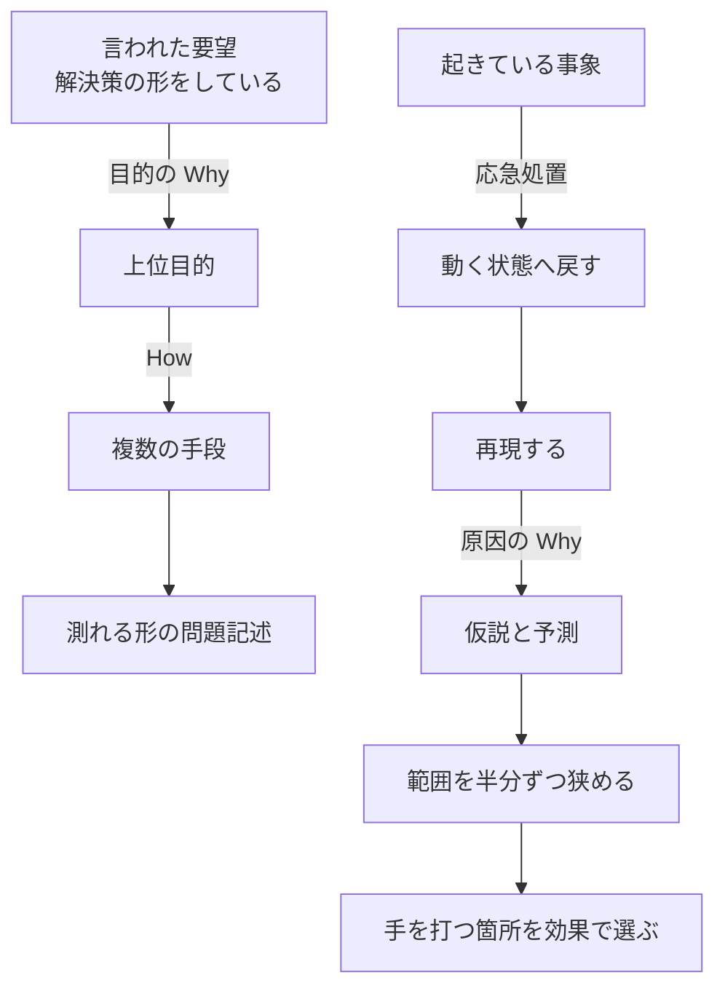

# 06 問題の見つけ方

「サーバーの容量を増やしてほしい」と頼まれて、そのまま見積もりを出したことがあるはずである。決済が失敗したと聞いて、直前に入れた変更へ飛びついたこともあるはずである。**この章は、言われたことと起きたことの両方から、解くべき問題を取り出すためのものである。**

## この章で判断できること

| 項目 | 内容 |
|---|---|
| 想定読者 | 要望を聞き取り、仕様を決め、障害の原因を追う開発者 |
| 答える問い | 言われたことから解くべき問題をどう取り出すか。起きている事象から原因へどうさかのぼるか |
| 読んだあとにできること | 「なぜ」と問うときに、過去の原因と未来の目的のどちらを聞いているかを言える。「問題は無かった」と報告するときに、どの範囲で無かったのかを添えられる |
| 例示に使う言語 | Java。例示のためであり、原則は言語に依らない |

## 結論

**「なぜ」には向きが2つある。** 過去へ向かう原因の「なぜ」と、未来へ向かう目的の「なぜ」である。要望の裏を掘るのは後者であり、なぜなぜ分析は前者に属する。取り違えると、手段の理由を聞いたまま、その手段を作ることになる。

**原因は1つに畳まない。** 表に出る失敗は複数の不備を要するため、孤立した「原因」は存在しない。手を打つ箇所は、根本かどうかではなく、効果と実現性で選ぶ。

**「見つからなかった」は「無い」ではない。** テストは欠陥の存在を示せるが、不在を示すには足りない。どの範囲で見つからなかったのかを言えて初めて、片方の意味になる。

**根拠**: `SRC-THINK-001` p.71-72（2章）、`SRC-EXT-061` 7、`SRC-TEST-001` p.135（10.6）、`SRC-EXT-055`、`SRC-EXT-042` §1.3

## 章01 から章05 との境目

**この章は、テストで欠陥を見つける話を作り直さない。** それは章「[05 テスト](05-test.md)」が観点IDつきで持っている。

境目は資料に書かれている。『ソフトウェアテスト徹底指南書』は、テストとデバッグを別の活動として定義する。**テストは対象を操作・診断してフィードバックを得る活動であり、欠陥の除去を含まない。デバッグは欠陥を見つけて除去する活動である。**

ISTQB の Foundation Level シラバスも同じ区分をとる。**同シラバスは「テストとデバッグは別の活動である」と書き出し、デバッグを故障の原因を見つけて分析し取り除くことと定義する。** 2件は独立している。

| 主題 | 持つ章 | 例 |
|---|---|---|
| 観点の出し方、設計技法、停止の条件 | 章05（`TS-` 番、28件） | 何を手がかりに観点を出すか |
| 事象を得るところまで | 章05 | テストを実行してフィードバックを得る |
| 得られた事象から原因へさかのぼるところ | この章（`PF-` 番、23件） | 仮説を立てて範囲を狭める |
| 確認テストと回帰テスト | 章05 | 直ったことと、壊していないことを確かめる |
| 要望から解くべき問題を取り出すところ | この章 | 目的の「なぜ」で上位目的へ上る |
| 抽象化の設計判断 | 章02（`DS-` 番、16件） | 抽象化を最も変化しやすい部分に絞る（`DS-15`） |
| 品質特性シナリオの書き方 | 章03（`AR-` 番、18件） | 言葉ではなくシナリオで書く（`AR-14`） |
| 結果が不安定なテストの扱い | 章05（`TS-28`） | フレーキーテストを放置しない |

**章04 と章05 の境目は、この手引きの判断だった。この章の境目は資料に書かれている。** 記録は `research/orchestration/problem-finding/40-debate.md` の `D-15` にある。

**根拠**: `SRC-TEST-001` p.50（2.2）、`SRC-EXT-042` §1.1.2

## 中心の問い

**この章が答えるのは2つの問いである。言われたことから解くべき問題をどう取り出すか。起きている事象から原因へどうさかのぼるか。**

2つの筋道は、向きが逆である。



**左の筋道は未来へ、右の筋道は過去へ向かう。** どちらも「なぜ」を使うが、同じ「なぜ」ではない。この区別が、この章の骨である。

## 要望から解くべき問題を取り出す

**言われたことは、たいてい解決策の形で来る。** そのまま作ると、手段だけが実現して目的が残る。この節は、聞き取りの入口から、測れる形の問題記述までを7つの観点で扱う。

### PF-01 言われたことを、3つの層に分けて聞いているか

「依頼者は自分の欲しいものを知っているか」を、はい・いいえで扱っていないかを見る。**独立した3件の資料が、それぞれ違う層について述べている。対立ではなく、層の違いである。**

| 層 | 述べている資料 | 述べていること |
|---|---|---|
| 達成したい結果 | 『Design It!』 | 通常は分かっている |
| 測れる文にすること | 『Design It!』、「No Silver Bullet」 | できないことが多い |
| 当たり前だと思っていること | IREB のシラバス | 口に出さない |

『Design It! プログラマーのためのアーキテクティング入門』は、ステークホルダー（利害の関わる関係者）が自分の欲しいものを通常は分かっていると述べる。**難しいのは、それを測れる文として明確にすることである。**

Frederick P. Brooks, Jr. の「No Silver Bullet」は、より強く書く。**同論文は、作るものを正確に決めることがソフトウェア構築で最も難しい単一の部分だとする。** 「依頼者は自分が何を欲しいかを知らない」とも書く。作って試す前に要求を完全に指定することは、実際には不可能だとも述べる。

IREB の CPRE Foundation Level シラバス（要求工学の資格制度の本体文書）は、3つ目の層を出す。**多くの関係者は、当たり前のことを口に出さない。** 同シラバスはこれを「潜在的な要求」と呼び、狩野モデルによる3分類を挙げる。

| 分類 | 別名 |
|---|---|
| 魅力的品質 | 気づかれていない要求 |
| 一元的品質 | 意識されている要求 |
| 当たり前品質 | 意識の下にある要求 |

3つの層をどの順で聞くかは、**この章は示さない。** どの資料も順序を書いていない。ただし同シラバスは、集める技法が意識されている要求と意識の下にある要求を引き出し、発想を促す技法が気づかれていない要求を引き出すと述べる。**技法の側から見ると、2系統は同時には使えない。**

**根拠**: `SRC-ARCH-001` p.83（4.3.2）、`SRC-EXT-053` 5.2、`SRC-EXT-054` 4.1、4.2

### PF-02 2つの「なぜ」を区別しているか

「なぜ」と問うたとき、過去と未来のどちらを向いているかを言えるかを見る。

『システム開発と「具体と抽象」』は、`Why` に2通りの使い方があり、向きが逆だと述べる。

| 種類 | 向き | 問うていること |
|---|---|---|
| 目的の `Why` | 未来へ | なぜそれをやるのか |
| 原因の `Why` | 過去へ | なぜそれが起きたのか |

同書は、原因の `Why` が経験と事実に基づいて説明できると述べる。**そして、製造業でよく使われる「なぜなぜ分析」は基本的にこちらに属すると位置づける。** 一方、目的の `Why` はまだ存在していないものを扱う。同書は「未来の現場は誰も経験していない」と書く。

同書は、技術者になじみがあるのは原因の `Why` のほうだとする。**障害という「すでに起こったネガティブなこと」は具体的で目につきやすいためである。**

「なぜ会議に遅れたのか」がどちらかは、同書が挙げる例そのものである。**通常、遅刻に目的は無い。これは原因を問うている。** 見分け方は、答えが過去の事実になるか、未来の意図になるかである。

**根拠**: `SRC-THINK-001` p.71-72、p.74（2章）

### PF-03 原因の「なぜ」を、目的の「なぜ」に置き直したか

要望の理由を聞いたあと、その理由を目的へ変換したかを見る。

『システム開発と「具体と抽象」』は、これを同書の原則として明記する。**原因の `Why` が一度上がったときは、目的の `Why` に変換してから解決策を考える。**

同書の例は次のとおりである。「サーバー容量を増やす」の理由が「データの蓄積速度が上がったから」であれば、**それは原因であって目的ではない。** 担当者の目線に置き直すと、目的は「容量に余裕を持たせて運用上の不安をなくす」になる。

**置き直すと手段が増える。** 同書は、家計に余裕を持たせる例で説明する。収入を増やすか、支出を減らすかの2方向がある。容量も同じで、増やす以外の道が見える。

**悪い例**

```text
依頼者: サーバーの容量を増やしてほしい。
担当者: 分かりました。今は何テラバイトで、いくつに増やしますか。
依頼者: 今が10で、20にしてほしい。
担当者: 見積もりを出します。
```

**良い例**

```text
依頼者: サーバーの容量を増やしてほしい。
担当者: 容量が増えると、何が良くなりますか。
依頼者: 蓄積の速さが上がっていて、いつか足りなくなるのが不安だ。
担当者: 足りなくなると、どの業務が止まりますか。
依頼者: 夜間の集計が落ちる。翌朝の帳票が出ない。
担当者: では、解きたいのは「夜間の集計を止めないこと」ですね。
依頼者: そうだ。
担当者: 容量を増やす案と、古いデータを別の場所へ移す案の2つを見積もります。
        判断の材料として、いま何日分で満杯になるかを先に測ります。
```

**なぜ悪いのか**: 担当者が聞いているのは、手段の細部だけである。**「10から20へ」という数値は、依頼者が思いついた手段の大きさであって、解くべき問題の大きさではない。** この会話は具体から具体への横移動であり、同書が「反応型」と呼ぶ型そのものである。同書は、この型が言われたことに最適化されており、AIに最も代替されやすいと述べる。

さらに、この聞き方では要求が測れる形にならない。**「20テラバイト」を満たしたかどうかは判定できるが、それで依頼者の不安が消えたかどうかは判定できない。**

**なぜ良いのか**: 担当者は原因の理由（蓄積が速い）を受け取ったあと、そこで止めずに目的へ上っている。**「夜間の集計を止めない」は、依頼者と担当者の両方が同じものを想像できる。** 上りきったところで下りているため、手段が2つに増えた。

**測る対象も変わった。** 「何日分で満杯になるか」は、両方の案を比べるための共通の物差しである。数値が出るまで、どちらが良いかを決めていない点にも意味がある。

どこまで上るかは、**この章は階層の数を示さない。** 同書は上位目的の存在を述べるが、何階層まで上るかの基準は書いていない。止めどきは `PF-06` で扱う。

**根拠**: `SRC-THINK-001` p.82、p.90-91（2章）

### PF-04 要望を、手段の候補として扱っているか

依頼の文が名詞（機能名、数量、画面）で終わっていないかを見る。

『システム開発と「具体と抽象」』は、「ネットワークを速くしたい」「サーバー容量を増やしたい」といった要望は、それ自体が目的ではないと述べる。**その先で依頼主が何を達成したいのかが目的である。**

同書は、この落とし穴を「手段の目的化」と呼ぶ。**技術に目を奪われがちな技術者にとって手段の磁力は強く、意識していないと目的は追いやられる。**

同書は、目的になりえないものを3つ挙げる。

| 手段 | 同書が示す理由 |
|---|---|
| 「見える化」 | 見えるようになった情報を誰かが使って初めて効果が出る |
| 「○○のレビュー」 | どんなレビューにも、その先の目的がある |
| データの収集と分析 | 集めることも分析することも、それ自体では成果にならない |

同書は、なぜ上位目的を考えるのかも書く。**それによって手段の選択肢が変わるからである。** 「見える化そのもの」が目的なら、あらゆる情報を見える化するのが達成手段になる。範囲を広げるほど費用は増える。上位目的があると、優先順位が付けられる。

同書は、要望を受け取るだけの進め方をこう評する。**顧客の言うことを聞いてそのまま作る進め方は、一見すると顧客志向の極致に見えるが、口にされた手段をそのまま受け取っているにすぎない。**

依頼者が手段を指定する権限を持っている場合でも、**この章は、指定を覆せとは書かない。** 『Design It!』は、ビジネス目標に責任を持つのはステークホルダーであり、その点を忘れてはならないと述べる。手段を選ぶ根拠を聞き、記録に残すところまでが `PF-04` の範囲である。

**根拠**: `SRC-THINK-001` p.73、p.78（2章）、p.167-171（4章）、`SRC-ARCH-001` p.83（4.3.2）

### PF-05 要求の出どころを、人だけに限っていないか

聞き取りの相手を数え上げただけで、出どころを尽くしたことにしていないかを見る。

IREB のシラバスは、要求の出どころを3種類に分ける。**関係者、文書、稼働しているシステムである。** 同シラバスは、1つでも欠けると理解も要求も不完全になると述べる。

文書の側の例として、同シラバスは既存システム、業務手順書、法令や規制の文書、社内規程、市場の情報を挙げる。**同シラバスは「まったく違う領域の似た状況を見ることも出どころになる」とも書く。**

関係者の側についても、同シラバスは範囲を広く取る。**利用者と顧客だけを見ると、他の関係者からの重要な要求を落とす。** 稼働中のシステムに意見を寄せる利用者も関係者に数える。

出どころを尽くしたと言える地点は、この資料には無い。同シラバスは、出どころの特定を「繰り返し行う、再帰的な過程であり、絶えず見直しを要する」と述べる。**尽くしたと宣言する基準は書かれていない。**

**根拠**: `SRC-EXT-054` 2.2 原則2、4.1

### PF-06 掘り下げの止めどきを、回数ではなく3つの確認で決めているか

「なぜを5回」のような回数を止めどきにしていないかを見る。

IREB のシラバスは、要求の検証で確かめることを3つ挙げる。**この3つは観測できる。**

| 確かめること |
|---|
| 関係者の間で要求について合意ができているか |
| 関係者の望みと必要が、要求で覆われているか |
| 文脈の前提が妥当か |

同シラバスは、検証で押さえる点をさらに4つ挙げる。**適した関係者を巻き込む、欠陥の指摘と修正を分ける、複数の視点から見る、繰り返し行う、である。** 検証の技法は、レビュー（ウォークスルー、インスペクション）と探索（試作、アルファ試験、ベータ試験、A/B試験、MVP。最小限の機能で価値を確かめる版）と標本開発の3系統に分かれる。

**回数で止める基準は、4系統のどの資料にも無い。** 調査の議論では、これを止めどきとして採れる資料が見つからなかった。記録は `40-debate.md` の `D-2` にある。

問題をすべて理解してから解決へ進む必要は無い。『Design It!』は、問題すべての定義を待っていたら何も作れなくなると述べる。同書は、解決策を探ることで問題に関する新しい洞察が得られるとも書く。**把握していない問題が見つかることもある。**

**根拠**: `SRC-EXT-054` 2.2 原則6、4.4、`SRC-ARCH-001` p.104（5.8）

### PF-07 問題の記述を、測れる形にしているか

問題の記述が、2人で読んで同じものを想像できる形になっているかを見る。

IREB のシラバスは、単一の要求に対する品質の基準のうち、最も重要なものを2つ挙げる。**適切さ（本当の合意された必要を述べている）と、分かりやすさである。** 同シラバスは、この2つを欠く要求は他の基準を満たしても役に立たないか有害だと述べる。

形を与える道具として、『Design It!』は POV Madlib（穴埋めで問題を1文にする道具）を挙げる。穴埋めの形は次のとおりである。

```text
〈特定の人物または役割〉は〈計測可能なタスク〉をする必要がある。
なぜなら〈インサイトを与えるコンテキスト〉があるからだ。
```

同書の記入例は「ヴァンダム市長は調達予算を30%減らす必要がある。なぜなら、彼は必須の部門の予算削減を避けたいと思っているからだ」である。**同書は、この形が機能ではなくシステム全体が提供する価値に重点を置くと述べる。**

**品質特性の側は、この章では作り直さない。** 章「[03 アーキテクチャ](03-architecture.md)」の `AR-14`（品質特性を言葉ではなくシナリオで書く）が持っている。

数値を書けない問題については、同シラバスが逃げ道を示す。**要求の価値に応じて、品質基準の満たし方を変えてよい。** 価値が高い要求ほど、基準を厳しく見る。すべての要求を同じ厳しさで書く必要は無い。

**根拠**: `SRC-EXT-054` 3.8、`SRC-ARCH-001` p.83（図4-3）、p.278-279（アクティビティ8）

## 具体と抽象を行き来する

**上りと下りは別の操作である。** 片方だけを速くしても、問題の見つけ方は良くならない。この節は、往復の型と、片側に寄りすぎた型を4つの観点で扱う。

### PF-08 具体から抽象へ上り、抽象から具体へ下りているか

依頼から作業へ、横に移動していないかを見る。

『システム開発と「具体と抽象」』は、2つの操作を名づける。**具体から抽象を導き出すのが「抽象化」、抽象から具体を導き出すのが「具体化」である。** 同書は、考える力の正体を、この縦の往復を速く正確に繰り返す能力だとする。

同書は、各操作の中身も書く。

| 操作 | 中身 |
|---|---|
| 抽象化（上り） | 断片的な要望やトラブルから枝葉末節を削ぎ落とし「そもそもこれは何のためか」を問う |
| 具体化（下り） | 定義した本質を個別の環境と制約に当てはめて「ではどう実現するか」に変える |

同書は、往復しない型を「反応型」と呼ぶ。**「Aという依頼が来たからAという作業をする」という、具体から具体への横移動である。** 同書は、この型が言われたことに最適化されており、AIに最も代替されやすいと述べる。

往復を何回まわすかは**決着していない。** 4系統のどの資料も、回数と頻度を示していない。詳しくは「決着していないこと」に書く。

**根拠**: `SRC-THINK-001` p.81-82（2章、図2-12）

### PF-09 具体に寄りすぎていないか

構造の話が出たときに、目の前の制約へ引き下ろして終わっていないかを見る。

『システム開発と「具体と抽象」』は、この型に名前を与える。**「現場ではそうはいかない」という反応は「具体への逃避」である。** 同書は、これを抽象度の高い構造的議論を目の前の具体的制約に引きずり下ろして思考を止める型だと書く。

同書は、対になる評価も添える。**「机上の空論を語らない」という川下での誠実さは、「確実にできそうなつまらない現実しか語れない」という川上の不誠実と表裏一体である。**

同書は、川上の仕事を「まずは餅の絵を描く」ことだと表す。**実現性だけを考える思考回路は、いつも誰かが描いた絵から始めるため、白紙を渡されると面食らう。**

実現性の指摘がいつ「具体への逃避」になるかは、**この章は線を引けない。** 同書も線を示していない。手がかりは、その指摘が案を改善したか、議論を止めたかである。**これはこの手引きの判断であり、出典は無い。**

**根拠**: `SRC-THINK-001` p.222、p.258（4章）

### PF-10 抽象に寄りすぎていないか

抽象の語が、正確さを増やすためではなく、決めないために使われていないかを見る。

Edsger W. Dijkstra の「The Humble Programmer」は、抽象化の目的を明確に述べる。**「抽象化の目的は曖昧になることではなく、絶対的に正確でいられる新しい意味の層を作ることである。」**

**この一文は、抽象を擁護すると同時に、曖昧な抽象を否定している。** 抽象の語を使ったのに正確さが増えていないなら、それは抽象化ができていない。

「No Silver Bullet」は、別の側から限界を述べる。**ソフトウェアの複雑さは本質的な性質であって偶有的なものではない。** したがって、複雑さを捨象した記述は、しばしば本質も一緒に捨ててしまう。同論文は、数学と自然科学が単純化した模型で成功したのは、無視した複雑さが現象の本質ではなかったからだと書く。

IREB のシラバスは、言葉の水準で落とし穴を挙げる。

| 避けるもの | 注意して使うもの |
|---|---|
| 不完全な記述 | 受動態 |
| 特定できない名詞 | 全称の量化子（「すべて」「決して」） |
| 不完全な条件 | 名詞化（動詞から作った名詞。例「認証」） |
| 不完全な比較 | |

**名詞化が注意の対象になっているのは、動作を名詞に変えると主語と目的語が消えるためである。** 「認証」は、誰が誰を認証するのかを含まない。

抽象の語を使わずに上位目的を書ける場合がある。`PF-07` の POV Madlib は、人物と計測可能なタスクを埋める形であり、抽象の語を必要としない。**上位目的が抽象の語でしか書けないなら、まだ上りきっていない可能性がある。これはこの手引きの判断である。**

**根拠**: `SRC-EXT-055`、`SRC-EXT-053` 2章、`SRC-EXT-054` 3.2

### PF-11 いま話しているのが、どの階層の具体と抽象かを言えるか

「具体的にしよう」という指示が、どの階層に向けられているかを言えるかを見る。**手元の2冊が、同じ「具体」の語で別の階層を指している。対立ではなく、階層の違いである。**

| 資料 | 述べていること | 階層 |
|---|---|---|
| 『良いコード／悪いコードで学ぶ設計入門』 | 意味が狭く、目的に特化した名前を選ぶ | 解が決まったあとの命名 |
| 『システム開発と「具体と抽象」』 | 「具体が善で抽象は悪」は川下側の発想であり、全体像の半分である | 解を決める前の問題選び |

『改訂新版 良いコード／悪いコードで学ぶ設計入門』は、存在に着目した名前が用途を多重にすると述べる。**「住所」「金額」「ユーザー」は目的不明の対象になり、「配送先」「請求金額」「アカウント」のように目的特化にする。**

『システム開発と「具体と抽象」』は、要件定義の場で「具体が善で抽象が悪」という価値観が広まる理由も書く。**ぼんやりした要望を勝手な解釈で詳細仕様に落として、期待と違うものを作る失敗があるためである。** 同書は、それを否定せずに「全体像の半分である」と位置づける。

**この整理は資料に書かれていない。** 2冊は互いを参照していない。**調査の議論に参加した3者が同じ読みに至った結果である。** 記録は `40-debate.md` の `D-6` にある。

名前の具体性をどこまで上げるかは、**この章は基準を持たない。** 章「[02 設計](02-design.md)」の `DS-15`（抽象化を最も変化しやすい部分に絞る）と `DS-14` が、その判断を持っている。

**根拠**: `SRC-CODE-002` p.239-241（11.2.1、11.2.2）、`SRC-THINK-001` p.44（2章）

## 事象から原因へさかのぼる

**手当たり次第に試さないための順序がある。** 主手順を1つ置き、その上に技法を配置する。この節は、復旧から手を打つ箇所の選び方までを8つの観点で扱う。

### PF-12 原因究明より先に、動く状態へ戻しているか

障害の最中に、原因の特定から着手していないかを見る。

Google が公開する「Site Reliability Engineering」の12章は、この本能を明確に退ける。**大きな障害での最初の反応として、根本原因をできるだけ速く見つけようとする本能は無視する。** 先に、その状況でできる限りシステムを動く状態に戻す。

同章は比喩も添える。**新人パイロットは、緊急時の第一の責務は飛行機を飛ばすことだと教えられる。原因究明は二の次である。**

**悪い例**

```text
運用: 決済が失敗している。
担当A: 昨日データベースを入れ替えたから、それだ。設定を戻す。
担当B: 同時にキャッシュの設定も直しておく。
運用: 直った。原因は何だった。
担当A: 分からないが、直ったからよい。
```

**良い例**

```text
運用: 決済が失敗している。
担当A: まず影響を止める。決済を旧経路へ切り替える。
担当B: 切り替える前に、その時点のログとスレッドダンプを保存する。
担当A: 仮説を3つ書く。入れ替えたデータベース、キャッシュの設定、外部の応答。
       仮説1が正しければ、失敗はすべて新しい接続先に出るはずだ。
担当B: 保存したログを見る。失敗は新旧の両方に出ている。仮説1は落ちた。
担当A: 仮説2なら、キャッシュを空にした直後だけ失敗するはずだ。検証環境で試す。
```

**なぜ悪いのか**: 3つの誤りが重なっている。1つ目は、影響を止める前に原因の特定へ着手したことである。2つ目は、直近の変更に飛びついたことである。同章は、過去の障害の原因に飛びつき「一度起きたのだから今回もそれだ」と考える型を、切り分けが下手になる4つの型の1つに挙げる。

3つ目は、2つの設定を同時に戻したことである。**どちらが効いたのかを、この手順では判別できない。** 同章は、システムを変えるときは系統立てて記録しながら行い、試験前の状態に戻せるようにせよと述べる。記録しないと、正体不明の設定のまま動かすことになる。

**「直ったからよい」で終わったため、証拠も残っていない。** Hochschild ほかの「Cores that don't count」は、別の危険を書く。コードベースには常に未診断の不具合が潜んでいるという前提が、別の原因を覆い隠すことがある。

**なぜ良いのか**: 影響を止める操作と、原因を調べる操作が分かれている。**証拠の保存が、切り替えの前に置かれている点に意味がある。** 復旧してしまうと、その時点の状態は二度と得られない。

仮説を3つ並べたことにも理由がある。**1つに決めうちすると、それを支持する情報だけを探すことになる。** 各仮説に「正しければ何が観測されるか」を先に書いているため、観測が予測と合わなければ落とせる。仮説1は、この形で落ちている。

応急処置が原因を消してしまう場合でも、**この章は順序を変えない。** 同章は復旧を優先せよと述べる。ただし良い例のように、切り替えの前に証拠を保存する余地はある。**この折衷は、同章の「系統立てて記録しながら変える」から導いたものである。**

**根拠**: `SRC-EXT-056`、`SRC-EXT-062` 1章

### PF-13 再現してから直しているか

再現できていない状態で、修正に着手していないかを見る。

ISTQB のシラバスは、動的テストが故障を引き起こしたときのデバッグの典型的な手順を3段で示す。**故障の再現、診断（欠陥を見つける）、欠陥の修正である。** そのあとに確認テストを置き、回帰テストを続ける。

『ソフトウェアテスト徹底指南書』は、同じ順序を自動テストの側から書く。同書はこれを「デバッギングテスト」と呼ぶ。

| 段 | すること |
|---|---|
| 1 | 再現手順をテストコードにして、期待に反して失敗することを確かめる |
| 2 | より詳細なテストを書いて、欠陥の存在箇所を絞り込む |
| 3 | 変えたくない振る舞いに回帰テストを書き、成功していることを確かめる |
| 4 | 欠陥を修正する |
| 5 | 再現テストと回帰テストを実行し、成功することを確かめる |

**2件は独立している。** 一方は資格制度の本体文書、他方は書籍である。

再現の情報には、頻度も含める。同書は、報告に「複数回操作して一回起こる」といった発生頻度を書くよう求める。**同書は、手順と環境情報だけでは足りないとする。**

再現しない障害について、**この章は手順を示さない。** 4系統のどの資料にも、非決定的な不具合を必ず切り分ける手順は無い。`PF-15` と `PF-16` は、正常と異常を再現できることを前提にしている。

**根拠**: `SRC-EXT-042` §1.1.2、`SRC-TEST-001` p.268（20.5）、p.383（30.6）

### PF-14 仮説の予測を先に書いてから試しているか

「試してみる」の前に、「正しければ何が見えるか」を書いたかを見る。

「Site Reliability Engineering」の12章は、切り分けを仮説演繹法（仮説を立て、その予測を試す進め方）の適用と位置づける。**観測とシステムの理解を材料に、原因の仮説を立て、それを試して確かめることを繰り返す。**

同章は、診断の問い方も示す。**「何をしているか」を先に突き止め、次に「なぜそれをしているか」と「どこで資源を使い、どこへ出力しているか」を問う。**

同章は、否定の結果の扱いも書く。**否定の結果は無視も割引もしてはならない。自分が誤っていたと分かることには大きな価値がある。** 同章は、否定の結果を出した実験は結論が出ていると述べる。

同章が挙げる、切り分けが下手になる4つの型は次のとおりである。

| 型 |
|---|
| 関係のない症状を見る。指標の意味を取り違える |
| 仮説を安全かつ有効に試すための変え方を取り違える |
| 突飛な説を立てる。過去の障害の原因に飛びつく |
| 偶然の一致や共通原因による見かけの相関を追う |

仮説をいくつ並べるかは、**この章は数を示さない。** 同章も数を書いていない。同章が示すのは、オッカムの剃刀（単純な説明を先に見る）と、相関は因果ではないという注意である。

**根拠**: `SRC-EXT-056`

### PF-15 範囲を半分ずつ狭めているか

端から順に見る作業を、二分法に置き換えられないかを見る。

「Site Reliability Engineering」の12章は、分割統治を汎用の手法として挙げる。**階層のどちらかの端から順にたどるのが良い場合が多い。** 大きなシステムでは二分法が速い。半分に割って両側の通信経路を見て、片側が正常と分かれば繰り返す。

版の履歴に対しては、道具が二分探索を持っている。git-bisect の公式マニュアルは、正常な版と異常な版の間を二分探索して、変更を入れた版を特定する。**675版が残っている時点で「およそ10段」と表示されるとおり、必要な試行は版数の対数に比例する。**

同マニュアルは自動化の方法も示す。判定を script に委ね、終了コードで結果を伝える。

| 終了コード | 意味 |
|---|---|
| 0 | この版は正常である |
| 1 から 127（125を除く） | この版は異常である |
| 125 | この版は試験できない。飛ばす |

**限界も書いてある。** 同マニュアルは、探している版の隣を飛ばすと、どちらが最初の異常版かを機械は決められなくなると述べる。

**この観点は、書籍4冊の読んだ範囲に対応する記述が無い。** 公開情報だけを根拠にしている。

二分法は、正常と異常を再現できないときは使えない。同マニュアルの手順は、各版で正常か異常かを判定できることを前提にしている。**判定が不安定な版は、飛ばす扱いになる。**

**根拠**: `SRC-EXT-056`、`SRC-EXT-060`

### PF-16 再現を最小にしてから直しているか

障害を起こす条件を、削れるだけ削ってから原因を探しているかを見る。

Andreas Zeller の「Isolating Failure-Inducing Input」は、最小化を自動化できると示した。**ddmin は、どの1要素を取り除いても失敗が消える状態まで入力を縮める。** 同論文はこれを 1-minimal と定義する。

同論文の測定値は次のとおりである。

| 対象 | 縮める前 | 縮めた後 |
|---|---|---|
| Mozilla を落とす利用者操作 | 95個 | 3個 |
| Mozilla を落とす HTML | 896行 | 1行 |

**自動試験は139回、500MHz の機で35分だった。** 同論文は、最悪の試行回数が要素数の2乗に3倍の要素数を加えた値だと示す。すべての試験が成功か失敗のどちらかを返す最良の場合は、二分探索と同じ複雑さになる。

同論文は、最小化する理由を2つ挙げる。**1つは、最小の事例ほど一般的な文脈を表すことである。** もう1つは、最小化した事例が現在と将来の複数の障害報告を1件に束ねることである。

同論文は、障害報告に相反する2つの要請があることも書く。**技術者が文脈を再現できるよう具体的でなければならず、同時に単純でなければならない。**

手で最小化するときに何から削るかは、**この章は順序を示さない。** 同論文が示すのは機械の手順であり、人が削る順序は書かれていない。削れる候補は、入力、時刻、並行の度合い、外部への接続、設定、データ、実行順である。**この一覧は、この手引きが組み立てたものである。**

**根拠**: `SRC-EXT-059` 要旨、1章、3.1、4章

### PF-17 記録が、原因の候補を分けられる項目を持っているか

記録が、どの仮説を落とせるかを決めているかを見る。

CWE-778「Insufficient Logging」は、記録の不足を独立した弱点として分類する。対象は、事象を記録しないことと、重要な項目を落として記録することである。**同項は、記録が足りないと何が問題を起こしたかを発見することが困難または不可能になると述べる。**

OWASP の Logging Cheat Sheet は、記録する項目を4つに整理する。

| 区分 | 項目の例 |
|---|---|
| いつ | 日時、事象の発生時刻、やり取りの識別子 |
| どこで | アプリケーションの名前と版、入口、ホスト |
| 誰が | 発生元のアドレス、利用者の識別 |
| 何を | 事象の種類、深刻度、説明 |

同資料は、記録してはならないものも挙げる。**セッション識別子、アクセストークン、パスワード、接続文字列、鍵、決済情報である。**

『ソフトウェアテスト徹底指南書』は、観測点という語でこれを扱う。**観測点は出力を得るための手段であり、その充実度が観測容易性に直結する。** 同書は、観測すべき情報が盛り込まれるようにログを設計することを、観測点を設ける手立ての1つに挙げる。

**悪い例**

```java
class PaymentClient {

    String charge(String orderId, int amount) {
        try {
            return gateway.send(orderId, amount);
        } catch (IOException e) {
            System.out.println("failed");
            return null;
        }
    }
}
```

**良い例**

```java
class PaymentClient {

    String charge(String traceId, String orderId, int amount) {
        long startedAt = clock.millis();
        try {
            String receipt = gateway.send(orderId, amount);
            write("charge", "ok", traceId, orderId, amount, startedAt, null);
            return receipt;
        } catch (IOException e) {
            write("charge", "gateway_io", traceId, orderId, amount, startedAt, e);
            throw new PaymentFailedException(orderId, e);
        }
    }

    private void write(String stage, String outcome, String traceId, String orderId,
                       int amount, long startedAt, Exception cause) {
        System.out.println("stage=" + stage + " outcome=" + outcome
                + " traceId=" + traceId + " orderId=" + orderId + " amount=" + amount
                + " elapsedMs=" + (clock.millis() - startedAt)
                + " cause=" + (cause == null ? "-" : cause.getClass().getName()));
    }
}
```

**なぜ悪いのか**: 記録が `failed` の1語しかないため、どの仮説も落とせない。**どの注文か、いくらか、どこで失敗したか、外部が何を返したかが分からない。** 同じ行が1万件並んでも、そこから読み取れるのは「何かが失敗した回数」だけである。

CWE-778 が言う「重要な項目を落として記録する」が、そのまま当てはまる。**さらに `null` を返しているため、呼び出し側では失敗と「決済が無い」が同じ形になる。** この点は `PF-23` で扱う。

**なぜ良いのか**: 各項目が、落とせる仮説と対応している。

| 項目 | 落とせる仮説 |
|---|---|
| `traceId` | 上流のどの要求から来たのか。上流と下流の記録を突き合わせられる |
| `orderId`、`amount` | 特定の注文や金額の範囲に偏っているか |
| `outcome` | 外部との通信の失敗か、それ以外か |
| `elapsedMs` | 待ち時間の超過か、即座の拒否か |
| `cause` | 例外の型で、経路を区別できる |

「Site Reliability Engineering」の12章は、上流と下流の記録を突き合わせる手間を減らすため、一連の呼び出しに一意の要求識別子を通せと述べる。**`traceId` はその役目である。**

**記録している項目に、OWASP の資料が禁じるものは無い。** 金額と注文の識別子は決済情報そのものではなく、カード番号も認証情報も含んでいない。

記録の量の上限は、**この章は示さない。** 同12章は、複数の詳細度を用意し、プロセスを再起動せずに詳細度を上げられるようにせよと述べる。**量の上限ではなく、切り替えの仕組みで解く。**

**根拠**: `SRC-EXT-065`、`SRC-EXT-066`、`SRC-TEST-001` p.486（39.3）、`SRC-EXT-056`

### PF-18 原因の候補を、木の形に押し込めていないか

原因の図が、必ず1つの根へ収束する形になっていないかを見る。

Richard I. Cook の「How Complex Systems Fail」は、明確に述べる。**「事故のあとに1つの『根本原因』を割り当てることは、根本的に誤っている。」** 同資料は、表に出る失敗が複数の不備を要するため、孤立した「原因」というものは存在しないとする。

同資料は、その理由も書く。**小さな失敗のそれぞれは必要条件にすぎず、組み合わさって初めて十分条件になる。** 同資料は「『原因』の見方そのものが、次の事故への防御の有効さを制限する」とも述べる。

『ソフトウェアテスト徹底指南書』は、道具の形で同じ点に触れる。同書は2つのモデルを並べる。

| モデル | 形 |
|---|---|
| Why ツリー（ロジックツリー） | 親ノードに問題、子ノードにその原因となる問題をつないだ木 |
| SaPID の問題構造図 | 木の形にする必要が無い。輪になる形も現れる |

同書は、問題構造図の利点を「木の形にとらわれず、問題が起きる仕組みをありのまま表せる」ことだとする。

3件目として、Google の事後分析の定義がある。**同社の事後分析は「原因（複数形）」を書くものとして定義されており、責めない事後分析とは「寄与した原因」を特定することに集中するものである。**

**独立した3件が同じ向きを取る。この章で最も根拠が厚い観点である。**

Why ツリーそのものは使ってよい。同書は、Why ツリーが有効な対策を打てる箇所を探すのに有効だと述べる。**問題は、木の形そのものではなく、1つの根へ収束させることを目的にすることである。** この読み分けは、同書が明示していない。**調査の議論に参加した3者の解釈である。** 記録は `40-debate.md` の `D-4` にある。

**根拠**: `SRC-EXT-061` 3、7、15、`SRC-TEST-001` p.108（10.6）、`SRC-EXT-058`

### PF-19 手を打つ箇所を、効果で選んでいるか

対策の対象を、「最も根本にある原因」という理由だけで選んでいないかを見る。

『ソフトウェアテスト徹底指南書』は、改善する問題点をレバレッジポイント（少ない手数で効く箇所）として選ぶと述べる。**同書は「これは根本原因に限定されません」と明記する。**

選ぶときの観点は5つである。

| 観点 |
|---|
| 自分たちで改善できる |
| 現実的に改善できる |
| 妥当な費用対効果で改善できる |
| 妥当な期間で改善できる |
| プロセスの改善で対応できる |

同書は、その手前の分析についても書く。**入り組んだ問題を層別して分析を分け、抽象度を調整し、`So What?` と `Why So?` の双方向で見直し、漏れと重なりを整える。**

**この「抽象度を調整する」は、`PF-08` の往復と同じ操作である。** 原因の分析の中にも、具体と抽象の上り下りが入っている。

応急処置と恒久対策の切り分けについて、**この章は基準を持たない。** 上の5つの観点は、どちらにも当てはまる。「How Complex Systems Fail」は、変更が新しい形の失敗を持ち込むとも述べる。**恒久対策を打つこと自体が、次の障害の経路になりうる。**

**根拠**: `SRC-TEST-001` p.135（10.6）、`SRC-EXT-061` 14

## 「問題が無い」と「見つけられていない」を分ける

**この2つを分けて初めて、調査の終わりを宣言できる。** この節は、範囲の言い方と、見えていない失敗を見つけ出す手立てを4つの観点で扱う。

### PF-20 見つからなかった範囲を言えるか

「問題は無かった」と言うとき、どの範囲でそう言えるのかを添えているかを見る。**4系統の一次資料が、それぞれ違う角度から同じ点を述べる。**

「The Humble Programmer」は論理の側から書く。**「テストは欠陥の存在を示すには非常に有効だが、欠陥の不在を示すには絶望的に不十分である。」**

ISTQB のシラバスは、同じ点を原則として並べる。

| 原則 | 内容 |
|---|---|
| 原則1 | テストは欠陥の存在を示せるが、欠陥が無いことを証明できない |
| 原則2 | 網羅は、些細な場合を除いて実行できない |
| 原則7 | すべての要求を試して欠陥をすべて直しても、利用者の必要を満たさないシステムになりうる |

**原則7 は「absence-of-defects fallacy」という名前を持つ。** 同シラバスは、検証（仕様どおりか）に加えて妥当性確認（必要を満たすか）も行えと述べる。

Altman・Bland の「Absence of evidence is not evidence of absence」は統計の側から書く。**差が出なかった試験を「差が無いことを示した」と読むのは誤りである。** 示されたのはたいてい「差の証拠が無い」ことだけであり、同記事はこの2つを「まったく別の主張である」とする。

『システム開発と「具体と抽象」』は、定義の側から書く。**顕在的問題は誰にでも見えるが、潜在的問題は見ようとする人にしか見えない。** 同書は、これが川下志向と川上思考を分ける要因だとする。

**「実施していない範囲を関係者へ開示する」ことは、章05 の `TS-20` が持っている。** この章は繰り返さず、`TS-20` を指す。

どこまで書けば範囲を示したことになるかは、**この章は項目を定めない。** 手がかりは、対象、期間、頻度、精度、観測した場所である。**この一覧は、この手引きが組み立てたものである。**

**根拠**: `SRC-EXT-055`、`SRC-EXT-042` §1.3、`SRC-EXT-063`、`SRC-THINK-001` p.115（3章）

### PF-21 独立した検算を持っているか

結果が正しいことを、計算した経路とは別の経路で確かめているかを見る。

「Cores that don't count」は、検算が無いと検出できない故障が現に存在することを示した。**同論文は、誤り検出の仕組みに引っかからないまま計算結果だけが狂う故障を「静かな実行破損」と呼ぶ。** そうした中核（CPU の演算単位の1つ）を「気まぐれ」と呼ぶ。

同論文は、発見の経緯を書く。**唯一の症状が誤った計算結果であるため、この故障は長らく「コードベースには必ず未診断の不具合が潜んでいる」という前提に覆い隠されてきた。** 検出できたのは、期待した結果と突き合わせたときだけだった。

同論文は、検出のされ方を4段階に分ける。

| 段階 |
|---|
| 即座に検出できて再試行できる |
| 機械チェックとして現れる |
| 検出はされるが、再試行には遅すぎる |
| まったく検出されない |

同論文は、規模との関係も書く。**数千台に数個という頻度でも、規模が大きければ問題として立ち上がってくる。** 逆に言えば、規模が小さいうちは「無い」と「見えない」を区別できない。

どこに検算を置くかは、**この章は示さない。** 同論文は、この故障が特定の中核に偏ることと、命令と欠陥箇所の対応が自明でないことを述べるにとどまる。

**根拠**: `SRC-EXT-062` 要旨、1章、2章

### PF-22 観測の経路そのものが生きていることを確かめているか

「警報が鳴っていない」を、「問題が無い」として扱っていないかを見る。

**この観点は、この手引きが組み立てたものである。** 直接これを述べた一次資料を、調査では見つけられなかった。調査の議論では3者が置くことに同意したが、根拠が弱い点も記録した。記録は `40-debate.md` の `D-10` にある。

組み立ての材料は3つである。外形監視（利用者から見える症状を外側から見る監視）の限界、検算でしか見つからない故障、観測点の充実度である。

| 材料 | 述べていること |
|---|---|
| 「Site Reliability Engineering」6章 | 外形監視は症状に着目し、現に起きている問題を表す。「今、正しく動いていない」を示す |
| 「Site Reliability Engineering」6章 | まだ起きていないが差し迫っている問題に対して、外形監視はほとんど役に立たない |
| 「Cores that don't count」 | 期待した結果と突き合わせることでしか検出できなかった |
| 『ソフトウェアテスト徹底指南書』39.3 | 観測点の充実度が観測容易性に直結する |

**外形監視は「今、正しく動いていない」を示す。裏返すと、沈黙は「今は分からない」であって「正常」ではない。** 観測の経路が止まっている場合も、同じ沈黙になる。

「Site Reliability Engineering」の6章は、監視が「何が壊れているか」と「なぜか」の2つを分けて扱うとも述べる。**前者が症状、後者が原因であり、同章はこの区別を良い監視を書くうえで最も重要なものの1つとする。**

経路の生存を確かめる方法は、**この章は示さない。** 既知の事象を流して届くことを確かめる方法が考えられるが、**それを述べた資料を読めていない。**

**根拠**: `SRC-EXT-057`、`SRC-EXT-062`、`SRC-TEST-001` p.486（39.3）

### PF-23 失敗を握りつぶしていないか

例外を捕まえたあと、呼び出し側に失敗が伝わる形になっているかを見る。

SEI CERT Oracle Coding Standard for Java の ERR00-J は、規則の題を「検査例外を握りつぶしたり無視したりしない」とする。**同規則は、各 `catch` が不変条件の保たれた状態でだけ処理を続けることを保証しなければならないと述べる。**

同規則は、スタックトレースを印字するだけの `catch` も非適合例として挙げる。**例外が起きなかったかのように処理が続くうえ、内部の情報が漏れうるためである。**

適合する対処は4つある。

| 対処 |
|---|
| 誤りの状態から回復する |
| 外側の `catch` が扱えるよう投げ直す |
| 報告の仕組みへ渡して記録する |
| 機微な情報を落としてから報告する |

**悪い例**

```java
class InventoryReader {

    int stockOf(String sku) {
        try {
            return repository.findStock(sku);
        } catch (SQLException e) {
            return 0;
        }
    }
}
```

**良い例**

```java
class InventoryReader {

    int stockOf(String sku) {
        try {
            return repository.findStock(sku);
        } catch (SQLException e) {
            throw new StockUnavailableException(sku, e);
        }
    }
}
```

**なぜ悪いのか**: データベースへ届かなかったときも `0` を返すため、呼び出し側からは「在庫が0である」と区別が付かない。**「問い合わせに失敗した」と「在庫が無い」が、同じ値になっている。** これは `PF-20` が扱う取り違えを、コードの水準で作り込んだ形である。

**この誤りは、警報にも記録にも出ない。** 例外は消え、戻り値は正常な型のままである。在庫が0だと判断した後続の処理は、注文を止めるなり発注を起こすなりして、誤った状態を先へ広げる。「How Complex Systems Fail」が述べるとおり、こうした小さな失敗が組み合わさって表に出る失敗になる。

**なぜ良いのか**: 呼び出し側が、値の欠如ではなく失敗として受け取れる。**`StockUnavailableException` は業務上の意味を持つ型であり、`sku` と原因の例外を運んでいる。** どの商品で、どの下位の失敗が起きたかが、そのまま伝わる。

**握りつぶしを避けることは、握りつぶさない書き方の1つを選ぶことである。** ここでは4つの対処のうち「投げ直す」を選んだ。回復できる誤りなら回復してよく、記録して既定値で進める判断もありうる。**選ばないほうがよいのは、何も決めずに例外だけを消す形である。**

呼び出し側が失敗を扱えない場合は、**投げ直す以外の対処を選ぶ。** 同規則の4つの対処のうち、記録して報告する形が残る。**そのときは `PF-17` の項目を持たせる。** 記録が `failed` の1語なら、握りつぶしたのとほとんど変わらない。

**根拠**: `SRC-EXT-064`、`SRC-EXT-061` 3

## よくある外れ方

**観点IDは振らない。既存の観点の中で参照する形にする。**

調査の議論では、これらの型に名前を付けないことで決着した。**codex が「確認した資料の中に、統一された固有名は見つからない」と報告したためである。** 心理学の用語をあてる案も出たが、原典を読めていないため採らなかった。記録は `40-debate.md` の `D-11` にある。

| 外れ方 | 対応する観点 | 出典 |
|---|---|---|
| 関係のない症状を見る。指標の意味を取り違える | `PF-14` | `SRC-EXT-056` |
| 仮説を安全かつ有効に試すための変え方を取り違える | `PF-12`、`PF-14` | `SRC-EXT-056` |
| 突飛な説を立てる。過去の障害の原因に飛びつく | `PF-14` | `SRC-EXT-056` |
| 偶然の一致や共通原因による見かけの相関を追う | `PF-14` | `SRC-EXT-056` |
| 1つの「根本原因」に割り当てる | `PF-18` | `SRC-EXT-061` 7 |
| 後知恵で人の働きを評価する | `PF-19` | `SRC-EXT-061` 8 |
| 手段の理由を聞いたまま、その手段を作る | `PF-03` | `SRC-THINK-001` 2章 |
| 構造の議論を目の前の制約へ引き下ろして止める | `PF-09` | `SRC-THINK-001` 4章 |

**責める場では、この型は表に出にくい。** Google の事後分析の文書は、責めを除くと人が報復を恐れずに問題を上へ上げられるようになると述べる。同資料は「人は直せないが、仕組みと手順は直せる」とも書く。

**根拠**: `SRC-EXT-058`

## この章で扱わないこと

**範囲の外にあるものと、その理由を書く。**

| 扱わないもの | 理由 | 代わりに読むもの |
|---|---|---|
| テストで欠陥を見つけること | 章05 が観点IDつきで持っている | 章05 の `TS-01` から `TS-15` |
| 確認テストと回帰テスト | 章05 の範囲である | 章05、`SRC-EXT-042` §1.1.2 |
| 結果が不安定なテストの扱い | 章05 の `TS-28` が持っている | 章05 の `TS-28` |
| 抽象化の設計判断 | 章02 が観点IDつきで持っている | 章02 の `DS-14`、`DS-15` |
| 品質特性シナリオの書き方 | 章03 が観点IDつきで持っている | 章03 の `AR-13`、`AR-14` |
| 非決定的な不具合の切り分け手順 | 4系統のどの資料にも手順が無い | 章05 の `TS-28` |
| 事後分析の書式と運用 | この章の問いに入れていない | `SRC-EXT-058` |
| 要求管理（版、追跡、変更の扱い） | 要求を見つけたあとの話であり、章07 の範囲に近い | `SRC-EXT-054` 6章 |
| 監視と警報の設計 | 運用の技術体系であり、この章の調査では追っていない | `SRC-EXT-057` |
| 形式手法による正しさの証明 | 調査の範囲に入れていない | 章の外 |

**Java は例示のための言語である。** この章の原則は言語に依らない。示している考え方は「失敗が呼び出し側に伝わるか」「記録が仮説を落とせるか」であり、記法の選択ではない。

**やり取りの例は日本語で書いた。** 実際の聞き取りが対面か文書かは、この章が決めることではない。

## 決着していないこと

**調査の議論で決まらなかったものを、決まらなかったと書く。** 記録は `research/orchestration/problem-finding/40-debate.md` にある。

| 決まらなかったこと | 理由 |
|---|---|
| 具体と抽象の往復を、1つの作業で何回まわすか | 4系統のどの資料にも回数と頻度が無い。`SRC-THINK-001` p.81 は「速く正確に繰り返す」と述べるだけである |
| 掘り下げを何階層まで上るか | 上位目的の存在は `SRC-THINK-001` が述べるが、階層の数を示した資料は見つからなかった |
| 要求の出どころを尽くしたと言える基準 | `SRC-EXT-054` 4.1 は、出どころの特定を絶えず見直す過程だとする。尽くしたと宣言する基準は書いていない |
| 実現性の指摘が「具体への逃避」になる線 | `SRC-THINK-001` は線を示していない。この章が挙げた手がかりは、出典なし・私見である |
| 非決定的な不具合を切り分ける手順 | 4系統のどの資料にも、必ず切り分けられる手順は無い。Antigravity も「資料に記載が無い」と報告した |
| 観測の経路の生存を確かめる方法 | `PF-22` を直接述べた資料を読めていない。方法まで示した資料も見つからなかった |

## この章の根拠の弱いところ

**読者が根拠の重みを判断できるように、弱い点を挙げる。**

| 弱い点 | 内容 |
|---|---|
| 要求工学の規格を読めていない | ISO/IEC/IEEE 29148:2018 は有料であり、本体を読めていない。要求の定義と引き出しは `SRC-EXT-054` の記述で代えている |
| 実地調査の論文を読めていない | Curtis ほか「A field study of the software design process for large systems」（CACM 31(11)、1988）は、`dl.acm.org` が 2026-09-08 の時点で HTTP 403 を返した |
| 「なぜなぜ分析」の批判を読めていない | Card「The problem with '5 whys'」（BMJ Qual Saf 2017;26(8):671-677）は本文を読めていない。書誌情報だけを確認した |
| 事故モデルの論文を読めていない | Leveson「A New Accident Model for Engineering Safer Systems」（Safety Science 42(4)、2004）は、`sunnyday.mit.edu` への接続が拒否された |
| 確証バイアスの原典を読めていない | Wason「On the failure to eliminate hypotheses in a conceptual task」（1960）は本文を読めていない。**この章は認知バイアスの名前を使っていない** |
| `PF-22` が組み立てたもの | 観測の経路の生存を直接述べた資料を読めていない。3つの材料から組み立てた |
| `PF-15` と `PF-16` の根拠が公開情報だけ | 書籍4冊の読んだ範囲に、二分探索と最小化の記述が無い |
| `PF-11` の整理が資料に無い | `SRC-CODE-002` と `SRC-THINK-001` は互いを参照していない。階層で分ける読みは3者の解釈である |
| `PF-18` の読み分けが資料に無い | Why ツリーとレバレッジポイントを「探し方」と「選び方」に分ける読みは、`SRC-TEST-001` が明示していない |
| Google の公開文書が3件ある | `SRC-EXT-056` から `SRC-EXT-058` は同じ発行者である。**独立した3件として数えない** |
| 外部AIが手元に無い書籍を引いた | Antigravity は Agans『Debugging』と Zeller『Why Programs Fail』を根拠にした主張を出した。**この2冊は手元に無く、採っていない** |
| 外部AIの採番案が衝突した | codex と Antigravity が同じ `SRC-EXT-` 番号を別の資料に割り当てた。**採番は `research/sources.md` が一次情報であり、この章はそちらに従っている** |
| 書籍に未読の章がある | `SRC-THINK-001` の1章と5章、`SRC-ARCH-001` の15章と16章、`SRC-TEST-001` の38章を読んでいない |
| ページ番号がPDFのページである | 書籍のページ番号はPDFのページであり、紙の本のノンブルとは一致しない。**この注記は [出典カタログ](../research/sources.md) にある** |

調査の記録は `research/orchestration/problem-finding/` にある。**論点と決着は `40-debate.md` に、参加した系統は `00-plan.md` に書いてある。**

## 観点の一覧

**この章の観点を引くための索引である。** レビューの指摘やチェックリストから、観点IDで一意に指せる。

| 観点ID | 見るもの | 強さ | 出典 |
|---|---|---|---|
| `PF-01` | 言われたことを、3つの層に分けて聞いているか | 必須 | `SRC-ARCH-001` 4.3.2、`SRC-EXT-053` 5.2、`SRC-EXT-054` 4.1 |
| `PF-02` | 2つの「なぜ」を区別しているか | 必須 | `SRC-THINK-001` 2章 |
| `PF-03` | 原因の「なぜ」を、目的の「なぜ」に置き直したか | 必須 | `SRC-THINK-001` 2章 |
| `PF-04` | 要望を、手段の候補として扱っているか | 必須 | `SRC-THINK-001` 2章、4章 |
| `PF-05` | 要求の出どころを、人だけに限っていないか | 推奨 | `SRC-EXT-054` 4.1 |
| `PF-06` | 掘り下げの止めどきを、回数ではなく3つの確認で決めているか | 必須 | `SRC-EXT-054` 2.2、4.4 |
| `PF-07` | 問題の記述を、測れる形にしているか | 必須 | `SRC-ARCH-001` アクティビティ8、`SRC-EXT-054` 3.8 |
| `PF-08` | 具体から抽象へ上り、抽象から具体へ下りているか | 必須 | `SRC-THINK-001` 2章 |
| `PF-09` | 具体に寄りすぎていないか | 必須 | `SRC-THINK-001` 4章 |
| `PF-10` | 抽象に寄りすぎていないか | 必須 | `SRC-EXT-055`、`SRC-EXT-053` 2章、`SRC-EXT-054` 3.2 |
| `PF-11` | いま話しているのが、どの階層の具体と抽象かを言えるか | 推奨 | `SRC-CODE-002` 11.2、`SRC-THINK-001` 2章 |
| `PF-12` | 原因究明より先に、動く状態へ戻しているか | 必須 | `SRC-EXT-056` |
| `PF-13` | 再現してから直しているか | 必須 | `SRC-EXT-042` §1.1.2、`SRC-TEST-001` 30.6 |
| `PF-14` | 仮説の予測を先に書いてから試しているか | 必須 | `SRC-EXT-056` |
| `PF-15` | 範囲を半分ずつ狭めているか | 推奨 | `SRC-EXT-056`、`SRC-EXT-060` |
| `PF-16` | 再現を最小にしてから直しているか | 推奨 | `SRC-EXT-059` |
| `PF-17` | 記録が、原因の候補を分けられる項目を持っているか | 必須 | `SRC-EXT-065`、`SRC-EXT-066`、`SRC-TEST-001` 39.3 |
| `PF-18` | 原因の候補を、木の形に押し込めていないか | 必須 | `SRC-EXT-061`、`SRC-TEST-001` 10.6 |
| `PF-19` | 手を打つ箇所を、効果で選んでいるか | 必須 | `SRC-TEST-001` 10.6 |
| `PF-20` | 見つからなかった範囲を言えるか | 必須 | `SRC-EXT-055`、`SRC-EXT-042` §1.3、`SRC-EXT-063` |
| `PF-21` | 独立した検算を持っているか | 推奨 | `SRC-EXT-062` |
| `PF-22` | 観測の経路そのものが生きていることを確かめているか | 推奨 | `SRC-EXT-057`、`SRC-EXT-062` |
| `PF-23` | 失敗を握りつぶしていないか | 必須 | `SRC-EXT-064` |

## 出典

**この章が使った出典と該当箇所を挙げる。** 出典IDの一覧は [出典カタログ](../research/sources.md) にある。

| 出典ID | 書名・資料名 | 使った箇所 | 支持する観点 |
|---|---|---|---|
| `SRC-THINK-001` | 細谷功『システム開発と「具体と抽象」』 | 2章、3章、4章 | `PF-02` から `PF-04`、`PF-08`、`PF-09`、`PF-11`、`PF-20` |
| `SRC-ARCH-001` | Michael Keeling『Design It! プログラマーのためのアーキテクティング入門』 | 4.3.2、5.8、アクティビティ8 | `PF-01`、`PF-06`、`PF-07` |
| `SRC-TEST-001` | 井芹洋輝『ソフトウェアテスト徹底指南書』 | 2.2、10.6、20.5、30.6、39.3 | `PF-13`、`PF-17` から `PF-19`、`PF-22` |
| `SRC-CODE-002` | 仙塲大也『改訂新版 良いコード／悪いコードで学ぶ設計入門』 | 11.2.1、11.2.2 | `PF-11` |
| `SRC-EXT-042` | ISTQB Certified Tester Foundation Level Syllabus v4.0.1 | §1.1.2、§1.3 | `PF-13`、`PF-20` |
| `SRC-EXT-053` | Frederick P. Brooks, Jr.「No Silver Bullet」（UNC TR86-020） | 2章、5.2 | `PF-01`、`PF-10` |
| `SRC-EXT-054` | IREB CPRE Foundation Level Syllabus v3.2.0 | 2.2、3.2、3.8、4.1、4.2、4.4 | `PF-01`、`PF-05` から `PF-07`、`PF-10` |
| `SRC-EXT-055` | Edsger W. Dijkstra「The Humble Programmer」（EWD340） | 全体 | `PF-10`、`PF-20` |
| `SRC-EXT-056` | Google「Site Reliability Engineering」12章 Effective Troubleshooting | 章全体 | `PF-12`、`PF-14`、`PF-15`、`PF-17` |
| `SRC-EXT-057` | Google「Site Reliability Engineering」6章 Monitoring Distributed Systems | 章全体 | `PF-22` |
| `SRC-EXT-058` | Google「Site Reliability Engineering」15章 Postmortem Culture | 章全体 | `PF-18` |
| `SRC-EXT-059` | Andreas Zeller「Isolating Failure-Inducing Input」 | 要旨、1章、3.1、4章 | `PF-16` |
| `SRC-EXT-060` | git-bisect の公式マニュアル | ページ全体 | `PF-15` |
| `SRC-EXT-061` | Richard I. Cook「How Complex Systems Fail」 | 3、7、8、14、15 | `PF-18`、`PF-19`、`PF-23` |
| `SRC-EXT-062` | Hochschild ほか「Cores that don't count」（HotOS '21） | 要旨、1章、2章 | `PF-12`、`PF-21`、`PF-22` |
| `SRC-EXT-063` | Altman・Bland「Absence of evidence is not evidence of absence」 | 記事全体 | `PF-20` |
| `SRC-EXT-064` | SEI CERT Oracle Coding Standard for Java, ERR00-J | 規則全体 | `PF-23` |
| `SRC-EXT-065` | CWE-778 Insufficient Logging | 項目全体 | `PF-17` |
| `SRC-EXT-066` | OWASP Logging Cheat Sheet | 記録する項目、記録しない項目 | `PF-17` |

**複数の独立した資料が支持する観点を挙げる。** この章の中では最も根拠が厚い。

| 観点 | 支持する独立した資料の数 |
|---|---|
| `PF-01`（言われたことを3つの層に分ける） | 3件（書籍1冊、著者の技術報告、資格制度の本体文書） |
| `PF-13`（再現してから直す） | 2件（書籍1冊、資格制度の本体文書） |
| `PF-18`（原因を木の形に押し込めない） | 3件（著者の公開文書、書籍1冊、公開されている社内標準） |
| `PF-20`（見つからなかった範囲を言える） | 4件（著者の草稿、資格制度の本体文書、査読つき雑誌、書籍1冊） |
| `PF-23`（失敗を握りつぶさない） | 2件（公的研究機関の規約、著者の公開文書） |

**1件にしか根拠が無い観点を挙げる。** 複数の資料が支持する観点と、重みが違う。

| 観点 | 唯一の根拠 |
|---|---|
| `PF-02`、`PF-03`（2つの「なぜ」） | `SRC-THINK-001` 2章 |
| `PF-05`（要求の出どころを人だけに限らない） | `SRC-EXT-054` 4.1 |
| `PF-06`（掘り下げの止めどき） | `SRC-EXT-054` 2.2、4.4 |
| `PF-09`（具体に寄りすぎ） | `SRC-THINK-001` 4章 |
| `PF-12`（応急処置が先） | `SRC-EXT-056` |
| `PF-14`（仮説の予測を先に書く） | `SRC-EXT-056` |
| `PF-16`（再現を最小にする） | `SRC-EXT-059` |
| `PF-19`（手を打つ箇所を効果で選ぶ） | `SRC-TEST-001` 10.6 |
| `PF-21`（独立した検算） | `SRC-EXT-062` |

## 文書情報

| 項目 | 内容 |
|---|---|
| 作成者 | Claude（Opus 5） |
| 機密区分 | 公開可 |
| 保守責任者 | このリポジトリの保守担当 |
| 最終確認日 | 2026-09-10 |
