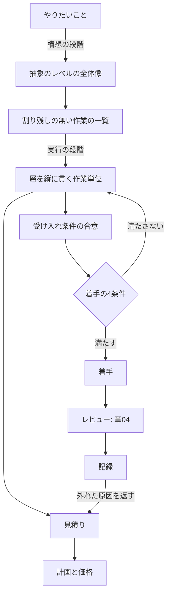

# 07 仕事の進め方

「この作業、どれくらいで終わりますか」と聞かれて、根拠のない数字を答えたことがあるはずである。着手してから仕様が決まっていないことに気づき、手が止まったこともあるはずである。**この章は、着手してよいと言える条件と、あとで読まれる記録の形を決めるためのものである。**

## この章で判断できること

| 項目 | 内容 |
|---|---|
| 想定読者 | 作業を割り、見積りを出し、着手前の合意を取り、記録を残す開発者 |
| 答える問い | どこまで決まれば着手してよいか。何を残せば、あとで読まれる記録になるか |
| 読んだあとにできること | 見積りを聞かれたときに、根拠と幅を添えて答えられる。着手前に、まだ決まっていないことを名指しで挙げられる |
| 例示に使う言語 | 使わない。例は課題票やコミットの説明であり、`text` のブロックと表で示す |

## 結論

**見積りは約束ではない。** 見積りの目的は正確さだけであり、計画と価格はそれぞれ別の工程が扱う。同じ数字を3つの目的に使い回すと、正確さが目的でなくなる。テストの側からも「見積りでは妥協せず、判断で妥協する」という同じ結論が出ている。

**着手してよいと言える条件は4つある。** 上限内で終わる大きさに割れていること、受け入れ条件が文字で残っていること、不確実な部分が調査として切り出されていること、依存を切る手立てが決まっていることである。1つ欠けるなら、欠けたまま着手すると決めるか、先に埋めるかを選ぶ。

**記録の良し悪しは長さで決まらない。** 読む人と使う場面が決まっているかで決まる。決めないまま項目を増やすと、書く手間だけが増える。

**根拠**: `SRC-EXT-067`（7つの指針）、`SRC-TEST-001` p.422（32.9）、p.479（38.2）、`SRC-REVIEW-001` p.213-217（6章）、`SRC-EXT-026`

## 章04 との境目

**この章は、レビューの場の中を作り直さない。** それは章「[04 コードレビュー](04-review.md)」が観点IDつきで持っている。

境目は「レビューという場の内か外か」に置く。**この章が扱うのは、レビューに入る前と、レビューを出たあとである。**

| 主題 | 持つ章 | 例 |
|---|---|---|
| 作業単位の大きさ | この章（`WF-` 番、35件） | 1つの作業をどこで切るか |
| 提出する変更1件の大きさ | 章04（`RV-23`） | 行数の目安を兆候として使う |
| 着手前の受け入れ条件 | この章 | 何が決まれば着手してよいか |
| 承認の条件 | 章04（`RV-08`、`RV-10`） | 未解決の必須指摘が残っていないか |
| 指摘の書き方と強さ | 章04（`RV-14` から `RV-22`） | 観察・理由・期待する状態を書く |
| 指摘のうち扱わないものの行き先 | この章 | 別の課題へ切り出し、放置しない |
| コミットの説明の書き方 | この章 | 問題を先に書き、理由を渡す |
| 変更の意図がコミットから読めるか | 章04（`RV-01`） | レビュー担当者が判定できるか |
| 設計判断の記録 | この章と章03（`AR-16`） | 章03 は層をまたぐ判断、この章は記録の形式 |
| 要求の掘り下げ | 章06（`PF-01` から `PF-07`） | 解くべき問題を取り出すところ |

**時間軸だけでは分けられない。** 『コードレビューの教科書』が言うとおり、ゴールを実装完了ではなくマージに置くと、レビューはこの章が扱う流れの一部になる。分けるのは時間ではなく場である。

**根拠**: `SRC-REVIEW-001` p.212（6章）

## 中心の問い

**この章が答えるのは2つである。どこまで決まれば着手してよいと言えるか。何を残せば、あとで読まれる記録になるか。**



**見積りから計画と価格へ出る枝が分かれている点が要である。** Jørgensen の見積りの指針が言うとおり、同じ数字を3つの目的に使い回すと、正確さが目的でなくなる。

**根拠**: `SRC-EXT-067`（7つの指針）

## 仕事の分割

**分割は2つの段階に分かれる。** 構想の段階と実行の段階では、起点が違う。この節は、全体像の作り方から、1つの作業の大きさと依存の切り方までを9つの観点で扱う。

### WF-01 構想の段階で、抽象のレベルの全体像を先に作っているか

全体の方針が1つの言葉になっていて、そこから割られているかを見る。

『システム開発と「具体と抽象」』は、統一感の欠如が「異なる企業や担当者が独立に作業すること」から生じるとする。同書が挙げる対策は「1人の設計者が一期に全体像を作る」ことである。

**同書は、人手が足りないという反論にも答える。** 具体のレベルでは領域の専門家の数だけ人が要るが、抽象度を上げれば1人で全体を見られる、という答えである。

手順も同書にある。一言の方針を3つの基本方針に落とし、それぞれをさらに3つに割っていく形である。

各部門の代表が集まって全体構想を作る形を、同書は「始まる前から統一感の無いものができることが約束されている」とする。**同書の見解であり、測定の裏づけは示されていない。**

**根拠**: `SRC-THINK-001` p.183、p.185、p.190（4章）

### WF-02 割り残しを作っていないか

一覧に載っていない作業が、実際には行われる予定になっていないかを見る。

NASA の作業分解構造の手引き（WBS Handbook Rev.1）は、作業分解構造を成果物を軸にした木と定義する。**その木に含まれない作業範囲は、その企画の範囲と見なさない。**

同手引きの用語集は、末端の単位が満たすべき条件を7つ挙げる。

- 作業が行われる水準の単位である
- 他と明確に区別できる
- 単一の組織単位に割り当てられる
- 開始と完了の日付を持つ
- 予算または値を持つ
- 期間が比較的短い
- 詳細な日程と統合されている

会議、調整、環境の準備のように成果物が残らない作業も、一覧から外さない。同手引きは、企画の木が成果物を中心にしつつ、成果物にならない共通の作業も含めるとする。**共通の枝として置く。**

**根拠**: `SRC-EXT-072` 2章、3章、用語集

### WF-03 実行の段階で、層を横ではなく縦に切っているか

1つの作業だけで、利用者に届く形が動くかを見る。

Bill Wake の「INVEST in Good Stories, and SMART Tasks」は、価値のある分割を、層を貫く薄切りとする。『マイクロサービスアーキテクチャ 第2版』は、専任の画面側チームを置くことを「間違いだ」とする。**組織に引き継ぎ点が生まれ、速度が落ちるためである。** これは著者の見解として書かれている。

縦に切れない基盤の作業もある。Google の「Small CLs」は、層のあいだに共通の抽象を先に作る横の割り方も手立てとして挙げる。**縦が原則であり、横は手段として使う。**

**根拠**: `SRC-EXT-070`、`SRC-ARCH-002` p.524（14.3）、`SRC-EXT-032`

### WF-04 1つの作業を、決めた上限で終わる大きさに割っているか

チームが決めた上限を超える作業が残っていないかを見る。

『コードレビューの教科書』は、見積りが1週間、2週間と大きくなるほど、着手前に把握できていない作業が残りやすくなるとする。同書はチームで上限を決めることを勧め、例として「最大で8時間（1人日）以内」を挙げる。

**数値は4件あり、桁が違う。尺度が違うためである。**

| 尺度 | 目安 | 資料 |
|---|---|---|
| 1つの作業の工数 | 8時間（1人日）以内 | 『コードレビューの教科書』p.216 |
| 完成と検証が終わるまでの日数 | 1週間を超えるものは大きすぎる | DORA「Work in small batches」 |
| 1つの作業単位の大きさ | 多くて数人週。チームによっては数人日 | Bill Wake「INVEST in Good Stories」 |
| 変更1件の行数 | 100行はおおむね妥当。1000行は大きすぎる | Google「Small CLs」 |

**4件のいずれにも測定の裏づけは示されていない。** どれも経験則である。行数の目安は章04 の `RV-23` が扱う。この章は作業の大きさだけを扱う。

**悪い例**

```text
[作業] 会員機能の実装
  担当: 未定
  見積り: 3週間
  内容: 会員まわりを一通り作る
```

**良い例**

```text
[作業 A] 会員登録の入力検証を追加する
  担当: 1名
  見積り: 6時間（チームの上限は8時間）
  完了の判定: 検証の規則5件が仕様どおりに動き、異常系のテストが通る
  依存: 無し（画面側は既存のモックで進められる）

[作業 B] 会員登録の完了メールを送る
  担当: 1名
  見積り: 8時間
  完了の判定: 送信の記録が残り、送信の失敗時に再試行される
  依存: 作業 A の入力検証（インターフェース定義のみ先に合意ずみ）

[作業 C] メール本文の文言を確定する（調査）
  担当: 1名
  時間の上限: 4時間
  成果物: 文言の案2件と、法務の確認が要るかどうかの判断
```

**なぜ悪いのか**: 「会員まわりを一通り」には終わりが無い。担当が決まっていないため、NASA の手引きが末端の単位に求める「単一の組織単位に割り当てられること」を満たさない。3週間という見積りは、『コードレビューの教科書』が挙げる「着手前に把握できていない作業が残る」大きさである。**さらに、この形では進捗を「何割終わった」としか言えない。**

**なぜ良いのか**: 3つとも完了の判定が書いてあり、終わったかどうかを本人以外が言える。依存が明示され、作業 B は作業 A の完了を待たずに始められる（`WF-06`）。文言の確定は不確実であるため、時間の上限つきの調査として切り出してある（`WF-07`）。**上限が数字で書いてあるため、超えたときに割り直す判断ができる。**

**根拠**: `SRC-REVIEW-001` p.215-216（6章）、`SRC-EXT-069`、`SRC-EXT-070`、`SRC-EXT-071`、`SRC-EXT-032`、`SRC-EXT-072` 用語集

### WF-05 受け入れ条件の数を、分割の判断材料に使っているか

1つの作業に、受け入れ条件がいくつ付いているかを見る。

『コードレビューの教科書』は、**受け入れ条件が多い作業には複数の目的や変更が含まれており、まだ粒度が大きい状態だとする。** 条件が増えるほど、確認すべき仕様の考慮漏れが起きやすくなる。

条件の粒度が細かいために数が多いこともある。**数そのものではなく、条件が指す目的が1つかどうかを見る。** 目的が1つなら割らなくてよい。

**根拠**: `SRC-REVIEW-001` p.216（6章）

### WF-06 依存を切り離せる形に割っているか

他の作業の完了を待たずに着手できるかを見る。

『コードレビューの教科書』は、依存を切ると影響範囲を把握しやすくなり、複数の担当者が非同期に進められるとする。具体例として、**先に API のインターフェース定義とモックの応答を用意すれば、画面側は API の実装を待たずに進められる**ことを挙げる。

インターフェース定義そのものが定まらないこともある。その場合は `WF-07` の調査として切り出す。

**根拠**: `SRC-REVIEW-001` p.217（6章）、`SRC-EXT-072` 用語集

### WF-07 不確実な部分を、調査として切り出しているか

実装の作業に、やってみないと分からない部分が混ざっていないかを見る。

『コードレビューの教科書』は、不確実性の高い要素を含んだまま着手すると、見積りが難しくなり、後から大きな手戻りが出るとする。例として、初めて導入する技術の検証、実現方法が明確でない機能、未確定要素を含む仕様を挙げる。

不確実な部分が小さいこともある。**切り出す判断は、時間の上限を置けるかどうかで決める。** 上限を置けるなら調査として切り出せる。

**根拠**: `SRC-REVIEW-001` p.217（6章）

### WF-08 小さくしすぎていないか

1つの作業だけを見て、何のための変更かが分かるかを見る。

Google の「Small CLs」は、**その変更の意味が読み取れないほど小さいものを「小さすぎる」とする。** 利用する場所の無い新しい仕組みだけを入れる分割が例に挙がる。『コードレビューの教科書』は、進捗の可視化について、粒度を細かくしすぎると情報量が増えすぎて全体像が分からなくなるとする。

**この2件は対象が違う。** 前者は変更1件の大きさ、後者は可視化の粒度である。**「同じ害を2件の資料が支持している」とは言えない。** 判断の記録は `research/orchestration/workflow/40-debate.md` の `D-2` にある。

段階的に積み重ねる分割は、この観点の例外になる。「Small CLs」は積み重ねを大きな変更を割る手立ての1つに挙げており、**途中の1件だけで意味が読めなくても、系列として意味が読めればよい。**

**根拠**: `SRC-EXT-032`、`SRC-REVIEW-001` p.218（6章）

### WF-09 並列にできない作業に、人を足していないか

足そうとしている人が、独立して進められる作業を持てるかを見る。

『マイクロサービスアーキテクチャ 第2版』は、**独立して行えるサブタスクに割れない作業には人を投入できず、投入するとかえって遅くなるとする。** 同書は大規模で働くときの最大の費用を「調整の必要性」に置き、作業につながりがあるほど人を増やす効果が小さくなるとする。同書はブルックスの法則も引く。

『システム開発と「具体と抽象」』は「トラブったらとにかく追加人員の工数を投入する」考え方を問題として挙げる。**同書は、単なる人手不足で問題が起きることはむしろ少ないとする。**

期限が迫っているときも、先に見るのは割れるかどうかである。『マイクロサービスアーキテクチャ 第2版』は、新たな人の追加に費用がかかり、生産性を発揮するまでに時間が要ることを挙げる。

**根拠**: `SRC-ARCH-002` p.564-565（15.5）、`SRC-THINK-001` p.185（4章）

## 見積り

**見積りは約束ではない。** この節の観点は、その1点から出ている。数字の作り方、渡し方、外れたあとの扱いまでを11の観点で扱う。

### WF-10 見積りと計画と価格を、別の工程として扱っているか

同じ数字を、見積り・計画・価格の3つに使い回していないかを見る。

Jørgensen の見積りの指針は、3つを混ぜないことを7つの指針の第1に置く。**目的が違うためである。** 見積りの目的は正確さだけである。計画は作業効率と超過の危険を見て、価格は受注と利益を見る。

この指針は、IEEE Software 22(3) に載った論文である。題は「Practical Guidelines for Expert-Judgment-Based Software Effort Estimation」である。同論文は3つの語を分ける。

| 語 | 意味 |
|---|---|
| pX 見積り | 超えない確率が X パーセントである工数。目的は正確さだけである |
| 計画工数 | 計画に使う工数。危険をどう見るかで p30 にも p80 にもなる |
| 受注できる工数 | 市場や発注側が受け入れる工数。関心は価格と利益である |

『ソフトウェアテスト徹底指南書』は、別の系統から同じ結論に達する。**「見積りでは妥協せず、マネジメント判断で妥協する」である。** 足りない状態では「必要と検討した分を用意できない。しかし判断として許容する」という共通認識を作るとする。

発注側が1つの数字だけを求めることがある。**数字を1つにするのは計画の段階であり、見積りの段階ではない。** Jørgensen の指針は、計画工数を p50 にするか p80 にするかを、危険をどう見るかで選ぶとする。

**根拠**: `SRC-EXT-067`（7つの指針、用語の節）、`SRC-TEST-001` p.422（32.9）

### WF-11 見積る人に、価格や予算の情報を渡していないか

見積る人が、期待される価格や残りの予算を知っているかを見る。

Jørgensen の指針は、**発注側の価格の期待が、見積る人が「影響されていない」と思っていても見積りを動かすとする。** 非現実的だと知っていても影響は消えない。避ける手立ては2つで、価格の情報を渡さないことと、計画と価格を別の工程として扱うことである。

『ソフトウェアテスト徹底指南書』は、**使える予算から開発の見積りを引いた余りを、そのままテストの見積りにする形を「最も悪いパターン」**として挙げる。

少人数のチームでは、見積る人と価格を知る人が同じになる。**分けられないなら、見積りを先に出し、そのあとで価格を見る順序にする。** 順序を変えられない理由は資料に無い。

**根拠**: `SRC-EXT-067`（7つの指針）、`SRC-TEST-001` p.422（32.9）

### WF-12 見積りの根拠を、受け取る前に求めているか

数字だけの見積りを受け取っていないかを見る。

Jørgensen の指針は、勘に基づく見積りを受け取らず、常に根拠を求めて査読できるようにするという2つの規則を挙げる。同論文が引く研究では、**組織の見積り精度と相関した唯一の要因は、見積る人が説明責任を負っていることだった。**

**悪い例**

```text
> この機能はどれくらいかかりますか。
> 5250時間だと思います。経験のある我々が合意しました。
> 予算が4000時間なので、その範囲で。
> 分かりました。4000時間にします。
```

**良い例**

```text
> この機能はどれくらいかかりますか。
> p50 で5250時間です。根拠は3つあります。
>   1. 昨年の受付機能（実績4800時間）と画面数がほぼ同じである
>   2. 作業を12件に割り、うち9件は同種の作業の実績がある
>   3. 残る3件は実績が無く、調査として切り出してある
> 過去12件の誤差の分布では、8割が50パーセント以内に収まっています。
> p80 を計画に使うなら7900時間です。
> 予算は4000時間です。
> 見積りは変えません。範囲を減らすか、期限を延ばすかの判断をお願いします。
```

**なぜ悪いのか**: 「経験のある我々が合意した」と「発注側がそれ以上を認めない」は、Jørgensen の指針が受け入れてはならない根拠として名指しで挙げているものである。**根拠が無いため、査読ができず、外れたときに何を直せばよいかも分からない。** さらに、予算に合わせて数字を書き換えた時点で、それは見積りではなく価格になっている（`WF-10`）。

**なぜ良いのか**: 3つの根拠は、同じ指針が受け入れてよいとする形に当たる。類似案件の実績、作業への分解と各作業の実績、そして実績が無い部分の切り出しである。誤差の分布から p80 を導いており、幅が人の勘ではない（`WF-14`）。**最後の1文が、見積りと判断を分けている。**

**根拠**: `SRC-EXT-067`（7つの指針）、`SRC-TEST-001` p.422（32.9）

### WF-13 よく似た案件の経験を持つ人に見積らせているか

見積る人の経験が、対象とどれだけ近いかを見る。

Jørgensen の指針は、見積りの巧拙が技術の巧拙とは別だとする。**技術的に優れた見積り手は、かえって楽観的になることがある。** 同論文が挙げる測定では、ある会社でよく似た経験を持つ人の誤差が平均12パーセント、それ以外が平均39パーセントだった。

『ソフトウェアテスト徹底指南書』も、見積りを類似案件の過去実績か現行案件のデータに基づいて行うとする。**同書は、外部組織の参考値をそのまま使えないとする。**

組織の中に似た経験を持つ人が居ないこともある。Jørgensen の指針は、組織の外に求めることを挙げる。同書は、参考値が無い場合の不確実性がきわめて高くなるとし、段階的に精度を高める工夫を必須とする。

**根拠**: `SRC-EXT-067`（7つの指針）、`SRC-TEST-001` p.421（32.9）

### WF-14 幅を、人の勘ではなく実績から作っているか

最小と最大を、誰がどうやって置いたかを見る。

Jørgensen の指針は、人の不確実さの見立てが過信に寄ることを示す。**「90パーセント確実」と言うとき、実際の確率はおおむね60から70パーセントである。** 同論文は、最小と最大を人が置く三点見積りの形を、幅が狭くなりすぎる原因として挙げる。

代わりの手順は3段である。

1. 最も可能性の高い工数（p50）を出す。
2. 最小と最大を**機械的に導く**。例として最大を150パーセント、最小を90パーセントとする。
3. 実際がその区間に入る確率を見立てる。

**この手順を採った大手2社では、平均16パーセントの過信が、過信ゼロになった。**

過去の実績が無いこともある。同論文は誤差の分布を作る対象について、**似ている必要は無く、数が多いことのほうが大事だとする。** 組織の直近の案件をすべて使う形が挙がる。

**根拠**: `SRC-EXT-067`（7つの指針、pX 見積りの節）

### WF-15 悲観の型を、あらかじめ列挙しているか

起こりうる悪い展開を、見積りの中で挙げてあるかを見る。

『ソフトウェアテスト徹底指南書』は、三点見積りを**悲観の型をあらかじめ挙げて備えるために使う。** 同書が挙げる型は5つである。前提条件が満たされず開始が遅れる、変更や品質の低さで実行サイクルが増える、危険の大きい挑戦が失敗する、デバッグの遅れで完了が遅れる、生産性が想定より低い。

**`WF-14` と用途が違う。** `WF-14` は幅の広さの精度を扱い、`WF-15` は起こりうる事象の列挙を扱う。**同じ手法の別の面である。** 判断の記録は `research/orchestration/workflow/40-debate.md` の `D-3` にある。

悲観の型を挙げると数字が大きくなり、通らなくなることがある。**それは `WF-10` の問題であり、見積りの問題ではない。**

**根拠**: `SRC-TEST-001` p.422（32.9）

### WF-16 相対見積りを、工数の算出ではなく知識の差を出す場として使っているか

点数を出すことが目的になっていないかを見る。

IPA の『アジャイル型開発におけるプラクティス活用事例調査』は、プランニングポーカー（見積りを各自が同時に出して差を見る進め方）の効果を挙げる。**「見積り根拠を互いに述べ合うことで、開発対象や見積りに対する理解が深まる」である。** 同報告書はストーリーポイントを時間とは異なるものと定義し、他チームとの比較には使えないとする。

Jørgensen の指針は別の系統から、**異なる役割の人の意見を取り入れたところ見積りの誤差が54パーセントから35パーセントに下がった**測定を挙げる。

**強さを「任意」にしてある。** 相対見積り自体の効果を測った資料を、4系統の調査のいずれも見つけられなかったためである。同報告書は事例の調査であり、適用率（全体で64パーセント）を報告するが、効果の測定ではない。

点数を人日へ換算するよう求められることがある。同報告書は、点数がチームごとに基準の異なるものであり、他チームとの比較に使えないとする。**換算すると、相対で見積る前提が失われる。**

**根拠**: `SRC-EXT-084` 3.1.4、`SRC-EXT-067`（7つの指針）

### WF-17 見積りを、着手後の目標値として据え置いていないか

着手前に出した数字を、条件が変わったあとも使い続けていないかを見る。

IPA/SEC の『定量的見積りの勧め』は、**不確定要素の強い段階の見積りを着手後も目標値として据え置くことを「危険」**とする。不確定な部分が定まった時点で再見積りが要る。同書は、決まっていないことへの対処を2つ挙げ、**不確定要素があると合意したうえで監視し、決まった時点で再見積りする形を「現実的」**とする。

『Design It! プログラマーのためのアーキテクティング入門』も、日程が完璧である必要は無いとする。**同書は、日程が案件の進行につれて変更されるべきものだと書く。**

契約で数字が固定されていることがある。『現場で役立つシステム設計の原則』は、段階を分けた契約の形を挙げる。**前半は期間に対して支払う形で進め、見積りの基礎情報が把握できた時点から完成に対して支払う形へ切り替える。** 同書は、変更容易性を活かすなら後半も期間に対して支払う形にすべきだとする。これは同書の見解である。

**根拠**: `SRC-EXT-082` 3章、4.1、`SRC-ARCH-001` p.337、`SRC-DESIGN-001` p.283-284（9章）

### WF-18 外れた原因を、担当者の甘さで終わらせていないか

見積りと実績のずれを、分析しているかを見る。

IPA/SEC の『定量的見積りの勧め』は、見積りの精度を上げるには計画値と実績値の対比が必須だとする。**同書は、特に終了時に差異分析を行う必要があるとする。** ずれの原因を分析すると、進め方の失敗、レビュー体制の不備、テスト体制の不備が明らかになる。

同書は分析の結果を2つの向きへ返すとする。

| 返す先 | 問いの例 |
|---|---|
| 見積り手法 | 推奨している手法に欠陥は無いか。最近の開発に合わなくなっていないか |
| 進め方 | 見積りは妥当だが進め方で失敗したのか。条件が途中で変わったのか |

**進め方の側の原因の例が4つ挙がっている。** 見積りは妥当だが進め方で失敗した、当初の条件が進行に伴って変わった、要件の膨張を抑えられなかった、時間がなく見積りの条件の検討が不足した、である。**第1の例が示すとおり、外れたことは見積りの誤りを意味しない。**

**この観点は議論で加わった。** 司会は当初「再見積りの手順は資料に無い」と考えていたが、codex と Antigravity の両方が同じ箇所を指した。記録は `research/orchestration/workflow/40-debate.md` の `D-5` にある。

案件が終わる前に大きく外れることもある。同書は、不確定な部分が明確になった時点での再見積りを求めており、終了時の分析だけを求めてはいない。

**根拠**: `SRC-EXT-082` 4.1、4.6

### WF-19 低く見せる力が働いていないかを見ているか

数字が低いことに、誰かの利害が絡んでいないかを見る。

Flyvbjerg の予測の論文は、予測が外れる原因を2つに分ける。**楽観バイアス（自分をだます）と、戦略的な過小申告（意図的に低く申告する）である。** 治し方が違う。政治的・組織的な圧力が低い場では前者、高い場では後者の説明が効く。

この論文は Project Management Journal 37(3) に載っている。題は「From Nobel Prize to Project Management: Getting Risks Right」である。

同論文は、データとモデルの改善に数十年を費やしても精度が上がらなかったことを挙げる。誤差の分布が正規分布にならず、平均がゼロから離れていることも挙げる。**同論文は、問題が技術ではなく偏りにあるとする。**

『ソフトウェアテスト徹底指南書』は、日本の現場の形で同じ力を描く。**権力の勾配があると、危険を危険と言えなくなる。** 受注元のスケジュール必達の要求から、遅延の可能性を進言できない例が挙がる。同書は、大きな炎上の多くで早い時期から予兆が見えているとし、予防できない理由を心理的安全性の欠如に置く。

『システム開発と「具体と抽象」』は、投資対効果の「効果」の側が**「着地点ありき」でいくらでも作れてしまう**とする。

**3件は独立している。** 査読つき雑誌の記事、日本の書籍2冊であり、対象も分野も違う。

自分が低く見せているかどうかは、自分では分からない。同論文は、**錯覚を自覚するだけでは見え方は正しくならないとする。** 自覚が役に立つのは、自分の印象を疑うべき場面を見分けられるようになる点である。

**根拠**: `SRC-EXT-068`、`SRC-TEST-001` p.448（34.4）、`SRC-THINK-001` p.157（4章）

### WF-20 外側の視点を取っているか

この案件の中身だけを見て見積っていないかを見る。

Flyvbjerg の予測の論文は、計画の誤りが「内側の視点」から来るとする。**当該の作業の中身に目を向け、似た作業がどう終わったかを見ない態度である。** 治し方は参照クラス予測（似た案件の集合の分布に、この案件を置く手順）であり、3段からなる。

1. 似た過去の案件の集合を選ぶ。**統計的に意味を持つ広さと、比べられる狭さの両方が要る。**
2. その集合の分布を作る。
3. 当該の案件を、その分布の中に置く。

同論文は、この操作を「最良の推測を集合の平均へ引き戻し、区間を集合の区間へ広げること」と説明する。**個々の不確実な出来事を当てにいくのではない。**

交通基盤の建設では、費用の予測の誤差が鉄道で平均44.7パーセント、道路で20.4パーセントである。**70年分のデータで、精度は改善していない。** 同論文は、比較研究で交通の案件が他の種類より悪いわけではないとし、IT システムを同じ種類に挙げる。

似た案件が組織の中に無いこともある。`WF-13` と同じ問題であり、外に求めるか、段階的に精度を高める。

**根拠**: `SRC-EXT-068`

## 着手前の合意

**合意の形は、文字で残っているかで判定する。** この節の観点は、そこへ収束する。ゴールの置き方から、たたき台の出し方までを6つの観点で扱う。

### WF-21 ゴールを実装完了ではなく、届く状態に置いているか

チームが「終わった」と言う地点がどこかを見る。

『コードレビューの教科書』は、ゴールを実装完了に置くと、レビュー待ち・修正・マージが見えなくなるとする。**どこで滞っているかも分からなくなる。** ゴールをマージに置くと、設計・実装・レビューを経て変更を届けるまでの流れをチームの活動として見られる。

The Scrum Guide（2020年11月版）は、完了の定義を満たさない作業がリリースも提示もできず、バックログへ戻るとする。同書は「増分は、完了の定義を満たした瞬間に生まれる」と書く。

リリースの頻度が低く、マージから公開まで長いこともある。『コードレビューの教科書』は、ゴールを1点に決めることを求めており、どこに置くかは決めていない。**決めることが目的である。**

**根拠**: `SRC-REVIEW-001` p.212（6章）、`SRC-EXT-069`

### WF-22 着手の4条件を満たしているか

着手してよいと言える根拠が、4つそろっているかを見る。

The Scrum Guide の本文に「Definition of Ready」という語は無い。**明文の基準は「1スプリントで完了できる大きさに割れていること」だけである。** そこでこの手引きは、4系統の調査で根拠のあったものを4条件として並べる。

| 条件 | 資料 |
|---|---|
| 決めた上限で終わる大きさに割れている | The Scrum Guide、『コードレビューの教科書』p.216 |
| 受け入れ条件が文字で残り、合意されている | 『コードレビューの教科書』p.213-214 |
| 不確実な部分が調査として切り出されている | 『コードレビューの教科書』p.217 |
| 依存が切れているか、切る手立てが決まっている | 『コードレビューの教科書』p.217 |

**「Definition of Ready」の語を使わない。** Scrum Guide に無い語を Scrum の規則として書くと、読者が原典をたどれなくなるためである。判断の記録は `research/orchestration/workflow/40-debate.md` の `D-6` にある。

4条件のうち1つを満たせないこともある。**満たせない条件を明示して着手するのと、満たしたふりをして着手するのは別である。** 前者は `WF-25` の合意の対象になる。

**根拠**: `SRC-EXT-069`、`SRC-REVIEW-001` p.213-217（6章）

### WF-23 受け入れ条件を、着手前に文字で残しているか

その作業が終わったと言える条件が、着手前に書かれているかを見る。

『コードレビューの教科書』は、受け入れ条件をそのタスク固有の完了条件を具体的に示すものとし、チーム共通の完了の定義と区別する。**同書は、開発の課題票に記載欄を用意しておくと運用しやすく、属人化を防げるとする。**

『ソフトウェアテスト徹底指南書』は、受け入れ基準に書ける内容を挙げる。範囲、テストの要求、関係者の協議結果、異常系や外乱の仕様、非機能の要求である。同書は、プロダクトオーナー・開発者・テストエンジニアの3役で読み合わせることを勧める。

**悪い例**

```text
件名: ユーザー登録
内容: ユーザー登録できるようにする。
      仕様は前回の打ち合わせのとおり。
      よろしくお願いします。
```

**良い例**

```text
件名: 会員登録の画面から会員を登録できるようにする

背景: 現在は運用担当が管理画面から手作業で登録している。
      1日あたり平均40件、1件あたり3分かかっている。

範囲に含む: 登録の画面、入力検証、登録の完了メール
範囲に含まない: 会員情報の変更と退会（別の課題 #1204、#1205）

受け入れ条件:
  □ 必須項目を入力し、会員情報を登録できる
  □ 各入力項目に、仕様書 3.2 に定義された検証が設定されている
  □ 登録の成功時に、登録の画面が自動的に閉じる
  □ 検証のエラーが、仕様書 3.3 の文言で表示される
  □ API の正常系・異常系を含むテストコードが実装されている

未確定: 完了メールの文言（課題 #1210 で確定させる。期限は着手の2日前）
確認する相手: 受け入れ担当（仕様）、レビュー担当（設計方針）
```

**なぜ悪いのか**: 「前回の打ち合わせのとおり」は、その場に居た人にしか読めない。RFC 2418 が求める「文字の場での確認」を経ていない。**終わったかどうかを本人以外が判定できず、`WF-21` の完了の定義とも結び付かない。** さらに、範囲に含まないものが書かれていないため、着手後に膨らむ。

**なぜ良いのか**: 受け入れ条件は『コードレビューの教科書』が示す形であり、確認すべき条件がチーム全体で共有される。範囲に含まないものを書いてあるため、膨らんだときに気づける。未確定の部分に期限と行き先が付いており、`WF-07` の切り出しになっている。**確認する相手が2種類に分かれている点も重要である。** 仕様と設計方針では、合意する相手が違う。

**根拠**: `SRC-REVIEW-001` p.213-214（6章）、`SRC-TEST-001` p.296-297、`SRC-EXT-079` §3.3

### WF-24 合意を、扱われていない論点の有無で判定しているか

合意したと言うとき、何をもってそう言っているかを見る。

RFC 7282「On Consensus and Humming in the IETF」（2014年6月）は、合意を「全員が満足して最良と認めること」とはしない。**「もはや個別の異議を持たない程度に納得していること」**とする。同文書は、粗い合意が成るのは「すべての論点が扱われたとき」であり、「受け入れられたとき」ではないとする。**異議は必ず検討するが、必ずしも採用しない。**

同文書は、決めるのが人数ではなく、扱われていない論点が残っているかどうかだとする。**割合を数えて合意を判定してはならない。**

**この観点の根拠は1件だけである。** RFC 7282 は IETF という具体的な場の作法を定めた文書であり、一般の開発現場へそのまま持ち込める保証は無い。

異議を出した人が納得しないこともある。同文書の立場では、異議が検討されていれば先へ進んでよい。**「検討した」と言えるのは、なぜ採用しないかを説明できるときである。**

**根拠**: `SRC-EXT-078` §2、§3、§6

### WF-25 口頭で決めたことを、文字の場で確認しているか

会議で決まったことが、文字で残り、その場に居なかった人が読めるかを見る。

RFC 2418（BCP 25、1998年）は、対面の会議で決めたことの一部を、文字の場で改めて確認しなければならないとする。**対象は、事前に文字で議論されていないものと、それまでの合意と大きく異なるものである。** 理由は参加できる人の幅である。その場に出られる人は、文字で読める人より少ない。

同文書は、文字の場で決まったことも次の会合の記録に残すとする。**最終成果物に決定の経緯を短くまとめることも、良い作法として挙げる。**

IPA の「機能要件の合意形成ガイド」は、合意形成を4つの作業に分ける。**「言い切る／聞き切る」「図表に書く」「もれ／矛盾をチェックする」「一緒にレビューする」である。** 第2の作業が、口頭の内容を図表という文字の形へ移す段に当たる。

『コードレビューの教科書』は、受け入れ条件を課題票の記載欄に置くことを勧める。

**3件は独立している。** 標準化団体の文書、公的機関の指針、日本の書籍である。

記録を書く手間が惜しくなることがある。同書は、**「別チケットで対応する」「次で直す」がそのまま放置される危険を挙げる。** 文字にしなければ、決めたこと自体が消える。

**根拠**: `SRC-EXT-079` §3.3、`SRC-EXT-083`、`SRC-REVIEW-001` p.137、p.214（3.3、6章）

### WF-26 たたき台を、合理的な値か法外な値のどちらかにしているか

最初に出す案が、中途半端な値になっていないかを見る。

『Design It! プログラマーのためのアーキテクティング入門』は、たたき台に錨の効果（先に出た数字が、後の判断を引き寄せる働き）があるとする。**たたき台は合理的な見積りか、完全に拒絶されるほど法外なものにする。** 法外なものが受け入れられた場合は注意が要る。

Jørgensen の指針も、早い時期の楽観的な見積りが後の見積りの錨になるとする。**情報が増えても現実的になれなくなる。**

『システム開発と「具体と抽象」』は、別の角度から同じ場面を描く。**抽象的な状態では人は判断できず、具体的な選択肢を目の前に置かれた瞬間に初めて批評を始める。** 同書はこれを性格でも説明力でもなく「人間の思考の仕様」とする。

たたき台を出すと、それで決まってしまうことがある。**それは錨が効いている状態そのものである。** Jørgensen の指針は、見積る人に価格の情報を渡さないことを対処に挙げる（`WF-11`）。

**根拠**: `SRC-ARCH-001` p.284、`SRC-EXT-067`（7つの指針）、`SRC-THINK-001` p.219（4章）

## 記録

**記録の良し悪しは長さで決まらない。** 読む人と使う場面が決まっているかで決まる。この節は、決定記録、コミットの説明、変更履歴、進捗の可視化までを9つの観点で扱う。

### WF-27 記録を書く前に、読む人と使う場面を決めているか

その記録を、誰がいつ読むかを言えるかを見る。

『ソフトウェアテスト徹底指南書』は、記録の項目を足すときの順序を決めている。**先に目的と分析の使い道を整理し、それから必要な項目を検討する。**

Michael Nygard の「Documenting Architecture Decisions」は、書き方を「未来の開発者との会話」とする。同文書は、経緯を知らない者が**過去の決定を無条件に受け入れるか、無条件に覆すかのどちらかになる**とし、どちらも良くないとする。

『Design It! プログラマーのためのアーキテクティング入門』は、記録が無い状態を「人はすべてを把握できていると容易に信じ込んでしまう」と書く。

読む人が「将来の誰か」としか言えないこともある。同書は、主な読み手を「私たちの後に来る次のチーム」と具体化する。**次に来る人が何を判断するかを言えるなら、それが使う場面である。**

**根拠**: `SRC-TEST-001` p.479（38.2）、`SRC-EXT-026`、`SRC-ARCH-001` p.190、p.197

### WF-28 記録を4つの要因で点検しているか

記録が読まれない原因が、どれに当たるかを見る。

4系統の調査で、読まれない原因は4つに整理できた。**どれも単独の資料に基づく。**

| 要因 | 内容 | 資料 |
|---|---|---|
| 長さ | 大きな文書は読まれず、更新もされない | 「Documenting Architecture Decisions」 |
| 内容の重複 | 差分を読めば分かることを、言葉で書き直している | Git「SubmittingPatches」 |
| 鮮度 | 覆された決定が、覆されたと分からない形で残っている | 「Documenting Architecture Decisions」 |
| 書く側の負担 | 項目が多すぎて、報告・修正・分析の手間が増える | 『ソフトウェアテスト徹底指南書』p.479 |

Git の「SubmittingPatches」は、**記録の目的を「なぜ」を未来の開発者へ渡すことに置く。** 「どう動くか」はコードとコメントで足りるが、「なぜそうしたか」は残さなければ失われる。

4つのどれにも当たらないのに読まれないこともある。そのときは **`WF-27` へ戻る。** 読む人と使う場面が決まっていないことが多い。

**根拠**: `SRC-EXT-026`、`SRC-EXT-076`、`SRC-TEST-001` p.479（38.2）

### WF-29 決定記録を1決定1文書とし、1ページから2ページに収めているか

1つのファイルに、判断がいくつ入っているかを見る。

「Documenting Architecture Decisions」は、記録の単位を「1つの力の集合と、それに応える1つの決定」とする。**1決定1文書、1ページか2ページである。**

『Design It! プログラマーのためのアーキテクティング入門』も、同じ形を挙げる。1ファイルにつき1つの判断だけを含め、1ページから2ページに収め、平易な言葉を使う。**同書は形式が Nygard の提案によるものだと明記している。**

同書は、記録すべき「アーキテクチャ上の判断」かどうかの手がかりを5つ挙げる。

| 手がかり |
|---|
| 他のコンポーネントやチームに直接影響する |
| 品質特性への影響が、良くも悪くも変わる |
| ビジネス上または技術上の制約によってなされた |
| 枠組みや技術の選択のように、広範囲に重大な影響を持つ |
| チームの開発方法や届け方を根本的に変える |

**悪い例**

```text
# 検討結果まとめ（第3回設計会議）

出席者: 5名
決定事項:
  - キャッシュには Redis を使う
  - ログは JSON 形式にする
  - バッチは毎晩2時に実行する
  - 認証は既存の仕組みを流用する
次回までの宿題:
  - Redis の構成を調べる（担当: 未定）
```

**良い例**

```text
# ADR-007 セッションの保存先に Redis を使う

## ステータス
承認済み（2026-09-09）

## コンテキスト
現在、セッションはアプリケーションのメモリに保持している。
そのため、配信の際に全利用者が再度サインインする必要がある。
平日の昼に配信すると、1回あたり約2000件の再サインインが起きる。
検討した選択肢は3つである。

| 選択肢 | 再サインイン | 運用の追加 | 応答時間の増加 |
|---|---|---|---|
| メモリ（現状） | 配信ごとに発生 | 無し | 0ミリ秒 |
| RDB のテーブル | 無し | 既存の範囲 | 約15ミリ秒 |
| Redis | 無し | 常駐が1つ増える | 約2ミリ秒 |

## 決定
私たちはセッションの保存先に Redis を使う。

## 影響
### 良い面
* 配信のたびに起きていた再サインインが無くなる。
* 応答時間の増加が、RDB の案の約7分の1に収まる。

### 悪い面
* 常駐する仕組みが1つ増え、監視と復旧の対象になる。
* Redis が落ちると、全利用者がサインインし直すことになる。

### どちらでもない面
* セッションの保持期間を、設定で変えられるようになる。
```

**なぜ悪いのか**: 4つの決定が1つのファイルに入っており、「Documenting Architecture Decisions」の「1決定1文書」に反する。**どれか1つが覆されたとき、ファイル全体をどう扱うかが決まらない。** さらに、なぜその選択にしたかが書かれていないため、同文書が言う「無条件に受け入れるか、無条件に覆すか」の状態を作る。担当が決まっていない宿題も残っている。

**なぜ良いのか**: 判断が1つであり、番号が付いている（`WF-31`）。コンテキストが事実の記述になっており、『Design It!』が求める「価値中立」に当たる。**捨てた選択肢とその理由が表で残っている**ため、条件が変わったときに見直す判断ができる。影響に良い面と悪い面の両方が書いてある（`WF-30`）。

**根拠**: `SRC-EXT-026`、`SRC-ARCH-001` p.326-328

### WF-30 帰結に、良い面と悪い面の両方を書いているか

記録に、その判断の不利な面が書いてあるかを見る。

「Documenting Architecture Decisions」は、**帰結にすべての帰結を挙げ、良いものだけを書かないとする。**

『Design It! プログラマーのためのアーキテクティング入門』も、判断が状況をどう変えるかについて、プラス面とマイナス面の両方を含めるとする。**同書は、影響が現れて把握できたときに、この節を更新するとする。**

悪い面が思い付かないこともある。同書の「影響が現れたら更新する」に従い、後から書き足す余地を残す。**帰結の節だけは、決定そのものと違って更新してよい**（`WF-31`）。

**根拠**: `SRC-EXT-026`、`SRC-ARCH-001` p.327

### WF-31 決定を覆したとき、記録を書き換えずに置き換えているか

覆された決定が、覆されたと分かる形で残っているかを見る。

「Documenting Architecture Decisions」は、**番号を連番で振り、再利用せず、覆した決定も消さずに「置き換えられた」と印を付けて残すとする。** 理由は「それが決定だったが、もう決定ではない」ことを残すためである。

『Design It! プログラマーのためのアーキテクティング入門』も、番号を順に振り、古い記録を保存するとする。**置き換えられたときは、古い記録への参照を追加する。** この2件は独立している。

#### このリポジトリ自身が従っていない

**このリポジトリの決定記録は、この観点に従っていない。** [ADR-002 Zensical で公開する](adr/ADR-002-publish-with-zensical.md) は、判断が変わったときに同じ記録を更新すると書いてある。**置き換えて残す方式とは食い違う。**

この食い違いは、章「07 仕事の進め方」を書く作業の中では直していない。決定記録をどちらの方式にするかは、章の執筆とは別の判断だからである。判断の記録は `research/orchestration/workflow/40-debate.md` の `D-11` にある。

**根拠**: `SRC-EXT-026`、`SRC-ARCH-001` p.328

### WF-32 記録の項目を、目的を決めてから足しているか

項目を足す提案に、その項目を何に使うかが書いてあるかを見る。

『ソフトウェアテスト徹底指南書』は、記録の項目について両方向のことを言う。1つは**「専用の項目を作ると、それを埋めるように促す流れができる」**である。もう1つは**「項目が多すぎると、記録の活動そのものの効率が落ちる」**である。この2つを結ぶのが「先に目的と分析の使い道を整理し、それから必要な項目を検討する」である。

同書は、分析のための項目が数の爆発を招きやすいとする。**「バグ原因」「根本原因」「バグ混入原因」のように、微妙に重なる項目が、いろいろな関係者の要求で足されていく。**

さらに、項目は後から変えるのが難しい。途中で足すと、それ以前の記録にその情報が無く、統計的な分析に制限が出る。

同書が挙げる課題の記録の定番の項目は次のとおりである。

| 項目 |
|---|
| 一意の識別子 |
| 状態（未着手、対応中、確認待ち、完了など） |
| 概要 |
| 各活動（発見、修正、完了）の日付 |
| 症状 |
| 対象と環境の特定情報 |
| 期待結果 |
| 原因 |
| 発見・修正・確認の担当 |
| 優先付けの指標 |
| やり取りのためのコメント |

**この観点の根拠は、同書の1件だけである。**

状態を増やしたいという要望が出ることがある。同書は、**不要な状態を原則として排除し、別の項目や項目の組み合わせで代替できないかを先に見るとする。** 協力会社ごとに「A社依頼中」のような状態を作らず、「依頼先」の項目と「依頼中」の状態の組み合わせで表す例が挙がる。

**根拠**: `SRC-TEST-001` p.478-479（38.2）

### WF-33 コミットの説明が、問題を先に書き、理由を渡しているか

説明を読んで、なぜその変更をしたかが分かるかを見る。

Git の「SubmittingPatches」は、題を50文字を目安とし、末尾に句点を打たず、命令形で書くことを求める。**本文はまず問題を書き、次に解決を正当化する。** 検討して捨てた案があれば、それも書く。問題は現在形で書く。

Google の「Writing good CL descriptions」は、悪い説明の例として「`Fix bug`」「`Fix build`」「`Add patch`」「`Moving code from A to B`」を挙げる。**どの不具合か、なぜその手段かが書かれていないためである。** 同文書は、説明が版管理の歴史に恒久的に残り、後で人がこの説明を手がかりに変更を探すとする。

『コードレビューの教科書』は、**「指摘点修正」のような抽象的なメッセージでは、どの指摘への修正か分からないとする。** 同書はコミットの説明を「単なる変更記録ではなく、レビュー担当者や将来のチームメンバーに変更の意図を共有する手段」と位置づける。

**悪い例**

```text
fix: 指摘点修正
```

```text
バグ修正

いろいろ直した。
あとリファクタも入れた。
```

**良い例**

```text
fix: 期限切れのパスワード再設定トークンを受け付けないようにする

再設定トークンの検証で、有効期限を見ていなかった。
そのため、発行から24時間を過ぎたトークンでもパスワードを変更できる。

検証を TokenValidator#verify に集約し、期限の判定を1か所にした。
既存の呼び出し元3か所は、この1か所を通るように変えてある。

期限を設定で変えられるようにする案も検討したが、採らなかった。
現時点で可変にする要求が無く、設定が1つ増える割に得るものが小さいためである。

課題: #1187
```

**なぜ悪いのか**: 「指摘点修正」は『コードレビューの教科書』が名指しで挙げる形であり、どの指摘への対応かが分からない。「いろいろ直した」は Google の文書が挙げる「`Fix bug`」と同じ問題を持つ。**さらに、修正とリファクタリングが1つのコミットに混ざっているため、片方だけを戻せない。**

**なぜ良いのか**: 題が命令形で、50文字の目安に収まっている。本文が問題から始まり、現在形で書かれている。**捨てた案とその理由が書いてある**ため、後で同じ検討を繰り返さずに済む。課題番号があるため、Google の文書が言う「後で人が手がかりに変更を探す」ことができる。

**根拠**: `SRC-EXT-076`、`SRC-EXT-077`、`SRC-REVIEW-001` p.120（3.3）

### WF-34 変更履歴を、コミットの写しにしていないか

変更履歴が、利用者にとっての差を書いているかを見る。

Keep a Changelog 1.1.0 は、変更履歴を**人のためのものであり、機械のためではないとする。** 同文書は、コミットの差分をそのまま変更履歴にすることを4つの悪い作法の第1に挙げる。**雑音が多く、統合のコミットや意味の取れない題が混ざるためである。** コミットは原文の変遷を記録し、変更履歴は利用者にとっての差を伝える。

残る3つの悪い作法は、非推奨化を書かないこと、日付の書式が紛らわしいこと、書いたり書かなかったりすることである。同文書は変更の種類を6つに分ける。追加、変更、非推奨化、削除、修正、セキュリティである。

Conventional Commits 1.0.0 は、規約の目的の第1に「変更履歴の自動生成」を挙げる。**この2つは矛盾しない。** 形をそろえたコミットは変更履歴の材料になるが、利用者にとっての差へ選び直す作業が要る。

Semantic Versioning 2.0.0 は、後方互換の修正をパッチとする。**後方互換の機能追加と非推奨化はマイナー、後方非互換の変更はメジャーである。**

**悪い例**

```text
## v2.1.0

- 3f2a9c1 Merge pull request #221 from feature/login
- a91b0de fix
- 77c4e02 wip
- 0d5e8a3 レビュー指摘反映
- b32f1a7 Merge branch 'main' into feature/login
```

**良い例**

```text
## 2.1.0（2026-09-09）

### 追加
- サインインで多要素認証を使えるようにした。既定は無効である。

### 変更
- パスワード再設定トークンの有効期限を24時間から1時間に短くした。
  1時間を超えたトークンは受け付けない。

### 非推奨化
- `POST /v1/login` を非推奨にした。2.4.0 で削除する。
  代わりに `POST /v2/session` を使う。移行の手順は移行ガイドにある。

### 修正
- 期限切れのパスワード再設定トークンが受理されていた問題を直した（#1187）。

### セキュリティ
- 依存する `example-auth` を 1.4.2 へ上げた（CVE-2026-XXXX への対応）。
```

**なぜ悪いのか**: Keep a Changelog が挙げる「コミットの差分をそのまま」の形そのものである。統合のコミットと「`wip`」が混ざっており、利用者が何をすればよいかが分からない。**非推奨化が書かれていないため、利用者が移行の準備をできない。** これも同文書が挙げる悪い作法である。

**なぜ良いのか**: 種類ごとにまとまっており、日付が `YYYY-MM-DD` の形である。非推奨化に、いつ消えるかと代わりが書いてある。**有効期限の短縮は利用者の行動を変える変更であるため「変更」に置いてある。** 版数の上げ方は Semantic Versioning の規則に従う。この例は後方互換の機能追加を含むため、マイナーを上げている。

**根拠**: `SRC-EXT-074`、`SRC-EXT-073`、`SRC-EXT-075`

### WF-35 進捗の可視化を、目的にしていないか

可視化の更新が、それ自体の目的になっていないかを見る。

『コードレビューの教科書』は、**可視化そのものが目的化すると、更新することがゴールになり形骸化するとする。** 同書は「完璧な可視化」を目指さないことを求める。すべてを正確に管理しようとすると、更新と管理の負担が増え、開発の速度を落とす。

Kanban Guide v2025.5 は、仕掛りの数を制限することを3つの実践の1つに数え、4つの指標を必須とする。仕掛りの数、処理量、サイクルタイム、**作業項目の滞留日数**である。

どこまで見えれば足りるかは、目的から決める。『コードレビューの教科書』は、可視化の目的を「問題が大きくなる前に気づける状態を作ること」に置く。**滞留日数は、この目的に直接つながる指標である。**

**根拠**: `SRC-REVIEW-001` p.218（6章）、`SRC-EXT-081`
## この章で扱わないこと

**範囲の外にあるものを挙げる。** 読者が別の場所を探せるようにするためである。

| 扱わないもの | 理由 | 代わりに読むもの |
|---|---|---|
| レビューの場での見方と承認の条件 | 章04 が観点IDつきで持つ | 章「[04 コードレビュー](04-review.md)」の `RV-01` から `RV-25` |
| 提出する変更1件の行数の目安 | 章04 の `RV-23` が持つ | 章「[04 コードレビュー](04-review.md)」 |
| 要求から解くべき問題を取り出す筋道 | 章06 が持つ | 章「[06 問題の見つけ方](06-problem-finding.md)」の `PF-01` から `PF-07` |
| テストの停止の条件 | 章05 が持つ | 章「[05 テスト](05-test.md)」の `TS-24` から `TS-26` |
| 契約の形式と法的な扱い | この手引きの範囲外である。`SRC-DESIGN-001` p.283-284 の記述は `WF-17` で触れるにとどめる | 契約の実務書 |
| 課題管理の道具の使い方 | 製品に依存し、寿命が短い | 各製品の公式文書 |
| 見積りの計算式 | 三点見積りの加重平均の式を、この章は採らない。理由は `WF-14` にある | `SRC-EXT-067` |
| 組織の作り方 | チームの分け方は章03 の `AR-15` が触れる。組織設計そのものは範囲外である | 章「[03 アーキテクチャ](03-architecture.md)」 |

**この章はプログラムのコードを例に使わない。** 調査で集めた悪い例と良い例の材料は、課題票、見積りの根拠、決定記録、コミットの説明、変更履歴のすべてが文字の形だったためである。例は ` ```text ` のブロックと表で示す。判断の記録は `research/orchestration/workflow/40-debate.md` の `D-15` にある。

## 決着していないこと

**4系統の調査と3者の議論で、決着しなかった論点が6件ある。**

| 論点 | なぜ決着しないか |
|---|---|
| 作業単位の大きさの数値 | 4件の数値のいずれにも測定の裏づけが無い。桁が違い、どれが正しいかを決める資料が無い（`WF-04`） |
| 切りすぎの害を1つにまとめられるか | 2件の資料が違う対象を見ており、同じ害の証拠として数えられない（`WF-08`） |
| 記録が読まれない要因の整理 | codex が挙げた4要因を、司会が `SRC-ARCH-001` p.197 で確認できなかった。この章は確認できた範囲だけで4要因を組み直した（`WF-28`） |
| このリポジトリの決定記録の方式 | `ADR-002` が更新方式であり、置き換えて残す方式と食い違う。直すかどうかは章の執筆とは別の判断である（`WF-31`） |
| 分割の大きさと成果の関係 | 4系統のいずれも、これを測った研究を見つけられなかった。DORA と Google の数値はどちらも社内標準である |
| 見積り手法どうしの比較 | 相対見積り・三点見積り・実績外挿・参照クラス予測を同条件で比較した研究を、4系統のいずれも見つけられなかった |

## 観点の一覧

**この章の観点を引くための索引である。** レビューの指摘やチェックリストから、観点IDで一意に指せる。

| 観点ID | 見るもの | 強さ | 出典 |
|---|---|---|---|
| `WF-01` | 構想の段階で、抽象のレベルの全体像を先に作っているか | 推奨 | `SRC-THINK-001` p.183、p.185、p.190 |
| `WF-02` | 割り残しを作っていないか | 必須 | `SRC-EXT-072` 2章 |
| `WF-03` | 実行の段階で、層を横ではなく縦に切っているか | 必須 | `SRC-EXT-070`、`SRC-ARCH-002` p.524 |
| `WF-04` | 1つの作業を、決めた上限で終わる大きさに割っているか | 必須 | `SRC-REVIEW-001` p.215-216、`SRC-EXT-069`、`SRC-EXT-071` |
| `WF-05` | 受け入れ条件の数を、分割の判断材料に使っているか | 推奨 | `SRC-REVIEW-001` p.216 |
| `WF-06` | 依存を切り離せる形に割っているか | 必須 | `SRC-REVIEW-001` p.217、`SRC-EXT-072` 用語集 |
| `WF-07` | 不確実な部分を、調査として切り出しているか | 必須 | `SRC-REVIEW-001` p.217 |
| `WF-08` | 小さくしすぎていないか | 推奨 | `SRC-EXT-032`、`SRC-REVIEW-001` p.218 |
| `WF-09` | 並列にできない作業に、人を足していないか | 必須 | `SRC-ARCH-002` p.564-565、`SRC-THINK-001` p.185 |
| `WF-10` | 見積りと計画と価格を、別の工程として扱っているか | 必須 | `SRC-EXT-067`、`SRC-TEST-001` p.422 |
| `WF-11` | 見積る人に、価格や予算の情報を渡していないか | 必須 | `SRC-EXT-067`、`SRC-TEST-001` p.422 |
| `WF-12` | 見積りの根拠を、受け取る前に求めているか | 必須 | `SRC-EXT-067` |
| `WF-13` | よく似た案件の経験を持つ人に見積らせているか | 推奨 | `SRC-EXT-067`、`SRC-TEST-001` p.421 |
| `WF-14` | 幅を、人の勘ではなく実績から作っているか | 推奨 | `SRC-EXT-067` |
| `WF-15` | 悲観の型を、あらかじめ列挙しているか | 推奨 | `SRC-TEST-001` p.422 |
| `WF-16` | 相対見積りを、工数の算出ではなく知識の差を出す場として使っているか | 任意 | `SRC-EXT-084` 3.1.4、`SRC-EXT-067` |
| `WF-17` | 見積りを、着手後の目標値として据え置いていないか | 必須 | `SRC-EXT-082` 4.1、`SRC-ARCH-001` p.337 |
| `WF-18` | 外れた原因を、担当者の甘さで終わらせていないか | 必須 | `SRC-EXT-082` 4.6 |
| `WF-19` | 低く見せる力が働いていないかを見ているか | 推奨 | `SRC-EXT-068`、`SRC-TEST-001` p.448、`SRC-THINK-001` p.157 |
| `WF-20` | 外側の視点を取っているか | 推奨 | `SRC-EXT-068` |
| `WF-21` | ゴールを実装完了ではなく、届く状態に置いているか | 必須 | `SRC-REVIEW-001` p.212、`SRC-EXT-069` |
| `WF-22` | 着手の4条件を満たしているか | 必須 | `SRC-EXT-069`、`SRC-REVIEW-001` p.213-217 |
| `WF-23` | 受け入れ条件を、着手前に文字で残しているか | 必須 | `SRC-REVIEW-001` p.213-214、`SRC-TEST-001` p.296-297 |
| `WF-24` | 合意を、扱われていない論点の有無で判定しているか | 推奨 | `SRC-EXT-078` §2、§3、§6 |
| `WF-25` | 口頭で決めたことを、文字の場で確認しているか | 必須 | `SRC-EXT-079` §3.3、`SRC-EXT-083` |
| `WF-26` | たたき台を、合理的な値か法外な値のどちらかにしているか | 推奨 | `SRC-ARCH-001` p.284、`SRC-THINK-001` p.219 |
| `WF-27` | 記録を書く前に、読む人と使う場面を決めているか | 必須 | `SRC-TEST-001` p.479、`SRC-EXT-026` |
| `WF-28` | 記録を4つの要因で点検しているか | 推奨 | `SRC-EXT-026`、`SRC-EXT-076`、`SRC-TEST-001` p.479 |
| `WF-29` | 決定記録を1決定1文書とし、1ページから2ページに収めているか | 必須 | `SRC-EXT-026`、`SRC-ARCH-001` p.326-328 |
| `WF-30` | 帰結に、良い面と悪い面の両方を書いているか | 必須 | `SRC-EXT-026`、`SRC-ARCH-001` p.327 |
| `WF-31` | 決定を覆したとき、記録を書き換えずに置き換えているか | 必須 | `SRC-EXT-026`、`SRC-ARCH-001` p.328 |
| `WF-32` | 記録の項目を、目的を決めてから足しているか | 必須 | `SRC-TEST-001` p.478-479 |
| `WF-33` | コミットの説明が、問題を先に書き、理由を渡しているか | 必須 | `SRC-EXT-076`、`SRC-EXT-077`、`SRC-REVIEW-001` p.120 |
| `WF-34` | 変更履歴を、コミットの写しにしていないか | 必須 | `SRC-EXT-074`、`SRC-EXT-073`、`SRC-EXT-075` |
| `WF-35` | 進捗の可視化を、目的にしていないか | 推奨 | `SRC-REVIEW-001` p.218、`SRC-EXT-081` |

## 出典

**この章が使った出典と該当箇所を挙げる。** 出典IDの一覧は [出典カタログ](../research/sources.md) にある。

| 出典ID | 書名・資料名 | 使った箇所 | 支持する観点 |
|---|---|---|---|
| `SRC-REVIEW-001` | 佐藤晶彦『コードレビューの教科書』 | 3.3（p.120、p.137）、6章（p.212-218） | `WF-04` から `WF-08`、`WF-21` から `WF-23`、`WF-25`、`WF-33`、`WF-35` |
| `SRC-ARCH-001` | Michael Keeling『Design It! プログラマーのためのアーキテクティング入門』 | p.190、p.197、p.284、p.326-328、p.337 | `WF-17`、`WF-26`、`WF-27`、`WF-29` から `WF-31` |
| `SRC-ARCH-002` | Sam Newman『マイクロサービスアーキテクチャ 第2版』 | 14.3（p.524）、15.5（p.564-565） | `WF-03`、`WF-09` |
| `SRC-THINK-001` | 細谷功『システム開発と「具体と抽象」』 | 4章（p.157、p.183、p.185、p.190、p.219） | `WF-01`、`WF-09`、`WF-19`、`WF-26` |
| `SRC-TEST-001` | 井芹洋輝『ソフトウェアテスト徹底指南書』 | 32.9（p.421-422）、34.4（p.448）、38.2（p.478-479）、p.296-297 | `WF-10`、`WF-11`、`WF-13`、`WF-15`、`WF-19`、`WF-23`、`WF-27`、`WF-28`、`WF-32` |
| `SRC-DESIGN-001` | 増田亨『現場で役立つシステム設計の原則』 | 9章（p.283-284） | `WF-17` |
| `SRC-EXT-026` | Michael Nygard「Documenting Architecture Decisions」 | 記事全体 | `WF-27` から `WF-31` |
| `SRC-EXT-032` | Google Engineering Practices「Small CLs」 | ページ全体 | `WF-03`、`WF-04`、`WF-08` |
| `SRC-EXT-067` | Jørgensen「Practical Guidelines for Expert-Judgment-Based Software Effort Estimation」 | 7つの指針、用語の節、pX 見積りの節 | `WF-10` から `WF-14`、`WF-16`、`WF-26` |
| `SRC-EXT-068` | Flyvbjerg「From Nobel Prize to Project Management: Getting Risks Right」 | 予測の不正確さ、原因の説明、参照クラス予測の節 | `WF-19`、`WF-20` |
| `SRC-EXT-069` | The Scrum Guide（2020年11月版） | 完了の定義、バックログの洗練、スプリントゴールの節 | `WF-04`、`WF-21`、`WF-22` |
| `SRC-EXT-070` | Bill Wake「INVEST in Good Stories, and SMART Tasks」 | 記事全体 | `WF-03`、`WF-04` |
| `SRC-EXT-071` | DORA「Work in small batches」 | ページ全体 | `WF-04` |
| `SRC-EXT-072` | NASA Work Breakdown Structure (WBS) Handbook | 2章、3章、用語集 | `WF-02`、`WF-06` |
| `SRC-EXT-073` | Conventional Commits 1.0.0 | 規約全体 | `WF-34` |
| `SRC-EXT-074` | Keep a Changelog 1.1.0 | 指針、変更の種類、悪い作法の節 | `WF-34` |
| `SRC-EXT-075` | Semantic Versioning 2.0.0 | 規則1、規則6から8 | `WF-34` |
| `SRC-EXT-076` | Git「SubmittingPatches」 | 変更の説明の節 | `WF-28`、`WF-33` |
| `SRC-EXT-077` | Google Engineering Practices「Writing good CL descriptions」 | ページ全体 | `WF-33` |
| `SRC-EXT-078` | RFC 7282「On Consensus and Humming in the IETF」 | §2、§3、§4、§6 | `WF-24` |
| `SRC-EXT-079` | RFC 2418「IETF Working Group Guidelines and Procedures」（BCP 25） | §3.1、§3.3 | `WF-23`、`WF-25` |
| `SRC-EXT-080` | Principles behind the Agile Manifesto | 原則3 | `WF-04` の背景 |
| `SRC-EXT-081` | Kanban Guide v2025.5 | 3つの実践、4つの指標 | `WF-35` |
| `SRC-EXT-082` | IPA/SEC『ITユーザとベンダのための定量的見積りの勧め』 | 3章、4.1、4.6 | `WF-17`、`WF-18` |
| `SRC-EXT-083` | IPA「機能要件の合意形成ガイド」 | 4つの作業 | `WF-25` |
| `SRC-EXT-084` | IPA『アジャイル型開発におけるプラクティス活用事例調査 調査報告書～ガイド編～』 | 3.1.4 | `WF-16` |

**複数の独立した資料が支持する観点を挙げる。** この章の中では最も根拠が厚い。

| 観点 | 支持する独立した資料の数 |
|---|---|
| `WF-10`（見積りと計画と価格を分ける） | 2件（査読つき雑誌の記事、書籍1冊） |
| `WF-11`（価格の情報を渡さない） | 2件（査読つき雑誌の記事、書籍1冊） |
| `WF-19`（低く見せる力を見る） | 3件（査読つき雑誌の記事、書籍2冊） |
| `WF-25`（口頭の合意を文字で確認する） | 3件（標準化団体の文書、公的機関の指針、書籍1冊） |
| `WF-26`（たたき台を中途半端にしない） | 3件（書籍2冊、査読つき雑誌の記事） |
| `WF-29`（1決定1文書） | 2件（提唱者本人の文書、書籍1冊） |
| `WF-31`（覆した決定を置き換えて残す） | 2件（提唱者本人の文書、書籍1冊） |
| `WF-33`（コミットの説明で理由を渡す） | 3件（道具の公式文書、公開された社内標準、書籍1冊） |

**1件にしか根拠が無い観点を挙げる。** 複数の資料が支持する観点と、重みが違う。

| 観点 | 唯一の根拠 |
|---|---|
| `WF-01`（抽象のレベルの全体像を先に作る） | `SRC-THINK-001` p.183、p.185、p.190 |
| `WF-02`（割り残しを作らない） | `SRC-EXT-072` 2章 |
| `WF-05`（受け入れ条件の数を分割に使う） | `SRC-REVIEW-001` p.216 |
| `WF-07`（不確実な部分を調査として切り出す） | `SRC-REVIEW-001` p.217 |
| `WF-14`（幅を実績から作る） | `SRC-EXT-067` |
| `WF-15`（悲観の型を列挙する） | `SRC-TEST-001` p.422 |
| `WF-16`（相対見積りを知識の差を出す場として使う） | `SRC-EXT-084` 3.1.4 |
| `WF-18`（外れた原因を担当者の甘さで終わらせない） | `SRC-EXT-082` 4.6 |
| `WF-20`（外側の視点を取る） | `SRC-EXT-068` |
| `WF-24`（扱われていない論点の有無で判定する） | `SRC-EXT-078` |
| `WF-32`（項目を目的を決めてから足す） | `SRC-TEST-001` p.478-479 |

**根拠が対象の違う2件である観点を挙げる。** 同じ主張を2件が支持しているのではない。

| 観点 | 内訳 |
|---|---|
| `WF-08`（小さくしすぎない） | `SRC-EXT-032` は変更1件の大きさ、`SRC-REVIEW-001` p.218 は可視化の粒度 |
| `WF-28`（4つの要因で点検する） | 4つの要因は、それぞれ別の1件に基づく |

## 文書情報

| 項目 | 内容 |
|---|---|
| 作成者 | Claude（Opus 5） |
| 機密区分 | 公開可 |
| 保守責任者 | このリポジトリの保守担当 |
| 最終確認日 | 2026-09-10 |
