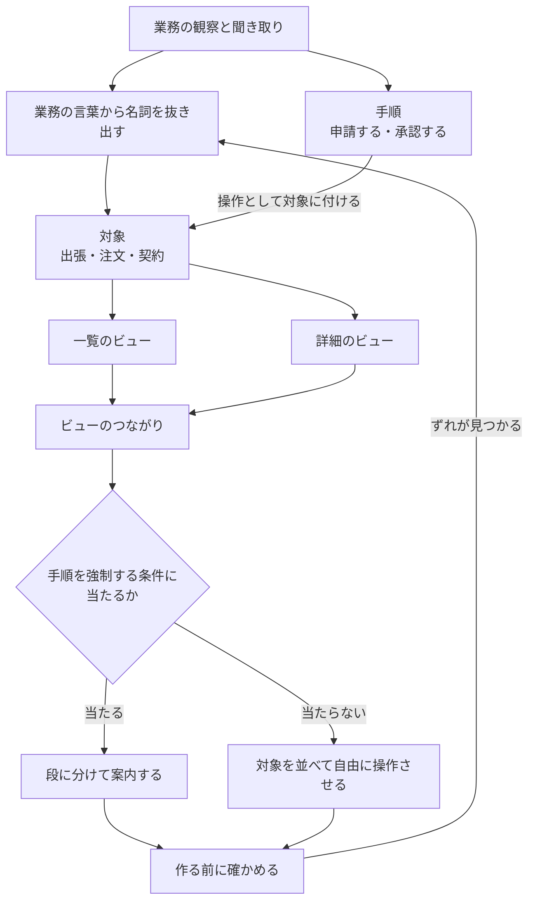
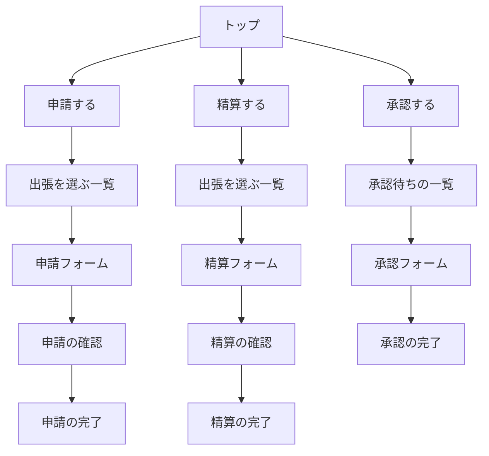
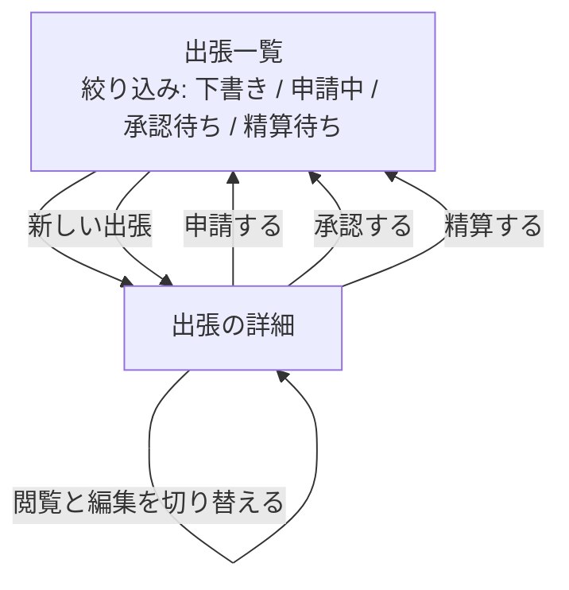

# 08 画面とインターフェースの設計

| 項目 | 内容 |
|---|---|
| この章で答えること | 画面の並びを何から導くか。その並びが正しいかを、作る前にどう確かめるか |
| 作成者 | Claude（Opus 5） |
| 機密区分 | 公開可 |
| 想定読者 | 業務システムの画面を設計し、その裏側のクラスを書く開発者 |
| この章を読んだあとできること | 画面の入口を対象から導ける。手順を案内する形を選ぶ条件を6つ挙げられる |
| 保守責任者 | このリポジトリの保守担当 |
| 最終確認日 | 2026-09-09 |
| 出典 | `SRC-UI-001`、`SRC-UI-002`、`SRC-DESIGN-001`、`SRC-EXT-085` から `SRC-EXT-103` |
| 例示に使う言語 | Java。画面の構成は ` ```text ` の枠線図、画面遷移は Mermaid の図で示す |

**Java のコードは、画面の裏側のオブジェクトをどう定義するかの観点にだけ付ける。** 画面の構成と画面遷移はコードで表せる題材ではないためである。判断の記録は `research/orchestration/ui-design/40-debate.md` の `D-18` にある。

## 3行で

1. **画面の入口は、業務の手順（動詞）ではなく業務で扱う対象（名詞）から導く。** ただし手順を案内する形が向く条件があり、その条件は3つの独立した資料が一致している（`SRC-EXT-086`、`SRC-EXT-096`、`SRC-EXT-095`）。
2. **「名詞→動詞だから良い」とは言えない。** 統制実験は操作の順序そのものに差を見つけていない（`SRC-EXT-087`）。優位が出るのは、その順序が利用者をモードに閉じ込めないときである。
3. **画面の良し悪しをクリック数で測らない。** 44人・620件の作業の分析で、クリック数は成功率とも満足度とも相関しなかった（`SRC-EXT-101`）。測るのは「目当てのものが見つかるか」である。

## 章02 と章03 との境目

**この章は、層の分担とモデルの設計そのものを作り直さない。** それは章「[02 設計](02-design.md)」と章「[03 アーキテクチャ](03-architecture.md)」が観点IDつきで持っている。

境目は「画面の中の話か、画面の外の話か」に置く。**この章が扱うのは、画面そのものの構成と、画面のオブジェクトと業務のオブジェクトの対応である。**

| 主題 | 持つ章 | 例 |
|---|---|---|
| 画面の入口と一覧・詳細の置き方 | この章（`UI-` 番、28件） | トップに何を置くか |
| フロントエンド・BFF・API の責務 | 章03（`AR-01` から `AR-08`） | どの層で組み立てるか |
| 業務ルールの置き場所 | 章03（`AR-09` から `AR-12`） | ルールを層のどこへ置くか |
| 層の間でやり取りする値の形 | 章03（`AR-17`、`AR-18`） | 何を渡すか |
| 画面と業務のオブジェクトの対応 | この章（`UI-24` から `UI-27`） | 1対1になるか |
| クラスの単位と責務の分割 | 章02（`DS-01` から `DS-04`） | 何を1クラスにするか |
| パッケージ構成 | 章02（`DS-08` から `DS-11`） | どこへ置くか |
| 要求の掘り下げ | 章06（`PF-01` から `PF-07`） | 何を解くべきかを決めるところ |
| 画面のテストの観点 | 章05（`TS-` 番） | 何を確かめるか |

**業務ルールが画面ごとに重複する害は、この章と章02 の両方に関わる。** この章は「画面の側に書かない」までを扱い、置き場所の判断は章02 と章03 に渡す。

## 中心の問い

**この章が答えるのは2つである。画面の並びを何から導くか。その並びが正しいかを、作る前にどう確かめるか。**



**手順から画面へ直接引く線が無い点が要である。** 手順は画面の並びではなく、対象に付く操作として吸収する（`SRC-UI-001` p.143-144）。

## 観点の一覧

**観点IDの接頭辞は `UI-` である。** レビューの指摘や画面設計書から、この章の観点を一意に指すために振る。

| 観点ID | 見るもの | 強さ | 出典 |
|---|---|---|---|
| `UI-01` | オブジェクト指向UI を、見た目ではなく操作の順序の話として扱っているか | 推奨 | `SRC-UI-001` p.25-26、p.33 |
| `UI-02` | 「タスク指向」の語を、資料ごとの意味の違いを断ってから使っているか | 必須 | `SRC-UI-001` p.34、`SRC-DESIGN-001` p.204-207 |
| `UI-03` | 対象を先に選ぶ形の理由を、順序ではなくモードの不在で説明しているか | 必須 | `SRC-EXT-087`、`SRC-UI-001` p.35 |
| `UI-04` | 形の選択を、システム全体ではなく操作の単位で決めているか | 必須 | `SRC-UI-001` p.46、`SRC-EXT-087`、`SRC-EXT-086` |
| `UI-05` | 手順を案内する形を選ぶ条件を、利用者の側と対象の側の両方で確かめたか | 必須 | `SRC-EXT-086`、`SRC-EXT-096`、`SRC-EXT-095`、`SRC-UI-001` p.46 |
| `UI-06` | 画面数が減る効果を、数値で約束していないか | 必須 | `SRC-UI-001` p.9 |
| `UI-07` | 入口が、処理名（動詞）ではなく対象（名詞）になっているか | 必須 | `SRC-UI-001` p.36、p.260 |
| `UI-08` | 同じ対象の一覧が、複数の入口から重複して作られていないか | 必須 | `SRC-UI-001` p.39-40 |
| `UI-09` | 役割ごとに画面の体系を分けていないか | 推奨 | `SRC-UI-001` p.260-264、`SRC-EXT-091` |
| `UI-10` | 手順から外れた要求を、システムが扱えるか | 推奨 | `SRC-EXT-086` 8.3節 |
| `UI-11` | 業務ルールの判定を、画面の表示処理に書いていないか | 必須 | `SRC-DESIGN-001` p.198-200 |
| `UI-12` | 画面を作る前に、対象を業務の言葉から抜き出したか | 必須 | `SRC-UI-001` p.59、p.69-70、`SRC-EXT-089` |
| `UI-13` | 対象ごとに一覧と詳細の対を置き、省く条件を確かめたか | 推奨 | `SRC-UI-001` p.93-96、`SRC-UI-002` p.105-106、`SRC-EXT-097` |
| `UI-14` | 一覧と詳細を別画面にするか2枠にするかに、説明できる根拠があるか | 推奨 | `SRC-UI-001` p.105-109、`SRC-EXT-097` |
| `UI-15` | 一覧に、絞り込み・並べ替え・切り替えの3つを検討したか | 推奨 | `SRC-UI-002` p.107 |
| `UI-16` | 検索を、一覧へ到達する別の経路として併設しているか | 必須 | `SRC-UI-002` p.106-107、`SRC-EXT-090` 2.4.5 |
| `UI-17` | 同じ働きの操作を、画面ごとに違う名前や違う位置にしていないか | 必須 | `SRC-EXT-090` 3.2.3、3.2.4、`SRC-EXT-085` |
| `UI-18` | 操作の語彙を、対象の種類が増えるたびに増やしていないか | 推奨 | `SRC-EXT-085` |
| `UI-19` | クリック数や遷移の回数を、良し悪しの指標にしていないか | 必須 | `SRC-EXT-101`、`SRC-UI-002` p.72-73 |
| `UI-20` | 階層のラベルが排他的か。深さの根拠を説明できるか | 推奨 | `SRC-UI-002` p.96-98、`SRC-EXT-102` |
| `UI-21` | 一覧から詳細へ移って戻ったとき、位置と絞り込みが保たれるか | 必須 | `SRC-UI-002` p.158-159、`SRC-EXT-097` |
| `UI-22` | 操作の途中で、他の対象を見られないモードに閉じ込めていないか | 必須 | `SRC-UI-001` p.34-35 |
| `UI-23` | 段に分けた入力で、同じ情報を再入力させていないか | 必須 | `SRC-EXT-090` 3.3.7 |
| `UI-24` | 画面のオブジェクトと業務のオブジェクトを、1対1に強いていないか | 必須 | `SRC-UI-001` p.69、p.71、`SRC-EXT-088`、`SRC-EXT-086` 8.1節 |
| `UI-25` | 画面ごとのデータ保持クラスへ、業務ロジックを散らしていないか | 必須 | `SRC-DESIGN-001` p.198-203、p.209-210 |
| `UI-26` | ビュー専用オブジェクトを、条件を満たすときだけ置いているか | 推奨 | `SRC-DESIGN-001` p.211、`SRC-EXT-098` |
| `UI-27` | ドメインオブジェクトに、物理的な体裁を持たせていないか | 必須 | `SRC-DESIGN-001` p.212-213、`SRC-EXT-099`、`SRC-EXT-088` |
| `UI-28` | 画面の並びを、外部仕様書を書く前に段階を踏んで確かめたか | 必須 | `SRC-UI-002` p.191-197、`SRC-EXT-103` |

## 用語をそろえ、形を選ぶ

**この節の6観点は、残りの22観点を読む前提になる。** 用語の意味が資料ごとに違うため、先に固定する。

### UI-01 オブジェクト指向UI を、見た目ではなく操作の順序の話として扱っているか

**何を見るか**: 「オブジェクト指向UI にする」という言葉が、画面を絵にすることではなく、操作の順序を変えることを指しているか。

**なぜそう言えるか**: 出典は `SRC-UI-001`（ソシオメディア 上野学、藤井幸多『オブジェクト指向UIデザイン』）である。同書 p.33 は、この形を「利用者が対象オブジェクトを選ぶところから操作が始まるもの」と定義する。同 p.25-26 は、見た目がグラフィカルでも操作の設計が対象を先に置かなければ使いにくいとする。

**この定義は1冊だけのものではない。** Xerox Star の設計原則（`SRC-EXT-085`）は「Star のコマンドは noun-verb の形をとる」と書き、対象を指してからコマンドを呼ぶ形を明文の原則にしている。Selby 1990（`SRC-EXT-087`）は、画面が対象へ偏っているかどうかは実装言語と独立だと結論づける。**オブジェクト指向言語で書いた画面が対象指向とは限らない。**

**判断に迷う例**: 画面の見た目を新しくする改修を「オブジェクト指向UI 化」と呼ぶ場合。`SRC-EXT-086` は Richard Pawson の博士論文 Naked Objects（2004年）である。同論文 8.1節は Constantine の指摘を引く。「そう呼ばれているものの多くは、単なる直接操作の画面か、ただのグラフィカルな画面にすぎない」というものである。**用語の混乱は1999年の時点で指摘されている。**

**近い主張をする別の系統がある。** `SRC-EXT-100`（Sophia Prater「What is OOUX」）は、動詞より先に名詞を決めることを主張する。手順は ORCA と呼ぶ。Objects と Relationships と Calls-to-action と Attributes の頭文字である。**同サイトは、有効性を示す研究や実験を挙げていない。根拠として挙がっているのは実務者の推薦文である**（2026-09-09 確認）。

### UI-02 「タスク指向」の語を、資料ごとの意味の違いを断ってから使っているか

**何を見るか**: 「タスク指向」「タスクベース」という語が、誰の定義で使われているかを明示しているか。

**なぜそう言えるか**: 手元の2冊が同じ語を別の意味で使っている。`SRC-UI-001` p.34 の「タスク指向UI」は、**まず処理を選び、次に対象を指定する「動詞→名詞」の操作順序**である。もう1冊は `SRC-DESIGN-001`（増田亨『現場で役立つシステム設計の原則』）である。同書 p.204-207 の「タスクベース」は、**注文の登録を6画面に割ること**を指す。6画面とは、注文者・注文内容・決済方法・配送手段・連絡先・確定である。

**この2つは対立していない。** 後者は「注文」という1つの対象を関心事ごとに割ったものであり、各情報の登録は任意の順序でよい。**順序を強制していないため、前者の言う「動詞→名詞」には当たらない。** この判断は `research/orchestration/ui-design/40-debate.md` の `D-5` で決着した。司会は書籍の調査の段階で「両書は真っ向から食い違う」と書いていたが、議論がこれを正した。

**判断に迷う例**: 設計の議論で「これはタスク指向だ」という指摘が出た場合。**どちらの意味かを聞き返す。** この章では、前者を指すときに「動詞を先に選ばせる形」と言い換える。

### UI-03 対象を先に選ぶ形の理由を、順序ではなくモードの不在で説明しているか

**何を見るか**: 「名詞→動詞だから良い」で説明を止めていないか。

**なぜそう言えるか**: `SRC-EXT-087` は Carolyn M. J. Selby の博士論文である（University College London、1990年）。同論文はこの2つの順序を統制実験で比べ、**本質的な差を見つけなかった。** 同論文は、順序の使いやすさを決めるのは順序そのものではなく作業の構造だとする。観察研究（Macintosh Lisa と IBM TopView の比較）では対象指向の画面のほうが使いやすかったが、続く統制実験でその優位は再現しなかった。

**`SRC-UI-001` 自身も、優位の本質を順序ではなくモードに置いている。** 同 p.35 は「対象物を先に選んでからやることを選ぶ操作はモードレスであり、そのことが優位性の本質である」と書く。`SRC-EXT-085`（Xerox Star）も、対象を選び直してもコマンドが確定していないため、確認の手順を挟まずに選択を変えられると説明する。

**判断に迷う例**: Selby の実験を根拠に「順序はどちらでもよい」と結論づける場合。**それは行きすぎである。** 同論文の最終結論は「一般的な尺度で見れば対象指向の画面のほうが使いやすい」であり、無条件の優位を否定しただけである。**観察研究の被験者は6人であり、標本は小さい。**

### UI-04 形の選択を、システム全体ではなく操作の単位で決めているか

**何を見るか**: 「このシステムはオブジェクト指向UI で作る」といった全体の宣言になっていないか。

**なぜそう言えるか**: 3つの独立した資料が、二択ではないことを示す。

| 資料 | 示していること |
|---|---|
| `SRC-UI-001` p.46 | 対象を先に出せない条件を、著者自身が4つ挙げる |
| `SRC-EXT-087`（Selby 1990） | 画面を「対象へ偏る」「行為へ偏る」「どちらにも偏らない」の3種に分け、二分していない |
| `SRC-EXT-086`（Pawson 2004） | 順序の強制が要る箇所を「目的を持つオブジェクト」で表す方法を示す |

**判断に迷う例**: 既存システムの一部だけを対象起点に変える改修。**操作の単位で決める規則からすれば、これは一貫性の欠如ではない。** ただし操作の名前と位置は画面をまたいでそろえる（`UI-17`）。

### UI-05 手順を案内する形を選ぶ条件を、利用者の側と対象の側の両方で確かめたか

**何を見るか**: 段に分けて順に入力させる形を選ぶとき、その理由が条件表のどれに当たるかを言えるか。

**なぜそう言えるか**: **この観点は、この章で最も根拠が厚い。** 利用者の側の条件は、3つの独立した資料が一致する。

| 群 | 条件 | 手順を案内する形 | 出典 |
|---|---|---|---|
| 利用者 | 利用の頻度が低い | 向く | `SRC-EXT-086` 第2章 |
| 利用者 | 熟練していない | 向く | `SRC-EXT-096` |
| 利用者 | 作業を繰り返し、素早く切り替える | 向かない | `SRC-EXT-096`、`SRC-EXT-095` |
| 対象 | 対象が1つしか無く、選択が要らない | 向く | `SRC-UI-001` p.46 |
| 対象 | 段をまたいでデータを比べる必要がある | 向かない | `SRC-EXT-096` |
| 対象 | 順序を意図的に強制したい | 向く | `SRC-UI-001` p.46、`SRC-EXT-086` 第2章 |

`SRC-EXT-086`（Pawson 2004）は「利用の頻度が低い顧客向けのセルフサービスは、対象を並べる形の候補として典型的には良くない」と明記する。`SRC-EXT-096`（Raluca Budiu、Nielsen Norman Group、2017-06-25）は、段に分けた形が向くのを「初心者の利用者」または「めったに行わない手順」とする。`SRC-EXT-095`（GOV.UK Service Manual）は、内部の熟練した利用者には1画面1問いが適切でない場合があるとする。

**対象の側の条件は `SRC-UI-001` p.46 が主な根拠である。** 同書は4つ挙げる。タスクによって処理対象の集合が違う場合、タスクによって出すべき属性が大きく違う場合、対象が1つしか無い場合（例: ATM）、順序を強制したい場合である。

**「1つの画面に1つの問いだけを置く」は、既定にしない。** `SRC-EXT-093`（GOV.UK Design System の question pages）はこれを既定とし、利用者が何を求められているかを理解しやすくなるとする。`SRC-EXT-094`（Tim Paul「One thing per page」、2015-07-03）は、利点を3つ挙げる。自信の低い利用者に使いやすいこと、携帯端末で機能すること、誤りと分岐と途中保存の扱いが楽になることである。

**この3つに定量の裏づけは示されていない。** 同じ発信元の `SRC-EXT-095` が、内部の熟練した利用者には適切でない場合があると書く。**原則と例外が1つの組織の文書の中にあるため、独立した2件とは数えない。**

**判断に迷う例**: 同じ画面を社内の担当者と社外の顧客の両方が使う場合。**利用者の側の条件が割れる。** `SRC-EXT-095` の立場に従えば、この2つは別のサービスとして設計する。

### UI-06 画面数が減る効果を、数値で約束していないか

**何を見るか**: 「オブジェクト指向UI にすれば画面数が何分の1になる」という数値を、効果の根拠として使っていないか。

**なぜそう言えるか**: この数値の出どころは `SRC-UI-001` p.9 の1冊1箇所である。同ページは「画面数は5〜20分の1に減ります」と書く。**司会が前後を読み、測定の方法・対象・件数のいずれも書かれていないことを確認した（2026-09-09）。** 同じページには「世の中の業務アプリケーションの8割ぐらいはタスク指向の構成になっているようです」という記述もあり、これも著者の経験則である。

**効果を測った公開の資料は、4系統の調査で見つからなかった。** 同じ課題を両方の形で作り、完了時間・誤操作・離脱・改修工数を比べた研究は、確認できた範囲では `SRC-EXT-087`（1990年）が最後である。

**判断に迷う例**: 改修の提案書に効果を書く必要がある場合。**書けるのは「同じ一覧の重複が消える」といった構造の変化までである**（`UI-08`）。削減率を約束すると、測定の裏づけの無い数値を渡すことになる。

## 画面を業務にどう対応させるか

**この節の6観点は、画面の並びを何から導くかに答える。** 悪い例と良い例を、出張申請・精算の業務で示す。

### UI-07 入口が、処理名（動詞）ではなく対象（名詞）になっているか

**何を見るか**: トップ画面やナビゲーションに並ぶ言葉が、名詞か動詞か。

**なぜそう言えるか**: `SRC-UI-001` p.36 は、両者を分ける実用的な手掛かりを、ナビゲーションの語が名詞形か動詞形かに置く。同 p.260 の出張申請・精算の事例では、ナビゲーションにある「申請」と「精算」がフォーム画面を開くだけのものであり、動詞的に使われていると分析している。

**悪い例**（処理名を入口にする）

```text
┌──────────── 出張管理 ─────────────┐
│                                   │
│   [ 出張を申請する ]              │
│   [ 出張を精算する ]              │
│   [ 出張を承認する ]              │
│   [ 出張を照会する ]              │
│                                   │
└───────────────────────────────────┘
```

**良い例**（対象を入口にする）

```text
┌──────────── 出張一覧 ───────────────────────────┐
│ 状態 [ すべて ▼ ]  期間 [ 2026-09 ▼ ]  [ 探す ] │
├───┬─────────┬─────────┬──────────┬─────────────┤
│   │ 行き先  │ 出発日  │ 金額     │ 状態        │
├───┼─────────┼─────────┼──────────┼─────────────┤
│ ● │ 大阪    │ 09-14   │ 42,300円 │ 申請中      │
│   │ 福岡    │ 09-20   │ 68,900円 │ 下書き      │
│   │ 名古屋  │ 08-30   │ 31,200円 │ 精算待ち    │
└───┴─────────┴─────────┴──────────┴─────────────┘
  選んだ出張に対して [ 申請する ] [ 取り下げる ] [ 複製する ]
```

**なぜ悪い例が悪いのか**: 4つのボタンはどれも「出張」という同じ対象を扱う。それなのに、利用者は自分が何をしたいかを先に言葉にしなければ先へ進めない。**目当ての出張がどこにも見えていないため、「先週の大阪出張はどうなったか」という問いに答えられない。** さらに、4つの入口の先には、それぞれ出張を選ぶための一覧が要る（`UI-08`）。

**なぜ良い例が良いのか**: 出張が最初から見えている。状態の欄を見れば、申請するべきものと精算するべきものが分かる。**操作は選んだ出張に付いているため、対象を選び直しても操作の取り消しが要らない**（`UI-22`）。「複製する」のような操作を足すときも、入口を1つ増やすのではなく、この行に1つ足すだけで済む。

**判断に迷う例**: 「新規作成」のように、対象がまだ存在しない操作。**これは対象を選べないため、一覧の側に置く。** `SRC-UI-001` p.143-144 は、手順を対象に付く操作へ分解する形を示す。

### UI-08 同じ対象の一覧が、複数の入口から重複して作られていないか

**何を見るか**: 別々の画面遷移の途中に、同じ対象を選ぶための一覧が複数現れていないか。

**なぜそう言えるか**: `SRC-UI-001` p.39-40 のビデオカメラの事例が、この重複を示す。「再生」と「削除」を別の流れにすると、どちらの流れにも録画の一覧が要る。**録画の一覧を入口にして、再生と削除を操作にすると、一覧は1つになる。**

**判断に迷う例**: 一覧の見た目や項目が流れごとに違う場合。**それは別の一覧ではなく、同じ一覧の表示形式の違いである可能性が高い**（`UI-15`）。

### UI-09 役割ごとに画面の体系を分けていないか

**何を見るか**: 社員向け・上長向け・経理向けのように、役割ごとに別々の画面群を作っていないか。

**なぜそう言えるか**: `SRC-UI-001` p.260-264 の出張申請・精算の事例では、社員・上長・経理の3つの役割が「申請」「精算」「承認」を分け合う。**同書はこれを役割ごとの画面ではなく、1つの出張の一覧に、状態の絞り込みと権限に応じた操作を足す形で解く。**

**この観点の直接の根拠は、1冊の1事例だけである。** 公開情報の側では `SRC-EXT-091`（GOV.UK Service Standard 第2項）が「利用者が公共サービスを使うために、政府の仕組みを理解する必要があってはならない」と書く。**組織の境界の話であり、同じ話ではない。方向が一致するだけである。**

**判断に迷う例**: 役割によって見える項目が大きく違う場合。`SRC-UI-001` p.46 は、出すべき属性が大きく違うことをタスク指向の許容条件に挙げる。**この場合は、役割ごとの画面が正当になりうる。**

### UI-10 手順から外れた要求を、システムが扱えるか

**何を見るか**: 想定した手順に当てはまらない事態が起きたとき、システムが何かを支援できるか。

**なぜそう言えるか**: `SRC-EXT-086`（Pawson 2004）8.3節は、業務システムの多くが手順の台本で作られていると論じる。**利用者のやりたいことが台本に合わないとき、そのシステムは機能しなくなる。****同節が挙げる例は航空会社である。通常の運航は支援できるが、嵐や故障で大きく乱れたときの回避策の検討と実行はほとんど支援できない。**

**判断に迷う例**: 例外の手順を追加で作り込む場合。**例外の数だけ台本が増える。** 同論文が示す別の道は、対象を並べて利用者が自分で組み立てられるようにすることである。**どちらを採るかは `UI-05` の条件表で決める。**

### UI-11 業務ルールの判定を、画面の表示処理に書いていないか

**何を見るか**: 画面の表示を組み立てるところに、業務のルールに基づく条件判断が書かれていないか。

**なぜそう言えるか**: `SRC-DESIGN-001` p.198-199 は、強調表示の条件を CSS クラスの付与のところに `if` 文で書く形を悪い例に挙げる。**その条件は「一定金額を超え、かつ注文後1日以上を経過した注文」であり、業務ルールである。** 同 p.200 は、注文に関係する画面が複数あることを挙げる。登録時の確認、一覧、詳細である。**そのため合計金額の計算と消費税の計算と日付の表示形式が、画面ごとに重複しがちになる。**

**同書は複雑さの原因を2つに切り分ける。** 「画面そのものが複雑」と「画面の表示ロジックと業務ロジックが分離できていない」である。**別々の原因であり、別々に直す。**

**判断に迷う例**: 表示の条件が業務ルールかどうかを判定できない場合。**判定の基準は「その条件が変わったとき、変わるのは業務か表示か」である。** 置き場所の判断は章「[03 アーキテクチャ](03-architecture.md)」の `AR-09` から `AR-12` が持つ。

### UI-12 画面を作る前に、対象を業務の言葉から抜き出したか

**何を見るか**: 画面の絵を描く前に、業務の言葉から名詞を抜き出す作業をしたか。

**なぜそう言えるか**: `SRC-UI-001` p.69 は、設計を3段に分ける。オブジェクトの抽出、ビューとナビゲーションの検討、レイアウトパターンの適用である。**最初の段は、オブジェクト指向分析のクラス定義やデータベース設計のエンティティ定義と同じ作業だとする。**

同 p.70 は、ある概念が対象として扱えるかを判断する手掛かりを3つ挙げる。

- 数えられる名詞として表せる
- 同種の集合として管理されうる
- 共通の操作を持っている

**同ページは留保も置く。** 「受信」のような動詞的な概念や「フラグ」のような属性でも、システムの目的によっては対象にすることがあるとする。

**規格の側にも、手順と目標を分ける定義がある。** `SRC-EXT-089`（ISO 9241-110:2020）3.3 と 3.5 は、目標を「意図した結果」、作業を「特定の目標を達成するために行う活動の集合」と定義する。**注記2は「目標はそれを達成する手段から独立しているが、作業は目標を達成する特定の手段を表す」と述べる。** 同規格の序文は、避けられる使いにくさの型を5つ挙げ、その先頭に「作業の一部として必要ではない、余分な手順」を置く。**同規格は原則と設計の推奨を述べる文書であり、適合の判定基準を与えるものではない。**

**判断に迷う例**: 業務の聞き取りが足りないまま抽出に入る場合。`SRC-UI-001` p.59 は、観察と聞き取りが足りなければ、抽出したモデル自体を誤るとする。**要求の掘り下げそのものは章「[06 問題の見つけ方](06-problem-finding.md)」の `PF-01` から `PF-07` が持つ。**

## 画面の構成をどう決めるか

**この節の6観点は、1つの画面の中と、画面どうしのつなぎ方に答える。**

### UI-13 対象ごとに一覧と詳細の対を置き、省く条件を確かめたか

**何を見るか**: 抽出した対象それぞれに、一覧のビューと詳細のビューを想定したか。そのうえで省く判断をしたか。

**なぜそう言えるか**: 3つの独立した資料が、この対を基本形とする。

| 資料 | 呼び方 | 該当箇所 |
|---|---|---|
| `SRC-UI-001` | コレクションビューとシングルビュー | p.93-94（3-4） |
| `SRC-UI-002`（原田秀司『UIデザインの教科書 新版』） | トップ・一覧・詳細の3層 | p.105-106（5-4） |
| `SRC-EXT-097`（Android の標準レイアウト） | list-detail | ページ全体 |

`SRC-UI-002` p.107 は「利用者は目的の詳細ページに辿り着くために、ほとんどのケースで一覧を経由せざるを得ない」とし、これを構造的な事実と呼ぶ。

**省いてよい条件は2つある。この2条件は `SRC-UI-001` の1冊だけが示す。**

| 省くもの | 条件 | 該当箇所 |
|---|---|---|
| 詳細のビュー | 一覧に出す属性で用が足りるとき | p.95-96 |
| 一覧のビュー | 利用者から見て対象が1つしか無いとき | p.95-96 |

**判断に迷う例**: 詳細に出す項目が多いかどうかで迷う場合。`SRC-EXT-097` は list-detail が向くのを「項目が説明的・補足的な情報を持つとき」に限り、例としてメッセージアプリ、連絡先管理、メディアの閲覧を挙げる。

### UI-14 一覧と詳細を別画面にするか2枠にするかに、説明できる根拠があるか

**何を見るか**: 一覧と詳細を同じ画面の2つの枠に並べるか、別の画面にするかを、何を見て決めたか。

**なぜそう言えるか**: `SRC-UI-001` p.105-109 は、判断の材料を2つに置く。画面の面積と、対象どうしの参照関係である。**狭い画面や、参照がめぐる場合は別画面が向く。横断する参照が少なく面積がある場合は2枠が向く。**

`SRC-EXT-097`（Android の標準レイアウト）は、画面幅が広いときに一覧と詳細を同時に出し、狭いときはどちらか一方を出す形を示す。**広い画面へ変わったときは、詳細に対応する項目を一覧の側で選択状態として示す。**

**判断に迷う例**: 同じ画面を広い端末と狭い端末の両方で使う場合。`SRC-EXT-097` は、その場合に切り替える形を標準として示す。**切り替えたときに選択状態を失わないことが条件である**（`UI-21`）。

### UI-15 一覧に、絞り込み・並べ替え・切り替えの3つを検討したか

**何を見るか**: 一覧の使いやすさを上げる手立てとして、この3つを検討したか。

**なぜそう言えるか**: `SRC-UI-002` p.107 は、一覧ページで工夫できる基本の手法は3種類しか無いとする。「絞り込み」「並べ替え」「切り替え」である。

**この3つは `UI-09` の役割の吸収にも効く。** 上長が承認待ちのものだけを見るのは、役割ごとの画面ではなく、状態による絞り込みで足りる（`SRC-UI-001` p.260-264）。

**判断に迷う例**: 一覧の表示形式が1つで足りるかどうか。`SRC-UI-001` p.110-117 は、比べるのが文字の属性ならリスト、外観ならサムネイル、日時や位置ならカレンダーや地図を選ぶとする。**複数の見方が要るなら切り替えを置く。**

### UI-16 検索を、一覧へ到達する別の経路として併設しているか

**何を見るか**: 対象の一覧だけを唯一の入口にしていないか。

**なぜそう言えるか**: 2つの独立した資料が支える。`SRC-UI-002` p.106-107 は、検索結果を「多数の詳細情報を束ねて表示するページ」という観点から一覧と本質的に同義とする。**カテゴリから進んだ一覧と検索結果は、構造としてほとんど同じである。**

`SRC-EXT-090` は WCAG 2.2 である（W3C Recommendation、2024-12-12）。その達成基準 2.4.5「複数の手段」は適合レベル AA である。同基準は、ページの集合の中である1ページを見つける手段が複数あることを求める。**ただし、そのページが処理の結果または処理の一段である場合は除かれる。**

**検索を入口にする設計は、対象を入口にする設計と対立しない。** 検索結果は対象を束ねた一覧の一種であり、同じ一覧へ到達する別の経路である。

**判断に迷う例**: 段に分けた手続きの途中のページ。**上の除外に当たるため、複数の手段は求められない。**

### UI-17 同じ働きの操作を、画面ごとに違う名前や違う位置にしていないか

**何を見るか**: 同じことをする操作の名前と置き場所が、画面をまたいでそろっているか。

**なぜそう言えるか**: 2つの独立した資料が同じことを求める。`SRC-EXT-090`（WCAG 2.2）の 3.2.3「一貫したナビゲーション」（AA）は、複数のページで繰り返される仕組みが同じ相対順序で現れることを求める。同 3.2.4「一貫した識別」（AA）は、同じ機能を持つ部品が一貫して識別できることを求める。

`SRC-EXT-085`（Xerox Star の設計原則、BYTE 1982年4月号）は、8つの汎用コマンドが選んだ対象の種類によらず同じ働きをすると書く。

**判断に迷う例**: 一覧の「削除」と詳細の「破棄」のように、同じ操作が別の名前になっている場合。**どちらかにそろえる。** どちらが正しいかは、業務で使われている言葉で決める。

### UI-18 操作の語彙を、対象の種類が増えるたびに増やしていないか

**何を見るか**: 新しい対象を足したとき、その対象専用の操作名が増えていないか。

**なぜそう言えるか**: `SRC-EXT-085`（Xerox Star）の汎用コマンドは8つである。MOVE、COPY、DELETE、SHOW PROPERTIES、COPY PROPERTIES、AGAIN、UNDO、HELP である。**選んだ対象の種類によらず同じ働きをするため、対象が増えても覚える操作は増えない。**

**判断に迷う例**: 業務に固有の操作（「承認する」「精算する」）を足す場合。**これは汎用コマンドで置き換えられない。** その場合も、同じ操作が複数の対象に現れるなら名前をそろえる（`UI-17`）。

## 画面遷移

**この節の5観点は、画面から画面へ移るときに起きる問題を扱う。** 悪い例と良い例を Mermaid の図で示す。

### 悪い例と良い例

**悪い例**（処理を入口にし、流れごとに一覧を持つ）



**良い例**（対象を入口にし、操作を対象に付ける）



**なぜ悪い例が悪いのか**: 同じ「出張」を選ぶ一覧が3つある（`UI-08`）。出張を見るには、利用者が先に処理を決める必要がある（`UI-07`）。**申請フォームに入ったあとで対象を選び間違えたと気づいた場合、いったん流れを抜けてトップへ戻る必要がある**（`UI-22`）。承認の流れだけが別の一覧を持つため、上長は自分の申請と部下の承認で別々の入口を使うことになる（`UI-09`）。

**なぜ良い例が良いのか**: 一覧が1つしか無い。状態の絞り込みが、3つの流れを1つの画面に吸収している（`UI-15`）。操作は詳細の側にあり、対象を選び直しても取り消しが要らない。**画面の数が減ることそのものは目的ではない。** 目的は、利用者が「いまどの出張の話をしているのか」を常に見ていられることである。

**この良い例は完成形ではない。** `UI-05` の条件表に当たる操作、例えば初回の申請のように利用の頻度が低く順序を強制したい操作は、段に分けた形にする余地がある。

### UI-19 クリック数や遷移の回数を、良し悪しの指標にしていないか

**何を見るか**: 「3クリック以内で到達すること」のような数値目標を、設計の判定に使っていないか。

**なぜそう言えるか**: `SRC-EXT-101` は Joshua Porter の記事である（User Interface Engineering、2003-04-16）。同記事は 44人・620件の作業・8000回を超えるクリックを分析した。その結果、**クリック数と成功率の間に相関は見つからなかった。** 同記事は「3クリックの後に利用者が離脱する確率は、12クリックの後より高くはなかった」と書く。満足度もクリック数で変わらず、クリック列の違いによる差は46パーセントから61パーセントの範囲に収まった。

同記事の結論は「クリック数への苦情は、実は目的のものを見つけられなかったことへの苦情である」である。`SRC-UI-002` p.72-73 は、使いやすさの指標を精神の負荷と身体の負荷の合計に置く。

**判断に迷う例**: 遷移が多いという指摘を受けた場合。**確かめるのは回数ではなく、途中で進んでいる感じが途切れていないかである。**

### UI-20 階層のラベルが排他的か。深さの根拠を説明できるか

**何を見るか**: 分類のラベルを見て、利用者がどちらに進むべきか迷わないか。

**なぜそう言えるか**: `SRC-UI-002` p.98 は、ラベルを排他的に付けることを重要な点とする。**「こちらにもあちらにも該当しそうだ」という状況では、利用者が困惑し、負荷が上がる。** 同 p.96-98 は、階層が狭いほど上位のラベルが包含的・抽象的になり、分かりにくくなるとする。

**深さの数値の目安は書けない。** `SRC-UI-002` p.96-97 は「浅く広く」のほうが探しやすいという一般的な傾向を述べるが、根拠を挙げていない。`SRC-EXT-102`（Larson と Czerwinski、CHI '98）の要旨は「深さが増すと探索の成績は落ちるが、中位の深さと広さの構成が、最も広く浅い構成を上回った」とする。**2つの資料は食い違う。** 司会は同論文の要旨しか読めておらず、実験条件と人数を確認していない。

**4系統の調査のいずれも、段数と一覧の件数の目安を見つけられなかった。** この章は数値を書かない。

**判断に迷う例**: 階層を1段減らすかどうかの判断。**減らした結果、同じ階層の項目が増えてラベルが抽象的になるなら、減らさない。**

### UI-21 一覧から詳細へ移って戻ったとき、位置と絞り込みが保たれるか

**何を見るか**: 詳細を見てから戻ったとき、一覧が最初の状態に戻っていないか。

**なぜそう言えるか**: `SRC-UI-002` p.159 は、無限スクロールの最も大きな難点を「戻る」との相性の悪さに置く。**スクロールしてから詳細へ移り、戻ると、一般には最初の状態に戻る。** 同ページが挙げる回避策は、詳細をオーバーレイで表示することと、別の窓で開くことである。

`SRC-EXT-097`（Android の標準レイアウト）は、詳細に対応する項目を一覧の側で選択状態として示すことを求める。

**判断に迷う例**: 絞り込みの条件を URL に持たせるかどうか。**この章は実装の方法を決めない。** 確かめるのは、戻ったときに同じ一覧が見えるかである。

### UI-22 操作の途中で、他の対象を見られないモードに閉じ込めていないか

**何を見るか**: ある操作を始めたあと、他の対象を見るために完了か取り消しが要る状態になっていないか。

**なぜそう言えるか**: `SRC-UI-001` p.34-35 は、自動販売機を例に挙げる。**先に金を入れてから商品を選ぶ形では、やめたくなったときに返却レバーを押す必要がある。先に商品を選べる形では、立ち去ればよい。** 同ページは、この差を優位性の本質として説明する（`UI-03`）。

**判断に迷う例**: 入力の途中で他の画面へ移ると、入力が消える場合。**これもモードである。** 下書きとして残せば、モードではなくなる。

### UI-23 段に分けた入力で、同じ情報を再入力させていないか

**何を見るか**: 段に分けた手続きの中で、前の段で入力した情報をもう一度入力させていないか。

**なぜそう言えるか**: `SRC-EXT-090`（WCAG 2.2）の達成基準 3.3.7「冗長な入力」は適合レベル A である。同基準は、同じ処理の中で再入力が求められる情報について、自動で埋めるか、利用者が選べるようにすることを求める。**例外は、再入力が不可欠な場合、安全の確保に必要な場合、前の入力が無効になった場合である。**

同基準の解説が挙げる利点は、記憶への依存が減ること、間違いが減ること、文字入力の量が減ることである。

**段に分けた形を選ぶことと、この基準は両立する。** 段に分けてよいかどうかは `UI-05` の条件表で決め、分けたなら状態を保って戻れるようにする。

**判断に迷う例**: 確認のための再入力（メールアドレスの2回入力など）。**上の例外のうち「再入力が不可欠な場合」に当たるかを判断する。**

## 画面の裏側のオブジェクト

**この節の4観点は、画面に現れるものと業務のオブジェクトの対応を扱う。** Java のコードを、悪い例と良い例の対で示す。

### UI-24 画面のオブジェクトと業務のオブジェクトを、1対1に強いていないか

**何を見るか**: 画面に出す対象と、プログラムのクラスを、機械的に1対1で対応させていないか。

**なぜそう言えるか**: 4つの独立した資料が、1対1にならないことを示す。

| 資料 | 示していること | 該当箇所 |
|---|---|---|
| `SRC-UI-001` | 画面のモデルには、利用者が意識している概念だけを定義すればよい | p.69（2-6） |
| `SRC-UI-001` | 1つの対象が複数のビューで扱われるのが普通である | p.71（2-6） |
| `SRC-EXT-088`（Reenskaug の1979年のメモ） | ビューはモデルの属性のいくつかを強調し、他を抑える提示のフィルタである | メモ本文 |
| `SRC-EXT-086`（Pawson 2004 が引く IBM CUA、1991年） | 利用者が扱う対象は、内部のオブジェクトやコードの単位と必ずしも対応しない | 8.1節 |

**ズレは異常ではなく、設計を見直す手がかりである。** `SRC-DESIGN-001` p.210-211 は「もし一致していないのなら、なぜ一致していないのかを分析します」とし、ドメインの側を直すべきか画面の側を直すべきかを検討せよとする。**この扱い方は1冊にしか根拠が無い。**

**判断に迷う例**: 画面に出したい項目が、業務のオブジェクトに無い場合。**まず、その項目が業務の言葉かどうかを見る。** 業務の言葉なら、業務のオブジェクトの側が足りていない。モデルの設計そのものは章「[02 設計](02-design.md)」の `DS-01` から `DS-04` が持つ。

### UI-25 画面ごとのデータ保持クラスへ、業務ロジックを散らしていないか

**何を見るか**: 画面ごとにデータだけを持つクラスを作り、その脇に計算や判定を置いていないか。

**なぜそう言えるか**: `SRC-DESIGN-001` p.209-210 は、ドメインオブジェクトを画面に出す方法を3つ挙げ、**画面用のデータクラスを別に用意する方式を明確に否定する。** 理由は「データクラスを使うと、どこにでもロジックを書けてしまう」ためである。同 p.200 は、合計金額の計算と消費税の計算が画面ごとに重複しがちだとする。

**悪い例**（画面ごとのクラスに値を並べ、計算を脇へ置く）

```java
// 画面ごとに、値だけを持つクラスを作る
public class OrderConfirmForm {
    public String customerName;
    public List<String> itemNames;
    public List<Integer> unitPrices;
    public List<Integer> quantities;
    public String paymentMethod;
}

// 計算はサービスの側に書く。一覧画面のサービスにも同じ計算がある
public class OrderConfirmService {
    public int total(OrderConfirmForm form) {
        int sum = 0;
        for (int i = 0; i < form.unitPrices.size(); i++) {
            sum += form.unitPrices.get(i) * form.quantities.get(i);
        }
        return (int) (sum * 1.10);
    }
}
```

**良い例**（計算と判定を業務のオブジェクトに閉じる）

```java
public class Order {
    private final Customer customer;
    private final List<OrderLine> lines;   // 単価と数量は組で持つ
    private final PaymentMethod payment;
    private final LocalDate orderedOn;

    public Order(Customer customer, List<OrderLine> lines,
                 PaymentMethod payment, LocalDate orderedOn) {
        this.customer = customer;
        this.lines = List.copyOf(lines);
        this.payment = payment;
        this.orderedOn = orderedOn;
    }

    public Amount total() {                // 合計金額の計算はここにしか無い
        Amount subtotal = lines.stream().map(OrderLine::amount)
            .reduce(Amount.ZERO, Amount::add);
        return subtotal.addTax(TaxRate.STANDARD);
    }

    public boolean needsAttention(LocalDate today) {   // 強調表示の条件は業務ルール
        return total().isGreaterThan(Amount.of(100_000))
            && orderedOn.isBefore(today.minusDays(1));
    }
}
```

**なぜ悪い例が悪いのか**: `OrderConfirmForm` は値の入れ物でしかないため、合計金額の計算をどこに書いてもよくなる。**確認画面、一覧画面、詳細画面のそれぞれに同じ計算が現れる。** 税率が変わったとき、変える箇所を探し出す作業が要る（`SRC-DESIGN-001` p.200）。単価と数量を別々のリストで持っているため、要素数がずれたときに気づく仕組みも無い。

**なぜ良い例が良いのか**: 合計金額の計算が `Order` の中に1つだけある。税率の変更は1箇所で済む。**`needsAttention` は業務ルールであり、画面の側の `if` 文ではなくなった**（`UI-11`）。単価と数量が `OrderLine` として組になっているため、要素数がずれようが無い。`SRC-DESIGN-001` p.202-203 は、この分け方を6つのクラスで示す。`Customer`、`Items`、`PaymentMethod`、`DeliverySpecification`、`ContactTo`、`Order` である。

**このコードそのものは出典なし・私見である。** 資料が示すのは分け方の方針であり、このクラス名とメソッド名は章のために書いた。

**判断に迷う例**: 画面から受け取る入力を、どのクラスで受けるか。**この章は決めない。** 層の間でやり取りする値の形は、章「[03 アーキテクチャ](03-architecture.md)」の `AR-17`、`AR-18` が持つ。

### UI-26 ビュー専用オブジェクトを、条件を満たすときだけ置いているか

**何を見るか**: 表示のためのオブジェクトを、置く理由を言えるときだけ置いているか。

**なぜそう言えるか**: 2つの独立した資料が、別々の理由から同じ結論を出す。**既定では置かない。次の2条件のいずれかが成り立つときに置く。**

| 条件 | 出典 |
|---|---|
| 1つの画面が複数のドメインオブジェクトを組み合わせる | `SRC-DESIGN-001` p.211 |
| 画面の表示状態を、部品と独立に試験したい | `SRC-EXT-098`（Martin Fowler「Presentation Model」、2004-07-19） |

`SRC-DESIGN-001` p.210 の結論は「ドメインオブジェクトをそのまま使うことを重視すべき」である。同 p.211 は、複合画面を出す場合にはプレゼンテーション層にビュー専用オブジェクトを置き、その中で複数のドメインオブジェクトを組み合わせよとする。

`SRC-EXT-098` は「Presentation Model は特定のドメインオブジェクトに対する外面ではない。ビューの抽象と考えるほうがよい」と書く。**ドメインオブジェクト1つに対して1つ置くものではない。**

**代償がある。** 同記事は「画面と Presentation Model の間に同期の仕組みが要る」ことを代償に挙げ、同期の要らない設計のほうが単純な場合があるとする。

**悪い例**（画面の状態をドメインオブジェクトに持たせる）

```java
public class Order {
    private final Customer customer;
    private final OrderLines lines;
    private OrderStatus status;

    // ここから下は画面の都合である
    private boolean submitButtonEnabled;
    private String selectedTabName;
    private String highlightCssClass;

    public void setSubmitButtonEnabled(boolean enabled) {
        this.submitButtonEnabled = enabled;
    }

    public void setSelectedTabName(String name) {
        this.selectedTabName = name;
    }
}
```

**良い例**（複数のドメインオブジェクトを束ねる、表示専用のオブジェクトを置く）

```java
public final class OrderSummaryView {
    private final Order order;
    private final Shipment shipment;
    private final ApproverRole viewerRole;

    public OrderSummaryView(Order order, Shipment shipment, ApproverRole viewerRole) {
        this.order = order;
        this.shipment = shipment;
        this.viewerRole = viewerRole;
    }

    public String totalText() {
        return order.total().format();
    }

    public String deliveryText() {
        return shipment.scheduledOn().format(DateTimeFormatter.ISO_DATE);
    }

    // 表示するかどうかの判断であり、承認できるかどうかの判断ではない
    public boolean showsApproveButton() {
        return viewerRole.canApprove() && order.isWaitingForApproval();
    }
}
```

**なぜ悪い例が悪いのか**: `Order` が画面の部品の状態を持っている。**画面を作り直すたびにドメインオブジェクトが変わるため、業務ルールの変更と画面の変更を区別できなくなる。** 同じ `Order` を別の画面から使うと、どの画面のためのタブ名なのかが分からない。

**なぜ良い例が良いのか**: `OrderSummaryView` は `Order` と `Shipment` の2つを束ねており、`SRC-DESIGN-001` p.211 の条件に当たる。**表示のための導出しか持たないため、`Order` の側は業務ルールだけを持てる。** `showsApproveButton` は「承認してよいか」を決めていない。その判断は `viewerRole` と `order` の側にある。

**このコードそのものは出典なし・私見である。**

**判断に迷う例**: 画面が1つのドメインオブジェクトだけを出す場合。**上の2条件のどちらにも当たらないため、置かない。** `SRC-DESIGN-001` p.210 は、まずそのまま使うことを重視せよとする。

### UI-27 ドメインオブジェクトに、物理的な体裁を持たせていないか

**何を見るか**: ドメインオブジェクトが返す値に、表示の装置に依存する文字列が混ざっていないか。

**なぜそう言えるか**: `SRC-DESIGN-001` p.212-213 は、論理的なビューと物理的なビューを分ける。**段落の集合を `String[]` として持つのが論理であり、`<p>` タグや改行コードを持つのが物理である。ドメインオブジェクトが持ってはいけないのは物理の側である。**

同ページは、一覧画面用の「最初の段落の最初の20文字だけ表示する」という要約の加工ロジックを、ドメインオブジェクトが持つべきだとする。理由は「利用者の関心事であり、かつ論理的な構造とその操作だから」である。

`SRC-EXT-099` は Martin Fowler「GUI Architectures」（2006-07-18）である。同記事は、ドメインオブジェクトが表示を参照せずに完結することを求める。**複数の表示を同時に支えられる形にする。**`SRC-EXT-088`（Reenskaug の1979年のメモ）は「モデルの節点はすべて同じ問題のレベルに置くべきである」と書き、問題の側の節点と実装の細部を混ぜることを悪い形とする。

**この線引きは、1点で決着しなかった。** CSS の `class` 属性の値をドメインオブジェクトが返してよいかについて、資料が割れている。次の「決着しなかったこと」に書く。

**判断に迷う例**: 金額を「42,300円」の形で返してよいか。**桁区切りと通貨記号は表示の装置に依存しない。** ただし言語や地域で変わるなら、変わる部分は表示の側に置く。

## 画面の並びを、作る前に確かめる

**この節の1観点は、この章の中心の問いの後半に答える。**

### UI-28 画面の並びを、外部仕様書を書く前に段階を踏んで確かめたか

**何を見るか**: 仕様書を書き上げる前に、画面の前後関係を試す機会を作ったか。

**なぜそう言えるか**: 2つの独立した資料が、同じ順序を示す。

| 段 | 何をするか | 出典 |
|---|---|---|
| 1 | ワイヤーフレーム（紙と鉛筆でよい）で要素と構造を共有する | `SRC-UI-002` p.191 |
| 2 | 画面を画像にしてリンクでつなぎ、前後関係を体験する | `SRC-UI-002` p.193 |
| 3 | 動くプロトタイプで、外部仕様書を書く前に評価する | `SRC-EXT-103` |

`SRC-UI-002` p.193 は、静止画であるワイヤーフレームだけですべての判断はできないとする。**「ページを移動することで実際にどのような印象を受けるかは、詳細な設計図であっても理解することはできない」と書く。**

`SRC-EXT-103`（IPA『先進的な設計・検証技術の適用事例報告書2016年度版』の全自動血液凝固測定装置の事例）は、この段を実際に踏んだ記録である。**運用仕様書に正常系49タスク・異常系30タスクを書き、そこから重要なものを抜いて正常系20タスク・異常系11タスクをプロトタイプの評価の対象とした。** 評価はウォークスルー法と構造化ヒューリスティック評価である。

**同報告書は、導入の理由を手戻りの大きさに置く。** 外部仕様書として書き上げてしまうと、指摘が出ても、よほどの欠陥がなければやり直せないとする。

**判断に迷う例**: プロトタイプをどこまで作り込むか。`SRC-UI-002` p.196-197 は、作り込みすぎると案への固執を招くとし、簡素な状態で早く失敗することを勧める。

**この観点は、4系統のうち codex だけが材料を出した。** 司会の公開情報の調査と書籍の調査は、作る前の確かめ方を扱っていなかった。**司会が2つの原典を開いて裏を取った（2026-09-09）。** 経緯は `research/orchestration/ui-design/40-debate.md` の `D-15` にある。

## 決着しなかったこと

**議論で決着しなかった論点が1件ある。** 決めていないことを決めたように書かないため、ここに残す。

### CSS の class 属性の値を、ドメインオブジェクトが返してよいか

**争点**: 表示の分類を表す文字列を、業務のオブジェクトが返してよいか。

| 立場 | 資料 | 段 |
|---|---|---|
| 返してよい | `SRC-DESIGN-001` p.211 | 一次資料（書籍の本文） |
| 返すべきでない | `SRC-EXT-099`（Fowler「GUI Architectures」） | 二次資料 |
| 問題のレベルを混ぜてはならない | `SRC-EXT-088`（Reenskaug 1979） | 一次資料 |

`SRC-DESIGN-001` p.211 は、ドメインオブジェクトに書いてよいことを3つ挙げ、その1つに「HTML の class 属性の出力」を置く。**同書はこれを、表示の細部ではなく論理的な状態の名前と見なしている。** `SRC-EXT-099` は、ドメインオブジェクトが表示を参照せずに完結することを求める。**同じ `class` 属性を、一方は論理、他方は物理に分類している。**

**資料の側で分類が割れているため、この手引きは裁かない。** 決めるときの手掛かりは1つある。**その文字列が、表示の技術を替えたときに変わるかどうかである。** 替えても変わらないなら論理に近く、変わるなら物理に近い。**この手掛かりは出典なし・私見である。**

## この章で扱わないこと

**範囲の外にあるものを挙げる。** 読者が別の場所を探せるようにするためである。

| 扱わないもの | 理由 | 代わりに読むもの |
|---|---|---|
| フロントエンド・BFF・API の責務の分担 | 章03 が観点IDつきで持つ | 章「[03 アーキテクチャ](03-architecture.md)」の `AR-01` から `AR-08` |
| 業務ルールを層のどこへ置くか | 章03 が持つ | 章「[03 アーキテクチャ](03-architecture.md)」の `AR-09` から `AR-12` |
| クラスの単位と責務の分割 | 章02 が持つ | 章「[02 設計](02-design.md)」の `DS-01` から `DS-04` |
| 要求から解くべき問題を取り出す筋道 | 章06 が持つ | 章「[06 問題の見つけ方](06-problem-finding.md)」の `PF-01` から `PF-07` |
| 画面のテストの観点と自動化の範囲 | 章05 が持つ | 章「[05 テスト](05-test.md)」 |
| 色、書体、余白などの視覚表現 | `SRC-UI-001` p.138 が、この主題を扱わない理由を「変化が速く、環境ごとの標準で決まる」ことに置く。この手引きも同じ理由で扱わない | 各環境のデザインガイドライン |
| アクセシビリティの達成基準の全体 | この章が引くのは WCAG 2.2 の4基準だけである。全体は規格そのものが持つ | `SRC-EXT-090`（WCAG 2.2） |
| 画面をオブジェクトの定義から自動生成する方式 | `SRC-EXT-086`（Pawson 2004）の naked objects は、画面を手で設計する余地を無くす。同論文が自らこれを第1の制約に挙げる | `SRC-EXT-086` 第2章 |
| フロントエンドの部品の実装方法 | 製品と版に依存し、寿命が短い | 各製品の公式文書 |

## 出典

**この章が使った出典と該当箇所を挙げる。** 出典IDの一覧は [出典カタログ](../research/sources.md) にある。

| 出典ID | 資料 | 使った箇所 | 支持する観点 |
|---|---|---|---|
| `SRC-UI-001` | ソシオメディア 上野学、藤井幸多『オブジェクト指向UIデザイン』 | 1-3、1-4、1-5、2-6、3-4、3-5、3-6、ワークアウト15 | `UI-01` から `UI-09`、`UI-12` から `UI-15`、`UI-22`、`UI-24` |
| `SRC-UI-002` | 原田秀司『UIデザインの教科書 新版』 | 4-2、5-2、5-4、6-8、7-3 | `UI-13`、`UI-15`、`UI-16`、`UI-19` から `UI-21`、`UI-28` |
| `SRC-DESIGN-001` | 増田亨『現場で役立つシステム設計の原則』 | 7章（p.198-213） | `UI-02`、`UI-11`、`UI-24` から `UI-27` |
| `SRC-EXT-085` | Smith ほか「Designing the Star User Interface」（BYTE 1982年4月号） | 設計原則の節、汎用コマンドの節 | `UI-01`、`UI-03`、`UI-17`、`UI-18` |
| `SRC-EXT-086` | Richard Pawson『Naked Objects』（博士論文、2004年） | 第2章、第3章、8.1節、8.3節 | `UI-01`、`UI-04`、`UI-05`、`UI-10`、`UI-24` |
| `SRC-EXT-087` | Carolyn M. J. Selby『An Investigation of Object-oriented Interfaces for Human Computer Interaction』（博士論文、1990年） | 要旨、第4章、第7章、第9章、第10章 | `UI-01`、`UI-03`、`UI-04` |
| `SRC-EXT-088` | Trygve Reenskaug「MODELS - VIEWS - CONTROLLERS」（1979-12-10） | メモ本文 | `UI-24`、`UI-27` |
| `SRC-EXT-089` | ISO 9241-110:2020「Interaction principles」 | 1章、3.3、3.5、序文 | `UI-12` |
| `SRC-EXT-090` | WCAG 2.2（W3C Recommendation、2024-12-12） | 達成基準 2.4.5、3.2.3、3.2.4、3.3.7 | `UI-16`、`UI-17`、`UI-23` |
| `SRC-EXT-091` | GOV.UK Service Standard 第2項「Solve a whole problem for users」 | ページ全体 | `UI-09` |
| `SRC-EXT-093` | GOV.UK Design System「Question pages」 | ページ全体 | `UI-05` |
| `SRC-EXT-094` | Tim Paul「One thing per page」（GDS Design Notes、2015-07-03） | 記事全体 | `UI-05` |
| `SRC-EXT-095` | GOV.UK Service Manual「Designing services for government users」 | ページ全体 | `UI-05` |
| `SRC-EXT-096` | Raluca Budiu「Wizards: Definition and Design Recommendations」（NN/g、2017-06-25） | 向く条件と向かない条件の節 | `UI-05` |
| `SRC-EXT-097` | Android Developers「Canonical layouts」 | list-detail の節 | `UI-13`、`UI-14`、`UI-21` |
| `SRC-EXT-098` | Martin Fowler「Presentation Model」（2004-07-19） | 記事全体 | `UI-26` |
| `SRC-EXT-099` | Martin Fowler「GUI Architectures」（2006-07-18） | Separated Presentation の節 | `UI-27` |
| `SRC-EXT-100` | Sophia Prater「What is OOUX」（Rewired） | ページ全体 | `UI-01` |
| `SRC-EXT-101` | Joshua Porter「Testing the Three-Click Rule」（UIE、2003-04-16） | 記事全体 | `UI-19` |
| `SRC-EXT-102` | Larson・Czerwinski「Web page design: implications of memory, structure and scent for information retrieval」（CHI '98） | 要旨のみ | `UI-20` |
| `SRC-EXT-103` | IPA『先進的な設計・検証技術の適用事例報告書2016年度版』の事例64 | 4.3、5章 | `UI-28` |

**この章で採番したが、本文の根拠に使わなかった出典が1件ある。** `SRC-EXT-092`（GOV.UK Government Design Principles）である。**調査の記録は `research/external/` に残してある。**

**発信元が同じ出典を、独立した件数として数えない。** `SRC-EXT-091` から `SRC-EXT-095` はすべて GOV.UK であり、`SRC-EXT-098` と `SRC-EXT-099` はどちらも Martin Fowler である。

**複数の独立した資料が支持する観点を挙げる。** この章の中では最も根拠が厚い。

| 観点 | 支持する資料の数 | 内訳 |
|---|---|---|
| `UI-05` 手順を案内する形を選ぶ条件 | 4 | `SRC-EXT-086`、`SRC-EXT-096`、`SRC-EXT-095`、`SRC-UI-001` |
| `UI-24` 画面と業務のオブジェクトは1対1にならない | 4 | `SRC-UI-001`、`SRC-EXT-088`、`SRC-EXT-086`、`SRC-DESIGN-001` |
| `UI-13` 一覧と詳細の対が基本形である | 3 | `SRC-UI-001`、`SRC-UI-002`、`SRC-EXT-097` |
| `UI-01` 対象指向は見た目の話ではない | 3 | `SRC-UI-001`、`SRC-EXT-085`、`SRC-EXT-087` |
| `UI-04` 形は操作の単位で決める | 3 | `SRC-UI-001`、`SRC-EXT-087`、`SRC-EXT-086` |
| `UI-19` クリック数を指標にしない | 2 | `SRC-EXT-101`、`SRC-UI-002` |
| `UI-12` 手順と目標を分けて扱う | 2 | `SRC-UI-001`、`SRC-EXT-089` |
| `UI-27` 物理的な体裁をドメインに置かない | 3 | `SRC-DESIGN-001`、`SRC-EXT-099`、`SRC-EXT-088` |

**1冊にしか根拠が無い観点を挙げる。** 上の表の観点と重みが違う。

| 観点 | 唯一の出典 |
|---|---|
| `UI-06` 効果の数値を約束しない | `SRC-UI-001` p.9（数値そのものが1冊のもの） |
| `UI-09` 役割ごとに画面を分けない | `SRC-UI-001` p.260-264（1冊の1事例） |
| `UI-15` 一覧の3つの手立て | `SRC-UI-002` p.107 |
| `UI-25` 画面ごとのデータ保持クラスを作らない | `SRC-DESIGN-001` p.209-210 |
| `UI-24` の後半（ズレを設計の手がかりとする） | `SRC-DESIGN-001` p.210-211 |
